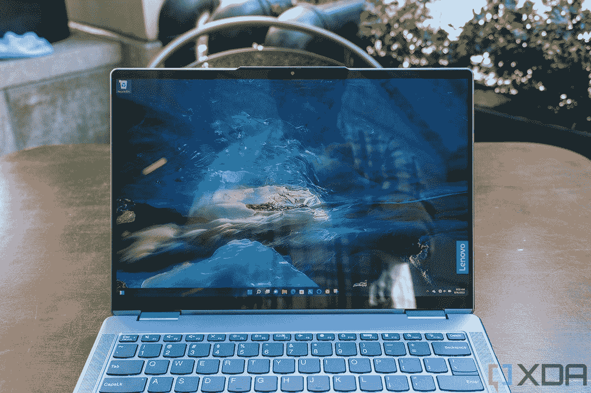

# 联想劳动节销售折扣联想平板电脑高达 640 美元

> 原文：<https://www.xda-developers.com/lenovos-labor-day-deals-discounts-yoga-tablets-up-to-640/>

如果您需要一台新的 Windows 2 合 1 设备，今年就不要再犹豫了，因为现在正是省钱的好时机。随着本周末美国劳动节的到来，联想正在打折几款 Yoga 设备，作为劳动节销售的一部分。一些销售涵盖了[新 Yoga 9i](https://www.xda-developers.com/lenovo-yoga-9i-2022-review/) ，采用英特尔 Arc 图形的 Yoga 7i 16 英寸，甚至是采用 AMD 处理器的经济型 Yoga 6。

当然，包括 ThinkPads 和几款游戏笔记本电脑在内的其他联想产品也在销售。我们将为您提供以下最优惠的交易，但请记住，这些交易仅持续到 9 月 4 日。您还可以试试运气，在任何一台电脑上使用 EXTRA5 代码结账时再节省 5%的费用，有效期至 12 月 31 日。

联想劳动节销量最高的是最新一代 14 英寸 Yoga 9i。由于联想的大减价，你可以以大约 1640 美元的价格买到一台，而不是通常的 1930 美元。这个价格有很多让人喜欢的地方，因为这是联想最新的旗舰产品。我们最近审查了它，发现它是新的最佳消费者笔记本电脑。我们这么说也有很多原因。这是一个更高端的型号，华丽的有机发光二极管显示器将照亮你的电影，使它们看起来充满活力。英特尔最新的第 12 代 CPU 将加快您的工作速度，惊人的键盘将使打字变得有趣。

##### 联想 Yoga 9i

联想的 Yoga 9i 是该公司的旗舰可转换笔记本电脑，今年，它肯定是市场上最好的产品之一。

如果您需要更强的图形处理能力来处理轻度游戏或其他任务，那么 Yoga 7i 16 英寸适合您。这款高端车型是联想最强大的敞篷车之一，此次销售将价格从 1860 美元降至 1580 美元，节省了 15%。以这个价格，您购买的是最新的英特尔显卡，英特尔 Arc。这些图形是全新的，旨在挑战 Nvidia 的 MX 芯片，并为基本的照片和视频编辑提供强大的功能。我们非常喜欢这款 Yoga 的基本款，以至于我们称它为“[一款超值的时尚主流笔记本电脑](https://www.xda-developers.com/lenovo-yoga-7i-2022-review/)

 <picture></picture> 

Lenovo Yoga 7i (16-inch, Intel)

##### 联想 Yoga 7i 2 合 1 (16 英寸)

联想 Yoga 7i 是一款出色的可转换笔记本电脑，具有强大的处理能力和出色的 GPU，可用于轻度游戏以及照片和视频编辑。

也许你不能花 1000 美元买一台联想 Yoga，这就是 Yoga 6 发挥作用的地方。这是最便宜的联想 Yoga 设备之一，售价 690 美元，而不是通常的 860 美元。即使价格更低，由于锐龙 5 CPUs，您也可以获得大量的网络浏览和多任务处理性能。这也主要归功于 8GB 的内存。我们也不要忘记 256GB 的存储空间，这是 128GB 的一个进步，将为您的重要文件提供充足的空间。

 <picture></picture> 

Lenovo Yoga 6 (13-inch AMD)

##### 联想 Yoga 6

凭借 AMD 锐龙 5 CPUs，联想 Yoga 6 在拥有可转换外形的常见优势之外，还提供了出色的性价比。

如果你想要的联想瑜伽不在我们的列表中，那么不要担心。联想[有一系列其他在售的 Yoga 设备](https://shop-links.co/1784352416218592620?u1=8bf30b15-6e55-4589-8972-db1033e04588)。大多数这些设备不需要优惠券代码，只需将它添加到您的购物车中，然后结账！

但是如果联想 Yoga 设备不适合你呢？好吧，别担心，ThinkPad、IdeaPad、Legion Gaming、Chromebooks 等还有其他劳动节优惠。

**ThinkPad(此外，code THINKOUT 还可额外节省 5%的费用，可与其他优惠券叠加使用):**

**博彩** ( [查看更多 IdeaPad &军团博彩交易](https://shop-links.co/1784352418822656542?u1=e7779abf-4dd9-4eb5-83f9-53b708cecad5)):

*   [IdeaPad Gaming 3i(英特尔酷睿 i5 第 11 代处理器，8GB 内存，1TB 固态硬盘，GTX 1650-679 美元(降价 250)](https://shop-links.co/1784352419095448353?u1=dcd3cd63-82d0-4498-8448-83dbdd3ca4cb)
*   [Legion Slim 7i Gen 6(英特尔酷睿 i7 第 11 代，32GB 内存，1TB 固态硬盘，RTX 3080)——1289 美元(优惠 610 美元)](https://shop-links.co/1784352419321376269?u1=a7bede38-41c3-46ea-9cb3-5e43be876d05)
*   [军团 5i Pro Gen 6 16 英寸(Cire i7 第 11 代英特尔，16GB 内存，1TB 固态硬盘——1550 美元(降价 570 美元)](https://shop-links.co/1784352419381403051?u1=d483604d-e153-4601-8782-33367201a7b1)

联想[有一整版](https://shop-links.co/1784352697661362126?u1=0552091f-38f0-491f-82b5-9a348943f51d)关于劳动节的所有促销活动。不过，还是那句话，最好尽快行动。大多数交易将持续到 9 月 4 日。此外，上门推销的商品很快就会脱销。如果您需要帮助，也可以查看我们的[购买新笔记本电脑指南](https://www.xda-developers.com/best-laptops/)！