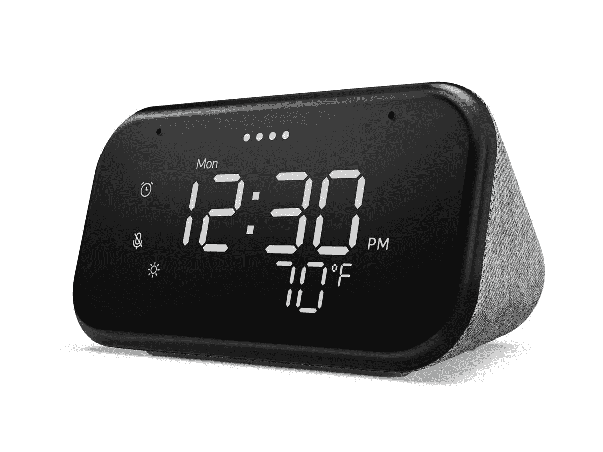

# 配备谷歌助手的联想智能时钟现在仅售 30 美元

> 原文：<https://www.xda-developers.com/lenovos-smart-clock-essential-has-google-assistant-and-only-costs-30-right-now/>

# 联想的智能时钟 Essential 有谷歌助手，目前仅售 30 美元

联想新推出的数字闹钟兼做智能音箱，目前正在家得宝(Home Depot)销售。

联想去年发布了智能闹钟 Essential作为内置谷歌助手(和一些其他智能功能)的数字闹钟。最初 49 美元的建议零售价有点偏高，特别是考虑到功能更丰富的联想智能时钟经常以同样的价格出售，但现在新型号打折到 29.99 美元。

联想智能时钟 Essential 是一个数字时钟，带有大尺寸的 LED 数字，一个三级亮度的夜灯，一个温度指示器，背面有一个 USB Type-A 端口，用于给手机充电(或任何可以通过 USB 充电的东西)。它还可以用作谷歌助手智能扬声器，允许您播放音乐、设置提醒、控制智能家居设备、查看日历等等。最后，时钟是您家庭网络上的 Chromecast 目标，因此您可以从手机或平板电脑上支持的应用程序流化音频内容。

 <picture></picture> 

Lenovo Smart Clock Essential

##### 联想智能时钟必备

这款数字闹钟可以兼做谷歌助手智能音箱。它在家得宝的网站上售价 29.99 美元，你甚至可以在精选的实体店买到。

考虑到[谷歌 Nest Mini](https://store.google.com/product/google_nest_mini) 通常售价 49 美元左右，[亚马逊最新的 Echo Dot](https://www.amazon.com/All-new-Echo-Dot-Blue/dp/B084J4MZK8?tag=xda-2sp2nlp-20&ascsubtag=UUxdaUeUpU3040&asc_refurl=https%3A%2F%2Fwww.xda-developers.com%2Flenovos-smart-clock-essential-has-google-assistant-and-only-costs-30-right-now%2F&asc_campaign=Short-Term) 通常售价 50 美元(尽管现在售价 35 美元)，联想智能时钟 Essential 是一个更便宜的选择，还有一个永远在线的时钟。主要缺点是没有备用电池，所以如果你经常遇到断电，它可能不如“哑”闹钟可靠。