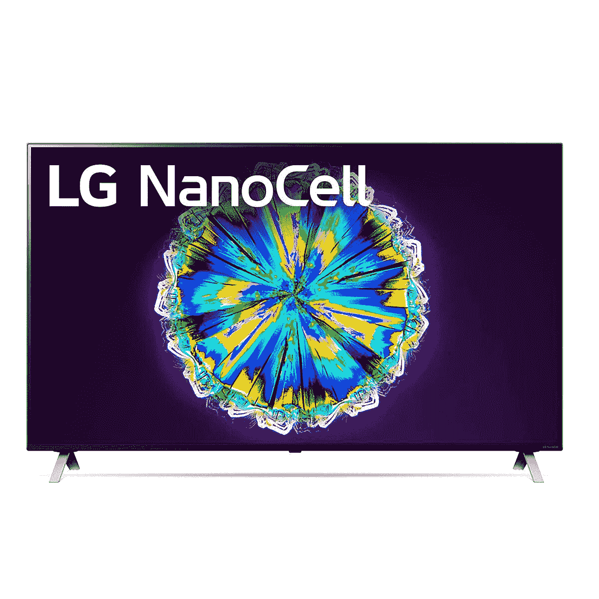
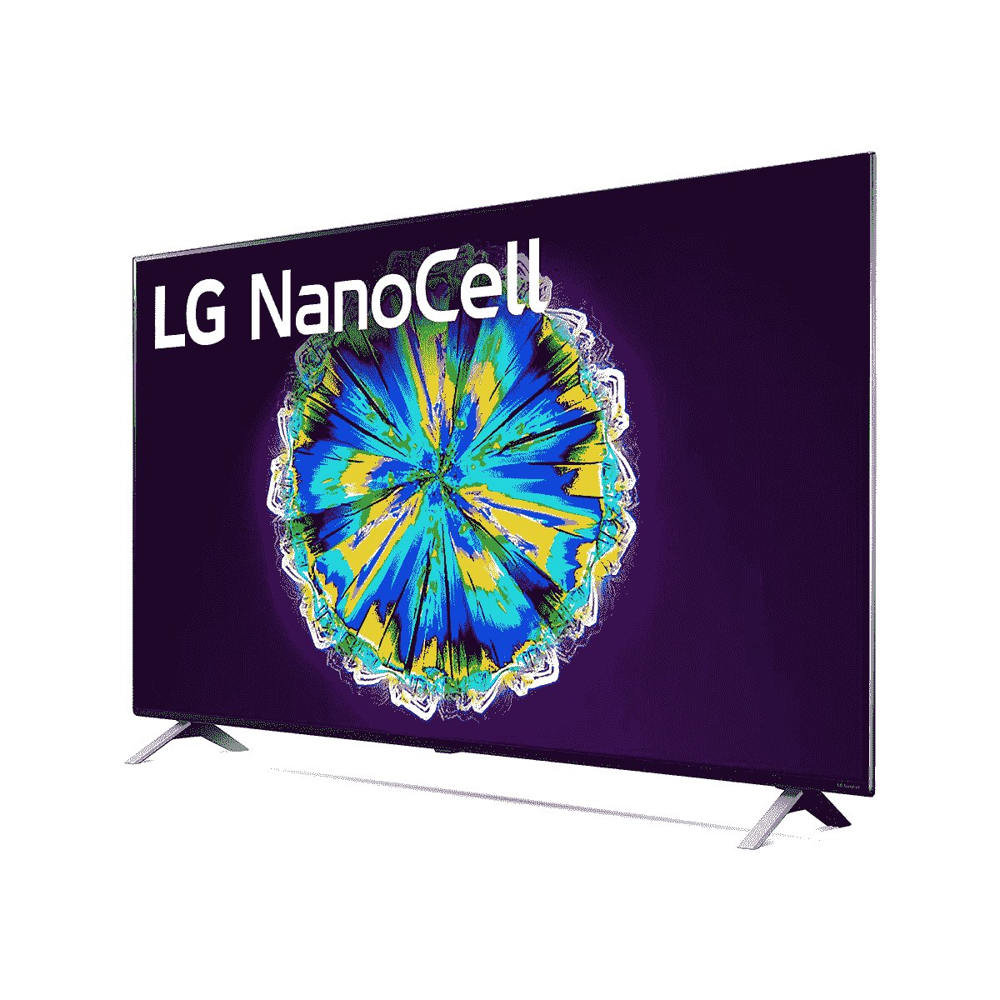

# 在网络星期一购买 LG 65 英寸 4K LED 智能电视可节省 300 美元

> 原文：<https://www.xda-developers.com/lg-65-inch-4k-led-tv-120hz-refresh-rate-cyber-monday-sale-crutchfield-amazon/>

# 购买 LG 的 65 英寸 4K LED 电视(刷新率为 120 赫兹)可节省 300 美元

在 Crutchfield 和亚马逊的网络星期一销售期间，以 300 美元的折扣购买这台 1200 美元的 65 英寸 4K LED 电视，刷新率为 120 赫兹。

这个黑色星期五，我们见证了大规模的降价，电视的折扣高达 1000 美元。如果你还在寻找一个，并希望对你面前的所有选择有一个清晰的概述，我们已经编辑了一个列表[最好的网络星期一电视交易](https://www.xda-developers.com/black-friday-tv-deals/)。但是，如果你正在寻找一些特定的东西，比如 65 英寸的 LED 电视，而又不想在口袋里烧出一个洞，我们有一个很好的选择给你。LG 65 英寸 NanoCell 85 系列 4K LED 智能电视的售价比通常的 1200 美元低 300 美元。

 <picture></picture> 

LG 65-inch 4K LED Smart TV

##### LG 65 英寸 4K LED 智能电视

LG 制造了最好的电视之一，这是你能买到的最物有所值的电视之一。凭借 65 英寸 120Hz 显示屏，这是一款令人兴奋的娱乐和游戏电视。在 Crutchfield 的网络星期一促销期间获得 300 美元的折扣。

 <picture></picture> 

LG 65-inch 4K LED Smart TV

##### LG 65 英寸 4K LED 智能电视

偏爱亚马逊还是想用 Prime 确保更快的送货速度？在亚马逊上为网络星期一获得同样的交易。

这款来自 LG 的 65 英寸 4K LED 智能电视配有该公司的 NanoCell LCD 背光 LED 显示面板。作为 IPS 面板，它提供了出色的可视性，即使从极端角度观看也不会有太大的色彩损失。它还配有局部调光功能，以获得更丰富的对比度。

这款智能电视运行在 LG 专有的基于 Linux 的 WebOS 界面上。YouTube、网飞、Hulu、Amazon Prime、Disney+等应用程序。可通过预装在电视上的 app store 轻松获得。你还可以选择在电视上安装 Alexa 和谷歌助手，并根据自己的喜好使用它们。随着 65 英寸 LED 电视的推出，LG 提供了一个可以作为普通遥控器的 magic 遥控器，以及一个可以通过检测遥控器的物理移动来移动光标的 air 遥控器。

LG 为这款 65 英寸 4K LED 智能电视配备了α7 GEN 3 处理器，可以轻松处理视频信号，并对较低分辨率的内容进行人工智能 4K 升级。电视中使用的面板具有 120Hz 的刷新率，而电视支持可变刷新率，以实现流畅的游戏。它还支持 HDR10、杜比视界和 HLG，以提高对比度。

对于 I/O，电视具有 4 个 HDMI 端口，其中两个支持 HDMI 2.1，一个支持 eARC。您还可以获得 3 个 USB 2.0 端口，使数据传输更容易。