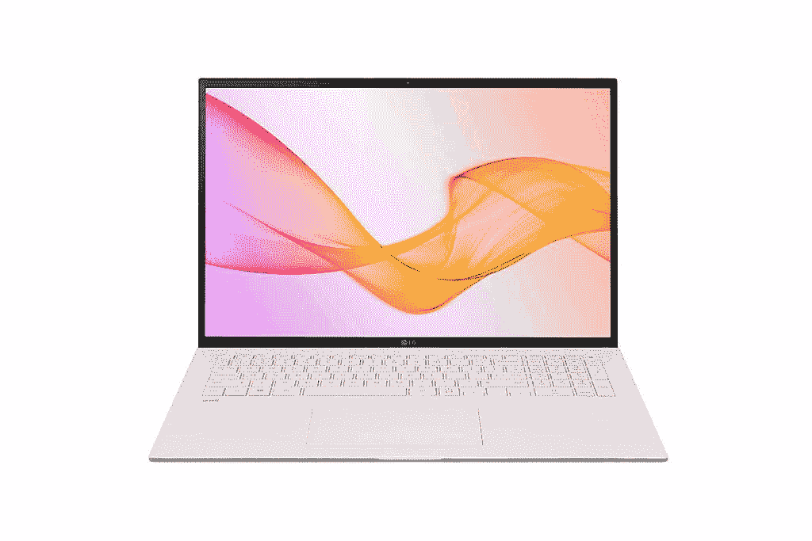

# LG Gram 2021 系列笔记本在 CES 正式上市

> 原文：<https://www.xda-developers.com/lg-announces-new-gram-2021-notebooks-ces-11th-gen-intel-processors/>

# LG 在 ces 上发布新的 LG Gram 2021 笔记本电脑，采用 16:10 显示屏和第 11 代英特尔处理器

LG 更新了其 LG Gram 笔记本产品线，提供更大的屏幕和英特尔最新的第 11 代处理器。把他们都检查出来！

全新的 LG Gram 2021 系列笔记本电脑已经正式公布。延续了超轻超薄的设计，据说新的更新将带来更长的电池寿命，由于新的第 11 代英特尔处理器和新的 16:10 宽高比屏幕而提高了性能。全新 LG Gram 2021 共包括五款机型——LG Gram 17(型号 17Z90P)、LG Gram 16(型号 16Z90P)、LG Gram 14(型号 14Z90P)、LG Gram 二合一 16(型号 16T90P)、LG Gram 二合一 14(型号 14T90P)。

## LG Gram 2021:规格

| 

规格

 | 

LG Gram 17(17Z90P)

 | 

LG 克 16(16Z90P)

 | 

LG 克 14(14Z90P)

 | 

LG 克 16 二合一(16T90P)

 | 

LG 克 14 二合一(14T90P 便士)

 |
| --- | --- | --- | --- | --- | --- |
| **尺寸&重量** | 

*   380.2 x 260.1 x 17.8 毫米
*   1.35 千克

 | 

*   355.9 x 243.4 x 16.8 毫米
*   1.19 千克

 | 

*   313.4 x 215.2 x 16.8 毫米
*   0.99 千克

 | 

*   356.6 x 248.3 x 16.95 毫米
*   1.48 千克

 | 

*   314 x 219.5 x 16.75 毫米
*   1.25 千克

 |
| **显示** | 

*   17 英寸 WQXGA (2560 x 1600) IPS
*   保卫儿童国际-P3 99%
*   16:10 宽高比

 | 

*   16 英寸 WQXGA (2560 x 1600) IPS
*   保卫儿童国际-P3 99%
*   16:10 宽高比

 | 

*   14 英寸 WUXGA (1920 x 1200) IPS
*   保卫儿童国际-P3 99%
*   16:10 宽高比

 | 

*   16 英寸 WQXGA (2560 x 1600) IPS 触摸屏
*   康宁大猩猩玻璃 6
*   16:10 宽高比

 | 

*   14 英寸 WUXGA (1920 x 1200) IPS 触摸屏
*   康宁大猩猩玻璃 6
*   16:10 宽高比

 |
| **处理器** | 

*   第 11 代英特尔酷睿处理器

 | 

*   第 11 代英特尔酷睿处理器

 | 

*   第 11 代英特尔酷睿处理器

 | 

*   第 11 代英特尔酷睿处理器

 | 

*   第 11 代英特尔酷睿处理器

 |
| **GPU** | 

*   英特尔 Iris X ^e 显卡
*   英特尔超高清显卡

 | 

*   英特尔 Iris X ^e 显卡
*   英特尔超高清显卡

 | 

*   英特尔 Iris X ^e 显卡
*   英特尔超高清显卡

 | 

*   英特尔 Iris X ^e 显卡
*   英特尔超高清显卡

 | 

*   英特尔 Iris X 显卡
*   英特尔超高清显卡

 |
| **风筒&储存** | 

*   8GB/16GB LPDDR4x
*   M.2 双 NVMe 固态硬盘插槽

 | 

*   8GB/16GB LPDDR4x
*   M.2 双 NVMe 固态硬盘插槽

 | 

*   8GB/16GB LPDDR4x
*   M.2 双 NVMe 固态硬盘插槽

 | 

*   8GB/16GB LPDDR4x
*   M.2 双 NVMe 固态硬盘插槽

 | 

*   8GB/16GB LPDDR4x
*   M.2 双 NVMe 固态硬盘插槽

 |
| **电池&充电器** |  |  |  |  |  |
| **输入/输出** | 

*   2 个 USB 4 Gen3x2 (USB PD，Thunderbolt 4)
*   2 个 USB 3.2 Gen2x1
*   高清晰度多媒体接口
*   微型 SD/UFS 读卡器
*   3.5 毫米耳机/麦克风组合插孔

 | 

*   2 个 USB 4 Gen3x2 (USB PD，Thunderbolt 4)
*   2 个 USB 3.2 Gen2x1
*   高清晰度多媒体接口
*   微型 SD/UFS 读卡器
*   3.5 毫米耳机/麦克风组合插孔

 | 

*   2 个 USB 4 Gen3x2 (USB PD，Thunderbolt 4)
*   2 个 USB 3.2 Gen2x1
*   高清晰度多媒体接口
*   微型 SD/UFS 读卡器
*   3.5 毫米耳机/麦克风组合插孔

 | 

*   2 个 USB 4 Gen3x2 (USB PD，Thunderbolt 4)
*   USB 3.2 Gen2x1
*   高清晰度多媒体接口
*   微型 SD/UFS 读卡器
*   3.5 毫米耳机/麦克风组合插孔

 | 

*   2 个 USB 4 Gen3x2 (USB PD，Thunderbolt 4)
*   USB 3.2 Gen2x1
*   高清晰度多媒体接口
*   微型 SD/UFS 读卡器
*   3.5 毫米耳机/麦克风组合插孔

 |
| **连通性** |  |  |  |  |  |
| **OS** |  |  |  |  |  |
| **其他功能** | 

*   指纹读取器
*   符合美国军用标准 810G
*   DTS X Ultra

 | 

*   指纹读取器
*   符合美国军用标准 810G
*   DTS X Ultra

 | 

*   指纹读取器
*   符合美国军用标准 810G
*   DTS X Ultra

 | 

*   指纹读取器
*   符合美国军用标准 810G
*   手写笔(Wacom AES 2.0)
*   DTS X Ultra

 | 

*   指纹读取器
*   符合美国军用标准 810G
*   手写笔(Wacom AES 2.0)
*   DTS X Ultra

 |

LG 表示，新的超便携系列现在通过更新的屏幕纵横比提供了更大的空间。新显示器还具有更高的分辨率，并覆盖 99%(典型值)的 DCI-P3 色彩空间，使其非常适合娱乐和工作。该公司还重新设计了键盘和触摸板，据说它们现在更大了，可以提供更快、更方便的打字体验。

所有新型号都配备了最新的第 11 代英特尔酷睿处理器选项，以及 LPDDR4x 内存和新的英特尔 Xe 显卡。LG 还推出了 14 英寸和 16 英寸显示屏尺寸的 2 合 1 外形，允许用户根据自己的使用情况，使用 360 度转轴灵活地改造笔记本电脑。

 <picture></picture> 

LG Gram 17 (17Z90P)

自从该公司在 2015 年推出 Gram 系列以来，它一直都是超轻量设计。LG 多年来推出了各种变体，专注于生产重量不到一千克的笔记本电脑。然而，2021 年的新款并不是真正的“轻量级”除了标准的 14 英寸型号，LG Gram 系列的所有新笔记本重量都超过 1 千克。这实质上意味着只有 LG Gram 14 14Z90P 名副其实。

## 定价和可用性

截至目前，LG 尚未确认新 Gram 笔记本系列的定价或可用性，但我们预计该公司将在下周的 CES 2021 虚拟展厅期间分享这一点。