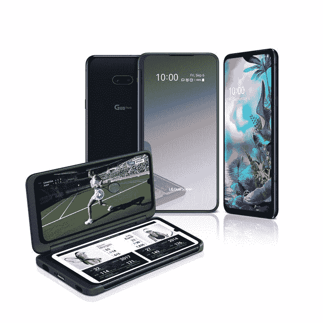

# [更新:在印度推出] LG 的可折叠产品是带双屏附件的 G8X

> 原文：<https://www.xda-developers.com/lg-g8x-dual-screen-announced/>

**更新 2(美国东部时间 2019 年 12 月 20 日上午 7:20):**lg8x thinq 已经在印度上市，售价为₹49,999(～702 美元)。

**更新 1(美国东部时间 2019 年 10 月 22 日下午 4:30):**LG G8X 将于 11 月 1 日在美国发布。售价 699 美元(含双显示器)。发表于 2019 年 9 月 6 日的原始文章保留如下。

关于 LG 的下一款设备是 LG G8X 还是 LG V50S，曾有过一些争论,今天该公司搁置了这一争论。LG G8X ThinQ 在 2019 年 IFA 发布，是该公司第二款采用双屏配件的设备。然而，这一次，它不仅仅是为韩国保留的，他们已经做了一些关键的改进。

| 

规范

 | 

LG G8X ThinQ

 |
| --- | --- |
| 大小 | 159.3 x 75.8 x 8.4mm 毫米，192 克 |
| 显示 | 6.4 英寸 19.5:9 FHD +有机发光二极管全视屏(2，340 x 1，080/403 像素) |
| 芯片集 | 高通骁龙 855 |
| 记忆 | 6GB 内存 |
| 储存；储备 | 128GB (microSD) |
| 后置摄像头 | 

*   12MP 标准(1.8 微米/ 1.4 微米/ 78 英寸)
*   1300 万像素超宽(2.4 / 1.0μm / 136 英寸)

 |
| 前置摄像头 | 

*   32MP 标准(1.9 微米/ 0.8 微米/ 79 微米)

 |
| 电池 | 4000 毫安时(高通快充 3.0) |
| 操作系统（Operating System） | 安卓 9 派 |
| 连通性 | Wi-Fi 802.11 a、b、g、n、ac /蓝牙 5 / NFC / USB Type-C(兼容 USB 3.1) |
| 生物测定学 | 显示屏内指纹传感器 |
| 声音的 | 立体声扬声器、32 位高保真四通道 DAC、DTS:X 3D 环绕声、3.5 毫米耳机插孔 |
| 颜色；色彩；色调 | 极光黑 |

首先说一下手机本身，这是公告中最不激动人心的部分。LG G8 ThinQ 和 LG G8X 之间没有太多的区别。G8X 略大，6.4 英寸有机发光二极管显示屏，分辨率为 FHD+级，有一个小水滴凹槽。有趣的是，分辨率低于 LG G8 (3120 x 1440)。

LG G8X 背面也有双摄像头。主传感器为 12MP，f/1.8 光圈，辅助摄像头为 13MP，f/2.4，136 度广角视野。LG 正在推出一些新的相机软件，包括“AI Action Shot”，它可以在检测快速移动的对象时自动提高快门速度。前置摄像头 32MP。

就表现而言，我们看到的与 G8 基本相同。LG G8X 拥有骁龙 855 处理器，6GB 内存，128GB 存储空间(可扩展)，以及略大的 4,000mAh 电池。同样，它具有高通快速充电 3.0 和无线充电功能。

我们也不能在不提及音频的情况下谈论 LG 手机。LG G8X 具有立体声扬声器、32 位高保真四通道 DAC 和 DTS:X 3D 环绕声。哦，他们仍然坚持使用 3.5 毫米耳机插孔。LG 还表示，在 ASMR 录制视频时，麦克风会自动打开。是的，他们真的这么说了。

## 双屏

现在，关于双屏配件。LG 对我们在 LG V50 上看到的[双屏进行了几项关键改进。它现在通过 USB Type-C 连接到手机，而不是弹簧针。双屏幕上的显示在对称性上与 LG G8X 完全相同。LG 甚至在双屏上添加了一个假的水滴凹槽，以确保它们看起来一样。](https://www.xda-developers.com/lg-v50-dual-screen-hands-on/)

铰链经过改进，现在可以 360 度旋转。很多人认为最初的双屏在关闭时应该有某种显示，就像[星系折叠](https://www.xda-developers.com/samsung-galaxy-fold-launch-delays/)，现在有了。这是一个 2.1 英寸的小显示屏，可以显示时间、日期、电池、通知等。LG 还声称双屏现在耗电更少。

不过，双屏的问题仍然存在。你仍然不得不处理两个显示器之间相当大的间隙。如果你想在两个屏幕上运行一个应用程序，应用程序支持不是很好。双屏也增加了 LG G8X 的厚度。

## 有效性

LG G8X 和双屏将于今年晚些时候在“主要市场”上市。LG 没有分享定价信息。它将有一种颜色可供选择:极光黑。

**来源:[LG](http://www.lgnewsroom.com/2019/09/lg-g8x-thinq-and-new-lg-dual-screen-enhance-mobile-multitasking-and-user-enjoyment/)**

* * *

## 更新:11 月 1 日在美国发布

 <picture></picture> 

LG G8X ThinQ, LG Dual Screen Available In U.S. Beginning Nov. 1

LG 终于宣布了 LG G8X 的定价和发布日期。它将于 11 月 1 日在美国上市，售价 699 美元。当你考虑到 LG 将双显示器配件与它捆绑在一起时，这是一个相当不错的价格。所以你可以在一个设备中获得两个显示器。它将在亚马逊、美国电话电报公司和 Sprint 上出售。

**来源:[LG](https://www.prnewswire.com/news-releases/lg-g8x-thinq-lg-dual-screen-available-in-us-beginning-nov-1-300942988.html)**

* * *

## 更新 2:在印度为₹49,999 推出(约 702 美元)

LG 已经在印度推出了 LG G8X ThinQ。这款双屏智能手机的价格为₹49,999(约 702 美元)。这款手机将于 2019 年 12 月 21 日起在线下零售店上市。

**来源: [NDTV 小工具](https://gadgets.ndtv.com/mobiles/news/lg-g8x-thinq-price-in-india-rs-49999-launch-specifications-release-date-december-21-2151930)**