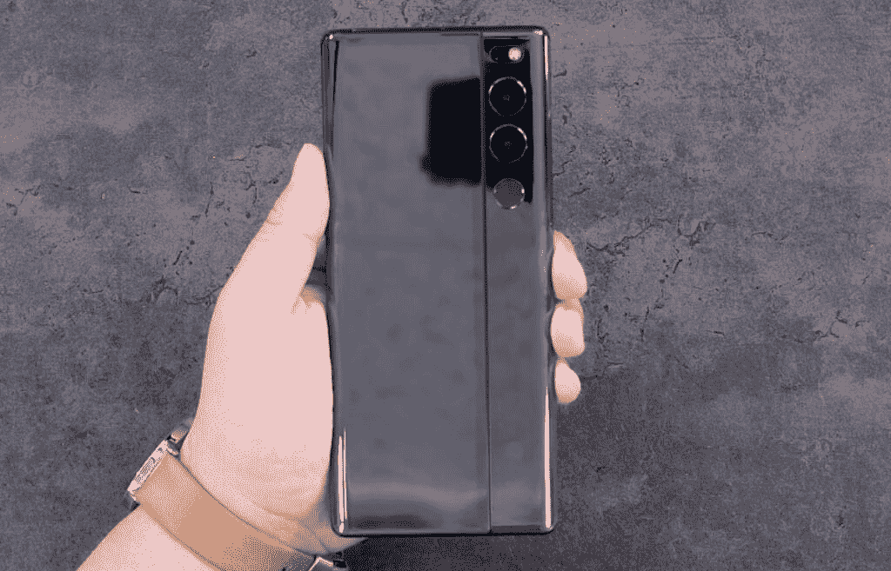
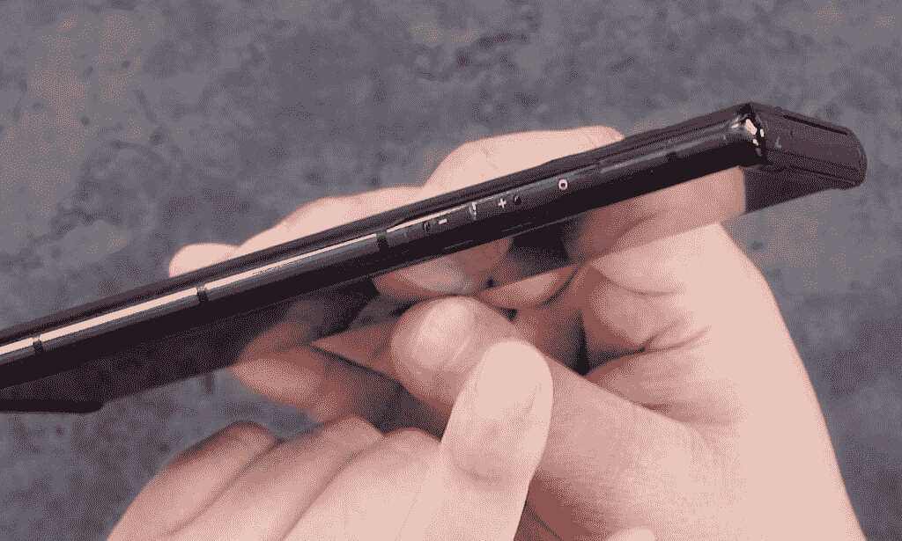
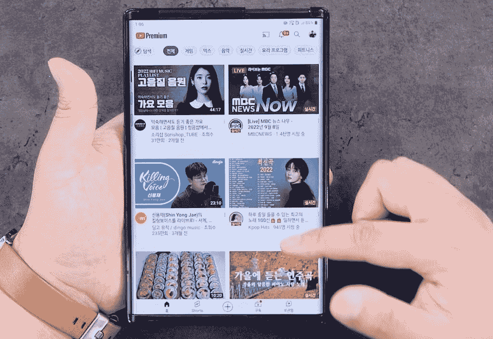

# 被取消的 LG Rollable 出现在另一个动手视频中，看起来棒极了

> 原文：<https://www.xda-developers.com/lg-rollable-hands-on-video/>

在 LG [退出智能手机市场](https://www.xda-developers.com/lg-exits-smartphone-business/)之前，该公司正在开发一款独特的可滚动智能手机。它首先在 2020 年 9 月的 LG Wing 发布会上取笑了这款设备，然后[在 CES 2021](https://www.xda-developers.com/lg-rollable-smartphone-concept-revealed/) 上展示了一款工作原型。虽然该公司官方确认 LG Rollable 将于 2021 年上市，但我们都知道结果如何。

虽然 LG Rollable 从未上市，但我们已经在野外看到了它。这可能是因为据称该公司[向其员工](https://www.xda-developers.com/lg-unreleased-flagship-rollable-phonesallegedly-being-sold-employees/)出售了该设备。今年早些时候，这款手机[出现在一个简短的实践视频](https://www.xda-developers.com/lg-rollable-smartphone-shows-up-in-video/)中，展示了它的可滚动显示机制。现在，韩国 YouTube 频道发布了一段深入的视频，让我们了解到目前为止 LG 取消的 rollable。

视频从展示 LG Rollable 独特的零售包装开始，这种包装可以像设备的显示屏一样滑动打开。在里面，你得到了设备，一些文件，一块充电砖和一根 USB 线。

 <picture></picture> 

Credit: BullsLab

然后，我们将看到这款设备的辉煌，并了解它的所有硬件规格。根据视频，LG Rollable 包了高通的骁龙 888 SoC、12GB 内存、256GB 存储和 4500 毫安时电池。这款设备的正面有一个 6.8 英寸的柔性电极显示屏，可以扩展到更大的 7.4 英寸屏幕。

 <picture></picture> 

Credit: BullsLab

在背面，LG Rollable 采用了双摄像头设置，包括一个 64MP 主摄像头和一个 12MP 超广角摄像头。它还在后置摄像头模块的正下方配备了一个圆形指纹扫描仪。

 <picture></picture> 

Credit: BullsLab

有趣的是，LG Rollable 没有传统的电源按钮或音量摇杆。相反，这款设备的左边缘有触摸感应控制，可以帮助用户打开显示屏和调节音量。

视频接着展示了 LG Rollable 的显示屏，你可以通过两个手指的滑动手势无缝扩展和收缩。随着手机的转变，其用户界面会自动适应不断变化的外形。UI 转换看起来相当平滑，即使在 YouTube 这样的应用程序中也是如此。

 <picture></picture> 

Credit: BullsLab

虽然拥有可卷曲的显示屏意味着手机不会像三星的可折叠手机那样有褶皱，但显示屏的可卷曲部分似乎确实有一些褶皱。此外，可卷曲部分不像显示器的其余部分那样结构坚固，并且在受压时容易弯曲。虽然 LG 可能会在后续版本中解决这一问题，但该公司不会很快发布新的智能手机。

然而，其他原始设备制造商正在开发类似的智能手机，你可以期待在未来得到一款带有可滚动显示屏的设备。在那之前，请查看完整视频，了解取消的 LG Rollable。