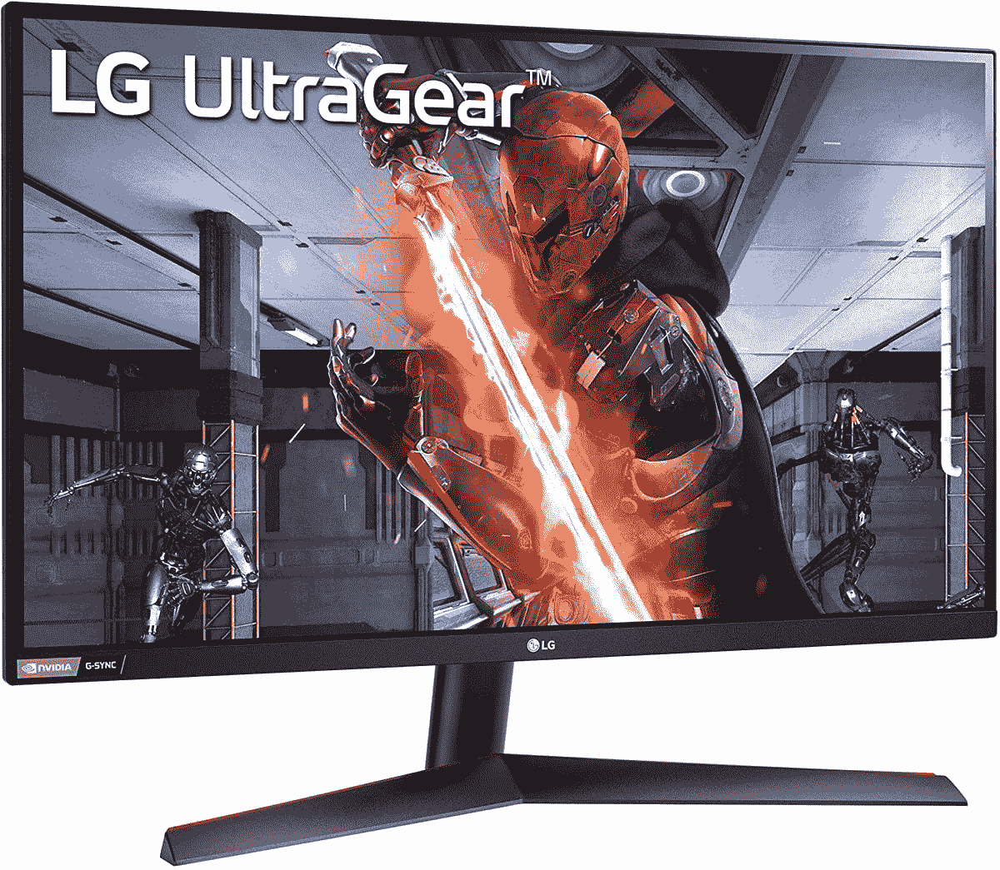

# 这款 LG UltraGear 游戏显示器在网络星期一仅售 280 美元

> 原文：<https://www.xda-developers.com/lg-ultragear-quad-hd-gaming-cyber-monday/>

需要新的游戏显示器吗？LG 的 UltraGear 品牌包括一些很棒的游戏显示器，今天，你可以在亚马逊花 277 美元买到一款更好的型号。LG UltraGear 27GN800-B 是一款 27 英寸游戏显示器，具有四核高清分辨率和 144Hz 刷新率，承诺提供清晰流畅的游戏体验。这款 LG UltraGear 显示器通常售价 360 美元，在网络星期一只需 280 美元。你也可以在沃尔玛花 280 美元买到它，只需多花 3 美元。

 <picture></picture> 

LG UltraGear 27GN800-B Gaming Monitor ($80 off)

##### LG UltraGear 27GN800-B

这款 LG UltraGear 显示器具有四核高清分辨率和流畅的 144Hz 刷新率，可带来出色的游戏体验。它还支持 HDR 和自适应同步。

LG UltraGear 27GN800-B 配备了 2560 x 1440 分辨率，这是 16:9 纵横比中的标准四高清分辨率。这仍然是游戏中最受欢迎的长宽比，尽管有些人可能更喜欢更宽的屏幕。IPS 面板还覆盖了 99%的 sRGB 色彩空间，并支持 HDR10，尽管它不是一个超级明亮的面板，不会像更昂贵的显示器那样明显地产生 HDR 效应。

此外，您还可以获得超级平滑的 144Hz 刷新率，以及对 AMD FreeSync Premium 和 NVIDIA G-Sync 兼容性的支持。这些自适应同步技术确保即使在帧速率下降时也能获得流畅的游戏体验。还有 1 毫秒的灰阶响应时间，所以当你在游戏中错过一个镜头时，你不能责怪输入延迟。

这款显示器的一个潜在缺点是支架，它不支持旋转或高度调节。它有一些倾斜控制，虽然不是最宽的。它确实支持 VESA 安装，如果您有一个支持它的设置，这可能会给您更多的控制。

通过这笔网络星期一大交易，LG UltraGear LG 27GN800-B 是你以这个价格可以买到的最好的显示器之一。它清晰、平滑、具有纯色覆盖范围，并且具有小边框，如果你打算为多显示器设置购买多个显示器，这是很好的选择。如果你想看看其他的选择，我们已经在我们的[网络星期一个人电脑交易中心](https://www.xda-developers.com/best-black-friday-pc-gaming-deals/)重点介绍了几款显示器。对于所有与移动技术相关的东西，请查看我们专注于智能手机的[网络星期一](https://www.xda-developers.com/black-friday/)交易列表。