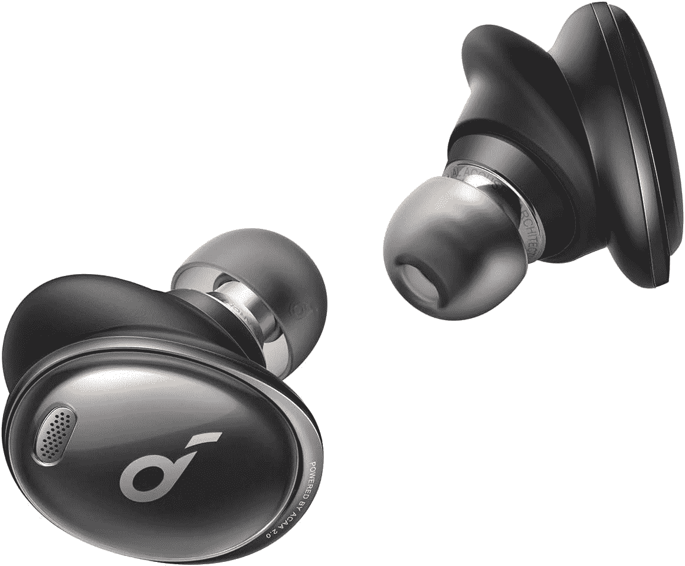

# Anker Soundcore 公司的 Liberty 3 Pro TWS 在这个销售季节降到了 90 美元

> 原文：<https://www.xda-developers.com/liberty-3-pro-tws-anker-soundcore-deal-prime-day-early-access/>

# Anker Soundcore 公司的 Liberty 3 Pro TWS 在这个销售季节降到了 90 美元

Anker Soundcore 的 Liberty 3 Pro 无线耳塞再次降至 90 美元，如果你错过了第一轮，你就有机会购买。

Anker 很快在音频领域声名鹊起，尤其是在预算和中档领域。虽然该公司最近推出了采用 stem 设计的 Liberty 4，但 Liberty 3 Pro 继续拥有自己的空间。当你考虑到你可以只花 90 美元买到这些很棒的耳塞时，这就更是事实了，这对于想要更小的无柄设计耳机的人来说是一个很好的选择。

这并不是 Liberty 3 Pro 第一次降到这个价格——你也可以在 7 月销售季节以这个价格买到它们。但是如果你错过了这个机会，它们会再次降到 90 美元，这个价格会让你获得巨大的价值。你可以在亚马逊上以折扣价买到它们，但如果它们在那里缺货，你可以在 Anker 的网站上用折扣券买到它们，折扣券会在将它们添加到购物车时弹出。

 <picture></picture> 

Anker Soundcore Liberty 3 Pro

##### Anker Soundcore 自由 3 专业版

Soundcore Liberty 3 Pro 耳塞的音质非常好，ANC，而且价格便宜 50%!

让 Liberty 3 Pro 脱颖而出的是，除了通常的耳尖尺寸之外，它还提供了一系列翼尖选项供您选择。翼尖有助于保持耳塞的位置，如果你发现自己很容易摆脱其他耳塞，这很好。有蓝牙 5.2 与蓝牙多点双设备连接，编解码器支持 LDAC，AAC 和 SBC。Liberty 3 Pro 的音质可以用重低音来形容，但对于大多数普通消费者来说还是不错的。诚然，ANC 不是业内最好的，但考虑到价格，你在这里也能得到很好的价值。您还可以获得出色的电池续航时间，并且该外壳还支持 Qi 无线充电。

如果你不喜欢这些耳塞，你可以看看市面上其他的[优质耳塞](https://www.xda-developers.com/best-wireless-earbuds/)。