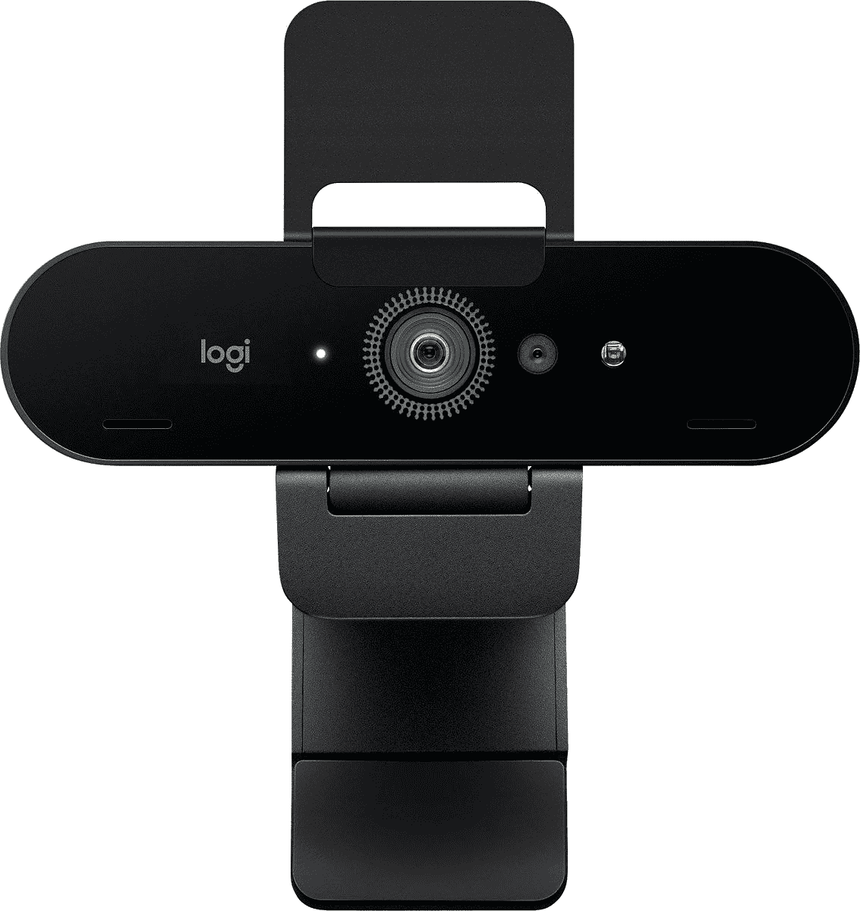

# 网络摄像头交易:立即以 40 美元的价格购买罗技 4K 专业网络摄像头

> 原文：<https://www.xda-developers.com/logitech-4k-pro-webcam-deal-feb-2022/>

在 2020 年的大部分时间里，以及 2021 年的一些时间里，网络摄像头难以置信地难以购买，但现在股票已经稳定下来，网络摄像头上的实际销售再次出现。现在，你可以在多家零售商那里以 159.99 美元的价格买到罗技 4K 专业网络摄像头——比通常价格优惠 40 美元。

这个网络摄像头以 30FPS 的速度捕捉 DCI·4K(4096 x 2160)的视频，但你需要一个免费的 USB 3.0 端口或更好的端口才能达到最高质量。这款相机还可以以 30/60FPS 的速度在 1080p 下工作，以 30/60/90FPS 的速度在 720p 下工作，为您以正常或高帧速率录制提供了大量选择。还有两个全向麦克风，旨在听到“最远 3.3 英尺远”的清晰音频，尽管使用专用麦克风可能仍会获得最佳音频质量。

 <picture></picture> 

Logitech 4K Pro Webcam

##### 罗技 4K 专业网络摄像头

这是目前桌面网络摄像头的最佳选择之一。

摄像头可以放置在 65 度、78 度和 90 度的角度，并且有一个内置的隐私保护盖，可以随时隐藏网络摄像头的视图。像大多数网络摄像头一样，它可以通过内置的夹子放置在显示器上，或者您可以将其放在带有标准 1/4 英寸-20 英寸三脚架的三脚架上。这为您提供了大量选项来改变其他人在视频通话中看到的角度或位置。

正常的视频和音频录制可以在任何运行 Windows、macOS 和 Chrome OS 的 PC 上运行。但是，如果您碰巧使用 Windows 10 或 11，罗技 4K 专业网络摄像头也可以配置为 Windows Hello 登录方法，以便在您的 PC 上轻松进行类似 Face ID 的身份验证。

如果罗技 4K 专业网络摄像头有点太贵，看看我们的[最佳网络摄像头](https://www.xda-developers.com/best-webcams/)综述。我们从包括罗技、微软、戴尔和联想在内的各种制造商那里收集了一些适用于各种使用情形和价位的最佳选项。令人欣慰的是，现在有数百万人远程工作，对于高质量的网络摄像头有了前所未有的更多选择。