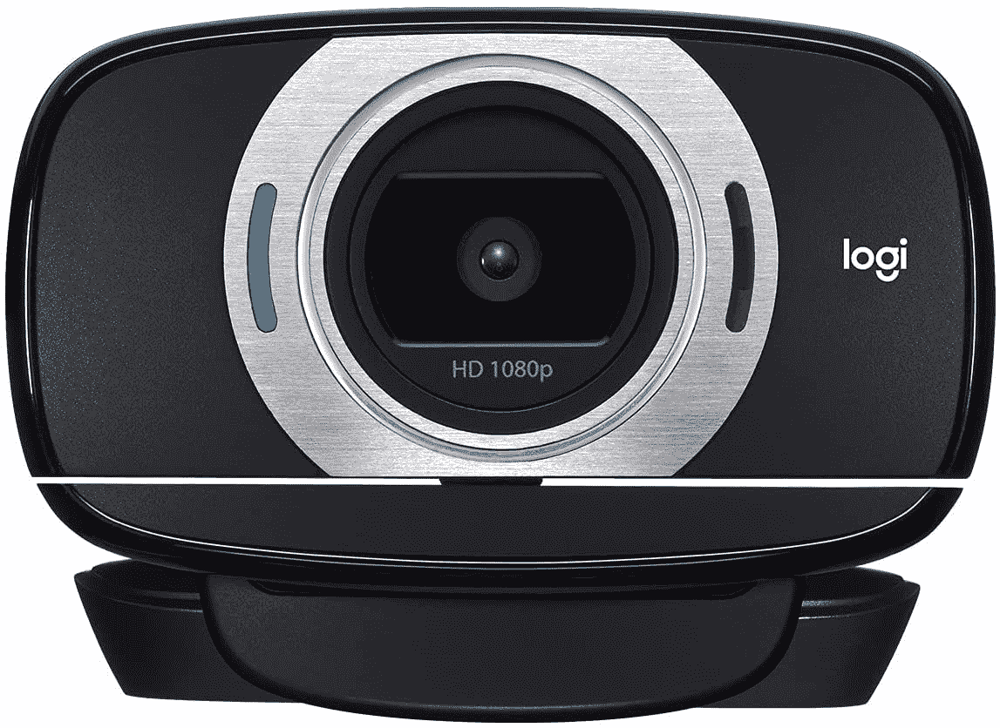

# 只需 40 美元，立即购买罗技 C615 高清网络摄像头

> 原文：<https://www.xda-developers.com/logitech-c615-webcam-deal-december-2021/>

在 2020 年和 2021 年的大部分时间里，几乎不可能买到网络摄像头，这要归功于世界各地数百万人转变为在家工作。尽管 COVID 疫情并没有结束，现在我们有持续的供应链问题，网络摄像头的价格已经谢天谢地稳定了一点。现在，你可以在亚马逊花 39.99 美元买到罗技的 1080p 网络摄像头，比正常价格优惠 30 美元。

这是罗技的一款廉价相机，配有 1080p 视频传感器，可以达到 30 FPS，但仅此而已——如果你迫切需要 60FPS 的流媒体或流畅的视频通话，你必须去别处看看。主要卖点是折叠设计，不使用时可将相机放平，便于携带，并且能够 360 度旋转。除此之外，它几乎是你的平均预算网络摄像头-支持自动对焦，有一个内置麦克风，可以夹在显示器或笔记本电脑的顶部。

 <picture></picture> 

Logitech C615

##### 罗技 C615 高清网络摄像头

这款 1080p 网络摄像头在亚马逊以不到 40 美元的价格出售。

YouTube 上有一些来自相机的视频样本，这似乎是一个“足够好”的领域，尤其是在 50 美元以下。内置麦克风也不错。然而，这款相机确实使用 USB Type-A 电缆连接计算机，所以如果你有一台只有 USB Type-C 连接的笔记本电脑，你需要[一个加密狗](https://www.amazon.com/AmazonBasics-Type-C-Gen1-Female-Adapter/dp/B01GGKYXVE?tag=xda-67n2g1c-20&ascsubtag=UUxdaUeUpU6232&asc_refurl=https%3A%2F%2Fwww.xda-developers.com%2Flogitech-c615-webcam-deal-december-2021%2F&asc_campaign=Short-Term)。

对于普通的视频通话和流媒体来说，这是一个很好的网络摄像头，但它缺乏一些价格稍高的网络摄像头常见的功能，如录制 60FPS 1080p 视频的选项。尽管如此，罗技 C615 是一个功能强大的网络摄像头，用于典型的视频通话，它可以成为任何仍在处理低于标准相机的人的一个体面的礼物。尽管罗技确实为网络摄像头提供了软件驱动程序，但它应该可以即插即用到任何运行 Windows、macOS 或 Linux 的台式电脑或笔记本电脑上。