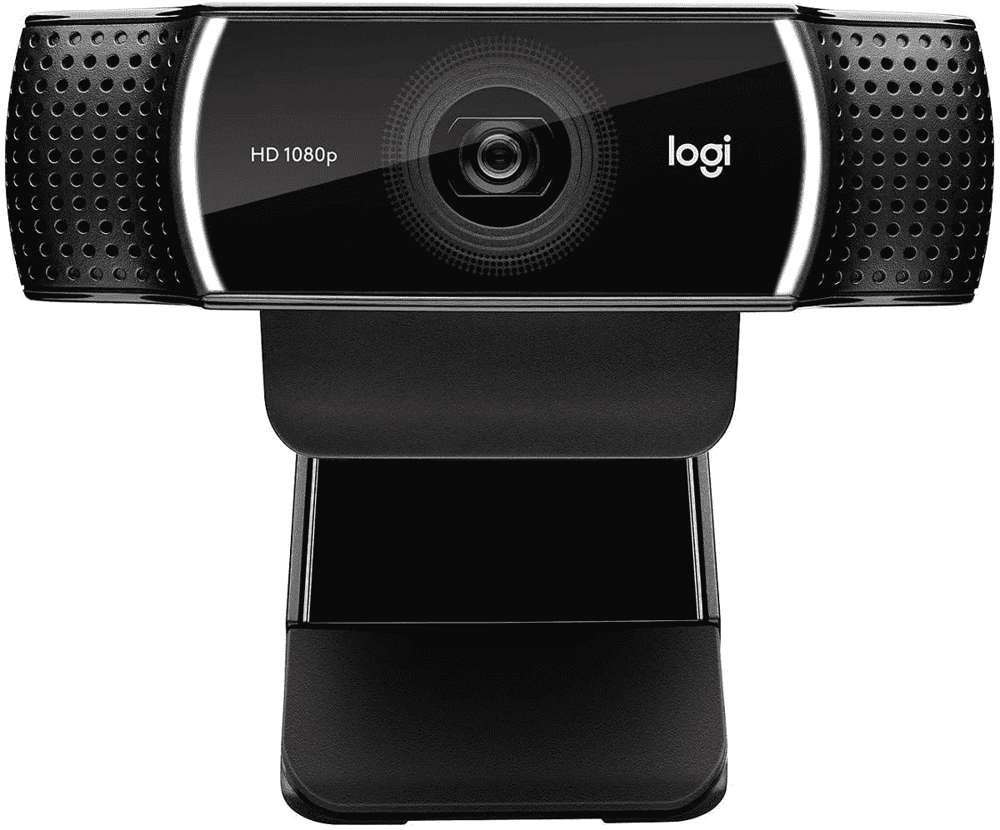

# 罗技 C922x 专业网络摄像头现售价 80 美元

> 原文：<https://www.xda-developers.com/logitech-c922x-pro-webcam-now-on-sale-for-80/>

# 罗技 C922x 专业网络摄像头现售价 80 美元

需要网络摄像头吗？罗技的 C922x Pro 网络摄像头现在以 79.99 美元的价格出售，这是自 COVID 推出以来的最低价。

新冠肺炎疫情造成了许多产品类别的普遍短缺，由于在家工作的突然增加，网络摄像头在一段时间内很难买到。制造业终于赶上了需求，现在网络摄像头的价格比 2020 年时低得多。一个例子是罗技 C922x Pro，现在售价为 79.99 美元，比最初的建议零售价低 20 美元，是我们见过的疫情时代的最低价格。

这是该公司目前销售的许多罗技 C920 变体之一，能够以 1080p@30FPS 或 720p@60FPS 录制。它正式兼容 Windows，macOS，Chrome OS，Android 和 Xbox One。即使罗技没有在产品描述中提到它，网络摄像头也[在桌面 Linux](https://www.youtube.com/watch?v=iE2YpLpIU7Q) 下工作良好。如果你对流媒体感兴趣，网络摄像头包括一个为期 6 个月的 [XSplit](https://www.xsplit.com/) 许可证。

 <picture></picture> 

Logitech C922x Pro

##### 罗技 C922x 专业网络摄像头

这款来自罗技的 1080p 网络摄像头现在售价为 79.99 美元。这是 COVID 开始以来的最低价。

目前亚马逊上有一些价格更低的白色 1080p 网络摄像头，但这是目前大品牌中最便宜的型号之一。[罗技的 C920x 低了 10 美元](https://www.amazon.com/Logitech-C920x-Pro-HD-Webcam/dp/B085TFF7M1?tag=xda-62fu9m5-20&ascsubtag=UUxdaUeUpU4253&asc_refurl=https%3A%2F%2Fwww.xda-developers.com%2Flogitech-c922x-pro-webcam-now-on-sale-for-80%2F&asc_campaign=Short-Term)，但该型号没有 60FPS 的录制模式，而 C922x 可以以 720p@60FPS 和 1080p@30FPS 录制。这个网络摄像头也没有 XSplit 许可证。