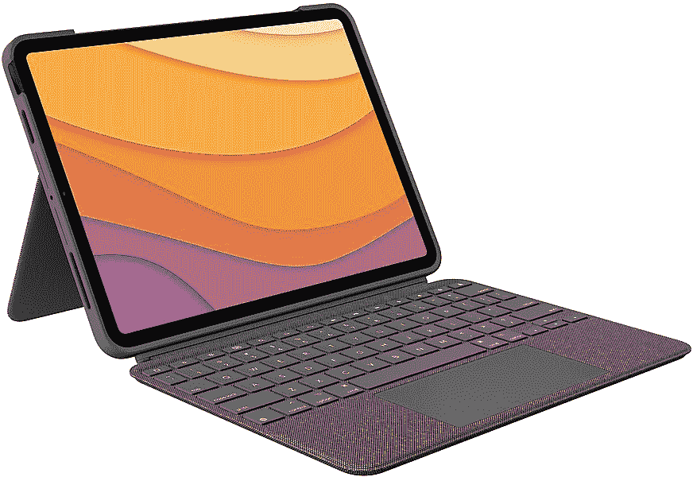

# 罗技的 iPad Air 组合触摸键盘保护套今天降价 30 美元

> 原文：<https://www.xda-developers.com/logitech-combo-touch-keyboard-case-deal-december-2021/>

苹果 iPad Air 是目前最好的平板电脑之一，但要把它变成一台合适的生产力机器通常意味着要购买一个键盘盖。罗技已经销售其 Combo Touch 键盘保护套有一段时间了，该保护套在最新的 iPad Air 上添加了键盘、触摸板和保护套，现在它在多家商店以 169.99 美元的价格出售。这比通常的价格低了 30 美元，这似乎是有史以来的第一次折扣。

这款保护套专为 iPad Air 第四代(A2316、A2324、A2325 和 A2072)设计，提供可拆卸背光键盘，拥有 16 级亮度和一整行 iPadOS 快捷键。外壳组件保护 iPad 的正面、背面和角落，并在侧面有一个支架和一个开口，用于为 Apple Pencil 充电。即使你没有在打论文，支架也可以方便地播放流媒体。还有，键盘使用 iPad 内置的智能连接器，所以你不用充电(不像基于蓝牙的键盘配件)。

 <picture></picture> 

Logitech Combo Touch Keyboard Case

##### 罗技 Combo Touch iPad Pro 12.9 英寸(2021)外壳

这款带有可拆卸键盘的保护套是第四代 iPad Air 的完美附件。

按照目前 169.99 美元的销售价格，罗技 Combo Touch 外壳比苹果自己的魔法键盘便宜了 129 美元。神奇键盘有点花哨，尤其是内置 USB Type-C 端口，但它没有为 iPad 本身提供任何保护。苹果还销售一款智能键盘 Folio，价格低于罗技的机箱，在[仅售 99 美元](https://www.amazon.com/Apple-Smart-Keyboard-11-inch-iPad-Pro/dp/B08635GZ8H?tag=xda-1ptdu69-20&ascsubtag=UUxdaUeUpU6416&asc_refurl=https%3A%2F%2Fwww.xda-developers.com%2Flogitech-combo-touch-keyboard-case-deal-december-2021%2F&asc_campaign=Short-Term)，但 iPad 角度调节有限，而且没有内置触控板。

如果你有不同型号的 iPad，请查看我们关于 iPad Mini 6 的[最佳保护套](https://www.xda-developers.com/best-ipad-mini-6-cases/)、12.9 英寸 iPad Pro 2021 最佳保护套、11 英寸 iPad Pro 2021 最佳保护套和 iPad 9 代最佳保护套[的综述。无论你有哪一款 iPad，或者你理想的价格区间，一定会有一款适合你的保护套。](https://www.xda-developers.com/best-ipad-9-cases/)