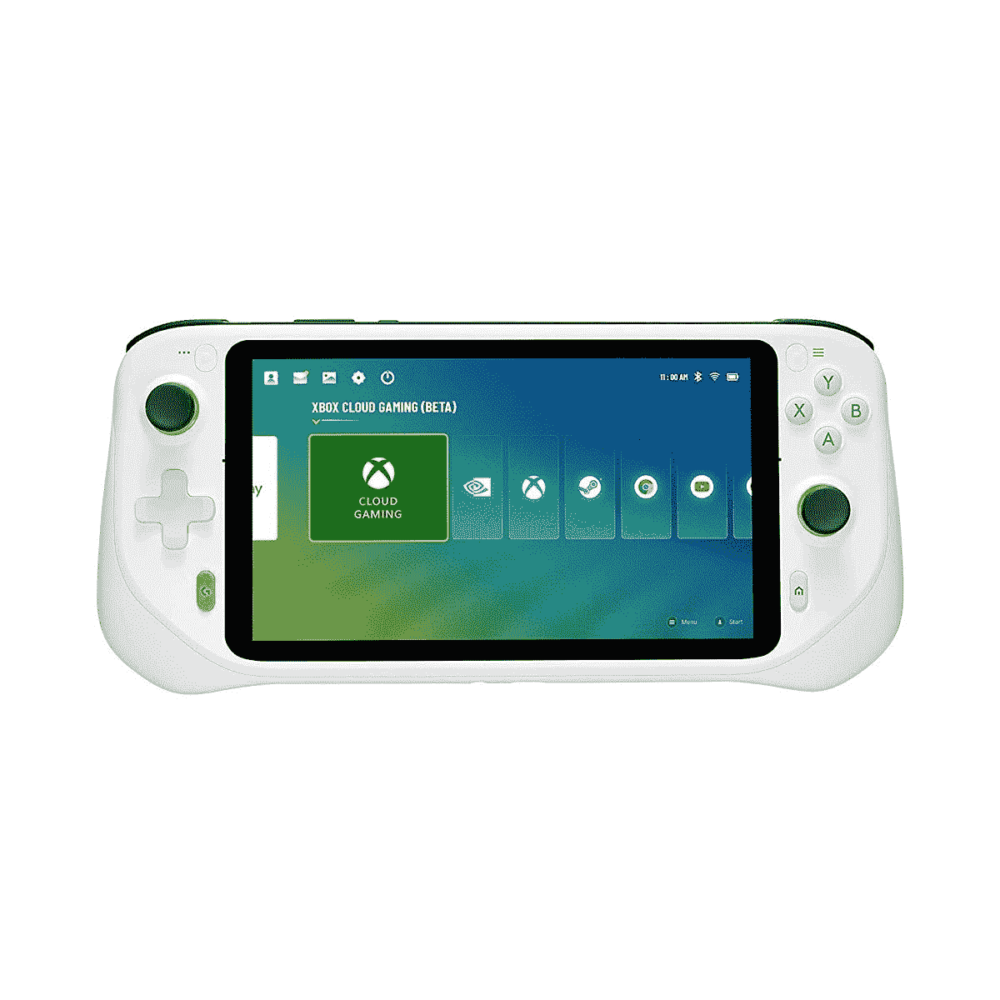

# 今天是罗技 G 云游戏掌机优惠 50 美元的最后一天

> 原文：<https://www.xda-developers.com/logitech-g-cloud-gaming-handheld-50-off/>

大约一个月前，罗技发布了其便携式游戏手持设备 [G 云游戏手持设备](https://www.xda-developers.com/logitech-g-cloud-gaming-handheld-release/)。该设备定于明天进行零售发布，因此这意味着今天是你可以以折扣价买到它的最后一天。G 云游戏掌机以 50 美元的折扣出售，你现在可以从亚马逊、百思买和罗技购买。

尽管过去几年发布了大量 Android 掌上游戏机，但大多数来自较小的公司，很少在美国的商店销售。罗技 G 云游戏手持设备配备了一个 7 英寸的 1080p 大显示屏，刷新率为 60Hz。它还支持多点触控，亮度可以达到 450 尼特。它由高通骁龙 720G 处理器驱动，重量为 462 克。

除了立体声扬声器和麦克风，该设备还提供增强的音频功能，如回声消除和噪声抑制。此外，它还有广泛的连接选项，如 3.5 毫米耳机插孔、支持高通 aptXTM Adaptive 的蓝牙 5.1，以及用于充电和音频的 USB-C。最令人惊讶的是，它一次充电可以运行 12 个小时。由于这款游戏机运行安卓系统，你可以从谷歌 Play 商店下载所有你喜欢的游戏。

除了你最喜欢的应用程序，这款手持设备还将支持 Xbox Game Pass Ultimate 和 Nvidia GeForce Now 等云游戏服务。它甚至可以利用 Steam 和 Xbox 的本地游戏流。当然，你也可以使用流媒体应用程序，如网飞、迪士尼加、亚马逊 Prime 等，观看所有你喜欢的节目。如前所述，该游戏机目前正在打折销售，但其正常零售价格为 349.99 美元。虽然你今天可以花 299.99 美元购买，但从明天开始，它将升至全价。

 <picture></picture> 

Logitech G Cloud Gaming Handheld

##### 罗技 G 云游戏掌机

罗技 G 云游戏手持设备提供强大的功能和便携性。

 <picture></picture> 

Logitech G Cloud Gaming Handheld

##### 罗技 G 云游戏掌机

罗技 G 云游戏手持设备提供强大的功能和便携性。

 <picture></picture> 

Logitech G Cloud Gaming Handheld

##### 罗技 G 云游戏掌机

罗技 G 云游戏手持设备提供强大的功能和便携性。