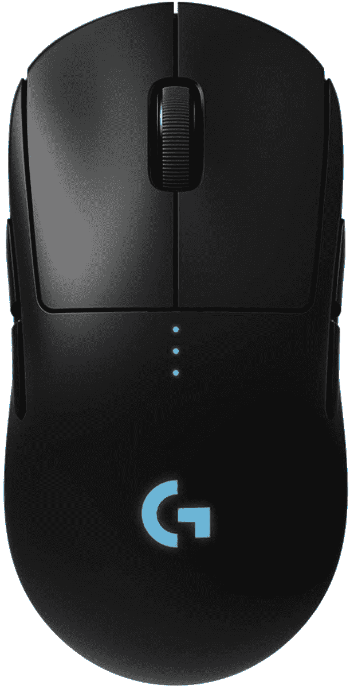

# 以英国有史以来最低的价格购买罗技 G Pro 无线鼠标(53%的折扣)

> 原文：<https://www.xda-developers.com/logitech-g-pro-wireless-61-uk/>

# 以英国有史以来最低的价格购买罗技 G Pro 无线鼠标(53%的折扣)

罗技 G Pro Wireless 是一款非常棒的游戏鼠标，价格是英国有史以来最低的，非常适合玩反恐精英之类的游戏。

如果你想为你的电脑买一个新的游戏鼠标，罗技 G Pro Wireless 绝对不会错。我个人已经用了一年多了，这是我在电脑上用过的最好的鼠标。无线鼠标给你的自由不能被夸大。在像*反恐精英:全球攻势*、*瓦朗特*这样的电子竞技游戏中，或者像*彩虹 6:围攻*或全新的*使命召唤:先锋*这样的射击游戏中，这是一种快速而简单的升级游戏方式。这是亚马逊英国网站上迄今为止最低的价格，61.49 英镑，只比有线电视贵 4 英镑。

 <picture></picture> 

Logitech G Pro Wireless

##### 罗技 G Pro 无线

罗技 G Pro Wireless 的价格是有史以来最低的，它是流行的电子竞技游戏的绝佳游戏鼠标。

Logitech G Pro wireless 是一款真正的双手通用鼠标，每侧都有拇指按钮。它拥有罗技的 Hero 传感器，最高可达 25，600 DPI，响应时间比罗技的 Lightspeed 技术快 1 毫秒。它有 RGB 照明，可以从 Logitech G Hub 控制，支持配置文件，长达 60 小时的电池寿命，所有按钮都可以重新编程。我个人在浏览器中使用左侧的导航按钮前进和后退，右侧的导航按钮是为我正在玩的任何游戏中的某些操作保留的。

使用无线鼠标已经获得了极大的自由——不仅仅是在玩游戏的时候，甚至是因为它带来的移动自由。我可以在房间里走动，仍然可以用鼠标控制我的电脑，而且我不需要担心任何地方的电缆被卡住。它还能在我需要充电的时候快速充电，充电的时候还能像有线鼠标一样使用。我强烈推荐这款鼠标给市场上任何想要购买新无线鼠标的人，尤其是如果你喜欢玩流行的电子竞技游戏的话。对我来说，没有回到标准的有线鼠标。