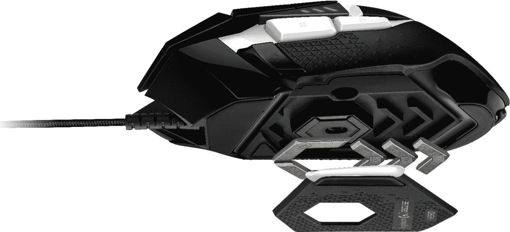

# 只需 35 美元，即可获得出色的罗技 G502 Hero SE 鼠标

> 原文：<https://www.xda-developers.com/logitech-g502-hero-se-deal/>

罗技出售一些最好的个人电脑配件，包括电脑鼠标、键盘、耳机、扬声器等等。由于其出色的构建质量和设计，G402 和 G502 多年来一直是受欢迎的游戏鼠标，现在 G502 Hero SE 有线版在百思买售价为 34.99 美元。这比最初的 MSRP 节省了 45 美元，比 G502 Hero 的通常价格低 5 美元(这也是亚马逊的[当前价格)。](https://www.amazon.com/Logitech-G502-Performance-Gaming-Mouse/dp/B07GBZ4Q68?tag=xda-mjni8hh-20&ascsubtag=UUxdaUeUpU6210&asc_refurl=https%3A%2F%2Fwww.xda-developers.com%2Flogitech-g502-hero-se-deal%2F&asc_campaign=Short-Term)

罗技 G502 Hero SE 与 [G502 Hero](https://www.amazon.com/Logitech-Performance-Gaming-Programmable-Buttons/dp/B07PHLBBQR?tag=xda-mjni8hh-20&ascsubtag=UUxdaUeUpU6210&asc_refurl=https%3A%2F%2Fwww.xda-developers.com%2Flogitech-g502-hero-se-deal%2F&asc_campaign=Short-Term) 相同，除了外观颜色图案——这款鼠标是黑色带白色高光的，而普通的 G502 Hero 正好相反。名称中的“Hero”意味着它使用罗技的 16，000 DPI“Hero”传感器，因此您可以获得一流的鼠标灵敏度。这款鼠标还具有可定制的 RGB 照明(通过罗技的桌面应用程序)、机械开关按钮张力和可调重量(您可以在鼠标中放置多达五个 3.6g 的重量)。鼠标的所有按键都可以用罗技的桌面软件定制。

 <picture></picture> 

Logitech G502 Hero SE

##### 罗技 G502 英雄 SE

这是一款出色的有线游戏鼠标，目前在百思买售价 34.99 美元。

关键是这是一个有线鼠标，而不是无线鼠标，所以你需要在你的电脑上有一个免费的 USB A 型连接器(或者一个加密狗，如果你只有 C 型端口的话)。然而，这种电缆也意味着你不必担心电池或延迟，就像你必须记住无线游戏鼠标一样。

尽管这是一款游戏鼠标(看起来也确实如此),但它同样适用于正常的工作效率，并且符合人体工程学的设计使 G502 成为比大多数其他电脑鼠标更好的通用选择。你也可以使用罗技的桌面应用程序完全关闭 RGB 灯，以降低游戏玩家的美感。

罗技的软件可用于 Windows 和 Mac，但如果你正在寻找其他苹果友好的选项，请查看我们的[Mac 最佳有线和无线鼠标](https://www.xda-developers.com/best-wireless-mouse-mac/)选项综述。