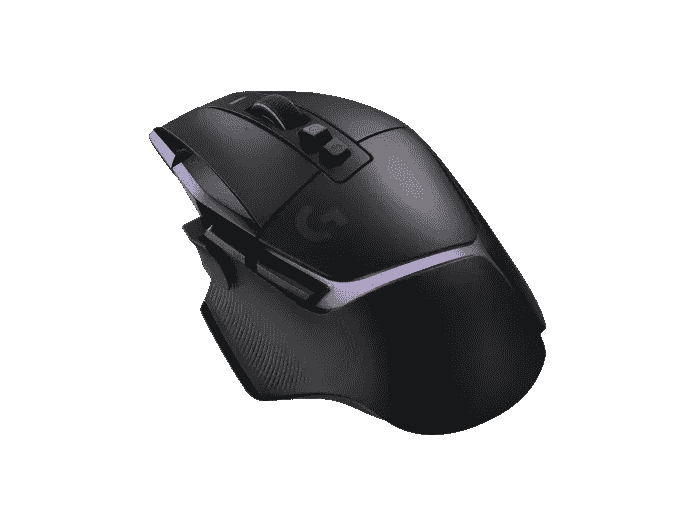

# 新的罗技 G502X 游戏鼠标有光学机械开关

> 原文：<https://www.xda-developers.com/logitech-g502-x-mouse-launch/>

罗技推出了 G502 X 系列游戏鼠标，这是 G502 的新版本，该公司称这是世界上最受欢迎的游戏鼠标。新的罗技 G502 X 有三种型号——标准 G502 X、G502 X Lightspeed 和 G502 X Plus。

这三种鼠标之间的差异不会影响核心功能。它们都配备了罗技新的光学机械鼠标开关，集合了两者的优势。光学开关意味着快速启动和更好的长期可靠性，因为不需要物理接触来启动鼠标按钮。然而，罗技仍然设计了一个机械触发器，当你点击按钮时，它可以提供更好的触觉反馈，所以你可以两全其美。罗技称这些为 Lightforce 开关。

罗技还重新设计了鼠标的部分部件，包括 DPI shift 按钮，该按钮现在可以拆卸和翻转，以适应不同的手柄。滚轮也经过了重新设计，更加稳定，感觉更轻，同时仍然提供无限和棘轮滚动模式。

新鼠标还配备了 Hero 25K DPI 传感器，提供 1 比 1 的亚微米级精度。罗技还表示，它没有对传感器进行过滤、平滑或加速。

标准的罗技 G502 X 是鼠标的有线版本，而 Lightspeed 和 Plus 版本使用罗技的定制无线连接，实现无延迟连接。罗技 G502 X Plus 还配备了 Lightsync RGB 照明支持，带有八个可以定制的 led。除了使用时的灯光效果，它还具有开机或关机时的特殊效果，并试图在不使用时关闭以节省电池。无线版本的鼠标可以通过 USB-C 或使用罗技的 Powerplay 充电垫充电，在你玩游戏时，可以保持鼠标无线充电。

罗技 G502 X 系列从今天开始可以购买，它们是第一批有黑色和白色两种版本的 G502 鼠标。标准版 [G502 X 型号](https://www.logitechg.com/products/gaming-mice/g502-x-wired-lightforce.910-006146.html)售价 79.99 美元，而[光速版](https://www.logitechg.com/products/gaming-mice/g502-x-wireless-lightforce.910-006189.html)售价 139.99 美元， [Plus 型号](https://www.logitechg.com/en-eu/products/gaming-mice/g502-x-plus-wireless-lightforce.910-006162.html)涨到 159.99 美元。你可以在罗技的网站上查看它们，或者使用下面的链接查看亚马逊。目前似乎只有 G502 X Plus 上市，还不能购买(在撰写本文时)，但这种情况应该很快就会改变。

 <picture></picture> 

Logitech G502 X Plus

##### 罗技 G502 X Plus

罗技 G502 X Plus 配备了创新的光学机械开关，超精确的 25K DPI 传感器，以及为更炫的游戏玩家提供的 RGB 照明。