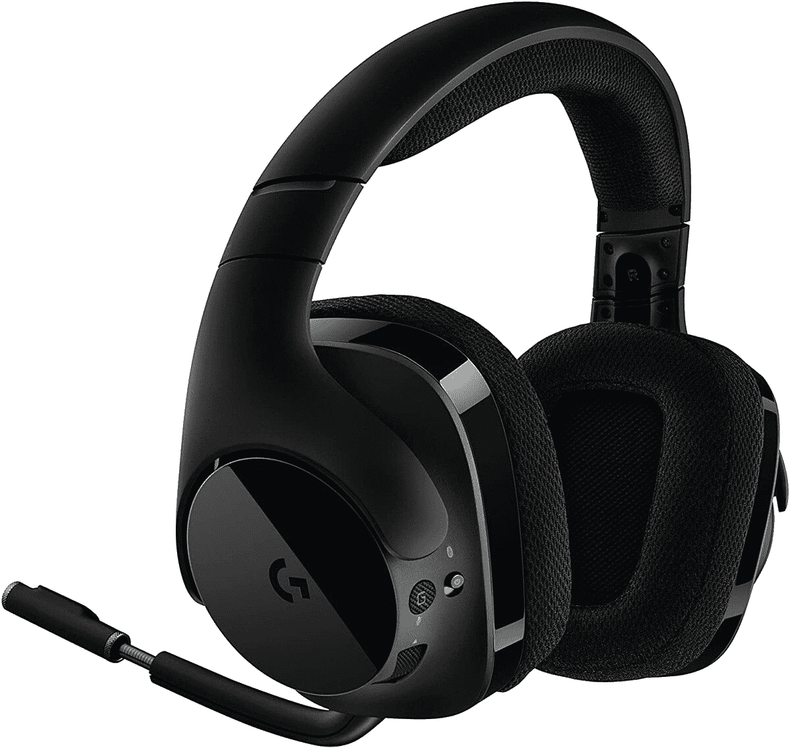

# 神奇的罗技 G533 游戏耳机仅售 66 美元

> 原文：<https://www.xda-developers.com/logitech-g533-deal-amazon/>

如果你正在关注我的交易综述帖子，那么你知道我喜欢罗技 G533 游戏耳机。在我的旧游戏耳机快要报废的时候半价出售，G533 是一个天赐之物，它是一个工作正常的无线耳机，不会随意改变我的音量。我已经用了大约一个月了，几乎没有任何问题。它们很舒服，当我去厨房拿饮料时不会失去蓝牙连接，它们可以持续很长时间，不需要充电。

我对我的耳机也很挑剔。我戴着眼镜，耳朵很敏感，所以我拿起的很多耳机要么会夹痛我的眼镜，要么会在几个小时后让我的耳朵疼痛。在玩游戏或看电影时，这不是最好的体验。我的上一个耳机用了几年，但最终，它们散架了，音量旋钮变得太容易乱动。

我知道我不能再买便宜的耳机了，但是作为一个交易大师的一个额外好处是，我通常可以以折扣价找到我想要的东西...有了额外的奖励，我可以告诉*你*同样的交易，我们都受益。所以当我最初看到罗技 G533 耳机时，我知道我找到了一个赢家，需要每个人都知道它。

当我上个月拿起罗技 G533s 时，它们是 75 美元，是建议零售价的一半。现在，它们甚至更低了，你可以[只花 66 美元](https://www.amazon.com/gp/product/B01MXE0FKC?tag=xda-2daglns-20&ascsubtag=UUxdaUeUpU30366&asc_refurl=https%3A%2F%2Fwww.xda-developers.com%2Flogitech-g533-deal-amazon%2F&asc_campaign=Short-Term)买到这款优质耳机。我认为 75 美元的价格是物有所值的，但你真的不能否认节省更多！我也不是唯一一个喜欢这款耳机的人，因为它在亚马逊上获得了四星评级。

 <picture></picture> 

Logitech G533 Gaming Headset

##### 罗技 G533 游戏耳机

不要乱弄耳机电线。罗技的无线 G533 耳机只需 66 美元，这是一个高质量的购买。舒适的耳罩，出色的声音，超长的电池寿命，这些都不会让人失望。

亚马逊目前表示，罗技 G533s 要到 29 日才会再次有货，但现在就下订单吧，放松，它们很快就会送到你的家门口。