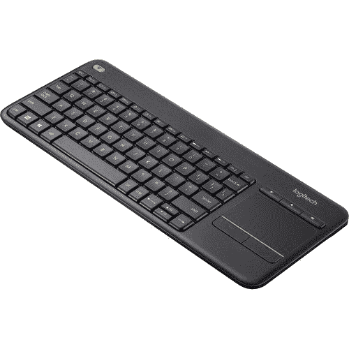

# 罗技 K400 Plus 无线键盘现在仅售 18 美元

> 原文：<https://www.xda-developers.com/logitech-k400-plus-wireless-keyboard-now-on-sale-for-just-18/>

# 罗技 K400 Plus 无线键盘现在仅售 18 美元

这种键盘/触摸板组合是树莓派或 HTPC 的绝佳选择，现在它在多家零售商处仅售 18 美元。

罗技出售许多不同的键盘，多年来，K400 一直是一种受欢迎的选择，因为它是一种带有 USB 连接的廉价无线型号。稍微升级的 K400 Plus 是家庭媒体中心、Raspberry Pis 或任何其他需要在单个紧凑设备中使用键盘和触摸板的情况下的优秀键盘。我们已经报道了罗技在游戏鼠标上的一些新销售，现在该公司已经以 17.99 美元的价格出售 K400 Plus 键盘。这比原价低 7 美元，比[从 7 月](https://www.xda-developers.com/logitechs-k400-plus-is-the-perfect-raspberry-pi-keyboard-at-just-20/)开始的折扣低 2 美元。

K400 Plus 是一款无线键盘，配有罗技的统一 USB 接收器(包含在包装盒中)，因此它可以兼容任何支持普通 USB 键盘的设备，而且您仍然不必处理线缆。无线范围也可以达到大约 33 英尺(约 10 米)，所以它肯定可以在任何桌子或沙发上工作——除非你的电视或显示器*非常*远。电力方面，你只需要两节 AA 电池就可以了，电池在盒子里。

 <picture></picture> 

Logitech K400 Plus

##### 罗技 K400 Plus

这款廉价的无线键盘售价 18 美元，比通常的价格节省了 7 美元。

这款键盘是 Raspberry Pi 和其他微型电脑的绝佳选择，因为它只需占用一个 USB 端口，而不是键盘和鼠标通常需要的两个端口。广泛的操作系统兼容性和紧凑的设计也很棒。即使对于使用普通无线配件的内置蓝牙的 PC，K400 Plus 仍然是最好的沙发键盘/鼠标组合之一，只要你对薄膜键盘不挑剔。