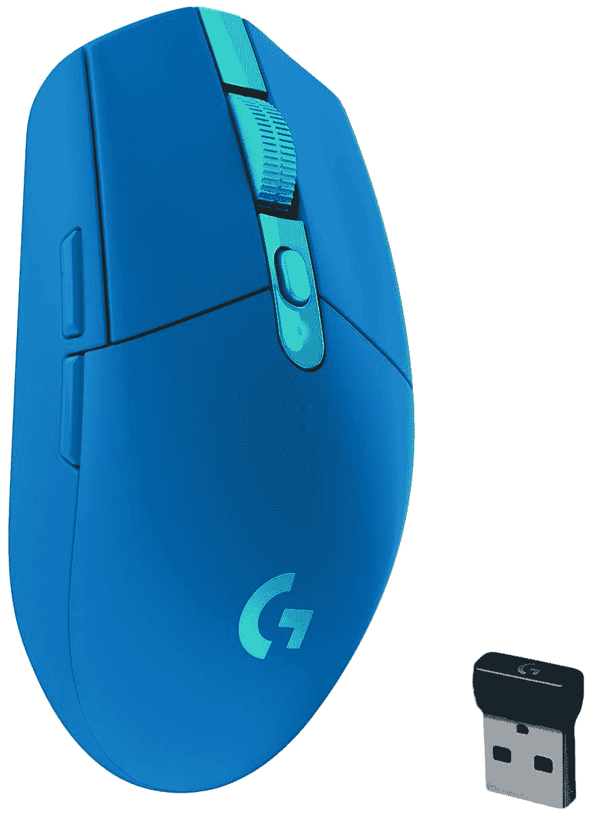

# 罗技高级和游戏鼠标在黑色星期五获得大折扣

> 原文：<https://www.xda-developers.com/logitech-mice-big-discounts-black-friday/>

升级你的电脑设置意味着很多事情，如果你正在寻找一个新的鼠标，罗技产品上有一些很好的交易值得一试。无论你是想要一个工作用的高级鼠标还是更实惠的东西，黑色星期五带来了一些罗技鼠标的交易，这是一个购买的好时机。

首先，如果你正在寻找一款高效的鼠标，MX Master 2S 鼠标在亚马逊上的售价仅为 53.60 美元，低于其 99.99 美元的正常价格。这不是我们见过的最低价格，但已经非常接近了，对于仍然是最好的生产力鼠标之一的鼠标来说，这是一个很好的价格。

 <picture></picture> 

Logitech MX Master 2S ($46 off)

##### 罗技 MX Master 2S

罗技 MX Master 2S 是一款出色的生产力鼠标，具有高精度传感器和符合人体工程学的设计。它还允许你同时控制两台电脑。

MX Master 2S 使用高精度传感器，允许您在任何表面上使用鼠标，您甚至可以同时在两台 PC 上使用它，并使用它在它们之间移动文件。滚轮支持自动切换，因此它可以根据您的需要快速或慢速滚动，甚至还有一个侧滚轮，这可能会在电子表格等事情上派上用场。MX Master 2S 已被更新的 MX Master 3 所取代，但这仍然是一款价格合理的伟大产品。

不过，如果你更喜欢游戏，罗技 G604 LIGHTSPEED 可能更合你的胃口。这是另一款无线鼠标，但这款主要面向游戏玩家。它总共有 15 个可编程按钮，可以实现你在鼠标中想要的所有快捷方式。该传感器的最大灵敏度为 25，600 DPI，因此您可以获得您需要的所有速度。它通常售价 100 美元，但现在你只需 45 美元就能买到，这是一笔难以拒绝的交易。

 <picture></picture> 

Logitech G604 LIGHTSPEED Wireless Gaming Mouse ($55 off)

##### 罗技 G604 光速

Logitech G604 LIGHTSPEED 鼠标是一款快速无线鼠标，配有 25K DPI 传感器、快速滚动和两种无线模式。使用一节 AA 电池可以持续 240 小时。

除了高 DPI 和大量可编程按钮，G604 LIGHTSPEED 还有一些功能，这些功能不仅对游戏有用。您可以使用 USB 加密狗在自定义光速无线连接之间切换，或者使用标准蓝牙连接到任何 PC。滚轮还包括高级罗技鼠标的自动换档功能，因此它可以在慢速滚动的棘轮模式和快速滚动的自由旋转模式之间切换。

对于预算有限的游戏玩家来说，还有另一个选择，罗技 G305 光速。这是一款更实惠的鼠标，但仍提供一些出色的功能。它有一个较小的 12，000 DPI 传感器，但对绝大多数人来说仍然足够好，而且它是一个非常轻和紧凑的鼠标。你现在只需花 30 美元就可以买下它，比通常价格便宜 20 美元。

 <picture></picture> 

Logitech G305 LIGHTSPEED Wireless Gaming Mouse ($20 off)

##### 罗技 G305 光速

Logitech G305 Lightspeed 是一款经济实惠的无线游戏鼠标，有坚固的规格和多种颜色可供选择，以符合您的风格。30 美元，这是一个了不起的交易。

除了较低的 DPI，罗技 G305 LIGHTSPEED 也没有太多的可编程按钮，但它仍然有一些，它们应该足以满足除了最狂热的游戏玩家之外的所有人。它还保持了定制的光速无线连接，最小输入延迟低至 1 毫秒，单节 AA 电池续航时间可达 250 小时。然而，这款机型不支持标准蓝牙，这可能会让一些人感到失望。

这款鼠标最大的好处之一，除了更实惠之外，就是它有五种不同的颜色，都是打折的，所以如果你不是纯黑色或白色的粉丝，你有一些更生动的选择。

寻找更多交易？查看我们的[黑色星期五 PC 交易](https://www.xda-developers.com/best-black-friday-pc-gaming-deals/)中心，了解更多值得立即购买的产品。如果你更关注移动方面的事情，我们有另一个页面关注所有移动技术方面的最佳[黑色星期五交易](https://www.xda-developers.com/black-friday/)。