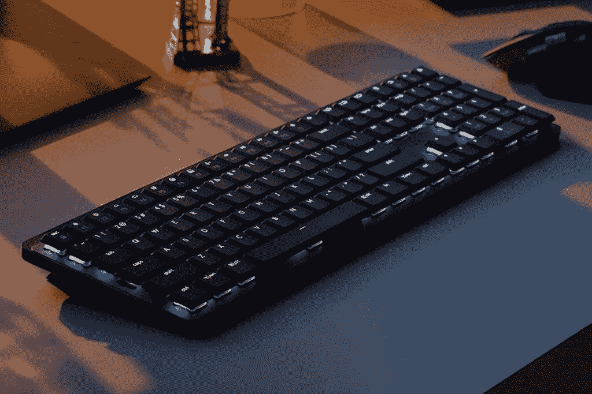

# 罗技推出新的 MX 主鼠标和机械键盘

> 原文：<https://www.xda-developers.com/logitech-mx-master-3s-mx-mechanical-mini-keyboard/>

罗技推出了 MX 系列产品的一些新成员，包括新的 MX Master 3S 鼠标和 MX 机械和机械迷你键盘。与已经非常优秀的 MX Master 3 相比，新鼠标更加注重提高舒适度，而键盘则是 MX 系列中的第一款机械键盘。

这三款设备都支持蓝牙，并且还带有 Logi Bolt 接收器，因此您可以以任何喜欢的方式连接到您的设备。它们还支持通过 Logitech 的 Logi options+软件进行定制。

## MX 主 3S

罗技 MX Master 3S 的一大改进是它有一个新的 8,000 DPI 传感器，是 MX Master 3 的两倍。就像那个一样，罗技说这个传感器可以跟踪大多数表面，包括玻璃，它更适合高分辨率显示器，在那里你可能想更快地移动鼠标。鼠标按键也已升级，噪音降低了 90%，因此您不必在工作时被咔哒声分散注意力。

除此之外，这使得最初的 MX Master 3 如此伟大——除了侧面的水平滚轮之外，它还具有 Lofitech 的 MagSpeed 电磁轮，每秒钟可以滚动高达 1000 行。它的设计也符合人体工程学，适合长时间使用。没有左手选项，但罗技最近推出了[升降式垂直鼠标](https://www.xda-developers.com/logitech-lift-vertical-mouse-launch/)，可能更适合你的需求。

MX Master 3S 现已上市，价格为 99.99 美元，与其前代产品一样。下面可以买。

 <picture></picture> 

Logitech MX Master 3S

##### 罗技 MX 大师 3S

新的罗技 MX Master 3S 配备了一个高精度的 8，000 DPI 传感器，并具有 90%更安静的点击，以增加舒适度。

## MX 机械和 MX 机械迷你键盘

 <picture></picture> 

Logitech MX Mechanical (full-size)

对于键盘爱好者来说，罗技还宣布了有史以来第一款机械键盘，为 MX 系列增色不少。简称为 MX Mechanical 和 MX Mechanical Mini，这些新键盘的目标是那些寻求在生产力键盘中使用机械按键开关的人。常规的 MX Mechanical 是一个全尺寸键盘，包括一个数字小键盘，独立的箭头键，以及你所期望的一切。MX Mechanical Mini 采用紧凑的 65%设计，为您提供打字和导航的必需品。

这两种键盘都使用低调的机械开关，默认选项是触觉安静的棕色开关。在某些市场，您还可以选择 Clicky 蓝色开关或线性红色开关。键帽本身是双色的，以便在外设视图中更容易识别哪些键是哪些键。

键盘还包括智能背光，可根据环境光自动调节亮度，包括在不需要时完全关闭的功能。当你的手靠近键盘时，背光就会打开，所以它随时准备就绪。您还可以使用 Logi Options+软件自定义背光效果和其他设置。

这两款键盘现在都有售，MX Mechanical 售价 169.99 美元，MX Mechanical Mini 售价 149.99 美元。可以在下面买。

 <picture></picture> 

Logitech MX Mechanical

##### 罗技 MX 机械

这是罗技有史以来第一款机械 MX 键盘，具有三种配置选项的薄型开关、智能背光和全尺寸设计。

 <picture></picture> 

Logitech MX Mechanical

##### 罗技 MX 机械迷你

具有 65%设计的罗技 MX 机械的紧凑版本。不过，它具有相同的机械开关和智能背光。