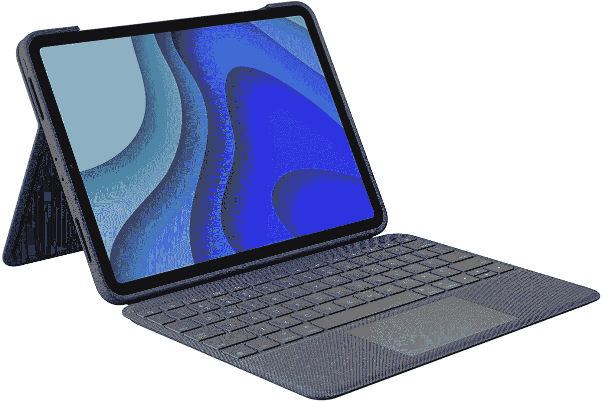

# 罗技的 11 英寸 iPad Pro 键盘套现在的价格还不到苹果 Magic Keyboard 的一半

> 原文：<https://www.xda-developers.com/logitechs-11-ipad-pro-keyboard-case-now-costs-less-than-half-of-apples-magic-keyboard/>

# 罗技的 11 英寸 iPad Pro 键盘套现在的价格还不到苹果 Magic Keyboard 的一半

罗技的 Folio 保护套有键盘、触摸板、支架和 Apple Pencil 插槽——所有这些都比苹果自己的键盘保护套便宜。

在过去几年中，苹果的 iPad 系列越来越受生产力工作的欢迎，特别是随着其硬件的快速发展。然而，苹果的 iPad 配件仍然贵得惊人，还有一些第三方选项。谢天谢地，罗技 iPad Pro 的 Folio 键盘套现在在亚马逊上以 129.99 美元的价格出售，比通常的建议零售价节省了 30 美元，也是有记录以来的最低价格。

销售的键盘是为所有最近的 11 英寸 iPad Pro 型号(第三代和第四代)设计的。它是在苹果宣布最新的 iPad Pro 2021 之前几个月发布的，但它*应该*也可以与最新的 11 英寸 Pro 兼容，因为它的物理尺寸与早期型号相同。

 <picture></picture> 

Logitech Folio Keyboard Case

##### 罗技 Folio Touch iPad Pro 11 英寸(2021)键盘套

这款保护套是为最近的 11 英寸 iPad Pros 设计的。它有键盘、触摸板、支架和 Apple Pencil 插槽。

罗技的保护套覆盖了整个 iPad，有一个键盘和触控板，可以翻转过来覆盖屏幕。还有一个支架可以保持 iPad 直立，有 40 度的角度范围。还有一个用于 Apple Pencil(第二代)或罗技蜡笔的插槽。该保护套使用 iPad 的智能连接器进行配对和供电，因此它永远不需要独立于平板电脑进行充电。

由于键盘和触控板都存在，该外壳具有苹果[智能键盘 Folio](https://www.apple.com/shop/product/MXNK2LL/A/smart-keyboard-folio-for-ipad-pro-11-inch-3rd-generation-and-ipad-air-4th-generation-us-english) 的外形，但具有[魔法键盘](https://www.apple.com/shop/product/MXQT2LL/A/magic-keyboard-for-ipad-pro-11-inch-3rd-generation-and-ipad-air-4th-generation-us-english-black)的大部分功能(减去额外的 USB 端口)。由于这些键盘的价格分别为 179 美元和 299 美元，罗技的替代品价格为 129.99 美元，非常划算。