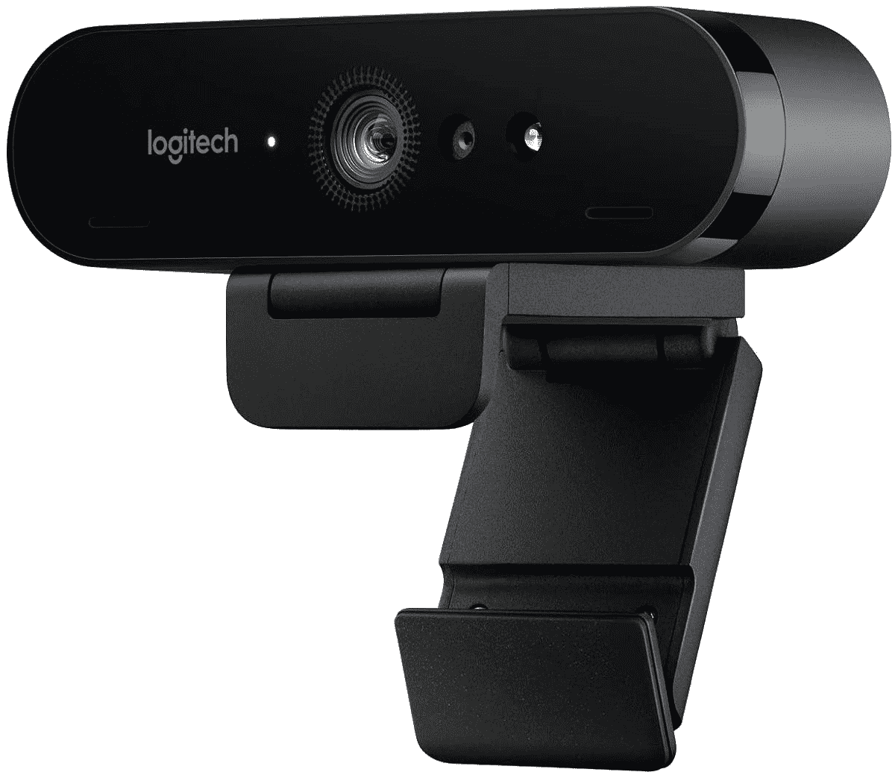

# 罗技的布里奥 4K 网络摄像头现在降到了 144 美元(降价 56 美元)

> 原文：<https://www.xda-developers.com/logitechs-brio-4k-webcam-is-down-to-144-right-now-56-off/>

# 罗技的布里奥 4K 网络摄像头现在降到了 144 美元(降价 56 美元)

目前市面上最好的网络摄像头之一，罗技布里奥 4K，以低于通常价格 56 美元出售。

网络摄像头是去年最热门的产品，因为突然转向在家工作突然意味着更多的人需要进行视频通话。通常很难找到原价的好摄像头，更不用说打折了，但这种情况终于开始改变了。本周早些时候，亚马逊的 Prime Day 销售活动在各种网络摄像头上有一些折扣，但如果你错过了这些折扣，罗技的布里奥 4K 型号现在比通常价格低 56 美元。

罗技布里奥是你现在可以买到的最好的网络摄像头之一，分辨率高达 4K @ 30FPS(或 1080p @ 30/60FPS)，自动光线校正，5 倍数码变焦，两个麦克风，可调视野(通过桌面软件)。布里奥也支持 Windows Hello，所以你可以只用你的脸登录 Windows。

 <picture></picture> 

Logitech Brio 4K

##### 罗技布里奥 4K 专业网络摄像头

罗技的这款 4K 网络摄像头目前比建议零售价低 56 美元。结账时输入代码 **THINKJUNE2021** 即可享受全额折扣。

这是罗技布里奥的最低价格之一，因为网络摄像头[目前在亚马逊](https://www.amazon.com/Logitech-BRIO-Conferencing-Recording-Streaming/dp/B01N5UOYC4?tag=xda-38dce2l-20&ascsubtag=UUxdaUeUpU3704&asc_refurl=https%3A%2F%2Fwww.xda-developers.com%2Flogitechs-brio-4k-webcam-is-down-to-144-right-now-56-off%2F&asc_campaign=Short-Term)售价 174 美元，在[大多数其他零售商](https://shop-links.co/1744367743207352124?u1=06e71a48-2438-45aa-8298-7e74960adff3)仍是全价(或缺货)。考虑到许多视频聊天/会议服务甚至没有达到那个分辨率，大多数人可能不需要 4K 网络摄像头，但是照明增强和 Windows Hello 支持将使几乎每个人受益。