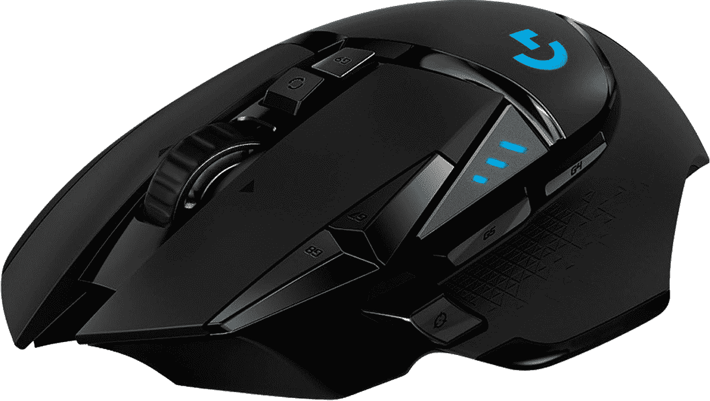

# 罗技优秀的 G502 光速和 G203 游戏鼠标正在销售

> 原文：<https://www.xda-developers.com/logitechs-excellent-g502-lightspeed-and-g203-gaming-mice-are-on-sale/>

罗技生产一些最好的电脑配件，包括键盘、鼠标、耳机、麦克风等等。该公司最出名的可能是它的电脑鼠标，现在它的两个面向游戏的模型正在销售。无线罗技 G502 售价为 99.99 美元，比原价节省了 50 美元(尽管它通常售价约为 120 美元)，更便宜的有线罗技 G203 打折至 19.99 美元，比通常价格低 10 美元左右。

罗技 G502 Lightspeed 是目前最好的游戏鼠标之一，具有 25K DPI 传感器、可配置的重量、罗技徽标上的 RGB 灯、无线连接(附带无线适配器)、纹理橡胶手柄、倾斜的左/右按钮、一个“超快”滚轮和总共 11 个可编程按钮(包括两个主左/右按钮)。Logitech 的桌面软件用于设置宏、RGB 照明模式和其他选项。如果你购买了 [PowerPlay 鼠标垫](https://www.amazon.com/Logitech-Powerplay-Wireless-Charging-Lightspeed/dp/B071WZ56G9?tag=xda-4um22d1-20&ascsubtag=UUxdaUeUpU5981&asc_refurl=https%3A%2F%2Fwww.xda-developers.com%2Flogitechs-excellent-g502-lightspeed-and-g203-gaming-mice-are-on-sale%2F&asc_campaign=Short-Term)，鼠标甚至可以在没有任何电缆的情况下使用它进行充电——否则，你只需不时地用附带的 microUSB 电缆将其插入即可。

 <picture></picture> 

Logitech G502 Lightspeed

##### 罗技 G502 英雄光速

这款高端游戏鼠标具有 25K DPI 传感器和低延迟无线功能。

 <picture></picture> 

Logitech G203

##### 罗技 G203 Lightsync

这款经济型鼠标有一个 8K DPI 传感器和 RGB 灯。

罗技 G203 是一款经济型游戏鼠标，但鉴于其 20 美元的价格标签，它仍然具有令人惊讶的功能数量。它不是无线的，但它仍然有可编程的按钮，可定制的 RGB 灯，8K DPI 传感器和双手灵巧的设计。罗技甚至设法在 G203 中包括板载内存，因此即使在您切换电脑后，您的 RGB 和宏设置也将继续工作。

尽管我不再使用罗技的游戏鼠标(我已经使用了[罗技 MX Vertical](https://www.amazon.com/Logitech-Vertical-Wireless-Mouse-Rechargeable/dp/B07FNJB8TT/?tag=xda-4um22d1-20&ascsubtag=UUxdaUeUpU5981&asc_refurl=https%3A%2F%2Fwww.xda-developers.com%2Flogitechs-excellent-g502-lightspeed-and-g203-gaming-mice-are-on-sale%2F&asc_campaign=Short-Term) 几年了)，我还是很喜欢我当年的 G402 游戏鼠标，G502 是一款支持无线功能的升级版。如果您需要更换老化/损坏的鼠标，或者如果您正在寻找节日礼物，G502 和 G203 都是绝佳的选择。