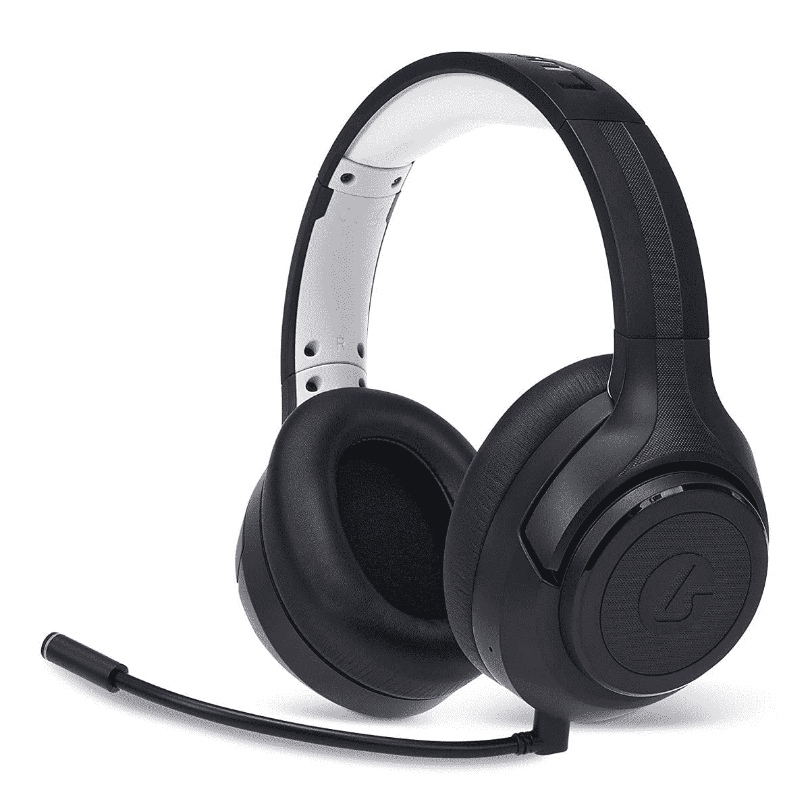

# LucidSound 的新 LS100X Xbox 耳机充电可持续 130 小时

> 原文：<https://www.xda-developers.com/lucidsound-ls100x-announced/>

选择[最佳游戏耳机](https://www.xda-developers.com/best-gaming-headset/)不是为胆小的人准备的，但是有了新的 LS100X，LucidSound 希望找到获胜的公式。该品牌生产高质量耳机已经有一段时间了，其最新的 Xbox 风格的事情有一个我们特别感兴趣的功能。

用于游戏机的无线耳机并不新鲜。但是，就像所有使用电池的东西一样，在某些时候，通常是最糟糕的时候，你会没电。不过，这似乎不是 LS100X 的问题，它承诺长达 130 小时的使用时间。

有什么条件？没有陷阱，但有一个警告。这一最长电池寿命数据是通过蓝牙连接到 PC 或移动设备时得出的。通过随附的无线加密狗(包括 Xbox)连接，您可以查看长达 72 小时。但对于无线游戏耳机来说，这仍然令人印象深刻。“游戏模式”无线承诺无干扰和低延迟。蓝牙就是，嗯，蓝牙。两者之间的切换就像按一个按钮一样简单。

不过，你挂在头上的不仅仅是一个又大又旧的电池。LS100X 设计舒适，包括减轻重量。耳罩和头带都用超级舒适的记忆泡沫装饰，所有重要的音频控制都在耳机上。

在音频方面，LS100X 封装了定制调谐的 50 毫米驱动器，具有三种不同的均衡器模式。在 Xbox 和 PC 上，它可以利用 Windows Sonic。带有监听功能的双麦克风系统可以确保你的通讯清晰，你不会对你的队友大声喊叫**。语音提示确保您花更少的时间摸索控制，花更多的时间玩游戏。**

LucidSound LS100X 现在可以订购，价格非常诱人，为 100 美元，将于 8 月 5 日发货。

 <picture></picture> 

LucidSound LS100X

##### LucidSound LS100X

一款价格极具吸引力的新型无线游戏耳机，适用于 Xbox 和 PC，电池续航时间长得惊人。