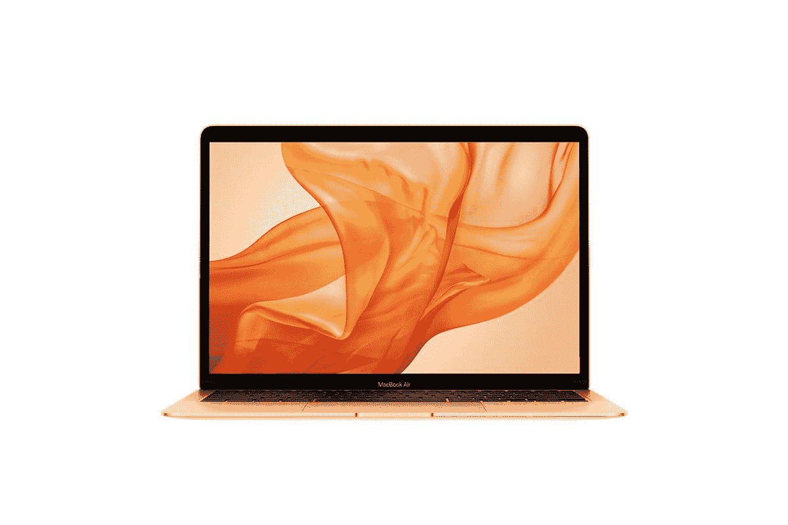

# M1 MacBook Air 和 MacBook Pro 在 Prime Day 前最多可优惠 200 美元

> 原文：<https://www.xda-developers.com/m1-macbook-air-pro-200-off-ahead-prime-day/>

M2 MacBook Air 就在眼前，但是如果你不想花 1200 美元买一台新的笔记本电脑，现在是买一台 M1 机型的好时机。包括亚马逊和百思买在内的零售商正在以 100 美元的大幅折扣销售 M1 驱动的 MacBook Air，这使得这款出色的笔记本电脑的基本款价格不到 900 美元。事实上，百思买将 512GB 机型降价 200 美元，这款机型还包括一个更强大的 M1 处理器版本，配有 8 核 GPU。你现在只需花 1049.99 美元就能买到这款手机，而不是 1249.99 美元。

除了处理器，MacBook Air 在基本型号中配备了 8GB 内存(统一内存)和 256GB 固态硬盘，这已经提供了足够的性能。基本型号还包括一个 7 核 GPU。正如我们提到的，您还可以升级到 512GB 的固态硬盘存储，并获得更强大的 8 核 GPU。这种型号在百思买上比亚马逊便宜得多，但两个地方都在基本配置上提供同样 100 美元的折扣。

 <picture></picture> 

MacBook Air (M1)

##### 苹果 MacBook Air (M1，2020 年)

MacBook Air 是一款轻薄的笔记本电脑，采用苹果的 M1 处理器，是一款非常快速的日常使用机器。

如果你想买 MacBook Pro，对你来说也有好消息。M1 MacBook Pro 目前在百思买打折 200 美元，所以起价 1099.99 美元。这款机型在每种配置中都配备了 8 核 GPU，此外它还具有主动冷却功能，因此可以更长时间地保持最佳性能。显示屏也更亮，高达 500 尼特。

 <picture></picture> 

MacBook Pro M1

##### 苹果 MacBook Pro 13 英寸(M1，2020 年)

采用 M1 处理器的 MacBook Pro 的内部结构与 Air 相似，但它具有主动冷却功能，可实现更好的持续性能，并具有更亮的屏幕。

这两款笔记本电脑都有 13.3 英寸的显示屏，宽高比为 16:10，分辨率为 2560 x 1600，因此您将获得物有所值的出色体验。此外，它们有一个坚固的铝制一体式机身，看上去和感觉上都很高档。当然，采用 M2 处理器的型号开始变得可用，但这些仍然是功能强大的笔记本电脑，有了这些折扣，它们变得更有吸引力。如果你现在购买它们，它们将足够你使用很长一段时间。