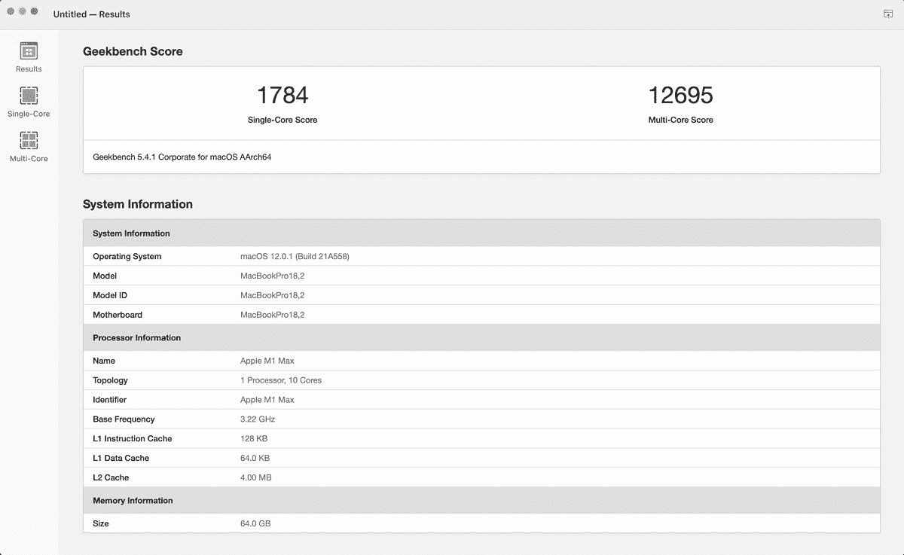
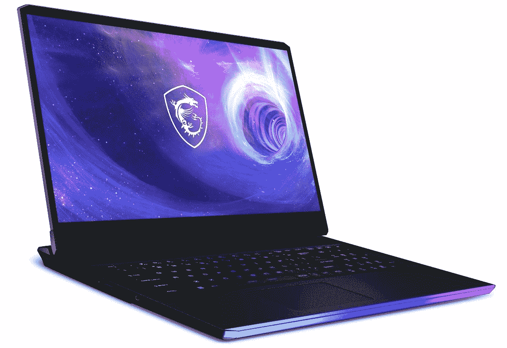

# 苹果 M1 Max 与英特尔第 12 代 Alder Lake 芯片:哪个更好？

> 原文：<https://www.xda-developers.com/m1-max-vs-intel-12th-gen/>

苹果新的 [M1 Ultra 发布会](https://www.xda-developers.com/apple-announces-m1-ultra-its-most-powerful-computing-chip-yet/)在业界掀起了巨大的波澜。该公司的新芯片功能强大，足以与英特尔和 AMD 的一些最强大的台式机芯片相抗衡。虽然 M1 超是迄今为止最强大的苹果芯片，但不可否认的是，该公司的 M1 Max 仍然是笔记本电脑领域真正的 MVP。在本文中，我们将看看苹果 M1 Max 与[英特尔第 12 代 Alder Lake](https://www.xda-developers.com/intel-12th-gen-alder-lake/) 的对比，看看哪一个更好。

我们只看一下苹果 M1 Max 与英特尔第 12 代 Alder Lake H 系列笔记本电脑 CPU 的比较。Alder Lake H 系列拥有英特尔最强大的第 12 代移动芯片，能够对抗苹果 M1 Max 的原始性能。顶配 12900HK 的性能也比得上 12900K 芯片的一般性能。英特尔的第 12 代产品系列也有 P 和 U 系列芯片，但它们是为相对低功耗和轻薄的笔记本电脑保留的。说完这些，让我们开始比较。

**浏览这篇文章:**

[规格](#specifications)

[性能](#performance)

[应该买哪个？](#whichonetobuy)

## 苹果 M1 Max 与英特尔第 12 代:规格

下面快速看一下苹果 M1 Max 芯片的规格:

| 

规格

 | 

**苹果 M1 Max**

 |
| --- | --- |
| **CPU 内核** | 多达 10 个内核 |
| **CPU 性能核心** | 多达 8 个内核 |
| **CPU 效率 c0res** | 2 |
| **GPU 核心** | 24 或 32 |
| **神经引擎核心** | 16 |
| **制造工艺** | 5 纳米 |
| **晶体管** | 570 亿 |
| **统一内存** |  |
| **内存带宽** | 400 GB/秒 |

以下是英特尔第 12 代 Alder Lake H 系列处理器及其规格:

| 

规格

 | 

**英特尔酷睿 i9-12900HK**

 | 

**英特尔酷睿 i9-12900H**

 | 

**英特尔酷睿 i7-12800H**

 | 

**英特尔酷睿 i7-12700H**

 | 

**英特尔酷睿 i7-12650H**

 | 

**英特尔酷睿 i5-12600H**

 | 

**英特尔酷睿 i5-12500H**

 | 

**英特尔酷睿 i5-12450H**

 |
| --- | --- | --- | --- | --- | --- | --- | --- | --- |
| **内核** | 14 (6P + 8E) | 14 (6P + 8E) | 14 (6P + 8E) | 14 (6P + 8E) | 10 英镑(6 便士+ 4E) | 12 (4P + 8E) | 12 (4P + 8E) | 8 (4P + 4E) |
| **螺纹** | 20 | 20 | 20 | 20 | 16 | 16 | 16 | 12 |
| **基频** | 2.5GHz (P 内核)&#124; 1.8GHz (E 内核) | 2.5GHz (P 内核)&#124; 1.8GHz (E 内核) | 2.4GHz (P 内核)&#124; 1.8GHz (E 内核) | 2.3GHz (P 内核)&#124; 1.7GHz (E 内核) | 2.3GHz (P 内核)&#124; 1.7GHz (E 内核) | 2.7GHz (P 内核)&#124; 2.0GHz (E 内核) | 2.5GHz (P 内核)&#124; 1.8GHz (E 内核) | 2.0GHz (P 内核)&#124; 1.5GHz (E 内核) |
| **最大涡轮频率** | 5.0GHz (P 内核)&#124; 3.8GHz (E 内核) | 5.0GHz (P 内核)&#124; 3.8GHz (E 内核) | 4.8GHz (P 内核)&#124; 3.7GHz (E 内核) | 4.7GHz (P 内核)&#124; 3.5GHz (E 内核) | 4.7GHz (P 内核)&#124; 3.5GHz (E 内核) | 4.5GHz (P 内核)&#124; 3.3GHz (E 内核) | 4.5GHz (P 内核)&#124; 3.3GHz (E 内核) | 4.4GHz (P 内核)&#124; 3.3GHz (E 内核) |
| **三级高速缓存** | 24MB | 24MB | 24MB | 24MB | 24MB | 18MB | 18MB | 12MB |
| **默认 TDP** | 45W | 45W | 45W | 45W | 45W | 45W | 45W | 45W |
| **最大涡轮功率** | 115 瓦 | 115 瓦 | 115 瓦 | 115 瓦 | 115 瓦 | 95W | 95W | 95W |
| **处理器显卡** | 96EU | 96EU | 96EU | 96EU | 64EU | 80EU | 80EU | 48EU |

从规格表中可以看出，苹果 M1 Max 和 Alder Lake H 系列芯片都采用了混合 CPU 架构。这使得本次比较中的所有 CPU 都拥有单独的性能和效率内核来处理不同的工作负载。我们强烈建议您查看我们的英特尔 Alder Lake hub 页面，了解更多关于 P 和 E 内核如何运行的信息。虽然 M1 Max 芯片的内核数量少于一些高端 Alder Lake 芯片，如英特尔酷睿 i9-12900HK，但由于有更多的高性能内核，它仍然可能具有更好的多核性能。

## 苹果 M1 Max vs 英特尔第 12 代:性能

尽管我们已经在规格表中列出了所有的 Alder Lake H 系列芯片，但我们将主要关注 Alder Lake 系列的英特尔酷睿 i9-12900HK 芯片。这是因为酷睿 i9-12900HK 的性能接近 M1 Max 芯片的一般性能。选择 12900HK 的另一个原因是，我们也审查了这种特殊的芯片，因此它将使我们更容易使用我们自己的基准数据来比较这两者。

 <picture></picture> 

M1 Max MacBook Geekbench score

从 Geekbench 5 得分开始，苹果 M1 Max 和英特尔酷睿 i9-12900HK 在单核和多核测试中的得分非常相似。也就是说，苹果 M1 Max 略胜英特尔酷睿 i9-12900HK。M1 Max 在单核和多核测试中分别获得了 1784 分和 12695 分。另一方面，12900HK 在同样的测试中获得了 1774 分和 12630 分。这些结果也反映在许多真实世界的测试中，尽管两种芯片的性能或多或少相似。

英特尔酷睿 i9-12900K 台式机 CPU 也是如此。正如我们在[英特尔酷睿 i9-12900K](https://www.xda-developers.com/intel-alder-lake-review/) 评测中强调的那样，英特尔的顶级 CPU 得分也非常接近。因此，如果你打算购买一台基于 M1 Max 的 Mac Studio 台式机，那么你可以期待两台机器具有几乎相同的性能，尽管你的英特尔机器的性能也将取决于你使用的 GPU 类型。

不过，在能效方面，苹果 M1 Max 比英特尔奥尔德湖 12900HK 有很大优势。英特尔的奥尔德湖在负载下的功耗高达 110 瓦或更高，而 M1 Max 舒适地位于 45 瓦以下。这是一个显著的差异，将极大地影响笔记本电脑的整体电池寿命。当然，你可能不会冒险离开电源插座太远，而使用一个沉重的游戏笔记本电脑，如 MSI 攻略 GE76 与 12900HK，但它肯定是一个困难的药丸吞下当你可以携带 M1 马克斯动力 MacBook Pro 笔记本电脑周围。使用 MacBook Pro 的最大好处在于，您不必一直忙于运行资源密集型任务。

奥尔德湖 P 和 U 系列的其他第 12 代芯片将能够在能效领域与 M1 Max 竞争。但不言而喻，这些芯片远不及 M1 马克斯的整体性能。综合考虑所有因素，我们认为可以肯定地说，在能效方面，M1 Max 无疑是赢家。

## 你应该买哪一个？

英特尔新的第 12 代奥尔德湖芯片比我们过去从该公司看到的任何东西都有显著的改进。即使与苹果最好的 MacBook Pro 笔记本手机芯片相比，12900HK 也能毫无问题地保留自己的芯片。英特尔在能效领域仍需做大量工作。当然，有专门的芯片可以在笔记本电脑上提供更长的电池寿命，但是你会错过这些芯片的很多性能。不过，谈到整体性能，我们认为英特尔和苹果的硬件都有很多价值。

这也归结于个人喜好，当涉及到购买基于英特尔的机器或苹果硅的苹果笔记本电脑时。如果你是一个有创造力的专业人士，尤其是一个对苹果的生态系统和苹果操作系统有深入投资的人，那么我们认为你可能会想坚持使用 M1 最大功率的苹果笔记本电脑。但是如果你想从便携式电脑中获得最好的游戏性能，那么 12900 港币的奥尔德湖芯片可以说是更好的选择。

 <picture></picture> 

MacBook Pro 16

##### 苹果 MacBook Pro 16 英寸(2021)

新的苹果 MacBook Pro 笔记本可以配置其他 M1 Pro 或 M1 Max 处理器。

 <picture></picture> 

MSI Raider GE76

##### MSI 突袭机 GE76

MSI 攻略 GE 76 搭载了英特尔酷睿 i9-12900HK 处理器和英伟达 GeForce RTX 3080 Ti 分立 GPU。

 <picture></picture> 

Apple Mac Studio

##### 苹果苹果工作室

苹果新的苹果工作室电脑可以配置 M1 马克斯或 M1 超芯片。

这总结了苹果 M1 Max 和英特尔第 12 代 CPU 之间的特殊比较。如果你打算购买采用 M1 Max 芯片的新 Mac Studio，那么也请考虑一下英特尔第 12 代 CPU。你很有可能能够制造一台相对便宜的基于英特尔处理器的电脑，并获得同样的性能。或者，你也可以查看 [Mac Studio deals 页面](https://www.xda-developers.com/best-deals-mac-studio/),看看你是否能在购买上节省一些钱。我们还收集了 T2 最好的 Mac 电脑 T3，所以一定要去看看。