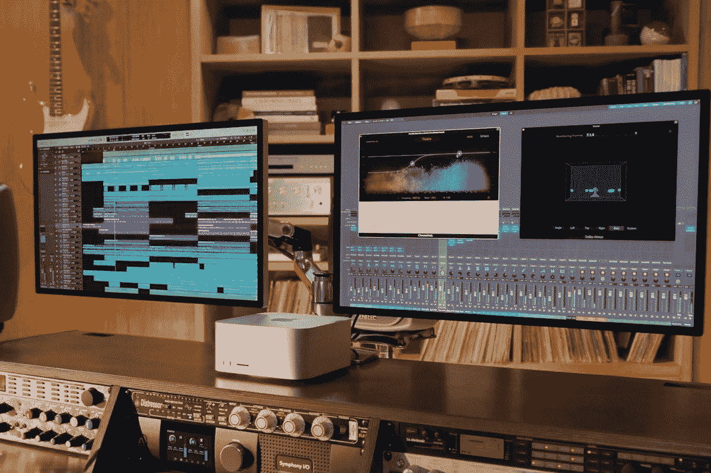
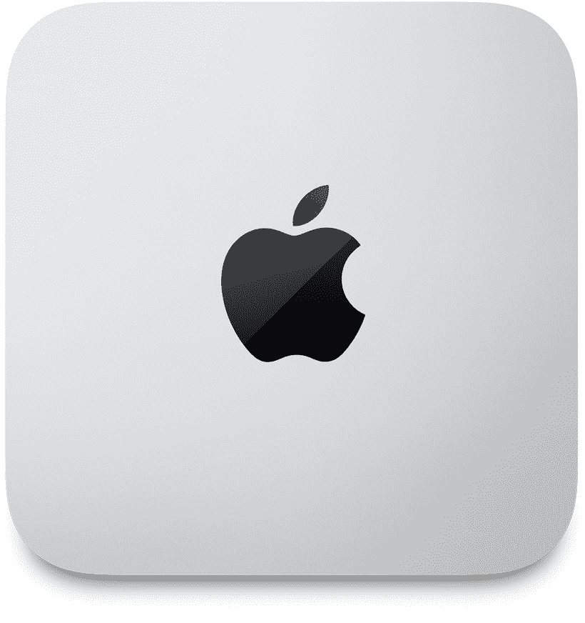

# 苹果 M1 Ultra vs M1 Max 芯片:你该买哪个？

> 原文：<https://www.xda-developers.com/m1-ultra-vs-m1-max/>

就在几个月前，苹果凭借 M1 Pro 和 M1 Max 芯片彻底击败了竞争对手。然而，该公司已经宣布了新的 M1 超芯片，这应该是迄今为止最强大的苹果硅。当苹果公司的 [Mac Studio](https://www.xda-developers.com/mac-studio/) 台式电脑于 3 月 18 日上市销售时，它很快就会出现在消费者手中。在这篇文章中，我们将把苹果的芯片与现有的 M1 Max 进行 M1 Ultra 与 M1 Max 的比较，以找出哪个最适合你。

**浏览这篇文章:**

## 苹果 M1 超与 M1 最大:规格

| 

规格

 | 

苹果 M1 超

 | 

苹果 M1 Max

 |
| --- | --- | --- |
| **CPU 内核** | 20 个(16 个高性能“火焰风暴”内核+ 4 个高效“冰风暴”内核) | 10 个(8 个高性能“火焰风暴”内核+ 2 个高效“冰风暴”内核) |
| **GPU 核心** | 64 核 | 32 核 |
| **神经引擎** | 32 核 | 16 核 |
| **记忆通道** | 32 LPDDR5 | 16 LPDDR5-6400 |
| **统一内存** | 高达 128GB | 高达 64GB |
| **内存带宽** | 800Gbps | 400Gbps |
| **流程** | 5 纳米 | 5 纳米 |
| **晶体管** | 1140 亿英镑 | 570 亿英镑 |

## 定价和可用性

因为你不能在市场上购买这些芯片用于任何设备，我们将不得不看看这些芯片驱动的机器的价格。几个月前，M1 Max 与新的 14 英寸和 16 英寸 MacBook Pro 笔记本电脑一起亮相。另一方面，新的 M1 超级 SoC 将于 3 月 18 日与新的苹果 Mac Studio 一起首次亮相。虽然新的 MacBook Pro 笔记本电脑并不完全“实惠”，但购买 M1 Max 系统的 MacBook Pro 仍然比购买 M1 Ultra-powered Mac Studio 相对便宜。

 <picture></picture> 

Image credit: Apple

M1 Max 动力 Mac Studio vs M1 Ultra-powered Mac Studio 也是如此。装有 M1 Max 的 Mac Studio 起价为 1999 美元，而装有 M1 Ultra 的 Mac Studio 起价为 3999 美元。这还只是台式机的成本，你还需要在显示器上花钱。总的来说，一台基于 M1 Max 的设备，无论是新的 MacBook Pro 笔记本还是新的 Mac Studio，都比一台 M1 Ultra-powered Mac Studio 便宜。

## M1 超不适用于笔记本电脑

这很好地引出了我们的下一点，即新的 M1 超芯片不适用于笔记本电脑。这种特殊的芯片是针对台式电脑的，这意味着我们很可能永远不会看到 M1 超动力笔记本电脑。这可能是由于许多原因，包括 M1 超芯片的整体芯片尺寸。苹果本质上是使用 UltraFusion 连接两个 M1 Max 芯片来创建 M1 Ultra die，所以它不太可能在笔记本电脑中运行。

因此，M1 超 SoC 仅由新的 Mac Studio 独家提供，而 M1 Max 芯片也可用于 14 英寸和 16 英寸的 MacBook Pro 笔记本电脑。因此，如果你需要在工作中随时携带强大的系统，那么我们认为购买一台 M1 Max 驱动的 MacBook Pro 是你的最佳选择。你可以阅读我们对由 M1 Max 驱动的 16 英寸 MacBook Pro 的[评测，以了解更多关于这款特殊芯片的整体性能。](https://www.xda-developers.com/apple-macbook-pro-2021-m1-max-review/)

## 两倍的性能？

虽然我们还没有接触到新的 M1 超芯片，但我们已经知道 M1 Max 的性能。事实上，M1 Pro 和 M1 Max 总体上都很棒，与英特尔和 AMD 一些最好的芯片的一般性能相当。苹果自己的硅在包括电源效率在内的其他方面也被证明更好。M1 Pro 和 M1 Max 都比旧的基于英特尔的 MAC 电脑提供了显著的性能改进，我们期待 M1 Ultra 会更好。

据苹果公司称，M1 超提供了比由[英特尔酷睿 i9-12900K 处理器](https://www.xda-developers.com/intel-alder-lake-review/)驱动的 16 核台式电脑更好的 CPU 性能。在 GPU 方面，M1 Ultra 的 64 核 GPU 和 8192 个执行单元可以比运行 GeForce RTX 3090 GPU 的 PC 提供更好的 GPU 性能。M1 超最好的一点是，苹果公司表示，它比最高端的台式机部件性能更好，同时功耗更低。看看新的 M1 超芯片与顶级的英特尔和 AMD 处理器相比表现如何将会很有趣。

## 苹果 M1 Ultra vs M1 Max:你该买哪个？

苹果新推出的 M1 Ultra 看起来令人印象深刻，至少在纸面上是这样。如果你去看看苹果在主题演讲中分享的性能数据，那么看起来 M1 超确实是一个令人难以置信的强大的工作站芯片。然而，这并不意味着 M1 Max 芯片不再有用。M1 Max 可以单枪匹马击败许多英特尔和 AMD 芯片，所以你不能把它写在图表上。除非你想从苹果获得绝对最佳性能的芯片来获得不折不扣的计算体验，否则我们认为 M1 Max 甚至 M1 Pro 都是一个值得考虑的好选择。此外，M1 超仅在 Mac Studio 上可用的事实使 M1 Max 成为那些寻求移动计算的最佳选择。

 <picture></picture> 

Apple Mac Studio

##### 苹果 Mac 工作室

苹果的 Mac Studio 使用苹果新的 M1 超芯片，在最小的封装中提供最大的性能

 <picture></picture> 

MacBook Pro 14-inch (2021)

##### 苹果 MacBook Pro 16 英寸(2021)

MacBook Pro 进行了彻底的重新设计，并采用了最新的苹果 M1 Pro/Max 芯片。你可以在亚马逊上买到 14 和 16 英寸的型号。

一旦我们拿到新的 Mac Studio 台式机，我们肯定会有更多关于 M1 超的计算性能的讨论，所以请务必保持关注。与此同时，你可以看看我们收集的[款最佳 MAC 电脑](https://www.xda-developers.com/best-macs/)，看看你是否能买到其他适合你需求的 MAC 电脑。我们在下面留下了购买新 Mac Studio 台式机的链接，但你可能想看看我们的[最佳 Mac Studio 交易](https://www.xda-developers.com/best-deals-mac-studio/)文章，看看你是否能找到一些不错的交易，并为显示器节省一些钱。