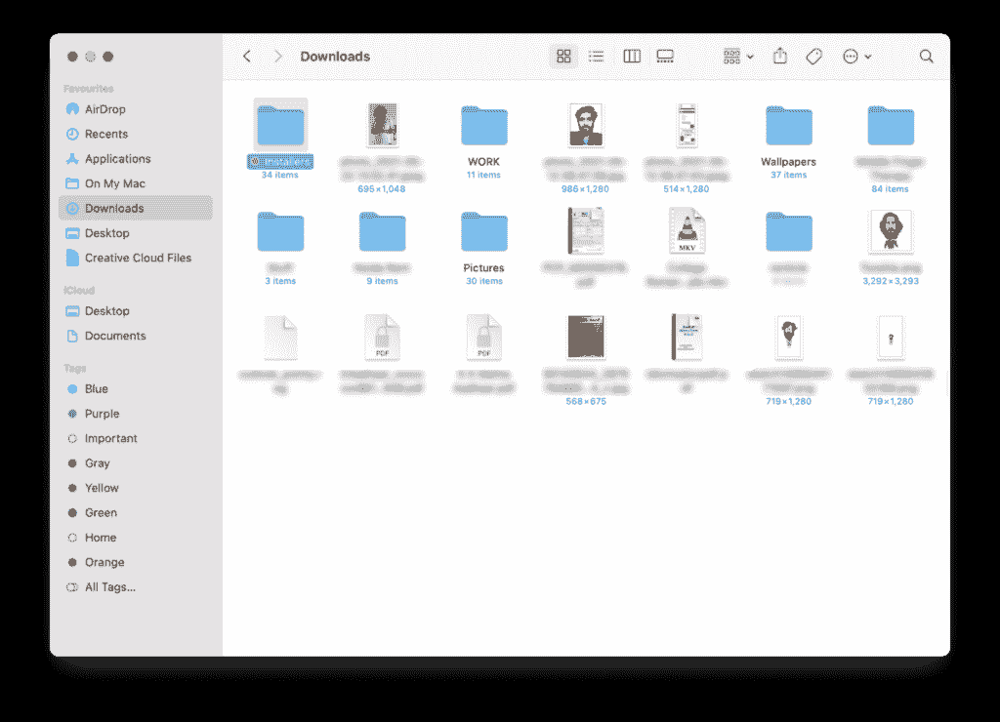

# Mac 常见问题:macOS 常见术语指南

> 原文：<https://www.xda-developers.com/mac-macos-faq-glossary-how-to-fix-problems/>

Windows 操作系统的受欢迎程度轻而易举地超过了 T2 MAC OS 操作系统的受欢迎程度，因为它在个人电脑市场的份额是后者的四倍。尽管存在这种差异，但由于缺乏其他受欢迎的选项，macOS 仍然是世界上第二大最常用的桌面操作系统。苹果公司不遗余力地吹嘘 macOS 提供的优秀而有品味的用户体验，用户和粉丝们也对此表示赞同。然而，在 XDA，我们过去更关注 Windows，直到最近才开始关注 Mac。我们最近为那些从 Windows PC 转向 Mac 的用户发布了 macOS 初学者指南。接下来是一个术语表，你可以用它来让你在谈论 macOS 时听起来很聪明。

在本文中，我们将告诉你一些与 macOS 相关的最常见的术语，这些术语是每个 macOS 用户都必须知道的。

## 标准 macOS 术语词汇表

### iCloud

苹果的在线云存储服务名为 iCloud，与你用来登录苹果设备的 Apple ID 相关联。它会自动备份存储在桌面和文档文件夹中的文件。每个苹果 ID 可以获得 5GB 的免费 iCloud 存储空间，但如果你需要更多，你也可以[按月付费购买 iCloud 存储空间](https://support.apple.com/en-in/HT201238)。

除了云存储，您还可以获得以下功能:

*   [找到我的](https://www.xda-developers.com/how-to-find-lost-apple-device/)，只要你的所有苹果设备连接到互联网，它就可以用来追踪它们的地理位置。
*   连续性，即同步不同苹果设备上的任务。
*   通用剪贴板。

在 WWDC 2021 上，[苹果发布了 iCloud+](https://www.xda-developers.com/apples-icloud-brings-new-privacy-features-at-the-same-price/) ，它通过添加 VPN 和无限存储 Homekit 兼容的安全摄像头的视频等功能，扩展了 iCloud 的效用。

### 探测器

 <picture></picture> 

Desktop folder in Finder

macOS 中的 Finder 是您可以找到所有文件的地方，类似于 Windows 中的文件资源管理器。除了将文件存储在“下载”、“文稿”和“桌面”等文件夹中，Finder 还允许 Mac 用户在“应用程序”文件夹中查看电脑上安装的应用程序。

### 码头

Dock 是一个浮动的应用程序行，传统上放置在显示器的底部。根据您的偏好，它也可以放在 Mac 屏幕的底部、左侧或右侧。由于 macOS 没有任务栏，应用程序会最小化到 Dock 中。

### 系统偏好设置

“系统偏好设置”是 macOS 上所有东西的设置中心。它由 Dock 上的齿轮图标表示。

### 控制中心

 <picture></picture> 

Control Center on macOS

添加到 macOS 和 Big Sur 的控制中心是对基本功能的各种快速设置，如 Wi-Fi、蓝牙、隔空投送以及 MacBooks 上的显示器和键盘亮度。控制中心的灵感来自 iOS 和 iPadOS 上的功能，可以通过点击菜单栏上日期和时间左侧的图标来访问。

### 聚光灯搜索

 <picture></picture> 

Spotlight Search on macOS

Spotlight 是 macOS 上的全系统搜索功能。它可以用来搜索文件和文件夹、应用程序以及偏好设置中的子菜单。除了储存在 Mac 上的文档或应用程序，Spotlight 还可用于根据默认网络浏览器的建议预览网络结果。

您可以通过按键盘上的 **Command + Space** 来启动 Spotlight search。

### 发射台

 <picture></picture> 

Launchpad on macOS

Launchpad 就像一个应用程序抽屉，您可以在其中找到 Mac 上安装的所有应用程序。您可以通过单击图标(

)或用三个手指和一个拇指在触控板上向内挤压。

### 任务控制

Mission Control 是 macOS 上一个强大的多任务工具。它可以用来显示每个桌面上所有活动的应用程序，以便您可以在这些应用程序之间无缝切换。它还可以用于在不同的桌面上排列不同的最大化应用程序。

您还可以使用 Mission Control 将两个应用程序合并到一个桌面上，以便您可以并排使用它们。为了了解你为什么会想这么做，我们有一个很好的解释者关于[为什么&如何在 Mac 上分割你的屏幕](https://www.xda-developers.com/how-to-split-screen-mac/)。

### 大量

堆栈可以用来组织桌面上的项目。使用堆栈，您可以将相似的文件排列在一个单独的文件堆中，当您单击它们时，可以展开这些文件。它就像一个文件夹，但少了一次点击。可以根据文件的种类、创建、添加、修改或上次打开的日期，或者根据文件的标签，将文件排列在堆栈中。

### 连续性

[Continuity](https://www.xda-developers.com/imac-continuity-handoff/) 是苹果公司使用的一套功能，用于方便您的 Mac 与 iPhone、iPad 或其他 Mac 之间的轻松转换，前提是它们连接到同一个 iCloud 帐户和同一个网络。使用连续性，您可以:

*   在 Mac 上接收来自 iPhone 的信息或来电。
*   如果您的 Mac 无法识别任何其他 Wi-Fi 网络，请将 iPhone 的数据连接用作个人热点。
*   使用通用剪贴板在 iPhone 上复制并粘贴到 Mac 上，反之亦然。
*   在 iPhone 上拍照或[扫描文档，并在 Mac 上查看。](https://www.xda-developers.com/continuity-camera/)
*   在 iPhone 或 iPad 上执行[任务](https://support.apple.com/en-in/HT209455)如浏览网页、起草电子邮件或标记媒体，并在 Mac 上继续。

### 照相亭

如果你试图搜索“相机”，但在你的 MacBook 上找不到，那是因为苹果公司将这款应用程序称为“照片亭”。您可以在 Mac 上使用 Photo Booth 来捕捉照片和视频。此外，你还可以尝试各种滑稽和怪异的效果，让你的图片或视频令人愉快。

### 边车

Sidecar 允许您将 iPad 用作 Mac 的辅助屏幕。对于使用苹果铅笔在 iPad 上做笔记、图形设计或创作插图的创作者来说，这是有益的。有了 Sidecar，这些任务可以直接在 Mac 上使用 Adobe Illustrator 等应用程序完成。您还可以使用 Sidecar 给 Mac 添加触摸屏，或者为不需要留在主桌面上的应用程序使用辅助屏幕。要使用 Sidecar，您的 iPad 至少需要运行 iPadOS 13 或更高版本。

这里是你的 Mac 运行 Sidecar 的最低系统要求。你需要有一个新型号的 Mac(列在链接上)，否则该功能可能无法工作。

随着 macOS 的下一个版本，即 Monterey，苹果还将允许[在 Mac 和 iPad](https://www.xda-developers.com/macos-montery-universal-control/) 之间无缝拖放，而不会将其变成第二显示屏。

### 时间机器

顾名思义，Time Machine 是 macOS 中的一个备份实用程序，它允许您创建 Mac 的及时备份。您可以创建 Mac 的完整备份，包括所有文件和文件夹、安装的应用程序、存储的 id，甚至偏好设置。您可以为 Mac 的自动备份分配一个磁盘，也可以随时手动创建一个磁盘。如果出现问题，您的 Mac 开始出现故障，您可以重新安装 macOS，并使用最新的 Time Machine 完全恢复您的 Mac，就像什么都没发生一样。

这里最重要的线索是定期备份，下面一条可以帮助你做到这一点。

### 磁盘工具

“磁盘工具”是一种用于管理连接到 Mac 的内置和外置磁盘的工具。您可以使用“磁盘工具”来检查磁盘错误、创建分区或抹掉外部磁盘和分区。我们也有一个解释器来回答[什么是 Mac 上的磁盘工具，它能做什么？](https://www.xda-developers.com/disk-utility-mac/)

### 末端的

“终端”是一个应用程序，可让您使用命令行界面控制 Mac 并对其进行故障诊断。就像 Windows 上的命令提示符或[终端预览](https://www.xda-developers.com/microsoft-windows-terminal-preview-1-9-quake/)，它可以管理文件或运行命令和脚本。

### 活动监视器

“活动监视器”可让您管理 Mac 上运行的活动，并查看它们使用的 RAM、CPU 功率、储存空间或网络。您还可以终止没有响应并且消耗过多上述资源的应用程序。

 <picture></picture> 

Apple iMac (24-inch, M1, 2021)

##### 苹果 iMac (2021 年)

新款苹果 iMac 采用 M1 芯片，24 英寸 4.5K 视网膜显示屏，高达 16GB 的内存和高达 2TB 的存储空间。

 <picture></picture> 

13-inch MacBook Pro

##### 苹果 MacBook Pro 13 英寸(M1，2020 年)

苹果 MacBook Pro 采用 M1 芯片，13.3 英寸视网膜显示屏，高达 16GB 的内存和高达 2TB 的存储空间。

 <picture></picture> 

MacBook Air (M1)

##### 苹果 MacBook Air (M1，2020 年)

苹果 MacBook Air 采用 M1 芯片，13.3 英寸视网膜显示屏，高达 16GB 的内存和高达 2TB 的存储空间。

 <picture></picture> 

Apple Mac Mini M1

##### 苹果 Mac Mini (M1，2020 年)

苹果 Mac mini 配备了 M1 芯片、高达 16GB 的内存和高达 2TB 的存储空间。

*大概就是这样。如果你能想到任何我们在 macOS 词汇表中没有提到的东西，请告诉我们！*