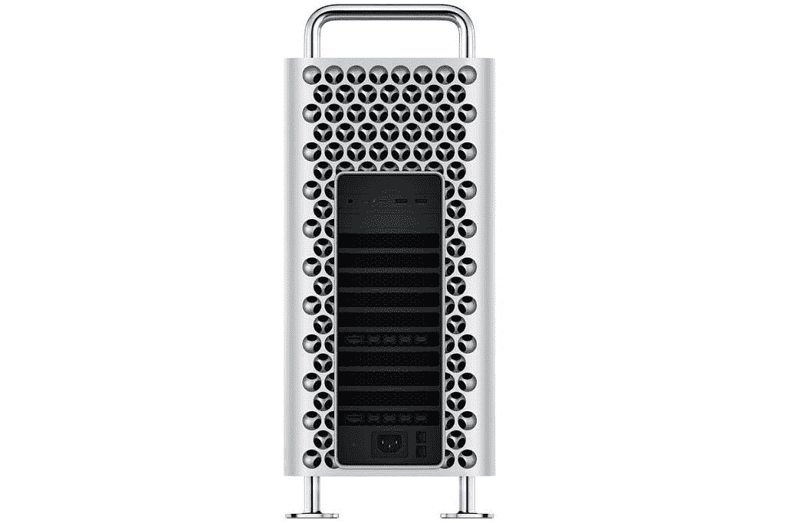
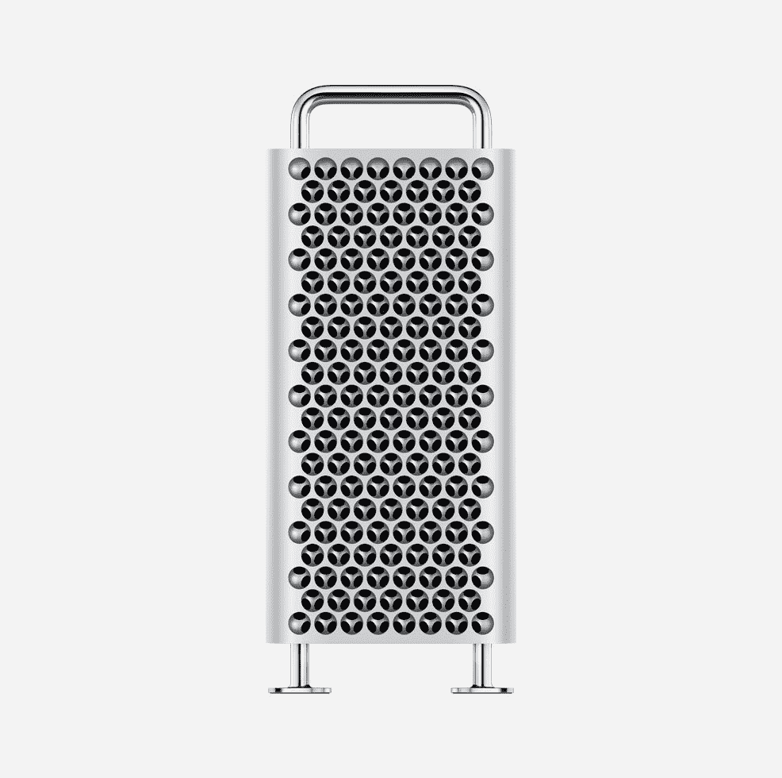

# Mac Studio vs Mac Pro (2019):比较苹果的顶级台式机

> 原文：<https://www.xda-developers.com/mac-studio-vs-mac-pro-2019/>

最近推出的 Mac Studio 是迄今为止我们见过的最强大的苹果硅 Mac，苹果确保我们知道这一点。由于苹果 M1 超处理器，Mac Studio 在一个小小的封装中集成了大量的功能，而且它仍然能够在机箱中安装大量的端口。从表面上看，它像是理想的发电站。但是，Mac Studio 与苹果迄今为止最强的 Mac Pro 相比究竟如何呢？

苹果做了一些直接的比较，所以我们对性能方面的预期有一个相当好的想法。但是，除了这些性能数字之外，还有更多的东西，所以让我们来看看两款最好的 MAC 电脑。

## Mac Studio vs Mac Pro:规格

|  | 

Mac 工作室

 | 

Mac Pro (2019)

 |
| --- | --- | --- |
| **处理器** | 

*   苹果 M1 Max(最高 3.23GHz，10 核)
*   苹果 M1 超(高达 3.23Ghz，20 核)

 | 

*   英特尔至强 W-3223(最高 4GHz，8 核)
*   英特尔至强 W-3235 处理器(最高 4.4GHz，12 个内核)
*   英特尔至强 W-3245 处理器(最高 4.4GHz，16 核)
*   英特尔至强 W-3265M 处理器(最高 4.4GHz，24 核)
*   英特尔至强 W-3275M 处理器(最高 4.4GHz，28 c 内核)

 |
| **图形** | 

*   24 核 GPU (M1 最大)
*   32 核 GPU (M1 最大)
*   48 核 GPU (M1 超)
*   64 核 GPU (M1 超)

 | 

*   AMD 镭龙专业版 W5500X
*   AMD 镭龙专业版 W6600X
*   AMD 镭龙专业版 W5700X
*   AMD 镭龙专业版 W6800X
*   AMD 镭龙 Pro W6800X 双核
*   AMD 镭龙专业版 W6900X
*   可选后燃卡(ProRes 和 ProRes 原始加速器)

 |
| **撞锤** | 

*   32GB 统一内存(仅限 M1 Max)
*   64GB 统一内存
*   128GB 统一内存(仅限 M1 Ultra)

 | 

*   32GB
*   48GB
*   96GB
*   192GB
*   384GB
*   768GB
*   1.5TB

 |
| **存储** |  |  |
| **端口** | 

*   **后**
    *   4 x 雷电 4
    *   2 个 USB 类型 A (5Gbps)
    *   1 个 10Gbps 以太网
    *   高清晰度多媒体接口
    *   3.5 毫米耳机插孔
*   **前部**
    *   两个 USB 类端口(10Gbps，M1 最大值)
    *   两个 Thunderbolt 4 端口(M1 超)
    *   SDXC 卡槽

 | 

*   **后**
    *   两个雷电 3 端口(40Gbps)
    *   两个 USB 类端口(5Gbps)
    *   两个 10Gb 以太网端口
*   **顶部**
    *   两个雷电 3 端口(40Gbps)
*   额外端口可用于 MPX 模块(默认配置包括两个 HDMI 端口和镭龙 Pro W5500X GPU)

 |
| **连通性** |  | 

*   Wi-Fi 5 (802.11ac) +蓝牙 5.0

 |
| **颜色** |  |  |
| **尺寸(WxDxH)** | 

*   7.7 x 7.7 x 3.7 英寸(197 x 197 x 95 毫米)

 | 

*   带标准支脚:8.58 x 17.7 x 20.8 英寸(218 x 450 x 529 毫米)
*   带可选车轮:8.58 x 17.7 x 21.9 英寸(218 x 450 x 557 毫米)

 |
| **重量** | 

*   M1 最大重量:5.9 磅(2.7 千克)
*   超级 M1:7.9 磅(3.6 千克)

 | 

*   起始重量为 39.7 磅(18 千克)

 |
| **起始价格** | 1999 美元(M1 最大)，3999 美元(M1 超) | $5,999 |

## 性能:Mac Studio 挑战最好的 Mac Pro

自从苹果推出苹果芯片以来，Mac 电脑变得越来越强大，尽管 Mac Studio 的尺寸很小，但苹果似乎已经为其最大的发电站创造了一个竞争者。在这个时候，我们真正拥有的是苹果的官方比较，但他们已经显示了它的能力。首先，让我们来看看苹果是如何评价搭载 M1 Max 处理器的 Mac Studio 的。

首先，苹果表示，这款机型的 CPU 性能比配备 16 核英特尔至强处理器的 Mac Pro 快 50%。至于 GPU，它比 Mac Pro 最受欢迎的 GPU(镭龙 Pro W5700X)快三倍以上。在视频转码方面，它比使用相同 GPU 和后燃卡的 Mac Pro 快 3.7 倍。对于 Mac 工作室来说，这已经令人难以置信了。苹果 M1 Max 和 64GB 内存的 Mac Studio 售价 2599 美元，但苹果用于比较的 Mac Pro 配置售价 13399 美元(包括 192GB 内存)。这些价格不包括任何型号的存储升级。

Mac Studio 的性能全面优于 Mac Pro，价格也低得多。

M1 超呢？苹果公司表示，在 CPU 性能方面，装有 M1 Ultra 的 Mac Studio 比 16 核 Mac Pro 快 90%，比 28 核 Mac Pro 快 60%。对于图形，Mac Studio 比最快的 Mac Pro GPU 镭龙 Pro W6900X 快 80%。对于视频转码，Mac Studio 比带后燃卡的 28 核 Mac Pro 快 5.8 倍。同样，虽然配备 M1 Ultra 和最大 RAM 的 Mac Studio 价格为 5599 美元，但在这次比较中，28 核 Mac Pro 配置的价格至少为 26399 美元。看看这些型号在 Geekbench 5 基准测试中的平均得分:

|  | 

苹果工作室 M1 马克斯

 | 

Mac Pro (2019)英特尔至强 W-3223

 | 

苹果 M1 超级工作室

 | 

Mac Pro (2019)英特尔至强 W-3275M

 |
| --- | --- | --- | --- | --- |
| Geekbench 5(单核/多核) | 1,754 / 12,327 | 1,017 / 8,025 | 1,754 / 23,356 | 1,152 / 20,025 |

Mac Pro 的一个优势是可升级性和一些可修复性。你可以随时为 Mac Pro 添加更多的内存或存储空间，你可以高达 1.5TB 的内存，这与 Mac Studio 的最大 128GB 相去甚远。你也可以用 MPX 模块替换 GPU 或添加其他类型的扩展。Mac Pro 的内部设计非常容易操作。另外你可以通过 Thunderbolt 连接外部 GPU，只要是 AMD 的 GPU。

Mac Studio 一旦购买就没有升级选项。无论你从盒子里选择什么，你都将永远拥有它。问题是，对于 2019 年的 Mac Pro，即使它可以升级，你也知道有些事情你无法改变。苹果公司正在将其设备转向苹果芯片，因此随着时间的推移，你将没有太多的选择来升级基于英特尔的 Mac Pro，无论是 CPU 还是 GPU。从现在起的两三年内，你现在拥有的选项很可能是相同的，所以你不可能轻易升级这些选项。

## 设计:Mac Studio 非常紧凑

Mac Studio 在性能方面与 Mac Pro 不相上下，但如果你认为这意味着它们的尺寸差不多，那你就大错特错了。Mac Studio 采用紧凑的机箱，7.7 英寸见方，3.7 英寸高。它的面积与 Mac Mini 一样大，但大约高 2.6 倍。与 Mac Pro 相比，差异是巨大的。Mac Pro 宽 8.58 英寸，深 17.7 英寸，高 20.8 英寸。

这是 Mac Studio 与 Mac Pro 的近似外观:

Mac Studio 是一台电脑，您可以轻松地将它放在桌子上、显示器旁边，甚至放在显示器下面，因此所有端口都很容易使用。有了 Mac Pro，你要么需要桌面上有很大的空间，要么就把它放在地板上，使端口有点难以够到。如果你想把 Mac Pro 安装在服务器机架上，还有一个机架版本。

当然，Mac Pro 的大尺寸也与可升级性有很大关系。大型机箱为 MPX 模块、用于 RAM 的 SODIMM 插槽、SSD 存储插槽等腾出了空间。传统的 PC 组件体积庞大，产生的热量更多，因此它们也需要更多的冷却。

至于 Mac Pro 有哪些升级，有几个选项可以选择。MPX 模块包括各种 GPU，从镭龙 Pro Vega II 到镭龙 Pro W6900X，但你也可以购买 Pegasus R4i 32TB RAID 模块，这为 Mac Pro 增加了一吨的存储空间。当然，你也可以购买 RAM 棒和 M.2 固态硬盘来升级你的 RAM 和存储。Mac Pro 具有免工具开启系统，因此您可以轻松进入系统进行升级。

相比之下，Mac Studio 的 CPU、GPU 和 RAM 都内置在苹果 M1 超芯片组中，存储也焊接在主板上。这些都有助于它尽可能小，但也意味着没有办法升级任何东西。

## 端口和连接性:更小的机箱并不意味着端口更少

尽管 Mac Studio 的封装要小得多，但这种设计并没有牺牲端口。事实上，不包括 MPX 模块，Mac Studio 的端口比 Mac Pro 更多。Mac Studio 的背面有四个 Thunderbolt 4 端口，以及两个 USB Type-A 端口、HDMI、10Gbps 以太网和一个支持高阻抗耳机的 3.5 毫米耳机插孔。在正面，有两个额外的 USB Type-C 端口，如果你选择 M1 超处理器，它支持 Thunderbolt 4，外加一个 SD 读卡器。这允许您通过 HDMI 连接多达五台显示器，包括四台 Pro Display XDRs 和一台 4K 显示器。

Mac Pro 的端口取决于您包含的 GPU。主计算机背面包括两个雷电 3 端口，以及两个 USB Type-A 端口和两个 10Gbps 以太网端口。顶部还有两个雷电 3 港口。镭龙 Pro W5500X 的基本配置在背面也有两个 HDMI 端口用于显示输出，两个 DisplayPort 连接被路由到主板上的雷电 3 端口，以便以这种方式实现显示输出。从镭龙 Pro W5700X 和更高版本开始，GPU 包括一个 HDMI 端口和四个内置的雷电 3 端口。根据您的 GPU 配置，Mac Pro 最多可以连接八台显示器，这是相对于 Mac Studio 的一个显著优势。Mac Pro 的另一个优势是通过 Thunderbolt 支持外部 GPU，而 Mac Studio 不支持。

从技术上来说，你可以在 Mac Pro 上获得更多的端口，这取决于你获得的 GPU，但 Mac Studio 的设置非常可靠，价格也低得多。它还有一个 SD 读卡器和耳机插孔，Mac Pro 没有。除了一些 GPU 中包含的端口之外，Mac Pro 的最大优势是拥有两个 10Gbps 以太网端口。对于大多数用户来说，Mac Studio 可能有更吸引人的设置，不过如果你愿意支付这笔钱，Mac Pro 可以走得更远。

 <picture></picture> 

Rear ports on the MacBook Pro with two GPUs installed

至于无线连接，Mac Studio 也稍微先进一些。与 Mac Pro 上的 Wi-Fi 5 相比，它支持 Wi-Fi 6。不过，这两款机型都支持蓝牙 5.0。

## 最后的想法

Mac Studio 和 Mac Pro 的受众不一定完全相同，但如果你的目标是性能，Mac Studio 似乎遥遥领先。苹果 M1 超轻松击败了 Mac Pro 上的顶级英特尔至强处理器及其 GPU。所有这些功能都包含在一个小得多的机箱中，而且它仍然有大量的端口，所以你不会真正做出大量的妥协。

Mac Studio 将强大的功能集成在一个小机箱中，却没有做出太多的妥协。

Mac Pro 的优势在于可升级性和可修复性，这要归功于可交换的 MPX 模块和可升级的 RAM 和存储。一些 MPX 模块甚至可以增加更多的存储空间，所以你可以真正有空间做任何事情。此外，Mac Pro 可以配置高达 1.5TB 的内存，因此如果您有一个需要大量内存的用例，它也会更好。

我们仍然认为 Mac Studio 是大多数消费者的理想选择。如果你是一名工作繁重的创意专业人士，无论是 3D 渲染还是音乐创作，Mac Studio 都将是你的最佳选择，尤其是如果你使用针对苹果芯片优化的[应用。](https://www.xda-developers.com/best-apps-apple-silicon/)

如果你认为你需要 Mac Pro 的好处，等待苹果升级它也是值得的。该公司已经推出了 Mac Pro 的苹果硅变体，因此值得留下来看看它会带来什么。考虑到它的成本至少为 5999 美元，我们会说最好等等看它是否是正确的投资。无论如何，你可以购买 Mac Pro 或下面的 Mac Studio。如果你不熟悉苹果电脑，看看[你需要知道的关于苹果电脑的一切，这是苹果电脑最新版本的操作系统。](https://www.xda-developers.com/macos-monterey/)

 <picture></picture> 

Mac Studio

##### 苹果 Mac 工作室

新的 Mac Studio 配备了超级强大的苹果 M1 超芯片组，高达 128GB 的内存，以及一个紧凑的机箱中的各种端口。

 <picture></picture> 

Apple Mac Pro Intel

##### 苹果 Mac Pro (2019)

2019 年的 Mac Pro 配备了高达 28 核的 Inel Xeon 处理器，1.5TB 的大容量 RAM，以及可升级的设计。然而，这需要付出巨大的代价。