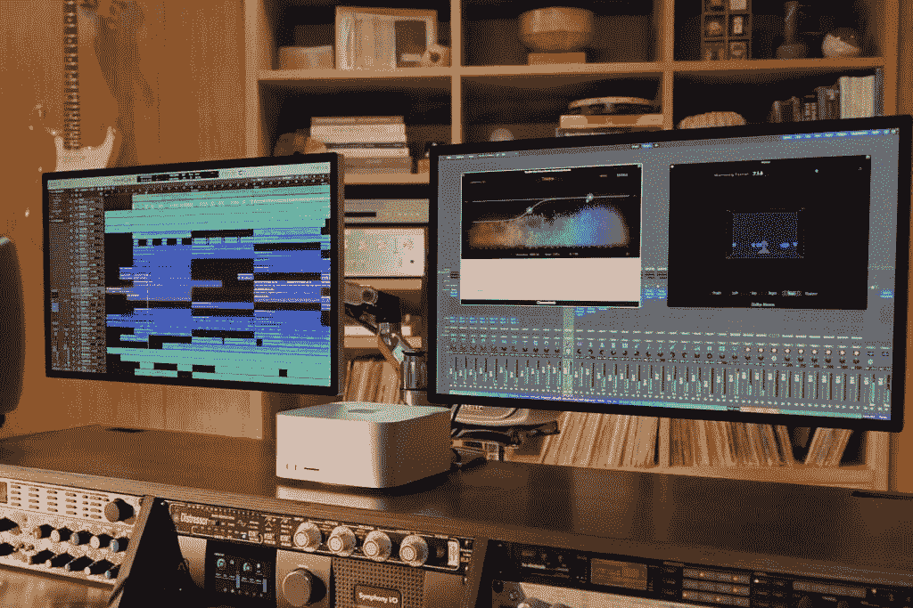

# Mac Studio vs MacBook Pro (2021):苹果新桌面有多强大？

> 原文：<https://www.xda-developers.com/mac-studio-vs-macbook-pro-2021/>

在过去的几年里，苹果芯片一直是苹果许多新产品的核心，它推动了这些产品的重大演变。最近，苹果公司发布了 Mac Studio，这是一款非常强大的台式电脑，搭载全新的苹果 M1 超级电脑或 M1 Max。M1 Max 还搭载了最新的 MacBook Pro 机型，这是你今天能买到的最好的苹果电脑之一。所以，如果你要买一台新的工作站，你应该买 Mac Studio 还是 MacBook Pro？

嗯，这真的取决于你想要什么。Mac Studio 显然不是一台便携式机器——毕竟它甚至没有显示屏。另一方面，它可以提供 MacBook Pro 无法提供的性能。让我们仔细看看这两款产品。

## Mac Studio vs MacBook Pro (2021 年):规格

|  | 

Mac 工作室

 | 

MacBook Pro (2021)

 |
| --- | --- | --- |
| **处理器** | 

*   苹果 M1 Max(最高 3.23GHz，10 核)
*   苹果 M1 超(高达 3.23Ghz，20 核)

 | 

*   苹果 M1 专业版(最高 3.23GHz，8 核) (仅限 14 英寸)
*   苹果 M1 专业版(最高 3.23GHz，10 核)
*   苹果 M1 Max(最高 3.23GHz，10 核)

 |
| **图形** | 

*   24 核 GPU (M1 最大)
*   32 核 GPU (M1 最大)
*   48 核 GPU (M1 超)
*   64-cre GPU (M1 超)

 | 

*   14 核 GPU (M1 专业版，仅限 14 英寸)
*   16 核 GPU (M1 专业版)
*   24 核 GPU (M1 最大)
*   32 核 GPU (M1 最大)

 |
| **撞锤** | 

*   32GB 统一内存(仅限 M1 Max)
*   64GB 统一内存
*   128GB 统一内存(仅限 M1 Ultra)

 | 

*   16GB 统一内存(仅限 M1 专业版)
*   32GB 统一内存
*   64GB 统一内存(仅限 M1 Max)

 |
| **存储** |  |  |
| **显示** | 

*   不适用(显示器单独出售)

 | 

*   14.2 英寸迷你 LED，3024 x 1964，宽彩色(P3)，真音，120 赫兹
*   16.2 英寸迷你 LED，3456 x 2234，宽彩色(P3)，真音，120 赫兹

 |
| **音频** |  | 

*   六扬声器立体声，带力消除低音扬声器，杜比 Atmos

 |
| **网络摄像头** |  | 

*   1080p 前置网络摄像头

 |
| **生物特征安全** | 

*   触控 ID 可与魔法键盘一起使用(单独出售)

 |  |
| **电池** |  | 

*   69.6 瓦时电池(14 英寸):电池续航时间长达 17 小时
*   99.8 瓦时电池(16 英寸):长达 21 小时的 Apple TV 视频播放

 |
| **港口** | 

*   **后**
    *   4 x 雷电 4
    *   2 个 USB 类型 A (5Gbps)
    *   1 个 10Gbps 以太网
    *   高清晰度多媒体接口
    *   3.5 毫米耳机插孔
*   **前端**
    *   两个 USB 类端口(10Gbps，M1 最大值)
    *   两个 Thunderbolt 4 端口(M1 超)
    *   SDXC 卡槽

 | 

*   3 个雷电 4 端口
*   高清晰度多媒体接口
*   MagSafe 3 充电端口
*   SD 读卡器
*   3.5 毫米耳机插孔

 |
| **连通性** |  |  |
| **颜色** |  |  |
| **尺寸(WxDxH)** | 

*   7.7 x 7.7 x 3.7 英寸(197 x 197 x 95 毫米)

 | 

*   14 英寸:12.31 x 8.71 x 0.61 英寸(312.6 x 221.2 x 15.5 毫米)
*   16 英寸:14.01 x 9.77 x 0.66 英寸(355.7 x 248.1 x 16.8 毫米)

 |
| **重量** | 

*   M1 最大重量:5.9 磅(2.7 千克)
*   超级 M1:7.9 磅(3.6 千克)

 | 

*   14 英寸:起始重量为 3.5 磅(1.59 千克)
*   16 英寸:起始重量为 4.7 磅(2.13 英寸)

 |
| **起始价格** | 1999 美元(M1 最大)，3999 美元(M1 超) | 1999.99 美元(14 英寸)，2499 美元(16 英寸) |

很明显，这两者之间最大的区别是它们完全是不同的产品。一个是台式机，另一个是笔记本电脑，这样你就可以马上解决问题了。但是让我们仔细看看。

## 性能:苹果 M1 超是一个野兽

在比较这两款设备时，最值得考虑的显然是性能。Mac Studio 和 MacBook Pro 都可以采用相同的苹果 M1 Max 芯片，但 M1 Ultra 怎么样呢？事情是这样的:M1 超是由两个 M1 最大的芯片组连接在一起。使用苹果的 UltraFusion 技术，两个处理器以令人难以置信的高带宽(高达 2.5TB/s)连接在一起，并且它们被系统识别为单个处理器。这意味着您将获得双倍的一切:CPU 核心、GPU 核心、神经引擎核心、RAM(统一内存)等等。连内存带宽都翻倍到 800GB/s，只有存储是一样的。

苹果没有直接比较 Mac Studio 和 MacBook Pro 的性能，但它确实将 M1 Max 和 M1 Ultra 与其他台式 Mac 进行了比较。这不是一个精确的测量，但以下是苹果分享的一些数据:

*   配备 M1 Max 的 Mac Studio 的性能是配备 10 核英特尔 CPU 的 27 英寸 iMac 的 2.5 倍。M1 超变种承诺 3.8 倍的性能相比，相同的 CPU。
*   与采用 16 核英特尔至强处理器的 Mac Pro 相比，M1 Max 在 CPU 性能方面快了 50%。M1 超快高达 90%。
*   与 27 英寸 iMac 相比，M1 Max 的 GPU 性能高达 3.4 倍，而 M1 Ultra 的 GPU 性能高达 4.5 倍。
*   M1 Max 的视频转码速度比 27 英寸 iMac 快 7.5 倍。有了 M1 超，它的速度提高了 12 倍。

这些数字表明，M1 Ultra 的 CPU 可以比 M1 Max 的快 50%到 80%。GPU 大约快 30%，视频转码大约快 60%。这都是考虑到 M1 Max 是在台式机机箱中冷却的，与 MacBook Pro 相比，差异可能更大，因为那里的散热解决方案不同。除此之外，当然，拥有两倍的内存也将为您带来更高的性能。内存带宽也增加了一倍，从 400GB/s 增加到 800GB/s

苹果 M1 Ultra 的 CPU 比 M1 Max 快 80%。

当然，这只是比较 M1 超 M1 最大。2021 年的 MacBook Pro 也有 M1 Pro 芯片组，该芯片组与 M1 Max 的 CPU 相同，但只有 14 或 16 个 GPU 核心，是 M1 Max 的一半。M1 Pro 还最大限度地提高了 32GB 的统一存储空间(最低 16GB)，内存带宽为 200 GB/秒。所有这些都是 M1 Max 所提供的一半，因此，GPU 性能约为一半。尽管如此，你得到了相同的 CPU 和神经引擎，所以性能在 M1 专业版上一点也不差。

## 显示屏:MacBook Pro 有一个

我们不会在这个问题上逗留太久，但自然地，MacBook Pro 有内置显示器，而 Mac Studio 没有内置显示器。MacBook Pro 上的显示器也很棒，作为一个液态视网膜 XDR 面板，它具有超清晰的 3456 x 2234 分辨率(在 16 英寸型号中)，并使用 mini-LED，提供 1，000，000:1 的对比度，高达 1000 尼特的持续全屏亮度，HDR，p 3 宽色彩，以及 120Hz 的刷新率。它基本上是你能要求的一切。

有了 Mac Studio，你应该已经有一台显示器了，或者买一台新的。苹果正在推动 Studio 显示器，这是一个 27 英寸的面板，具有 5K 分辨率(5120 x 2880)，600 尼特的亮度，支持 P3 宽彩色。这仍然是一个非常棒的屏幕，它涂有防反射玻璃，或者如果你想要更少的眩光，你可以添加纳米纹理玻璃。它甚至包括一个支持中央舞台的 1200 万像素摄像头，当你四处移动时，它可以让你保持在帧中。它甚至内部有一个苹果 A13 仿生处理器。然而，除了已经起价 1999 美元的个人电脑(如果你想要 M1 Ultra，价格为 3999 美元)之外，这至少需要 1599 美元。

 <picture></picture> 

Apple Studio Display

##### 苹果工作室显示器

Studio 显示器是苹果公司 Mac Studio 的伴侣，提供 5K 分辨率和 1200 万摄像头的高端视觉体验。

当然，还有其他选择，比如超高端的苹果 Pro 显示器 XDR，具有 6K 分辨率，迷你 LED 背光与 MacBook Pro 的显示器具有相同的优势，等等。你可以随时查看 MacBook Pro 的[最佳显示器，它们应该也适用于新的 Mac Studio。](https://www.xda-developers.com/best-monitors-macbook-pro/)

## 设计和端口:Mac Studio 比 MacBook Pro 拥有更多的端口

最后说一下端口。新的 Mac Studio 配备了大量的端口，超级用户可能会喜欢。在背面，有四个 Thunderbolt 4 端口，10Gbps 以太网，两个 USB Type-A 端口，HDMI 和一个支持高阻抗耳机的耳机插孔。这是一个非常强大的设置，将 10Gbps 以太网作为标准是不常见的。如果这还不够，前面还有两个 USB 型端口和一个 SD 读卡器，C 型端口变成了 M1 Ultra 的 Thunderbolt 4 端口。这相当于一台电脑上总共有六个 Thunderbolt 4 端口。你可以通过这种方式连接多达四个 Apple Pro Display XDRs，加上一个通过 HDMI 连接的 4K 显示器，总共 5 个屏幕。

MacBook Pro 配有三个 Thunderbolt 4 端口、HDMI、一个 SD 读卡器和一个支持高阻抗耳机的耳机插孔。它也使用 MagSafe 充电，而 Mac Studio 使用更传统的桌面电源端口。通过这种方式，您最多可以连接四台显示器，外加笔记本电脑上的内置屏幕。虽然这肯定是 MacBook Pro 在一段时间内拥有的最好的端口阵容，但 Mac Studio 仍然拥有以太网和 USB Type-A 作为优势。

Mac Studio 不包括任何外围设备，所以这是你错过的其他东西。没有内置键盘、鼠标或触控 ID 支持，MacBook Pro 显然是内置的，因为它是一台笔记本电脑。如果这是你想要的功能，你必须和触控 ID 一起购买魔法键盘。除此之外，我们还列出了苹果电脑的最佳键盘和鼠标，你也可以看看。

虽然 Mac Studio 并不完全意味着便携，但就其性能而言，它是一款非常紧凑的 PC，边长 7.7 英寸，高 3.7 英寸。它本身很容易携带，所以如果你碰巧在不同的地方有显示器，带着它也不是完全不合理的。当然，MacBook Pro 是一台真正的笔记本电脑，所以你可以在任何你想去的地方使用它。它有点重，但内置的一切意味着它更容易携带，你可以在路上使用它，而不是等待插上电源。

## 价格

现在，让我们讨论一下价格。MacBook Pro 和 Mac Studio 从技术上来说价格相同，但这里有很多需要考虑的因素。对于 MacBook Pro，您看到的是一款 14 英寸的机型，配有 10 核 CPU、14 核 GPU 和 16GB 的统一内存。然而，你确实得到了使用电脑所需的一切——屏幕(而且是一个很棒的屏幕)、键盘和触控板。另外，你有触控 ID 内置。如果你想要 16 英寸的 MacBook Pro，起价为 2499 美元，配备更大的屏幕、更大的电池和略强的 16 核 GPU。

同样是 1999 美元，Mac Studio 配备了苹果 M1 Max - 10 CPU 内核、24 个 GPU 内核和 32GB 统一内存，性能要高得多。但是除了电脑你什么也得不到。您需要单独购买键盘、鼠标和显示器。如果你打算购买苹果的配套工作室显示器，你至少要在屏幕上多花 1599 美元。

M1 超 Mac 工作室的价格至少为 3999 美元，你甚至没有一个显示器。

但是我们在这里谈论了很多关于 M1 Ultra 的事情，如果你想要那个，你至少要为 Mac Studio 支付 3999 美元。没错，4000 美元，你还是没有屏幕。这是 M1 超的淡化版本，拥有 48 个 GPU 核心和 64GB 的统一内存。当然，你也可以获得 1TB 的存储空间，但这仍然是一个巨大的要求。如果你想要 64 个 GPU 核心的 M1 超，它需要额外的 1000 美元。

比这个价格低 100 美元，你就可以买到一台 16 英寸的 MacBook Pro，配有 M1 Max 芯片、32 个 GPU 核心、64GB 统一内存和 4TB 存储空间。您将获得使用该笔记本电脑所需的一切。

## 最后的想法

考虑到 Mac Studio 和 MacBook Pro 如此不同，在它们之间做出选择应该不会太难。如果你希望性能高于一切，并且你有多余的钱，Mac Studio 显然是一个不错的选择。新的苹果 M1 超是一个令人难以置信的强大的芯片组，可以处理任何你可以扔给它。M1 Max 也快得令人难以置信，但 M1 Ultra 本质上是两个 M1 Max 芯片一起工作，所以它显然更好。

如果你希望性能高于一切，Mac Studio 是理想之选。

如果你已经准备好了桌面系统，Mac Studio 可能会更好。如果您只是购买计算机，并且已经有了显示器和外围设备，那么就更容易证明购买的合理性。此外，借助 USB Type-A 和 10Gbps 以太网端口，您无需任何适配器即可连接外围设备和超高速有线互联网。

 <picture></picture> 

Image credit: Apple

自然，如果你想在移动中工作，MacBook Pro 是首选。它仍然非常快，非常省电，并且内置了令人惊叹的显示屏。它可能比不上 Mac Studio 的性能，但它一点也不慢，而且它允许您在任何可以坐下的地方完成工作。此外，它便宜得多，因为你不需要为它购买显示器、键盘或鼠标。

如果你想购买这些设备中的任何一个，你可以在下面这样做。如果你是 macOS 的新手，你可以在这里了解最新版本 [macOS Monterey。如果这是你的第一台 Apple Silicon Mac，看看为 Apple Silicon 优化的](https://www.xda-developers.com/macos-monterey/)[最佳应用](https://www.xda-developers.com/best-apps-apple-silicon/)。

 <picture></picture> 

Mac Studio

##### 苹果 Mac 工作室

新的 Mac Studio 配备了超级强大的苹果 M1 超芯片组、大量端口和时尚紧凑的设计。尽管它很贵。

 <picture></picture> 

MacBook Pro 16

##### 苹果 MacBook Pro 16 英寸(2021)

MacBook Pro 配备了苹果 M1 Pro 或 M1 Max 处理器和令人惊叹的液态视网膜 XDR 显示屏。