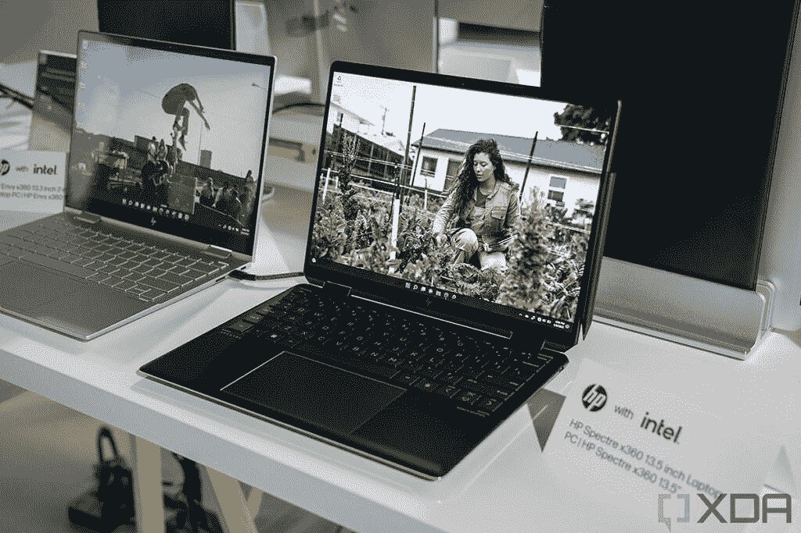

# MacBook Air (2022) vs 惠普 Spectre x360 13.5:你该买哪个？

> 原文：<https://www.xda-developers.com/macbook-air-2022-vs-hp-spectre-x360-13-5/>

2022 年对于笔记本电脑来说是相当重要的一年，各种品牌的许多设备都获得了全新的设计、功能和处理器。其中一款笔记本电脑是惠普 Spectre x360 13.5(T1)，它是 Spectre x360 14 的继任者。最近，苹果公司还推出了一个重大更新的 [MacBook Air](https://www.xda-developers.com/macbook-air-2022/) ，这两款笔记本电脑都是非常棒的高端设备。如果你正在寻找你今天能买到的[最好的笔记本电脑](https://www.xda-developers.com/best-laptops/)，这两个都是常见的推荐，但是你应该选择哪一个呢？在本文中，我们将对 HP Spectre x360 13.5 和 2022 MacBook Air 进行比较，以找出答案。

需要明确的是，永远不会有适用于所有人的明确答案。这两款笔记本电脑都有很大的优势，一款会在某些方面表现出色，而另一款会在其他方面更有吸引力。也许这里最值得注意的因素是操作系统，因为一台笔记本电脑运行 macOS，另一台运行 Windows 11。仅此一点就能为你做出选择，但还有更多。让我们仔细看看。

**浏览本文:**

## MacBook Air (2022 年)与戴尔 XPS 13 (2022 年):规格

|  | 

MacBook Air (2022 年)

 | 

惠普 Spectre x360 13.5

 |
| --- | --- | --- |
| **操作系统** | 

*   macOS Monterey(可升级到 macOS Ventura)

 |  |
| **CPU** | 

*   苹果 M2 (8 核，未知速度)

 | 

*   第 12 代英特尔酷睿 i5-1235U (10 个内核，12 个线程，最高 4.4GHz，12MB 高速缓存)
*   第 12 代英特尔酷睿 i7-1255U (10 个内核，12 个线程，最高 4.7GHz，12MB 高速缓存)

 |
| **图形** |  | 

*   英特尔 Iris Xe 显卡(最高 96 个欧洲单位)

 |
| **显示** | 

*   13.6 英寸 IPS，2560 x 1664，500 尼特，真实色调，P3 宽色彩

 | 

*   13.5 英寸 IPS，全高清+ (1920 x 1280)，触控，400 尼特，100% sRGB，防反射
*   13.5 英寸 IPS，全高清+ (1920 x 1280)，HP Sure View Reflect，触控，1000 尼特，100% sRGB
*   13.5 英寸有机发光二极管，3K2K (3000 x 2000)，触摸，500 尼特(HDR)，100% DCI-P3，防反射

 |
| **存储** | 

*   256GB 固态硬盘
*   512GB 固态硬盘
*   1TB 固态硬盘
*   2TB 固态硬盘

 | 

*   512GB PCIe 第四代固态硬盘
*   1TB PCIe 第四代固态硬盘
*   2TB PCIe 第四代固态硬盘

 |
| **闸板** | 

*   8GB 统一内存
*   16GB 统一内存
*   24GB 统一内存

 | 

*   8GB LPDDR4x 4266MHz(焊接)
*   16GB LPDDR4x 4266MHz(焊接)
*   32GB LPDDR4x 4266MHz(焊接)

 |
| **电池** | 

*   52.6 瓦时电池
    *   高达 67W 的 USB-C 电源适配器

 | 

*   4 芯 66 瓦时电池
    *   高达 65W 的 USB Type-C 电源适配器

 |
| **端口** | 

*   2 个 USB4 / Thunderbolt (USB-C)
*   3.5 毫米耳机插孔
*   MagSafe 3

 | 

*   2 个 Thunderbolt 4(USB C 型)
*   1x USB 3.2 第 1 代 A 型
*   3.5 毫米耳机插孔
*   microSD 读卡器

 |
| **音频** | 

*   带杜比 Atmos 的四扬声器音响系统
*   3 麦克风阵列

 | 

*   Bang & Olufsen 的四声道扬声器
*   双阵列数字麦克风

 |
| **摄像机** |  | 

*   惠普 True Vision 5MP 万像素红外摄像头，带摄像头快门和瞬时降噪功能

 |
| **生物认证** |  | 

*   红外网络摄像头
*   指纹传感器

 |
| **连通性** |  | 

*   英特尔无线网络 6E AX211
*   蓝牙 5.2

 |
| **颜色** | 

*   银
*   太空灰
*   星光
*   午夜

 | 

*   夜幕下的黑色，带着淡淡的黄铜色
*   天蓝色调的夜曲蓝
*   天然银

 |
| **尺寸(WxDxH)** | 

*   11.97 x 8.46 x 0.44 英寸(304.1 x 215 x 11.3 毫米)

 | 

*   11.73 x 8.68 x 0.67 英寸(297.94 x 220.47 x 17.02 毫米)

 |
| **尺寸** | 

*   起始重量为 2.7 磅(1.24 千克)

 | 

*   起始重量为 3.01 磅(1.37 千克)

 |
| **价格** | 起价 1199 美元 | 起价 1249 美元 |

## 操作系统:macOS 或 Windows

正如我们上面提到的，在选择这两款笔记本电脑时，你可能会考虑的最大因素是操作系统。这是体验的核心，如果你更习惯其中任何一个，那可能是你更喜欢的。归根结底是熟悉，至少对大多数人来说是这样。但是，如果你还没有偏好，仍然有充分的理由选择其中之一。

就个人电脑而言，Windows 是世界上最受欢迎的操作系统，这本身就有优势。你想要的大多数应用程序都存在于 Windows 中，因此你将更容易兼容，无论是特定的应用程序还是需要特殊驱动程序的设备。 [Windows 11](https://www.xda-developers.com/windows-11-22h2/) 是 Windows 的最新版本，除了长久以来对各类 app 的兼容之外，它还有一种新的设计语言，看起来很美，而且比以前的版本多了几分初学者友好。Windows 11 版本 22H2 也变得更好了。

另一方面，macOS 通常被认为是内容创作的最佳操作系统，这在很大程度上要归功于 Final Cut Pro。这是苹果公司开发的视频编辑器，即使不是最好的，也经常被认为是市场上最好的之一。由于它受到创作者的欢迎，许多其他内容创作应用程序为 MAC 提供了很大的支持，因此它是一个很好的设备。一些人还认为 macOS 对新用户更友好，所以如果你是电脑新手，这可能是个不错的选择。就像 Windows 11 一样，macOS 每年也会有大的更新，比如即将发布的 [macOS Ventura](https://www.xda-developers.com/macos-ventura/) 。

## 性能:苹果 M2 处理器强大而高效

自 2020 年推出苹果芯片以来，性能是苹果真正领先的一个领域。苹果 M2 是第二代苹果芯片，现在它在 CPU 和 GPU 方面都提供了更高的性能。它仍然有一个 8 核 CPU，但它的性能比上一代产品高 18%，已经非常快了。

当然，HP Spectre x360 13.5 还配备了最新的英特尔处理器，与之前的型号相比，性能有了很大的提高。它配有 10 个内核和 12 个线程，对于日常使用来说也足够快了。我们还没有直接比较这两款笔记本电脑的基准数据，但根据苹果的内部测试，很明显 M2 明显领先。下图比较了苹果 M2 和英特尔酷睿 i7-1255U，这是惠普 Spectre x360 13.5 中最强大的型号。

正如你所看到的，在相同的 15W 功耗下，苹果 M2 的速度几乎是英特尔酷睿 i7-1255U 的两倍。即使英特尔处理器被允许使用更多的功率，它仍然无法与 M2 的性能相匹配。

当涉及到 GPU 方面的事情时，更是如此。再次将苹果 M2 与英特尔酷睿 i7-1255U 进行比较，苹果的处理器具有更大的优势，在相同的功率水平下，性能是英特尔的 2.3 倍。即使英特尔处理器使用更多的能量，苹果也遥遥领先。

这里值得一提的是，苹果 M2 确实有两个版本的 GPU——一个 8 核，一个 10 核——这次比较使用的是更强大的一个。然而，英特尔酷睿 i5 与酷睿 i7 相比也是如此，所以在比较相同的定价层时，事情应该会平衡。

然而，这不仅仅是性能本身。在上面的比较中，还有一点很明显，那就是苹果 M2 实现了这些出色的性能水平，同时使用的功耗远远低于英特尔处理器。因此，即使惠普的笔记本电脑有更大的电池，它可能不会持续充电很长时间，或者它可能比最初看起来更平衡。

惠普 Spectre x360 的内存最高可达 32GB，但速度不会那么快。

至于其他规格，惠普 Spectre x360 13-5 在 RAM 容量方面领先，可以达到 32GB，而不是 MacBook Air 的 24GB。另一方面，由于 MacBook Air 的 RAM 内置于 M2 芯片中，因此它可以提供更快的速度，并且可以根据需要由 CPU 和 GPU 访问，这对于 GPU 需要从内存中加载资产的任务有很大帮助。至于存储，这两款笔记本电脑都高达 2TB，但惠普 Spectre x360 的基本配置中有一个 512GB 的固态硬盘，这使它比 MacBook Air 的基本型号更有优势。

## 显示和声音:HP Spectre x360 13.5 有一个有机发光二极管选项

接下来是展示，在这种情况下，您的预算在选择笔记本电脑时起着重要作用。MacBook Air 只有一种显示配置——它是一个 13.6 英寸的面板，具有独特的 2560 x 1664 分辨率，使其纵横比略高于 16:10。这是全面的标准，对于起价 1199 美元的基本配置来说，这是一个非常棒的显示器。对于这个尺寸来说，它非常清晰，亮度可以达到 500 尼特，而且它支持 P3 宽彩色。这里的一个缺点是屏幕顶部有一个用于网络摄像头的凹槽，有些人可能不喜欢。

相比之下，HP Spectre x360 13.5 的基本配置就没那么令人印象深刻了，至少在视觉体验方面是这样。13.5 英寸的屏幕具有 3:2 的长宽比，比 MacBook Air 的屏幕高，这使得它的工作效率更高。但基本配置“仅”是全高清+ (1920 x 1280)分辨率，这与苹果的产品相比是一个很大的下降(需要明确的是，对于这个尺寸来说，它仍然绰绰有余)。不过，这只是基本模型。惠普为您提供了升级到 3K2K (3000 x 2000) OLED 面板的选项，这是一款既清晰又充满活力的惊艳显示器。有机发光二极管意味着您可以获得真正的黑色、更鲜艳的颜色和高对比度，从而带来出色的视觉体验。

不过，这只是视觉上的一面。惠普 Spectre x360 还有另一个潜在优势，那就是它是一款可变形笔记本电脑。显示器支持触摸和笔输入，因此您可以更直观地使用它。它也使记笔记或画画变得很容易。此外，如果您处理敏感信息，Spectre x360 为您提供了集成隐私屏幕(HP Sure View Reflect)选项，可在您工作时阻止您周围的人看到您屏幕上的内容。

惠普 Spectre x360 配备了 Windows Hello 面部识别功能。

至于网络摄像头，这两个都会给你很好的体验。苹果首次在 MacBook Air 中使用 1080p 摄像头，这是由苹果 M2 内部的高级图像信号处理器支持的。与此同时，惠普 Spectre x360 13.5 使用了一个 500 万像素的摄像头和 1080p 视频，以及自动取景和光线校正等智能功能。理论上，看起来惠普的网络摄像头更好，但两者都很棒。除了指纹识别器之外，Spectre x360 还支持 Windows Hello 面部识别。尽管 MacBook Air 的显示屏上有一个凹槽，但它仍然只有触控 ID。

最后，在声音方面，两款笔记本电脑都配备了四扬声器立体声系统，这对 13 英寸的笔记本电脑来说相当不错。你肯定会获得很好的音频体验，但苹果通常拥有任何笔记本电脑上最好的扬声器，所以如果 MacBook Air 保持这一点，它可能会在这一领域名列前茅。

## 设计:一个是敞篷车，一个不是

设计是惠普在功能和外观方面领先的一个领域。就功能而言，Spectre x360 具有可转换的优势，正如我们已经提到的那样，这意味着铰链可以旋转 360 度，因此您可以将其用作平板电脑，也可以在中间的各种位置使用，如“帐篷模式”。当然，屏幕也支持触摸，所以你也可以把电脑当作平板电脑使用。相比之下，MacBook Air 是一款简单的翻盖式笔记本电脑，这使得它的通用性较差。

惠普 Spectre x360 在外观方面也更有趣。它采用双色调设计，这意味着笔记本电脑的表面是一种颜色，但边缘是不同的颜色。夜幕黑色款沿边缘有“淡黄铜”口音，夜曲蓝色版有浅蓝色口音。如果你想要更柔和的颜色，自然银也是可以选择的，而且是单一颜色。

另一方面，MacBook Air 看起来简单得多，尽管今年有新的颜色。你可以得到银色，太空灰，星光，或午夜。这些都是相当柔和的颜色，尽管他们仍然设法迎合不同的用户。尽管如此，我们肯定会把这一点交给惠普这个部门。

然而，惠普 Spectre x360 的敞篷设计也有一个缺点，那就是便携性。这款笔记本电脑重 3.01 磅，不算超级重，但也没那么轻。MacBook Air 的重量为 2.7 磅，这使得它的便携性略有提高。MacBook Air 也明显更薄，尺寸为 11.3 毫米，而 HP Spectre x360 的尺寸为 17.02 毫米。

## 端口:HP Spectre x360 13.5 具有更强大的设置功能

最后，我们来到港口，在那里，Spectre x360 取得了另一场胜利。惠普的笔记本电脑没有一个端口，但它有两个 Thunderbolt 4 端口，一个 USB Type-A 端口，一个耳机插孔和一个 microSD 读卡器。这意味着你应该能够插入你想要的大多数基本外设，而 Thunderbolt 支持意味着你也可以使用 Thunderbolt docks 和外部 GPU 等东西。

MacBook Air 上的耳机插孔支持高阻抗耳机。

另一方面，MacBook Air 也有两个 Thunderbolt 端口，外加一个耳机插孔和一个 MagSafe 充电连接器。不过，这里有一些不同之处。一方面，MacBook Air 的耳机插孔更强大，这意味着它实际上可以支持高阻抗耳机，而无需外部放大器。另一方面，Thunderbolt 端口受到苹果 M2 芯片的限制。你只能通过 Thunderbolt 连接一个外部显示器(不管分辨率如何)，而且这种方式不支持外部 GPU。这剥夺了 Thunderbolt 的许多功能。

至于无线通信，这两款笔记本电脑相似，尽管 MacBook Air 仍然不支持 Wi-Fi 6E，这是一种频率更高的 6GHz 新标准。惠普的笔记本电脑确实支持它。

## MacBook Air (2022)与惠普 Spectre x360 13.5:最终想法

和任何事情一样，选择笔记本电脑最终取决于你的个人喜好。MacBook Air 和 HP Spectre x360 13.5 在某些领域都有明显的优势，由你的需求来决定你最看重什么。如果性能和移动性是你的优先考虑，MacBook Air 是最佳选择。此外，如果您想要一个出色的显示器，而不必购买非常昂贵的配置，它也为您提供了这一选项。

另一方面，如果你有钱的话，HP Spectre x360 拥有更高级的有机发光二极管显示屏，此外它还有一个主要优点是可以转换，这使它更加多功能。仅此一点就可能是选择惠普设备的原因——就个人而言，这是我选择 Spectre 而不是 MacBook Air 的最大原因。此外，它有更独特的视觉设计，可能是两者中最好的网络摄像头。

 <picture></picture> 

HP Spectre x360 13.5

尽管如此，你的决定很可能完全取决于操作系统——如果你想要 macOS，你可以选择 MacBook Air，如果你想要 Windows，你可以选择 HP Spectre x360 13.5。对许多人来说，这可能就是你需要考虑的全部。

如果你已经做出了决定，你可以看看下面的两款笔记本电脑。惠普 Spectre x360 13.5 已经可以购买，但 MacBook Air (2022)预计将在 7 月推出。

 <picture></picture> 

MacBook Air M2 2022

##### 苹果 MacBook Air (M1，2020 年)

2022 年的 MacBook Air 由新的苹果 M2 芯片驱动，另外它有一个新的更高的显示屏和全新的设计。

 <picture></picture> 

HP Spectre x360 13.5

##### 惠普 Spectre x360 13.5

2022 HP Spectre x360 13.5 采用 3:2 显示屏和 10 核 12 线程的第 12 代英特尔处理器。