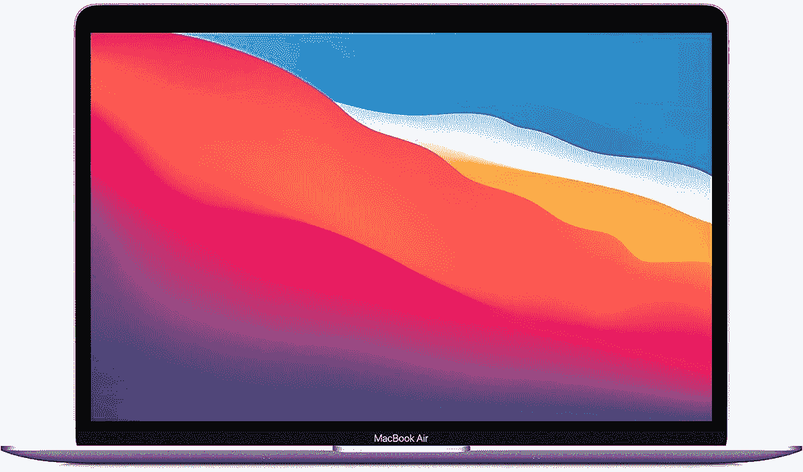

# 仅限今天:只需 800 美元(优惠 200 美元)就能买到 M1 MacBook Air

> 原文：<https://www.xda-developers.com/macbook-air-m1-deal-december-2021/>

最新的 MacBook Air 是你现在能买到的最好的笔记本电脑之一，只要你愿意使用 macOS 而不是 Windows 或 Linux。苹果去年更新了基于 ARM 的 M1 芯片，给 Air 带来了令人印象深刻的电池寿命和性能，所有这些都与旧款机型一样轻薄。入门级的 M1 型号已经 900 美元有一段时间了，偶尔会降至 850 美元，但现在它的售价仅为 799.99 美元。

这是入门级的 M1 MacBook Air，在同一个芯片组上配备了 8 核 CPU、8 核 GPU、16 核神经引擎和 8GB RAM。你还可以获得 256GB 的固态硬盘存储，背光键盘，FaceTime 高清网络摄像头和 13 英寸视网膜显示屏。800 美元一个不坏的套餐，尤其是与大多数低于 1000 美元的 Windows 笔记本电脑相比。

 <picture></picture> 

Apple MacBook Air 13 (2020)

##### 苹果 MacBook Air (M1，2020 年)

这是最新 MacBook Air 的 256GB 存储/8GB RAM 型号。

大多数主流 macOS 软件本身已经支持 M1 芯片，但大多数基于 x86 的旧应用程序可以在 Rosetta 兼容层上运行。装有 M1 芯片的 Mac 电脑无法引导进入 Windows(x86 MAC 上有可能)，但[你仍然可以在装有 Parallels](https://www.xda-developers.com/windows-10-apple-silicon-mac/) 的虚拟机中运行 Windows for ARM。在允许桌面 Linux 发行版在 M1 硬件上引导而不需要复杂的破解或变通办法方面，T4 也有缓慢的进展。

如果你不确定 MacBook Air 是否适合你，我们有一份关于[最佳 MAC 电脑](https://www.xda-developers.com/best-macs/)的综述，它解释了对于给定的使用案例和预算，哪些苹果电脑是最佳选择。如果你需要比 MacBook Air 更好的东西，新的[苹果 MacBook Pro 14 和 MacBook Pro 16 (2021)](https://www.xda-developers.com/macbook-pro-2021/) 可能值得考虑。新款 MacBook Pro 可以购买更强大的 M1 芯片、更大的存储空间和更多的 RAM，所有配置都比 Air 有更多的硬件端口和更大的显示屏。当然，所有这些都是有代价的，相比之下，空气就显得很重要了。