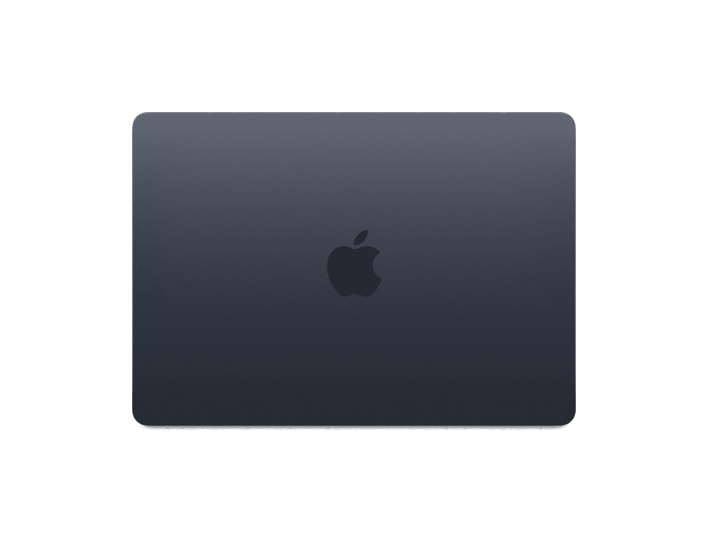

# MacBook Air (M2，2022)上的快充快了多少？

> 原文：<https://www.xda-developers.com/macbook-air-m2-2022-fast-charging/>

随着苹果的 M1 芯片在 2020 年如此受欢迎，今年的 M2 备受期待。除了显著的性能提升，我们开始看到一些重新设计的硬件可以利用新的处理器架构。最初的 M1 产品只是英特尔的设计，采用了新的内部结构。现在，我们看到了真正的变化，这从 [MacBook Air (M2，2022)](https://www.xda-developers.com/macbook-air-2022/) 开始。

该产品的新功能之一是快速充电，但这是苹果的产品，正如我们从该公司推出快速充电的其他产品中看到的那样，如 iPhone，库比蒂诺公司不一定在盒子中包括快速充电器。充电器有三种选择:

*   30W USB-C 电源适配器
*   35W 双 USB-C 端口紧凑型电源适配器
*   67W USB-C 电源适配器

30W 电源适配器配有基本型号，可能值得升级到另外两个中的一个。我们测试了 35W 适配器和 67W 适配器，因为后者是快速充电实际需要的。另一方面，双 USB-C 端口适配器可以让你同时为 iPhone 或 Apple Watch 充电。

需要明确的是，你需要 67W 的 USB-C 电源适配器来快速充电，尽管你可以得到更大功率的东西。

## 67W 电源适配器要快得多

在我的测试中，67W 的电源适配器为 MacBook Air (M2，2022)充电 85 分钟。不过我实际上进行了三次测试，因为对于 35W 适配器，我在它还连接到 [iPhone 13 Pro](https://www.xda-developers.com/apple-iphone-13-pro-review/) 时对它进行了计时，并且我还在它没有连接到任何其他设备时对它进行了测试。这两个结果也大相径庭，事实上，当用 35W 双 USB-C 端口紧凑型电源适配器给 iPhone 13 Pro 和 MacBook Air 充电时，需要 220 分钟。没错，用充电器给 MacBook Air 充电花了 3 小时 40 分钟，看起来它是在做它应该做的事情。

在没有连接 iPhone 的情况下，35W 适配器充满电需要 120 分钟，比同时给另一台设备充电少了整整 100 分钟。当然，iPhone 的充电速度比 MacBook 快得多，所以可以推测，你会在某个时候拔掉 iPhone 的电源。

有了 MacBook Air (M2，2022 年)，你可以放心地假设你将获得 8 小时的电池续航时间。你可能会得到更多，但让我们称之为八小时作为安全的假设。如果电池没电了，用 67W 的适配器充电半小时可以让你有 51%的电池，应该可以使用四个小时。如果你在紧要关头，那是非常有用的。另一方面，35W 适配器至少需要 55 分钟才能达到这一要求。

一如既往，由你来权衡自己的需求。这就是为什么苹果让你选择 MacBook Air 将配备哪种适配器。希望有了这些额外的数据，你可以做出更明智的决定。

 <picture></picture> 

MacBook Air

##### 苹果 MacBook Air (2022)

苹果 MacBook Air 配备了全新的 M2 处理器、大幅改进的网络摄像头、更好的显示屏等等