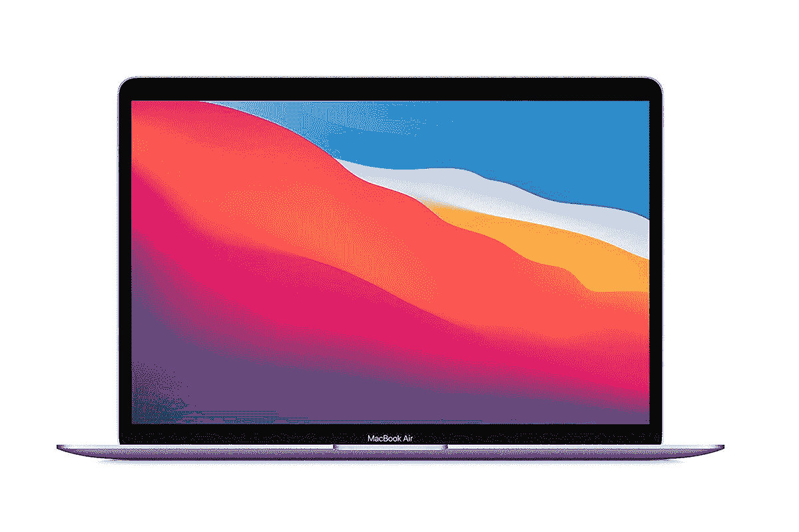

# 装有 M1 芯片的苹果 MacBook Air 大幅打折 200 美元

> 原文：<https://www.xda-developers.com/macbook-air-with-m1-gets-steep-200-discount/>

自从 MacBook Air 首次发布以来，已经过去了几年时间，但苹果仍然将采用 M1 芯片的 MacBook Air 保留在其产品线中，因为它提供了大量的功能，而且价格合理。虽然这款笔记本电脑的起价通常为 999 美元，但最近打折了，比零售价低了 200 美元。

MacBook Air 采用了苹果 M1 芯片，将 CPU 和 GPU 结合在一起。这不仅使它能够产生很大的功率，而且效率也很高。如果你认为最后一部分是夸张的，那你就错了，因为 MacBook Air 一次充电可以提供长达 18 小时的电池寿命。除了一个电源芯片，你还可以获得一个漂亮的 13.3 英寸显示屏 Retina 显示屏，分辨率为 2560 x 1600，因此颜色流行和文本是 razer sharp。

该笔记本电脑还具有足够的安全性，依靠触控 ID 传感器可以用来解锁笔记本电脑，购物，登录帐户等。你还会得到一个 3.5 毫米耳机插孔，两个雷电 3 端口，可用于充电和数据传输。基本型号将配备 8GB 内存和 256GB 内部存储。

如果有兴趣，你可以使用下面的链接购买苹果 MacBook Air。这款笔记本电脑的售价应该为 799 美元，并将有三种颜色可供选择:太空灰、银色和金色。如果你没有看到折扣价，这要么意味着亚马逊已经缺货，要么这笔交易不再可用。

对于那些寻求类似的便携性但功能更强的人来说，最好看看采用 M2 处理器的 MacBook Air。在我们的评论中，我们给了它很高的评价，它的价格比 M1 的零售价高一点点。无论你选择哪一款，如果你追求的是便携性和性能，MacBook Air 绝对不会错。如果你是一个 Windows 爱好者，一定要看看[我们的指南](https://www.xda-developers.com/best-lightweight-laptops/)中列出的一些最佳选项。

 <picture></picture> 

Apple MacBook Air (2020)

##### 苹果 MacBook Air (2020 年)

MacBook Air (2020)由苹果强大的 M1 芯片组驱动。它有三种高级表面可供选择，包括太空灰、银色和金色。基本型号包含 8GB 内存和 256GB 固态硬盘。

* * *

**来源** : [亚马逊](https://www.amazon.com/Apple-MacBook-13-inch-256GB-Storage/dp/B08N5LNQCX/?tag=xda-4as7brp-20&ascsubtag=UUxdaUeUpU1000052&asc_refurl=https%3A%2F%2Fwww.xda-developers.com%2Fmacbook-air-with-m1-gets-steep-200-discount%2F&asc_campaign=Affiliate)