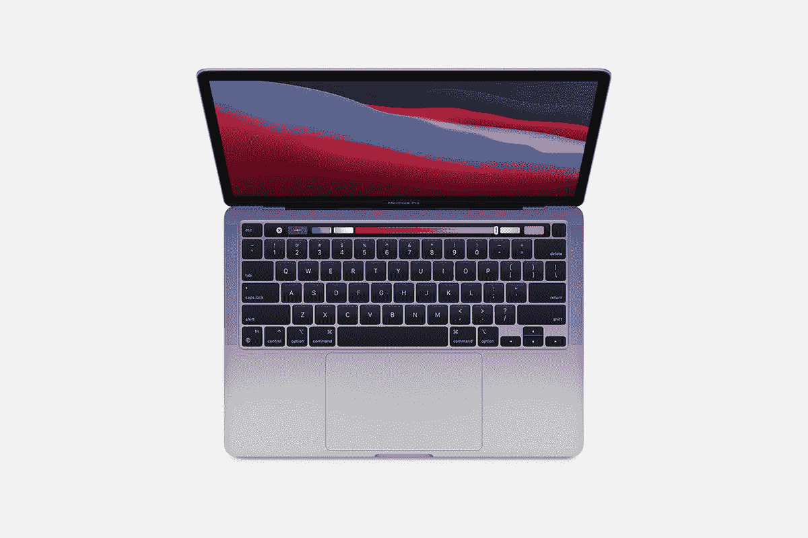

# MacBook Pro 13 (2022)适合游戏吗？

> 原文：<https://www.xda-developers.com/macbook-pro-13-2022-good-for-gaming/>

像 [MacBook Pro 13 (2022)](https://www.xda-developers.com/macbook-pro-2022/) 这样的笔记本电脑不是为游戏玩家设计的。虽然多年来 Mac 电脑总体上能够玩游戏，但这并不是苹果的主要关注点之一。也不是人们购买当今 T2 最好的苹果电脑的主要关注点。但这并不意味着你不能用 MacBook Pro 玩游戏。不过，向苹果芯片的转移在某些方面让事情变得复杂了。你能获得多少里程也取决于你从哪里得到你的游戏。M2 可以做很多事情，但有时还不够。

## MacBook Pro 13 上的 Steam 游戏(2022)

Steam 是全球最大的游戏商店，并且支持 Mac。Steam 中也有支持 ARM 的游戏，不过 M2 仅限于 64 位。Rosetta 2 也开始发挥作用，允许为 x86 编译的 Steam 游戏在 Apple Silicon Macs 上运行。

你不会得到一个 100%简单的解决方案来玩所有的 Mac 兼容游戏。有些行得通，有些行不通。这就是社区发挥作用的地方。有[编译的维基](https://www.applegamingwiki.com/wiki/M1_compatible_games_master_list)和 [Steam 策展人页面](https://store.steampowered.com/curator/42335871)可以帮助你弄清楚你最喜欢的游戏会玩得有多好。如果你想在 MacBook Pro 13 上玩游戏，这些资源绝对值得收藏。

## Mac 应用商店游戏

支持游戏的最佳途径是通过 Mac App Store 及其 Apple Arcade 部分。在这里你可以找到现成的书籍和一个不错的图书馆的订阅。iOS 开发者也可以将他们的游戏移植到苹果芯片上，所以你也可以在这里找到一些更轻的游戏。

2022 年末发布的 [macOS Ventura](https://www.xda-developers.com/macos-ventura-review/) 也为苹果芯片带来了 Metal 3 图形改进，特别是包括 MetalFX 升级、硬件加速等。这使得《生化危机村》、《无人天空》和《网格传奇》等知名游戏登陆 Mac 应用商店，尽管我们仍在等待后两款游戏在该平台上正式发布。

## 云游戏

云游戏的美妙之处在于你的笔记本电脑的规格并不重要。如果它能解码输入流，你就可以玩游戏了。MacBook Pro 13 (2022)可以访问所有主要的云平台和它们带来的恒星库。

NVIDIA GeForce 现在有一个支持苹果芯片的 Mac 原生客户端。对于拥有大型 Steam 库的游戏玩家来说，这可能是在 Mac 上玩游戏的最佳方式。额外的好处是可以访问 Windows 专用的游戏。Google Stadia 流媒体曾经是一种可能，但现在已经关闭。这仍然让其他人喜欢 Xbox 云游戏，你需要的只是一个浏览器。而且 Xbox 服务确实支持 macOS 上的 Safari。

* * *

最后，如果游戏对你来说很重要，Mac 可能不是你的最佳选择。你应该找一台[最好的游戏笔记本电脑](https://www.xda-developers.com/best-gaming-laptops/)，那里的妥协更少。

然而，如果你正在寻找一台用于专业或创意目的的 Mac 电脑，并希望在一旁玩点游戏，MacBook Pro 13 (2022)是一个可靠的选择。你可能会在 Steam 上遇到一些挫折，但 Mac 应用商店有一些很棒的产品，还会有更多，云肯定可以解决剩下的问题。

 <picture></picture> 

Refurbished MacBook Pro

##### 苹果 MacBook Pro 13 英寸(2022)

13 英寸的 MacBook Pro 配备了苹果的 M2 处理器，与 M1 机型相比，游戏和图像处理性能提高了 39%，同时提供了持久的电池续航时间。使用 Windows PC 玩游戏，你会有更流畅的整体体验，但如果你想找点乐子，MacBook Pro 仍然可以保持自己的体验。