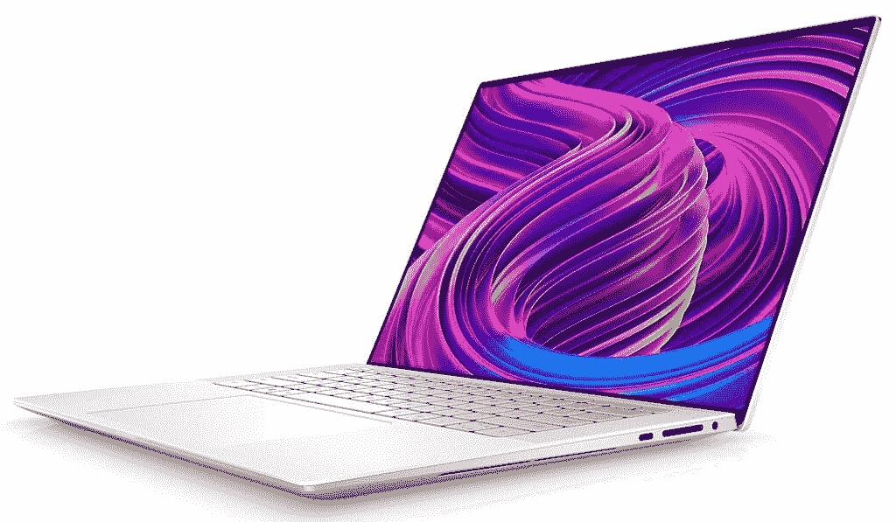
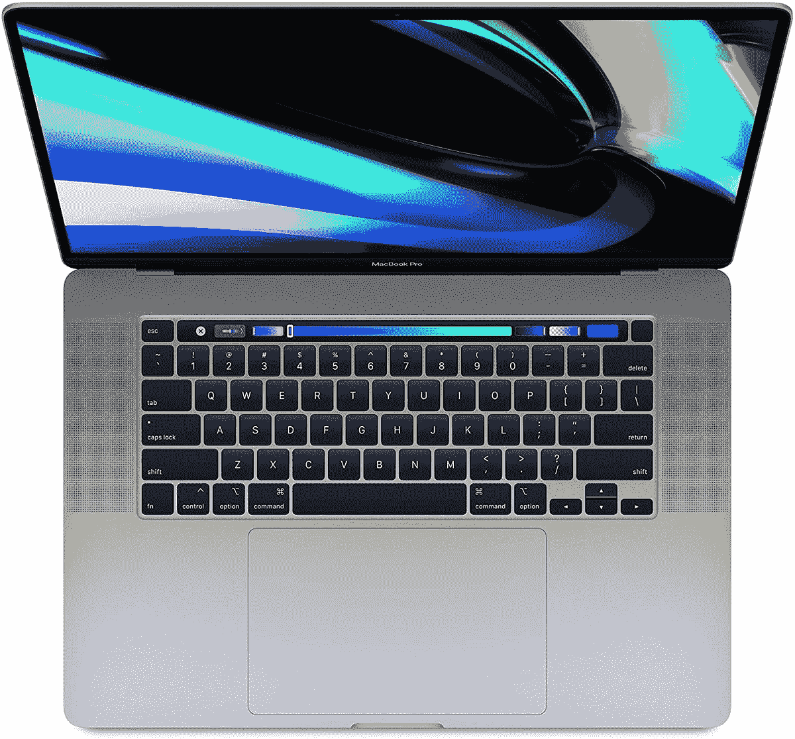

# MacBook Pro 16 vs 戴尔 XPS 15:强大的紧凑型笔记本电脑之战

> 原文：<https://www.xda-developers.com/macbook-pro-16-vs-dell-xps-15/>

当您在寻找一台能够处理视频编辑和内容创作等工作的强大笔记本电脑时，您可能会遇到几个选项。戴尔 XPS 15 和 MacBook Pro 16 英寸都是非常强大的笔记本电脑，能够很好地处理这种工作负载。但是你应该选择哪一个呢？我们比较了这两款产品，以帮助您做出决定，但是如果您现在想要一款，您可能会想要戴尔 XPS 15。

那是因为 MacBook Pro 16 英寸已经快两年没有刷新了，所以到现在它的规格已经有点过时了。然而，随着苹果将更多的 Mac 产品线转移到苹果芯片，这种情况可能很快就会改变。但是让我们比较一下我们现在拥有的。

## 戴尔 XPS 15 与 MacBook Pro 16:规格

让我们从比较每台笔记本电脑的技术规格开始。戴尔 XPS 15 和 MacBook Pro 16 英寸都是高性能的机器，但也有一些很大的差异，如上所述。

|  | 

戴尔 XPS 17

 | 

MacBook Pro 16 英寸

 |
| --- | --- | --- |
| **操作系统** | 

*   Windows 10 主页
*   Windows 10 专业版

可升级到 Windows 11 |  |
| **处理器** | 

*   英特尔酷睿 i5-11400H(最高 4.5GHz，6 核)
*   英特尔酷睿 i7-11800H(最高 4.8GHz，8 核)
*   英特尔酷睿 i9-11900H(最高 4.9GHz，8 核)

 | 

*   英特尔酷睿 i7-9750H(最高 4.5GHz，6 核)
*   英特尔酷睿 i9-9880H(最高 4.8GHz，8 核)
*   英特尔酷睿 i9-9980HK(最高 5GHz，8 核)

 |
| **图形** | 

*   英特尔 UHD 显卡
*   NVIDIA GeForce RTX 3050 4GB gddr 6(45W)
*   NVIDIA GeForce RTX 3050 Ti 4GB gddr 6(45W)

 | 

*   英特尔 UHD 显卡 630
*   AMD 镭龙 Pro 5300M (4GB GDDR6)
*   AMD 镭龙 Pro 5500M (4GB GDDR6)
*   AMD 镭龙 Pro 5500M (8GB GDDR6)
*   AMD 镭龙 Pro 5600M (8GB HBM2)

 |
| **撞锤** |  |  |
| **存储** |  |  |
| **显示** | 

*   15.6 英寸，全高清+ (1920 x 1200)，InfinityEdge，防眩光，500 尼特
*   15.6 英寸，3.5K (3456 x 2160)有机发光二极管，InfinityEdge，防眩光，触摸屏，400 尼特，100% DCI-P3
*   15.6 英寸，超高清+ (3840 x 2400)，InfinityEdge，防眩光，触摸屏，100% Adobe RGB，94% DCI-P3，500 尼特

 | 

*   16 英寸，视网膜(3072 x 1920) IPS，真彩色，宽彩色(P3)，500 尼特

 |
| **音频** | 

*   四声道立体声扬声器(两个 2.5 瓦低音扬声器，两个 1.5 瓦高音扬声器)

 | 

*   六个扬声器，宽立体声，杜比全景声

 |
| **网络摄像头** | 

*   2.25 毫米 720p 高清 30fps 红外摄像头

 |  |
| **生物认证** | 

*   Windows Hello 红外摄像机
*   指纹读取器

 |  |
| **电池** | 

*   3 芯 56 瓦时电池
*   6 芯 86 瓦时电池

 |  |
| **端口** | 

*   2 个 Thunderbolt 4(USB C 类)端口
*   1 个 USB 3.2 第二代 C 型
*   SD 读卡器
*   3.5 毫米耳机插孔
*   包含 USB Type-C 至 Type-A 和 HDMI 2.0 适配器

 | 

*   4 个雷电 3(USB C 类)端口(40Gbps)
*   3.5 毫米耳机插孔

 |
| **连通性** | 

*   黑仔 Wi-Fi 6 AX1650 (2x2)，蓝牙 5.1

 |  |
| **颜色** | 

*   铂金银外观+黑色内饰
*   霜冻外观+北极白内饰

 |  |
| **尺寸(WxDxH)** | 13.57 x 9.06 x 0.71 英寸(344.72 x 230.14 x 18 毫米) | 14.09 x 9.68 x 0.64 英寸(357.9 x 245.9 x 16.2 毫米) |
| **重量** | 起始于:

*   3.99 磅(1.81 千克)(非触控，带 56 瓦时电池)
*   4.22 磅(1.92 千克)(非触控，带 86 瓦时电池)
*   4.31 磅(1.96 千克)(有机发光二极管)
*   4.42 磅(2.01 千克)(超高清)

 | 4.3 磅(1.95 千克) |
| **起拍价** | $1,299.99 | $2,399 |

## Windows 还是 macOS？

决定选择戴尔 XPS 15 还是 MacBook Pro 的第一个因素，也可能是最大的因素是操作系统。如果你习惯了 Windows 或 macOS，这可能是你想要坚持使用的。如果你不倾向于任何一方，那么这两个操作系统可以完成许多相同的目标，但有一些大的差异。

一般来说，macOS 有时被认为更容易访问和理解。如果你不精通电脑，这可能是最好的起点。macOS 也受到许多创意专业人士的欢迎，尤其是视频创作者。这在很大程度上要归功于苹果开发的 macOS 专用视频编辑工具 Final Cut Pro。

另一方面，Windows 在如何使用电脑方面给了用户更多的自由，更深入的设置相对容易获得。对于没有经验的用户来说，这可能会令人望而生畏，但这也使它更具可定制性。作为迄今为止最流行的桌面操作系统，Windows 也有很多为其开发的应用程序。几乎任何你想要的程序或应用都会有一个 Windows 版本，但对 Mac 来说就不一定了。虽然苹果有 Final Cut Pro，但 Windows 上仍有许多视频编辑器，如 Adobe Premiere Pro 或 DaVinci Resolve。

然而，正如我们提到的，你很可能已经做出了这个选择。想要坚持自己熟悉的东西是很自然的，这完全没问题。归根结底，重要的是笔记本电脑能满足您的需求。

## 性能:戴尔 XPS 15 拥有更新的硬件

查看规格表，这两款笔记本电脑有几个突出的特点。MacBook Pro 的最新型号于 2019 年末发布，它在 2020 年年中才获得新的 GPU。这意味着 CPU 已经过时好几代了，GPU 也不再是最新的了。在 GeekBench 上看结果，MacBook Pro 中的英特尔酷睿 i9-9980HK 远远落后于戴尔 XPS 17 的酷睿 i7-11800H。这还不包括核心 i9-11900H 选项。

|  | 

英特尔酷睿 i9-9980HK

 | 

英特尔酷睿 i5-11400H

 | 

英特尔酷睿 i7-11800H

 |
| --- | --- | --- | --- |
| 平均 GeekBench 分数(单核/多核) | 1,114 / 6,463 | 1,367 / 5,817 | 1,494 / 8,084 |

不过，GPU 之间的距离并不远，特别是如果你考虑到一些 MacBook Pro 配置中的额外内存。戴尔 XPS 15 内部的 GPU 只有 4GB 的 VRAM，而 MacBook Pro 可以达到 8GB。另外，镭龙 Pro 5600M 拥有 HBM2 内存，而不是 GDDR6。尽管如此，戴尔 XPS 15 内部的处理能力将会更高，这仅仅是因为它更新了很多。值得注意的是，MacBook Pro 16 英寸可能很快就会得到更新。苹果一直在更新其许多设备，以在苹果芯片上运行，MacBook Pro 应该是下一个系列产品之一。

其余规格相当。这两款笔记本电脑都可以配置高达 64GB 的内存，苹果实际上可以让你获得比戴尔更多的存储空间——高达 8TB。戴尔 XPS 15 上可用的 4TB 配置已经很棒了，但如果你不知何故需要更多，MacBook Pro 可以给你双倍的配置。然而，值得注意的是，你可以在戴尔 XPS 17 上自己升级 RAM 和存储，而这在 MacBook Pro 上是不可能的，因为所有东西都焊接在主板上。

 <picture></picture> 

Dell XPS 15 in Arctic White

MacBook Pro 胜出的一个方面是电池尺寸。有了一个 99.9 瓦时的单元，它正好符合你在飞机上可以携带的限制，但这意味着你可以获得相当长的电池寿命，苹果承诺一次充电可达 11 小时。配备 86 瓦时电池的 Dell XPS 15 承诺长达 13 小时 20 分钟，但前提是您选择全高清+面板。如果你选择有机发光二极管模式，你可以获得长达 9 小时 13 分钟，或 8 小时 42 分钟的超高清+面板。

## 显示器和声音:Dell XPS 15 配有有机发光二极管显示器

戴尔 XPS 15 和 MacBook Pro 16 英寸都可以提供出色的显示和声音体验，即使它们不完全在同一水平上。MacBook Pro 很简单——你会得到一个 16 英寸的视网膜显示屏，分辨率为 3072 x 1920，长宽比为 16:10。苹果声称支持“宽颜色(P3)”，所以它也是一个颜色准确的面板。这绝不是一次糟糕的展示。

（...)戴尔 XPS 15 还可以选择升级到 3.5K 有机发光二极管显示屏，看起来非常棒。

相比之下，戴尔 XPS 15 有三个选项可供选择，首先是 15.6 英寸全高清+ (1920 x 1200)显示屏。这款机型并不那么有趣，但戴尔 XPS 15 还可以选择升级到 3.5K (3456 x 2160)有机发光二极管显示屏，看起来非常棒。这不仅比苹果的显示屏更清晰，而且作为 OLED 面板，它拥有令人难以置信的 100，000:1 的对比度，纯黑色和鲜艳的颜色。它覆盖了 100%的 DCI-P3，所以它的颜色也很准确，而且它是一个触摸屏，苹果一直拒绝在 MacBooks 上添加这一点。戴尔还为您提供超高清+ (3840 x 2400) IPS 触摸屏选项，100%覆盖 Adobe RGB。很明显，戴尔提供了卓越的显示器选项，即使基本型号并不出色。

谈到声音，这两款笔记本电脑都很棒，尽管 MacBook Pro 16 英寸可能会提供更好的体验。它有六个扬声器的立体声系统，这在大多数其他笔记本电脑上都找不到。戴尔 XPS 15 有一个四扬声器设置，这仍然非常令人印象深刻，但不完全在同一水平上。

如果我们在谈论 XPS 15 不在同一水平上的事情，我们必须提到网络摄像头。这款笔记本电脑如此紧凑的原因是因为戴尔将边框压缩到尽可能小，这包括设计一个 2.25 毫米的微型摄像头。这确实令人印象深刻，但这并不意味着网络摄像头有任何好处。这是一台 720p 相机，与其他高端笔记本电脑相比，它的质量是出了名的低。与此同时，苹果提供了全高清(1080p)网络摄像头，总体而言，MacBooks 拥有笔记本电脑中最好的网络摄像头。如果你重视视频通话，MacBook Pro 是不二之选。

## 设计和附加功能:戴尔 XPS 15 更小，端口更多

正如您可能预料的那样，Dell XPS 15 是两款笔记本电脑中较小的一款-毕竟，它的屏幕也略小。它更轻、更窄、更高，但比 MacBook Pro 更厚。虽然 Dell XPS 15 在网络摄像头方面做出了一些牺牲，但它仍然拥有大量端口。它配有两个 Thunderbolt 4 端口，一个 USB 3.2 Gen Type-C 端口，一个 SD 读卡器和一个耳机插孔。它还包括一个 USB Type-C 适配器，用于 USB Type-A 和 HDMI 2.0，因此开箱即用，比 MacBook Pro 更通用。

MacBook Pro 有一个额外的功能是 Touch Bar，它可以在功能行通常所在的位置为您提供定制的快捷方式。

MacBook Pro 16 英寸仅包括四个数据速率为 40Gbps 的雷电 3 端口(因此它们本质上与 Thunderbolt 4 相同)，以及一个耳机插孔。Thunderbolt 可以让你使用一个 [Thunderbolt dock](https://www.xda-developers.com/best-thunderbolt-docks/) 连接许多外围设备，但开箱后，MacBook Pro 会给你带来更多限制。

Dell XPS 15 还包括一个指纹识别器和一个用于 Windows Hello 的红外网络摄像头，使您可以更轻松地快速解锁 PC。MacBook Pro 只有触控 ID。MacBook Pro 有一个额外的功能是 Touch Bar，它可以在功能行通常所在的位置为您提供定制的快捷方式。应用程序可以利用这一功能做各种事情，如控制音乐或视频播放或提供快捷方式。

最后，还有长相的问题。MacBook Pro 有银色和太空灰两种选择，后者本质上是更暗的银色。戴尔 XPS 15 也有两种选择，但它更突出一些。一个型号有一个“白金银”的外观——类似于太空灰——但键盘面板采用了黑色碳纤维设计。另一个型号有一个“霜冻”的外观——更像普通的银色——和一个由编织玻璃纤维复合材料制成的“北极白”键盘面板。如果您想要更出众的产品，戴尔 XPS 15 可能是您的不二之选。

## 结果

经历了所有这些之后，很明显，Dell XPS 15 在大多数方面都是一款卓越的笔记本电脑，但这并不真正令人惊讶。就像我们一开始提到的，MacBook Pro 16 英寸被刷新已经快两年了，所以比较性能真的只能以一种方式结束。当然，Dell XPS 15 的优势不仅仅与年龄有关。有机发光二极管显示器或超高清+面板的选择使它明显更清晰，苹果通常不会在笔记本电脑上提供这么高的分辨率。它还提供了更多开箱即用的端口。

（...)很明显，戴尔 XPS 15 在大多数方面都是一款卓越的笔记本电脑(...)

这并不是说 MacBook Pro 16 英寸无论如何都是一款糟糕的笔记本电脑，但它开始显示出它的年龄。它确实有它的优势，比如更长的电池寿命，更好的网络摄像头，以及 macOS，如果你喜欢它胜过 Windows 的话。但即使你确实更喜欢 macOS 设备，你也可能想再等一会儿，看看苹果是否会很快推出新品。我们期待 2021 款 MacBook Pro 会有一些变化。

不管你的选择是什么，你都可以通过下面的链接购买这两款笔记本电脑。如果你想看看其他选项，我们有[最佳戴尔笔记本电脑](https://www.xda-developers.com/best-dell-laptops/)以及[最佳 MAC 电脑](https://www.xda-developers.com/best-macs/)的列表——而且这些 MAC 电脑中的许多也已经运行苹果芯片。

 <picture></picture> 

Dell XPS 17 9710

##### 戴尔 XPS 15 有机发光二极管

Dell XPS 15 配备第 11 代英特尔酷睿处理器、NVIDIA GeForce RTX 显卡和有机发光二极管显示器，是当今您可以买到的最好的笔记本电脑之一，尤其是如果您是内容创作者的话。

 <picture></picture> 

MacBook Pro 16

##### 苹果 MacBook Pro 16 英寸(2019)

MacBook Pro 16 英寸是苹果最强大的笔记本电脑之一，即使硬件需要更新。它有一个清晰的视网膜显示屏，长时间的电池续航时间，足够你在上面做任何事情。