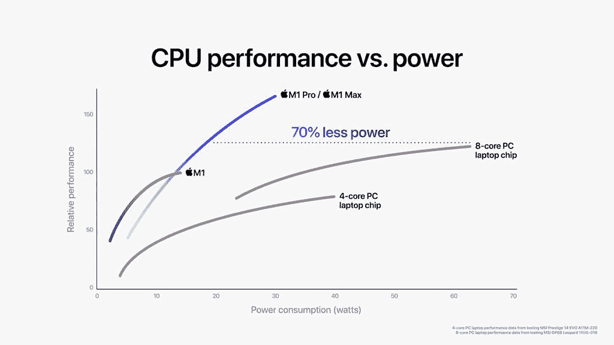
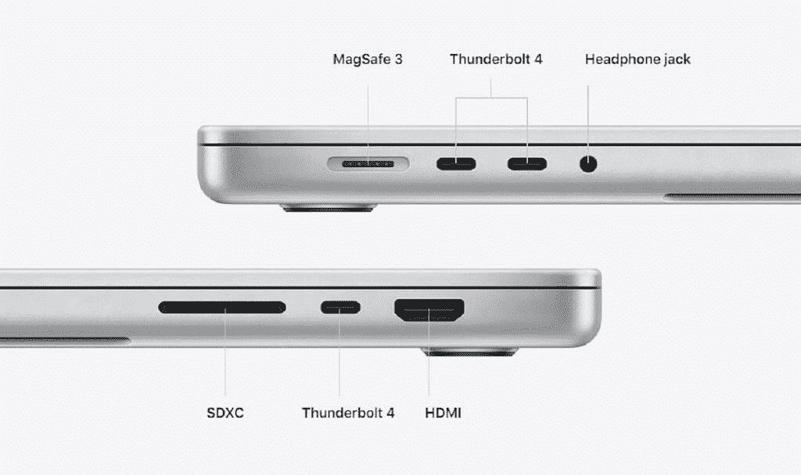

# MacBook Pro 16 vs LG gram 17:你应该买哪一款笔记本电脑？

> 原文：<https://www.xda-developers.com/macbook-pro-16-vs-lg-gram-17/>

苹果公司最近推出了 2021 年的 MacBook Pro，这一消息引起了轰动。MacBook Pro 由新的苹果 M1 Pro 或 M1 Max 芯片组驱动，是一款非常强大的笔记本电脑，最重要的是，它非常节能，并带回了用户一直渴望的经典端口。这无疑是近年来 T2 最好的苹果电脑之一，它让许多 Windows 笔记本电脑物有所值。在本文中，我们将对新款 MacBook Pro 16 英寸机型和 LG gram 17 进行比较，看看两者的表现如何。

不得不说，这些是完全不同的笔记本电脑，它们显然是为不同的受众设计的。虽然它们都可以被视为专业笔记本电脑，但它们有着非常不同的优势和劣势，以至于它们几乎不会相互竞争。让我们从规格开始，看看这是为什么。

## MacBook Pro 16 vs LG gram 17:规格

|  | 

MacBook Pro 16

 | 

LG gram 17

 |
| --- | --- | --- |
| **处理器** | 

*   苹果 M1 专业版(未知时钟速度，10 核)
*   苹果 M1 Max(未知时钟速度，10 核)

 | 

*   英特尔酷睿 i5-1135G7(最高 4.2GHz，四核)
*   英特尔酷睿 i7-1165G7(最高 4.6GHz，四核)

 |
| **图形** | 

*   16 核 GPU (M1 专业版)
*   24 核 GPU (M1 最大)
*   32 核 GPU (M1 最大)

 |  |
| **撞锤** | 

*   16GB(仅限 M1 专业版)
*   32GB
*   64GB(仅限 M1 最大值)

 |  |
| **存储** |  |  |
| **显示** | 

*   16.2 英寸，3456 x 2234 分辨率，宽彩色(P3)，真实色调，120 赫兹，1000 尼特

 | 

*   16 英寸四核高清+ (2560 x 1600) IPS，99% DCI-P3，60Hz

 |
| **音频** | 

*   六扬声器立体声，带力消除低音扬声器，杜比 Atmos

 | 

*   带智能放大器的双 2W 立体声扬声器

 |
| **网络摄像头** | 

*   1080p 前置网络摄像头

 |  |
| **生物特征安全** |  | 

*   电源按钮中的指纹识别器

 |
| **电池** | 

*   99.8 瓦时，长达 21 小时的 Apple TV 电影播放

 | 

*   80 瓦时电池，长达 19.5 小时(MobileMark 2014)

 |
| **端口** | 

*   3 个雷电 4 端口
*   高清晰度多媒体接口
*   MagSafe 3 充电端口
*   SD 读卡器
*   3.5 毫米耳机插孔

 | 

*   2 个 Thunderbolt 4(USB C 类)端口
*   2 个 USB 3.2 第 1 代 A 类端口
*   高清晰度多媒体接口
*   SD 读卡器
*   3.5 毫米耳机插孔

 |
| **连通性** |  | 

*   英特尔 Wi-Fi 6 AX201 (2x2)，蓝牙 5.1

 |
| **颜色** |  |  |
| **尺寸(WxDxH)** | 14.01 x 9.77 x 0.66 英寸(355.7 x 248.1 x 16.8 毫米) | 14.97 x 10.24 x 0.7 英寸(380.2 x 260.1 x 17.8 毫米) |
| **重量** |  |  |
| **起始价格** | $2,499.99 |  $1,399.99 |

很快，你可能会发现这两台笔记本电脑有多么不同，但我们将在以后进一步探讨。

## Windows 还是 macOS？

在我们深入了解每台笔记本电脑的规格之前，有必要谈谈这两台笔记本电脑运行的操作系统。正如你所料，MacBook Pro 运行的是苹果的 macOS 操作系统，特别是新推出的 [macOS Monterey](https://www.xda-developers.com/macos-monterey-review-the-calm-after-big-sur/) 。如果你是新手，一些用户更喜欢 macOS，因为它比 Windows 更容易理解和学习。但通常使 macOS 成为许多用户首选的操作系统是内容创建，具体来说是由苹果公司开发和销售的 Final Cut Pro。

另一方面，LG gram 运行 Windows 10，你可以免费升级到 [Windows 11](https://www.xda-developers.com/windows-11/) 。使用 Windows 也有很大的优势。这是一个更受欢迎的操作系统，正因为如此，应用程序支持在大多数领域都更加强大。对于小众应用或非常注重业务的应用来说尤其如此。最重要的是，虽然学习起来可能有点难，但如果你是超级用户，Windows 会给你更多的选项来使用一些高级工具。

没有哪一个操作系统一定比另一个更好，但是有充分的理由选择哪一个。说实话，你可能已经有了偏好，这也将决定你更喜欢哪种笔记本电脑。

## 性能:MacBook Pro 要强大得多

现在，让我们更深入地探讨 MacBook Pro 16 英寸和 LG gram 17 在各个方面的对比，从性能开始。这是一个很难公平竞争的领域，至少基于苹果的声明。

正如我们提到的，MacBook Pro 由苹果 M1 Pro 和 M1 Max 驱动。这两种处理器具有相同的 CPU，在演示期间，苹果公司将它们的性能与两种基于英特尔的处理器进行了比较，包括一种 4 核笔记本电脑 CPU。这特别是指微星 Prestige 14 Evo 中的英特尔酷睿 i7-1185G7，你可以看到苹果 M1 Pro/Max 的峰值性能是英特尔芯片的两倍多，而功耗更低。现在，LG gram 17 不是由英特尔酷睿 i7-1185G7 驱动的，而是由稍慢的酷睿 i7-1165G7 驱动的。这意味着性能差距可能会更大，尽管差异不应该太大。

 <picture></picture> 

Image: Apple

对于图形来说，没有太多的直接比较，但苹果的声明留给想象的空间很少。在这种情况下，苹果 M1 Max 比 M1 Pro 更强大，苹果将 M1 Mac 比作 Razer Blade 15 Advanced 中的 NVIDIA GeForce RTX 3080 笔记本电脑 GPU 的功率(功率为 105W)。M1 Max 内部的 GPU 提供了类似的性能水平，而功耗却降低了 40%，这令人印象深刻。LG gram 17 使用了英特尔的集成 Iris Xe 显卡，性能远远达不到同一水平。在这方面，MacBook Pro 将把 LG gram 17 远远甩在身后。

尽管性能领先，但 MacBook Pro 也比 LG gram 17 更省电。苹果声称观看 Apple TV 视频内容的电池寿命高达 21 小时，而 LG 声称使用 MobileMark 2014 测试的 gram 17 电池寿命高达 19.5 小时。当然，这将始终取决于您的使用情况，但 MacBook Pro 尽管功能更强大，但前景看好。

> MacBook Pro 拥有比 LG gram 17 更多的内存和存储空间。

MacBook Pro 在其他领域也领先。它配备了高达 64GB 的统一内存，CPU 和 GPU 都可以平等地访问。与此同时，LG gram 17 可以配置高达 32GB 的内存，但它不是那么集成。这两款笔记本电脑都将内存焊接在主板上，因此您以后无法升级其中任何一款。在存储方面，你可以在 MacBook Pro 上获得高达 8TB 的存储空间，在 LG gram 17 上获得 2TB 的存储空间，但后者使用 M.2 SSD 插槽，这意味着如果你想的话，你可以在技术上自行升级。

## MacBook Pro 16 英寸 vs LG gram 17:显示屏

转移到屏幕上，MacBook Pro 继续其统治地位，这在很大程度上要归功于今年型号中添加的 Liquid Retina XDR。这是苹果公司在新款 iPad Pro 和现在的 MacBook Pro 中使用的新型迷你 LED 面板的营销名称。使用 mini-LED 技术意味着 MacBook Pro 有数百个调光区，能够专门为每个调光区调节背光。它不像 OLED 面板那样精确，但它仍然提供了惊人的 1，000，000:1 对比度，并且它应该在许多方面提供与有机发光二极管显示器相似的鲜艳颜色和真正的黑色。

这也是一个非常清晰的显示器，分辨率为 3456 x 2234，离 4K 不远，并且采用了大多数 MAC 电脑典型的 16:10 纵横比。最重要的是，MacBook Pro 还具有 Pro Motion，这意味着它支持高达 120Hz 的刷新率。当不需要高刷新率时，显示器会动态调整刷新率以使动画更流畅并节省电池。

LG gram 17 的显示屏也很棒，但它没有 MacBook Pro 的花哨功能。这是一个 17 英寸的面板，具有 Quad HD+ (2560 x 1600)分辨率，这意味着它也有 16:10 的纵横比。然而，它不太清晰，此外，它有 60Hz 的刷新率，是典型的 IPS 面板，所以没有什么太突出的。它仍然是一个很棒的屏幕，但你不能否认 MacBook Pro 上的屏幕更好。

 <picture></picture> 

LG Gram 17 (17Z90P)

不过，有一个领域可能会对 LG 有利，那就是网络摄像头。与 MacBook Pro 的新 1080p 摄像头相比，LG gram 17 的网络摄像头实际上更差，为 720p。事情是这样的，为了容纳新的 1080p 摄像头，苹果从其 iPhone 设计中得到启示，在显示屏上增加了一个凹槽。虽然更好的网络摄像头质量当然是受欢迎的，但在笔记本电脑屏幕上有一个缺口肯定很奇怪，这可能会让一些用户离开。

> 苹果使用的六扬声器立体声系统是所有笔记本电脑中最好的之一。

回到苹果的霸主地位，提到音频很重要。LG gram 有双立体声扬声器，这是许多 Windows 笔记本电脑的常见设置。然而，苹果几年来一直在使用强大的六扬声器系统，它的表现比几乎所有 Windows 笔记本电脑都要好。该公司表示，今年其扬声器甚至更好，因此这是 MacBook Pro 获胜的另一个领域。

## 设计和端口:LG gram 17 真正便携

到目前为止，这种比较有些片面，MacBook Pro 的性能要好得多，显示屏也更好。但设计是 LG gram 17 具有一些关键优势的一个领域，这可能会使它成为这两款笔记本电脑中你最喜欢的一款。这两款都是翻盖式笔记本电脑，没有什么花哨的功能。

然而，LG gram 17 以特别轻而闻名，这就是 gram 品牌的全部。重量为 2.98 磅，是目前最轻的 17 英寸笔记本电脑之一。甚至更小的笔记本电脑通常比这更重。作为一台 17 英寸的笔记本电脑，gram 17 自然在几乎所有维度上都更大，但如果你把它放在背包里，它将非常容易整天随身携带。相比之下，MacBook Pro 的起始重量为 4.7 磅，这是一个明显的差异，你在携带笔记本电脑一段时间后会感觉到它在你的背上。

LG gram 在外观上也更有意思。MacBook Pro 有银色和太空灰两种颜色，实际上只是不同色调的银色。LG gram 也有一些银色型号，但如果你想要更独特的东西，你可以选择黑色或白色。具体来说，白色真的能比其他大多数笔记本电脑更突出，感觉更活泼。

> LG gram 非常轻便，非常适合携带。

至于端口，这是一个平衡的搭配，感谢苹果终于带回了 MacBooks 几年来一直缺失的经典端口。MacBook Pro 有三个 [Thunderbolt 4](https://www.xda-developers.com/best-thunderbolt-docks/) 端口、HDMI、SD 读卡器、耳机插孔和 MagSafe 充电连接器。这是一个磁性连接器，所以当你拉电缆时，它就会脱落，而不会拖着你的笔记本电脑。

 <picture></picture> 

MacBook Pro ports

与此同时，LG gram 17 有两个 Thunderbolt 4 端口、两个 USB Type-A 端口、HDMI、microSD 读卡器和耳机插孔。如果你使用许多仍然使用该连接器的外设，包括 USB Type-A 是很好的，这是 gram 17 的潜在优势。LG gram 17 的另一个优势是它的键盘上有一个完整的数字键盘，如果你经常在 PC 上处理数字，这可能会很有用。

## 结果

如果你在 MacBook Pro 16 英寸和 LG gram 17 之间挣扎，我们会说你的选择非常明确。是的，这是两台非常强大的笔记本电脑，如果您主要是浏览网页、撰写文档等，这两台电脑都可以满足您的需求。

但如果你是一名内容创作者，无论是视频、照片还是 3D 渲染，MacBook Pro 在性能方面都远远领先于 LG gram 17。你肯定会想走那条路。此外，它的显示屏非常棒，非常适合内容创作。

另一方面，如果你不需要创建那种内容，并且你想要一些可以带着去学校或工作的东西，LG gram 17 是迄今为止最合适的选择。它是同尺寸的笔记本电脑中难以置信的轻，比 MacBook Pro 轻得多，尽管它的物理尺寸更大。

这就归结为:您是需要高资源任务的最高性能，还是想要一种可以随时随地轻松完成要求较低的任务的产品？如果你能回答这个问题，你就已经知道该选择什么了。

你可以从下面的链接购买任何一款笔记本电脑。如果你选择了 MacBook Pro，并且想要保护它，我们有一个 MacBook Pro 的[最佳案例列表，你可能想看看。](https://www.xda-developers.com/best-macbook-pro-cases/)

 <picture></picture> 

MacBook Pro 16

##### 苹果 MacBook Pro 16 英寸(2021)

由于采用了 M1 Pro 和 M1 Max 芯片组，MacBook Pro 是一款功能强大的笔记本电脑，比任何 Windows 超极本都强大得多。

 <picture></picture> 

LG gram 17

##### LG Gram 17

LG gram 17 是一款超轻的 17 英寸笔记本电脑，具有高端规格和出色的电池续航时间。