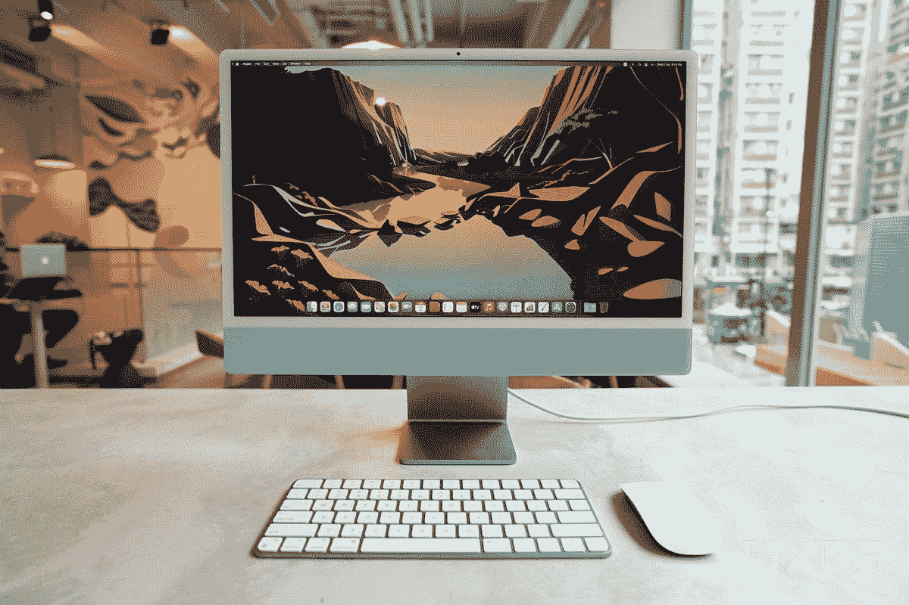

# 苹果 MacBook Pro (2021) vs iMac:该买哪个？

> 原文：<https://www.xda-developers.com/macbook-pro-2021-vs-imac-m1/>

随着新的 [MacBook Pro (2021)](https://www.xda-developers.com/macbook-pro-2021/) 笔记本电脑的发布，苹果现在拥有了一系列采用其内部芯片的产品。M1 驱动的 iMac 提供了强大的 Mac 体验，新的 MacBook Pros 是便携式选择，可以肯定地说，每个人都有适合自己的东西。在本文中，我们将把采用 M1 技术的 iMac 台式机和新款 MacBook Pro 笔记本电脑进行对比，看看在 MacBook Pro 和 iMac 的对决中谁更胜一筹？

**浏览本文:**

## 苹果 MacBook Pro vs iMac:规格

| 

规格

 | 

MacBook Pro 14 (2021)

 | 

MacBook Pro 16 (2021)

 | 

M1 iMac 2021

 |
| --- | --- | --- | --- |
| 处理器: | 

*   苹果 M1 Pro (8 核 CPU + 16 核神经引擎)
*   M1 Pro (10 核 CPU + 16 核神经引擎)
*   M1 Max (10 核 CPU + 16 核神经引擎)

 | 

*   苹果 M1 Pro (8 核 CPU + 16 核神经引擎)
*   M1 Pro (10 核 CPU + 16 核神经引擎)
*   M1 Max (10 核 CPU + 16 核神经引擎)

 | 

*   苹果 M1 (8 核 CPU + 16 核神经引擎)

 |
| 图形: | 

*   14 核 GPU
*   16 核 GPU
*   24 核 GPU
*   32 核 GPU

 | 

*   16 核 GPU
*   24 核 GPU
*   32 核 GPU

 |  |
| 统一内存: | 

*   16GB
*   32GB
*   64GB(仅适用于 M1 Max 芯片)

 | 

*   16GB
*   32GB
*   64GB(仅适用于 M1 Max 芯片)

 |  |
| 存储(固态硬盘): |  |  |  |
| 显示: | 

*   14.2 英寸 Liquid Retina XDR 显示屏，自适应刷新率，提升技术高达 120Hz，3024 x 1964，1000 尼特，True Tone，DCI-P3

 | 

*   16.2 英寸 Liquid Retina XDR 显示屏，自适应刷新率，提升技术高达 120Hz，3456 x 2234，1000 尼特，True Tone，DCI-P3

 | 

*   24 英寸 4.5K 视网膜显示屏，4480 x 2520，500 尼特，True Tone，DCI-P3

 |
| 网络摄像头: |  |  |  |
| 电池: | 

*   69.6 瓦时电池
*   长达 17 小时的 Apple TV 应用程序电影播放
*   96W USB-C 电源适配器(67W USB-C 电源适配器，带 M1 Pro 8 核 CPU SKU)

 | 

*   99.6 瓦时电池
*   长达 21 小时的 Apple TV 应用程序电影播放
*   140 瓦 USB-C 电源适配器

 | 

*   需要电源才能运行

 |
| 端口: | 

*   三个 Thunderbolt 4/USB 4 端口(40Gbps、电源传输、显示端口)
*   SDXC 卡槽
*   HDMI 端口
*   MagSafe 3 端口
*   3.5 毫米耳机插孔

 | 

*   三个 Thunderbolt 4/USB 4 端口(40Gbps、电源传输、显示端口)
*   SDXC 卡槽
*   HDMI 端口
*   MagSafe 3 端口
*   3.5 毫米耳机插孔

 | 

*   两个 Thunderbolt 4/USB 4 端口(40Gbps，显示端口)
*   3.5 毫米耳机插孔
*   两个 USB 3 端口(可配置)
*   千兆以太网(可配置)

 |
| 连通性: | 

*   Wi-Fi 6(兼容 802.11a/b/g/n/ac)
*   蓝牙 5.0

 | 

*   Wi-Fi 6(兼容 802.11a/b/g/n/ac)
*   蓝牙 5.0

 | 

*   Wi-Fi 6(兼容 802.11a/b/g/n/ac)
*   蓝牙 5.0

 |
| 大小(宽高比): | 

*   12.31 x 8.71 x 0.61 英寸

 | 

*   14.01 x 9.77 x 0.66 英寸

 |  |
| 重量: |  |  |  |
| 颜色: |  |  | 

*   蓝色、绿色、粉色、银色、黄色、橙色、紫色

 |
| 起价: |  |  |  |

## MacBook Pro 与 iMac:设计和端口

iMac 和 MacBook Pro 最明显的区别就是设计。MacBook Pro 提供了更多的便携性，而 iMac 是一款为固定工作环境设计的一体化台式机。这两款设备都提供了足够的性能，但购买决定在很大程度上取决于您的使用案例。也就是说，苹果在每种情况下都做出了一些值得强调的设计改进。

 <picture></picture> 

MacBook Pro (2021)

iMac 2021 和 MacBook Pro (2021)笔记本对市场来说都是相对较新的产品，它们带来了新鲜的新设计，使它们从现有的型号中脱颖而出。新款 MacBook Pro 笔记本采用了新的方形设计，边缘平整。现在，机箱容纳了更大的显示屏和更多的端口，苹果在底部增加了小支脚，以增加高度。新的 MacBook Pro 2021 笔记本仍然有一个适当大的触控板和新的魔法键盘。扬声器也位于键盘甲板上，苹果正在为新的 MacBook Pro 型号使用新的六扬声器音响系统，支持空间音频。最小和工业外观的铝底盘仍然给它一个熟悉的外观，我们在过去几年已经习惯了。

 <picture></picture> 

2021 iMac in blue with color-matched Magic Keyboard and Magic Mouse.

然而，2021 款 iMac 接受了自上而下的重新设计，配备了新的显示屏和轻薄的外形。主机(不包括支架)厚度仅为 11.5 毫米，这意味着它比新款 MacBook Pro 笔记本电脑更薄。这是一款非常轻薄的一体机，但它比 MacBook Pro 占用的空间更大。新款 iMac 2021 还推出了多种新颜色，这意味着你不必再坚持使用简单的银色 iMac。你可以选择蓝色、绿色、粉色、银色、黄色、橙色和紫色。值得注意的是，你还会得到一个配套的魔法键盘和鼠标。

苹果的 macOS 有很多触摸手势，包括双指滚动、从左向右滑动以在桌面之间切换等。众所周知，使用触控板效果更好。MacBook Pros 有一个巨大的 Force Touch 触控板，但 Magic Trackpad 2 是 iMac 的 50 美元升级版，因为你只有 Magic Mouse 2 作为标准配置。iMac 和 MacBook Pro 的显示屏上方都有一个 1080p FaceTime 摄像头。由于凹槽，这一点在新款 MacBook Pro 机型上更加突出。这个设计并不是每个人都喜欢，但苹果公司表示，它不会影响全屏观看或使用创造性的应用程序。

就端口而言，与之前的迭代相比，iMac 2021 型号上的选择明显减少。基本型号的 iMac 只配有两个 Thunderbolt 4 端口、一个 3.5 毫米耳机插孔和一个磁性电源连接器端口。带有两个额外 USB 3 端口和一个千兆以太网的型号价格更高。相比较而言，新款 MacBook Pro 机型的端口选择更好。所有新型号都带有两个 Thunderbolt 4 端口、一个 HDMI 端口、一个 SDXC 读卡器和一个 MagSafe 3 端口。

## 显示器:视网膜与液态视网膜 XDR 显示器

iMac 2021 采用 24 英寸 4.5K 视网膜显示屏，分辨率为 4480 x 2520。它不如苹果的专业显示器 XDR，但它拥有 2230 万像素，P3 宽色域和超过 10 亿种颜色。据苹果公司称，iMac 2021 的显示屏也达到了 500 尼特的峰值亮度。它的三面都有细长的边框，尽管下巴条仍然很突出，因为它隐藏了下面新的六扬声器音响系统。就尺寸而言，24 英寸的 iMac 2021 型号介于 21.5 英寸和 27 英寸的 iMac 型号之间。

MacBook Pro 2021 型号在苹果目前的笔记本阵容中拥有最好的显示屏。根据不同的型号，您可以选择 14.2 英寸(3024 x 1964)或 16.2 英寸(3456 x 2234)的迷你 LED 背光显示屏。这些面板具有 1000 尼特(峰值 1600 尼特)的持续亮度，并且它们还支持高达 120Hz 的自适应刷新率。这两款显示器还采用了苹果的 True Tone 技术，可以自动调整色温，以匹配您的环境。

唯一真正的缺点是，至少对一些人来说，新款 MacBook Pro 机型增加了凹槽。在与 iMac 2021 进行比较时，我们认为所有这些系统都为创意专业人士提供了很好的展示。iMac 碰巧拥有更大的屏幕尺寸和更大的外形。

## 性能:iMac 需要 M1 Pro/ Max 的待遇

新款 MacBook Pro 2021 笔记本电脑的一个显著特点是其 M1 Pro/Max 芯片。与去年的 M1 和其他苹果计算设备上的旧英特尔芯片相比，新芯片的性能有了显著提高。您可以将新款 MacBook Pros 配置为最高 10 核 CPU 和 32 核 GPU。苹果还在视频编辑部门做了一些有价值的改进，增加了多个视频引擎。更不用说，这些新笔记本还可以拥有高达 64GB 的统一内存，这是对 M1 芯片的又一次升级。

iMac 2021 型号也不逊色。M1 仍然是一个神奇的芯片，有许多 CPU 和 GPU 核心可以灵活使用。新款 iMac 与去年搭载英特尔酷睿 i9 处理器的 16 英寸 MacBook Pro 并驾齐驱。因此，可以肯定地说，它将非常有竞争力，如果不是主导新的 MacBook Pros 的话。也就是说，我们向那些希望获得最佳性能的人推荐新的 MacBook Pro 2021 型号，至少在明年 iMacs 获得 M1 Pro/Max 待遇之前。你可以看看我们的 [M1 专业与 M1 最大芯片比较](https://www.xda-developers.com/deep-dive-apple-m1-pro-max/)，看看哪一个是更好的选择。

## 苹果 MacBook Pro vs iMac:最终想法

除了外形之外，这两款设备总体上提供了非常相似的用户体验。新的 [macOS Monterey](https://www.xda-developers.com/macos-monterey-review-the-calm-after-big-sur/) 是 macOS Big Sur 的一个不错的软件改进，将在两台机器上运行良好。iMac 2021 是一款功能强大的一体机，适合那些希望在家中办公的人。另一方面，MacBook Pro 2021 型号仍然是任何寻求 Mac 便携性的人的绝佳和更强大的选择。两款设备之间的日常体验基本上是相同的，但 MacBook Pros 更适合创造性工作负载，这要归功于改进的 GPU 性能。

我们也鼓励你看看我们收集的[最佳 MAC 电脑](https://www.xda-developers.com/best-macs/)，以确保你错过了其他苹果计算设备。如果你最终选择了 MacBook Pro，那么你可能也想看看我们的[最佳 MacBook Pro 保护套](https://www.xda-developers.com/best-macbook-pro-cases/)系列。您可以使用下面的链接购买您喜欢的 Apple 设备。

 <picture></picture> 

MacBook Pro 14-inch (2021)

##### 苹果 MacBook Pro 14 (2021)

新的 MacBook Pro (2021)型号是那些寻求强大便携式机器的人的绝佳选择。

 <picture></picture> 

Apple 24-inch iMac (2021)

##### 苹果 iMac (2021 年)

如果你想投资一个固定的在家办公系统，苹果 iMac 2021 是一个很好的选择。