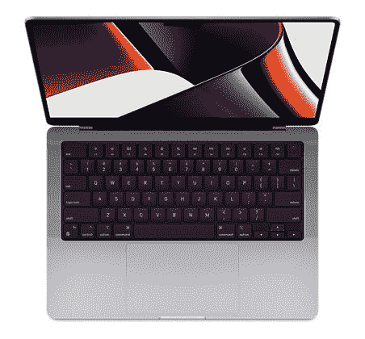
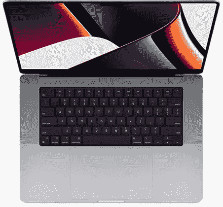
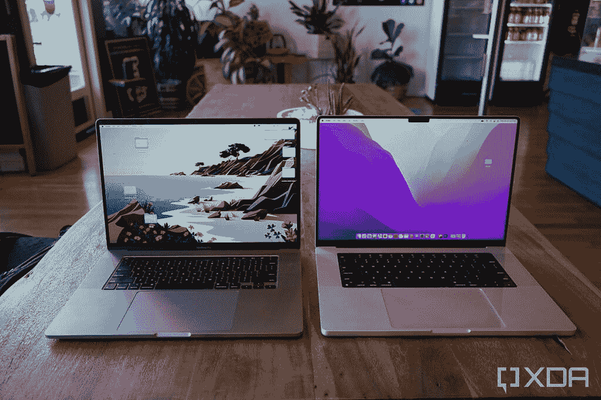
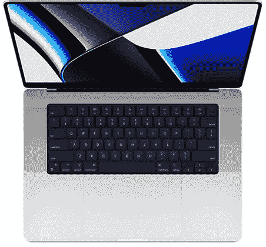
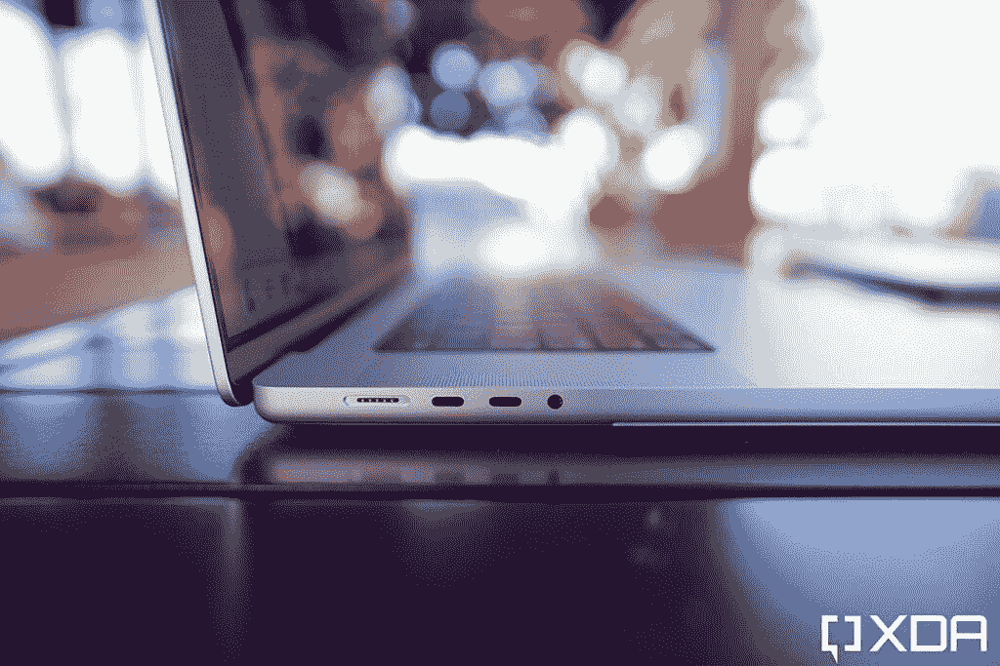

# 苹果 MacBook Pro 14 和 MacBook Pro 16 2021:你需要知道的

> 原文：<https://www.xda-developers.com/macbook-pro-2021/>

在 9 月份推出新的 [iPhone 13](https://www.xda-developers.com/iphone-13/) 系列后，苹果公司宣布了带缺口的 [MacBook Pro 14](https://www.xda-developers.com/apple-macbook-pro-14-launch/) 和 [MacBook Pro 16](https://www.xda-developers.com/apple-macbook-pro-16-launch/) 以及[第三代 AirPods](https://www.xda-developers.com/apple-airpods-3-announced/) 。该公司在 2020 年用其定制的 M1 硅更新了 [MacBook Pro 13 和 MacBook Air](https://www.xda-developers.com/apple-macbook-air-macbook-pro-13-mac-mini-m1-arm-soc/) 。接下来是老大哥 MacBook Pro 16 从英特尔过渡到苹果基于 ARM 的芯片组的时候了。随着 16 英寸机型的更新，苹果还宣布了一款全新的 14 英寸 MacBook Pro。这一举措类似于几年前该品牌用新的 16 英寸版本取代 MacBook Pro 15 的方式。2021 年的 MacBook Pro 14 配备了苹果的 [M1 Pro 或 M1 Max](https://www.xda-developers.com/apple-announces-m1-pro-m1-max-two-new-custom-built-silicon-to-power-the-next-generation-of-macs/) 芯片，并从 2015 年的 MacBook Pro 型号中带回了一些传统端口。那些喜欢经典 MacBook Pro 设计的人仍然可以购买 13 英寸的 MacBook Pro M2 (2022)，该公司在 WWDC22 期间发布了这款产品。

除了性能方面的升级，这两款 MacBook Pro 还拥有更新的屏幕、更新的键盘和更快的充电速度。这最终是专业用户的便携式发电站吗？以下是您需要了解的关于 MacBook Pro 14 和 MacBook Pro 16 的所有信息，从所有型号的规格和价格，到最适合您需求的型号。我们还在底部包含了一个 FAQ 部分，回答了关于这两款新笔记本电脑的一些常见问题。

## 应该买哪款 MacBook Pro (2021)？

MacBook Pro 14 和 MacBook Pro 16 有很多共同点，主要区别在于它们的物理尺寸。顾名思义，MacBook Pro 14 拥有 14.2 英寸的显示屏，而 MacBook Pro 16 拥有更大的 16.2 英寸显示屏。就内部而言，这里是两种型号的规格，让您更好地了解它们的不同之处。

### MacBook Pro 14 和 MacBook Pro 16 (2021):规格

| 

规格

 | 

MacBook Pro 14

 | 

MacBook Pro 16

 |
| --- | --- | --- |
| 尺寸和重量 | 

*   12.3 x 8.7 x 0.6 英寸
*   3.5 磅/1.58 千克

 | 

*   14 x 9.8 x 0.7 英寸
*   4.7 磅/2.13 千克(M1 专业版)
*   4.8 磅/2.18 千克(M1 Max 变型)

 |
| 显示 | 

*   14.2 英寸液态视网膜 XDR
*   3024 x 1964 像素
*   254 PPI
*   迷你 LED
*   120 赫兹促销
*   真实音调
*   16:10 宽高比

 | 

*   16.2 英寸液态视网膜 XDR
*   3456 x 2244 像素
*   254 PPI
*   迷你 LED
*   120 赫兹促销
*   真实音调
*   16:10 宽高比

 |
| 社会学 | 

*   苹果 M1 专业版(8 核 CPU，14 核 GPU)
*   苹果 M1 专业版(10 核 CPU，14 核 GPU)
*   苹果 M1 专业版(10 核 CPU，16 核 GPU)
*   苹果 M1 Max (10 核 CPU，24 核 GPU)
*   苹果 M1 Max (10 核 CPU，32 核 GPU)

 | 

*   苹果 M1 专业版(10 核 CPU，16 核 GPU)
*   苹果 M1 Max (10 核 CPU，24 核 GPU)
*   苹果 M1 Max (10 核 CPU，32 核 GPU)

 |
| RAM 和存储 | 

*   16/32/64GB 内存
*   512GB/1TB/2TB/4TB/8TB 固态硬盘存储

 | 

*   16/32/64GB 内存
*   512GB/1TB/2TB/4TB/8TB 固态硬盘存储

 |
| 港口 | 

*   MagSafe 3
*   高清晰度多媒体接口
*   3.5 毫米插孔
*   SD 卡插槽
*   USB-C Thunderbolt 4 (x3)

 | 

*   MagSafe 3
*   高清晰度多媒体接口
*   3.5 毫米插孔
*   SD 卡插槽
*   USB-C Thunderbolt 4 (x3)

 |
| 电池和充电 | 

*   70 瓦时
*   带基本型号的 67W 充电器
*   10 核 CPU 型号的 96W 充电器

 |  |
| 连通性 | 

*   无线网络 802.11ax 无线网络 6
*   蓝牙 5.0
*   1080p 网络摄像头

 | 

*   无线网络 802.11ax 无线网络 6
*   蓝牙 5.0
*   1080p 网络摄像头

 |
| 颜色；色彩；色调 |  |  |
| 价格 | 起价 1999 美元 | 起价 2499 美元 |

和往常一样，苹果让你配置 MacBook Pro 的内部。这意味着 MacBook Pro 14 和 MacBook Pro 16 可以指定相同的配置。这在早期的英特尔 MAC 电脑上是不可能的。然而，有了苹果的定制硅，你可以选择在任何一台机器上配备 10 核 CPU 和 32 核 GPU 的 M1 Max 芯片。

**[MacBook Pro 16 (2021)回顾:苹果终于用 M1 Max](https://www.xda-developers.com/apple-macbook-pro-2021-m1-max-review/)** 讨回公道

虽然内部结构可能是相同的，但我们可能会看到两台笔记本电脑之间在散热性能方面的差异，因为 MacBook Pro 16 在技术上具有更大的散热表面积。是否有相当大的性能差异，因为这只能确定一旦我们比较这两台机器。否则，这只是个人偏好的问题，你是想要更便携的笔记本电脑还是更大的显示屏和更好的电池续航时间。

如果您的工作流程不需要 M1 Max 或 M1 Pro 在所有 CPU 和 GPU 核心解锁的情况下提供的那种性能，您可以选择基线 MacBook Pro 14，它拥有 M1 Pro 的 8 核 CPU 和 14 核 GPU。这应该是大多数普通用户应该选择的变体，因为它可以轻松处理大多数任务。即使对于视频编辑或编译大型程序等密集型任务，基本型号 MacBook Pro 14 也应该足够了。如果您的工作涉及大量图形处理，如动画、多个视频编辑流，或者如果您希望将显示器输出到两台以上的显示器，您可以选择 M1 Max。

## MacBook Pro 14 和 16:发布日期和定价

MacBook Pro 14 和 MacBook Pro 16 型号于 2021 年 10 月 18 日发布，并于 10 月 26 日开始购买。根据您选择的变型或定制配置，交付日期可能会进一步推迟。至于新的 MacBook Pro 14 和 16 会花你多少钱，这里是所有变体的定价信息-

### MacBook Pro 14:价格

| 

Sl。号码

 | 

MacBook Pro 14 变体

 | 

价格

 |
| --- | --- | --- |
| 1 | MacBook Pro 14 配苹果 M1 Pro (8 核 CPU，14 核 GPU) | [$ 1999](https://adorama.rfvk.net/c/2233363/51926/1036?subId1=UUxdaUeUpU4070&subId2=exda&u=https%3A%2F%2Fwww.adorama.com%2Facmkgp3lla.html) |
| 2 | MacBook Pro 14 配苹果 M1 Pro (10 核 CPU，14 核 GPU) | 【2,199 美元 |
| 3 | MacBook Pro 14 配苹果 M1 Pro (10 核 CPU，16 核 GPU) | [2299 美元](https://www.apple.com/shop/buy-mac/macbook-pro/14-inch) |
| 4 | 苹果 M1 Max (10 核 CPU，24 核 GPU)的 MacBook Pro 14 | [$ 2899](https://www.apple.com/shop/buy-mac/macbook-pro/14-inch) |
| 5 | 苹果 M1 Max (10 核 CPU，32 核 GPU)MacBook Pro 14 | [3099 美元](https://www.apple.com/shop/buy-mac/macbook-pro/14-inch) |

### MacBook Pro 16:价格

| 

Sl。号码

 | 

MacBook Pro 16 变体

 | 

价格

 |
| --- | --- | --- |
| 1 | MacBook Pro 16 配苹果 M1 Pro (10 核 CPU，16 核 GPU) | [2499 美元](https://adorama.rfvk.net/c/2233363/51926/1036?subId1=UUxdaUeUpU4070&subId2=exda&u=https%3A%2F%2Fwww.adorama.com%2Facmk183lla.html) |
| 2 | 苹果 M1 Max (10 核 CPU，24 核 GPU)MacBook Pro 16 | [3099 美元](https://www.apple.com/shop/buy-mac/macbook-pro/16-inch) |
| 3 | 苹果 M1 Max (10 核 CPU，32 核 GPU)MacBook Pro 16 | [3299 美元](https://adorama.rfvk.net/c/2233363/51926/1036?subId1=UUxdaUeUpU4070&subId2=exda&u=https%3A%2F%2Fwww.adorama.com%2Facmk1a3lla.html) |

请注意，提到的价格是针对所有型号的基本 RAM 和存储配置的。所有型号都有 512GB 作为标准基本存储。配备 M1 专业 SoC 的型号在基本型号上有 16GB RAM，可升级到 32GB，而配备 M1 Max 的型号在基本型号上有 32GB RAM，可升级到 64GB。

 <picture></picture> 

MacBook Pro 14

##### 苹果 MacBook Pro 14 (2021)

MacBook Pro 14 配有 M1 Pro 或 M1 Max 芯片、MagSafe 和 120Hz 迷你 LED 显示屏

 <picture></picture> 

MacBook Pro 16

##### 苹果 MacBook Pro 16 英寸(2021)

MacBook Pro 16 配备了 M1 Pro 或 M1 Max 芯片、MagSafe 和更大的 120Hz 迷你 LED 显示屏

## MacBook Pro (2021)有什么新功能？

 <picture></picture> 

2019 MacBook Pro (left); 2021 MacBook Pro (right).

MacBook Pro 14 和 MacBook Pro 16 与上一代 MacBook 相比有了实质性的变化。它们拥有苹果定制的硅片、新的显示屏、广泛的端口选择，以及全面改进的功能。以下是苹果公司宣布的新款 MacBook Pro 电脑的主要变化和改进。这些都是 MacBook Pro 14 和 16 与我们迄今为止看到的旧 MacBook Pro 相区别的新功能和变化。

### 苹果 M1 专业版和 M1 最大硅

2020 年 MacBook Air 和 MacBook Pro 上的 M1 芯片在多个方面都是革命性的。苹果公司制造的基于 ARM 的定制硅将 MacBook Pro 13 的性能提升到了一个全新的水平，同时也大大延长了电池寿命。这是当时最强大的笔记本电脑 SOC 之一，这意味着 M1 的未来迭代只会变得更好。MacBook Pro 14 和 16 正是如此。

苹果宣布推出 M1 Pro 和 M1 Max T1，这两款芯片有了重大改进和新功能。这两个 SOC 可以在新的 MacBook Pro 14 和 MacBook Pro 16 电脑上找到。M1 Pro 有 10 个 CPU 内核，基于 5 纳米制造节点。10 个 CPU 内核分为两个集群，8 个高性能内核和 2 个高能效内核。CPU 最高匹配 16 核 GPU。这是 M1 上 GPU 核心数量的两倍。苹果声称，与 M1 相比，M1 Pro 的 CPU 性能提高了 70%，GPU 性能提高了 2 倍。

M1 Pro 带来的其他一些改进包括支持高达 32GB 的 RAM，而 M1 为 16GB，更高的 200GB/s 带宽，以及 337 亿个晶体管，是 M1 的两倍多。M1 Pro 的另一大改进是支持两个外部显示器，而 2020 年的 M1 只有一个。该芯片具有 ProRes 编解码器专用的加速功能。

如果你认为 M1 Pro 是一个性能怪兽，M1 Max 通过将 GPU 的核心数增加到 32 个而更上一层楼。是的，M1 Max 可以配置 32 个 GPU 核心以及相同的 10 核 CPU。它的体积比 M1 Pro 更大，内置 570 亿个晶体管。这比 M1 Pro 高出 70%，比去年的 M1 高出 3.5 倍。苹果声称，M1 Max 上的 GPU 可以匹配高端独立 GPU 的性能，同时消耗几乎 100W 的低功耗。无论这些说法是真是假，我们只有在拿到运行 M1 Max 的 MacBook Pro 后才能知道。

M1 Max 可以搭配比 M1 Pro 更大的内存。它的最高内存是 64GB，而不是 M1 Pro 的 32GB。M1 Max 上运行的 MacBook Pro 最多可以连接四个显示器，而不是两个外部显示器。这包括三个 6K 分辨率的专业显示器 XDR 和一个 4K 电视。据苹果公司称，M1 Max 是 MacBook 中最强大的芯片。除了功能强大之外，M1 Pro 和 M1 Max 还非常节能。苹果声称 MacBook Pro 16 的电池寿命长达 21 小时，是迄今为止任何笔记本电脑中最好的电池之一。

### MagSafe 和港口

如果你使用的是 2016 年以前的 MacBook，苹果在他们的笔记本电脑上使用了一个专有的充电端口，名为 MagSafe。这和 iPhone 12 在 iPhone 上推出的 MagSafe 不同，但思路差不多。MagSafe 端口与其他端口一起位于旧 MacBooks 的侧面，本质上是磁性的。充电器还有一个 MagSafe 端，如果你把它放得足够近，它会通过磁铁卡在连接器上。

早在 2016 年，当苹果在所有 MacBook 上引入 USB-C 端口时，它就从 MacBook 阵容中淘汰了 MagSafe。除了 USB-A、HDMI 和 SD 读卡器等其他传统端口，苹果还取消了专有的 MagSafe 充电端口，转而通过 USB-C 端口充电。USB-C 更加通用，大多数现代手机(苹果除外)都有 USB-C 端口，这种转换是有意义的。然而，年长的 MacBook 用户似乎非常想念 MagSafe，原因有两个:第一，这很方便，因为你只需将充电器靠近端口，它就会咬合上。第二，它可以防止充电器拖着 MacBook 一起走，以防有人被电线绊倒。

苹果似乎听到了那些用户的声音，用新的 MacBook Pro 14 和 MacBook Pro 16 带回了 MagSafe 3。MagSafe 3 提高了旧 MagSafe 的充电速度，以及苹果在以前的 MacBook 型号上采用的 USB-C 充电解决方案。MacBook Pro 16 现在支持高达 140W 的快充，而 MacBook Pro 14 支持高达 96W 的快充。苹果公司声称，使用这些新的 MagSafe 3 充电器，你可以在短短 30 分钟内将电池充满 50%。

除了 MagSafe，苹果还带回了 2016 年从 MacBook Pro 中移除的其他遗留端口。HDMI 端口和 SD 读卡器也回到了 MacBook Pro。耳机插孔现在可以驱动高阻抗耳机。除此之外，MacBook Pro 14 和 16 上还有三个 Thunderbolt 4 端口。这些端口的加入是新 MacBooks 真正“专业”的原因。苹果还改进了 14 英寸和 16 英寸 MacBook Pros 上的麦克风和扬声器。2016 年 MacBook Pro 机型推出的 Touch Bar 也已被苹果淘汰。它让传统的功能键伴随着触控 ID 回来了。

### 显示

显示屏是 MacBook Pro 获得大幅升级的另一个领域。MacBook Pro 14 和 MacBook Pro 16 现在都有迷你 LED 显示屏。迷你 LED 技术提供了更好的对比度，现在可以达到 1000 尼特的持续亮度和 1600 尼特的峰值亮度。对于笔记本电脑来说，这是非常好的亮度。新的显示面板还支持促销，这意味着它们可以以高达 120 赫兹的频率刷新。我们首先在 iPad Pro 上看到推广，然后是上个月的 iPhone 13 Pro 系列。现在，它已经走向了 MacBook Pro。

苹果还削减了液态视网膜 XDR 显示屏周围的边框。因此，MacBook Pro 16 现在拥有一个 16.2 英寸的显示屏，其外形与旧款 MacBook Pro 16 相似。MacBook Pro 14 是第一次推出，它有 14.2 英寸的显示屏，比 MacBook Pro 13 略大。然而，由于挡板较小，苹果无法将网络摄像头安装到传统位置，这意味着现在 MacBook 上有一个缺口。是的，一个很宽的缺口只是为了放置网络摄像头，其他什么都没有。

这是一个稍有争议的决定，并引发了一场关于这个刻痕是否真的有必要的争论。另一个合理的论点是，如果必须有缺口，苹果可以设法在新的 MacBooks 上提供 Face ID，使认证更容易。但事实并非如此，因为触控 ID 仍然是船上唯一的生物认证。由于 16:10 的长宽比略高，凹口不会占用太多的屏幕空间，因为它只占菜单栏的一小部分。

## MacBook Pro 14 和 16:颜色选项

苹果正在销售 MacBook Pro 14 和 MacBook Pro 16，有两种颜色可供选择——太空灰和银色。你可以挑一个对你来说最好看的，因为外表总是主观的！

 <picture></picture> 

MacBook Pro 16

##### 苹果 MacBook Pro 16 英寸(2021)

太空灰是我们多年来一直看到的经典苹果色。这是一种略暗的金属灰色，看起来很优雅。

 <picture></picture> 

Silver

##### 苹果 MacBook Pro 16 英寸(2021)

银色是另一种我们已经在 MacBooks 上看到很久的颜色。这是一种比太空灰稍浅的色调。

## 2021 款 MacBook Pro 在哪里买？

如果你打算购买 MacBook Pro 14 或 MacBook Pro 16，我们已经策划了[最佳交易和优惠](https://www.xda-developers.com/best-macbook-pro-deals/)来帮助你找到最好的商店，尽可能节省一些钱。

 <picture></picture> 

MacBook Pro 14

##### 苹果 MacBook Pro 14 (2021)

MacBook Pro 14 配有 M1 Pro 或 M1 Max 芯片、MagSafe 和 120Hz 迷你 LED 显示屏

 <picture></picture> 

MacBook Pro 16

##### 苹果 MacBook Pro 16 英寸(2021)

MacBook Pro 16 配备了 M1 Pro 或 M1 Max 芯片、MagSafe 和更大的 120Hz 迷你 LED 显示屏

 <picture></picture> 

MacBook Pro 14

##### 苹果 MacBook Pro 14 (2021)

MacBook Pro 14 配有 M1 Pro 或 M1 Max 芯片、MagSafe 和 120Hz 迷你 LED 显示屏

 <picture></picture> 

MacBook Pro 16

##### 苹果 MacBook Pro 16 英寸(2021)

MacBook Pro 16 配备了 M1 Pro 或 M1 Max 芯片、MagSafe 和更大的 120Hz 迷你 LED 显示屏

## MacBook Pro (2021)上的常见问题(FAQ)

虽然我们希望已经涵盖了 MacBook Pro 14 和 16 的每个细节，但消费者可能会对新 MacBook 的各个方面有一些常见的问题。在这一部分，我们将尝试为您解答这些问题。如果你在这个列表中没有找到你要找的问题，请在下面的评论中留下，我们会把它添加到这个部分。

### 可以在 MacBook Pro 14 和 MacBook Pro 16 上使用 Bootcamp 吗？

不，你不能在 MacBook Pro 14 和 MacBook Pro 16 上使用 Bootcamp，因为它们运行在苹果基于 ARM 的芯片上。Bootcamp 仅在基于 Intel 的 MAC 上受支持。然而，你可以通过其他第三方应用，如 [Parallels Desktop](https://www.xda-developers.com/windows-10-apple-silicon-mac/) ，在这些 MacBooks 上运行 Windows。

### 我可以升级 MacBook Pro 上的 RAM 或存储吗？

从 Apple 订购 MacBook Pro 时，您可以根据自己的需求配置 RAM 和存储。然而，一旦你有了一个特定的变体，你就不能对 MacBooks 的 RAM 或存储器进行任何改变或升级。RAM 和存储器都直接焊接在主板上，不能更换。

### MacBook Pro 在哪些国家有售？

MacBook Pro 的两种尺寸版本都已在全球推出，这意味着你可以在苹果销售产品的任何地区买到它们。这包括美国、英国、欧盟、印度、阿联酋等。

### MacBook Pro 需要多大的 RAM 和存储空间？

如果你选择运行在 M1 Pro 芯片上的 MacBook Pro 14 或 16 的基本版本，你将获得 16GB 的内存，可以升级到 32GB。对于大多数用户来说，16GB 的内存应该足够了。如果你要同时运行许多应用程序，并且要编辑多个视频流，同时在后台打开大量浏览器标签，我们建议选择 32GB RAM。

这两款笔记本电脑的 M1 Max 版本从 32GB 内存开始，可以升级到 64GB。64GB 对笔记本电脑来说似乎有点大材小用，所以除非你绝对确定你需要额外的空间，否则 32GB 应该足够了。

至于收纳，完全看你的使用情况。如果你打算从内部存储器中编辑大量的 4K 或 8K 视频，你可能需要一个更高的存储版本。然而，苹果的存储升级成本很高，所以你可以选择更低的存储版本，并以更低的价格获得外部 SSD。

### MacBook Pro 可以使用外置 GPU 吗？

不，你不能在 MacBook Pro 14 或 MacBook Pro 16 上使用 eGPU，因为 M1 Pro 和 M1 Max 平台不支持它。

### MacBook Pro 有迅雷吗？

是的，MacBook Pro 配有三个 Thunderbolt 4 端口。

 <picture></picture> 

From left: MagSafe, Thunderbolt 4 USB-C X2, headphone jack.

### 我可以将外接显示器连接到 MacBook Pro 吗？

如果您选择了配有 M1 Pro 芯片的 MacBook Pro，您最多可以连接两台外部显示器。升级到 M1 最大，你将能够连接多达四个外部显示器。

### MacBook Pro 有好的网络摄像头吗？

苹果最终设法在 MacBook Pro 14 和 MacBook Pro 16 上安装了 1080p 网络摄像头。他们还为它搭配了一个更好的 f/2.0 光圈镜头，这应该会在理想情况下带来更好的性能，特别是在弱光和室内照明场景下。

### MacBook Pro 有 5G 吗？

不，MacBook Pro 没有蜂窝版本，所以你不可能在它上面使用 5G 网络。您可以通过 Wi-Fi 或以太网转换器在 MacBook Pro 上访问互联网。

### MacBook Pro 自带充电器吗？

谢天谢地，是的！苹果还没有从 MacBook 盒子里取出充电器。MacBook Pros 支持 MagSafe 3，你可以在盒子里找到 USB-C 到 MagSafe 的电缆以及 USB-C 适配器。

对于基本型号的 MacBook Pro 14，您可以在包装盒中获得 67W 适配器，可以花 20 美元升级到 96W 适配器。对于 14 英寸 MacBook Pro 的所有其他版本，您可以在包装盒中获得 96W 的充电器。

MacBook Pro 16 在所有型号中都配有 140W 的电源适配器。您也可以使用第三方充电砖或您现有的充电砖通过 USB-C 端口为 MacBook Pro 充电。

### MacBook Pro 有触控 ID 吗？

是的，MacBook Pro 的键盘内置了触控 ID。它可以用来解锁 MacBook 和授权交易。

### MacBook Pro 有 Face ID 吗？

尽管在显示屏上有一个很大的缺口，但苹果还没有在 MacBook Pro 14 和 16 上实现 Face ID。

* * *

关于 2021 年的 MacBook Pro 14 和 MacBook Pro 16，这差不多就是你需要知道的一切了。它们配备了重新设计的机箱、强大的内部部件、新的显示屏和一系列有用的端口。苹果的 M1 Pro 和 M1 Max silicon 看起来很有前途，并被证明是对业内知名公司如英特尔和 AMD 的威胁。苹果甚至在 M1 Max 上采用了 32 核 GPU，与英伟达等品牌的独立 GPU 展开竞争。如果你在等待苹果公司真正意义上的专业机器，看起来终于到了挥霍的时候了！