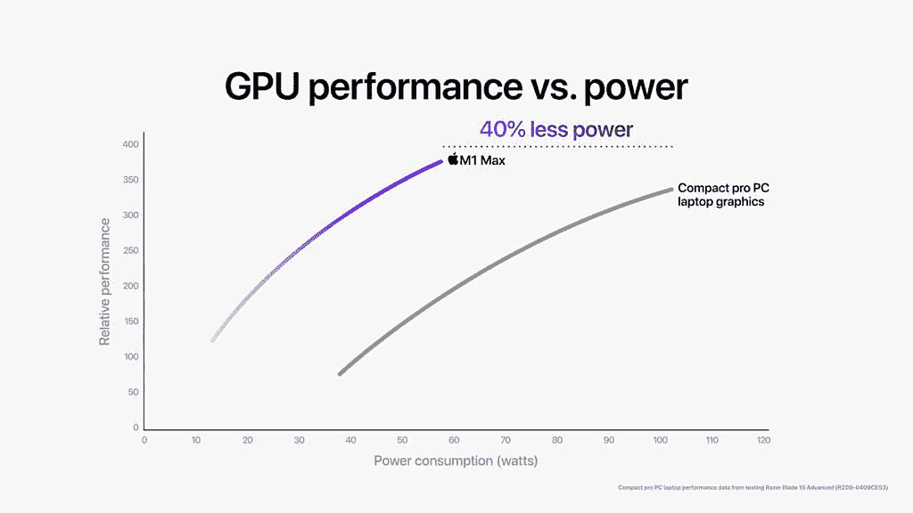
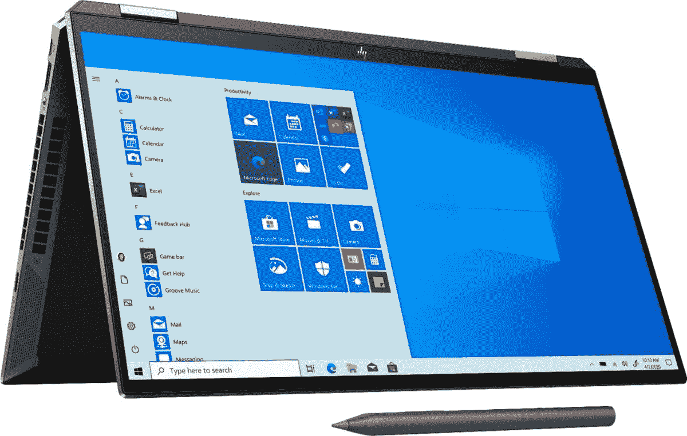

# MacBook Pro vs 惠普 Spectre x360:你应该买什么笔记本电脑？

> 原文：<https://www.xda-developers.com/macbook-pro-vs-hp-spectre-x360/>

苹果公司最近宣布了其全新的 [MacBook Pro 2021 型号](https://www.xda-developers.com/macbook-pro-2021/)，搭载苹果 M1 Pro 和 M1 Max 芯片组。这些都是非常令人印象深刻的笔记本电脑，一定会成为[苹果最棒的](https://www.xda-developers.com/best-macs/)之一。当然，这就引出了一个问题:MacBook Pro 与一些最著名的 Windows 竞争对手相比如何？在本文中，我们将 MacBook Pro 与最受欢迎的 Windows 笔记本电脑之一 HP Spectre x360 进行对比。

MacBook Pro 和 HP Spectre x360 的尺寸不同，因此规格也不同。这使得比较它们变得有点棘手，但是我们将尝试考虑您可以为每一个选择的所有不同型号。让我们直入主题，先看看每台笔记本电脑的规格。

## MacBook Pro 与惠普 Spectre x360:规格

|  | 

MacBook Pro

 | 

惠普 Spectre x360

 |
| --- | --- | --- |
| **处理器** | 

*   苹果 M1 专业版(未知时钟速度，8 核) (仅 14 英寸)
*   苹果 M1 专业版(未知时钟速度，10 核)
*   苹果 M1 Max(未知时钟速度，10 核)

 | 

*   Spectre x360 13，x360 14:
    *   英特尔酷睿 i5-1135G7(最高 4.2GHz，四核)
    *   英特尔酷睿 i7-1165G7(最高 4.6GHz，四核)
*   Spectre x360 15:
*   Spectre x360 16:
    *   最高可配英特尔酷睿 i7-11390H(最高 5GHz，4 核)

 |
| **图形** | 

*   14 核 GPU (M1 专业版，仅限 14 英寸)
*   16 核 GPU (M1 专业版)
*   24 核 GPU (M1 最大)
*   32 核 GPU (M1 最大)

 | 

*   英特尔 Iris Xe 显卡
*   英伟达 GeForce RTX 3050 (Spectre x360 16)

 |
| **撞锤** | 

*   16GB(仅限 M1 专业版)
*   32GB
*   64GB(仅限 M1 最大值)

 | 

*   8GB (Spectre x360 13、x360 14)
*   16GB

 |
| **存储** |  |  |
| **显示** | 

*   14.2 英寸迷你 LED，3024 x 1964，宽彩色(P3)，真实色调，120 赫兹，1600 尼特
*   16.2 英寸迷你 LED，3456 x 2234，宽彩色(P3)，真实色调，120 赫兹，1600 尼特

 | 

*   Spectre x360 13:
    *   13.3 英寸 IPS，全高清(1920 x 1080)，HP Sure View，触控
    *   13.3 英寸 4K 有机发光二极管(3840 x 2160)，400 尼特
*   Spectre x360 14:
    *   13.5 英寸 IPS，全高清+ (1920 x 1280)，触控，400 尼特
    *   13.5 英寸 IPS，全高清+ (1920 x 1280)，惠普 Sure View，触控，1000 尼特
    *   13.5 英寸有机发光二极管，3K2K (3000 x 2000)，触控，400 尼特
*   Spectre x360 15:
    *   15.6 英寸 AMOLED，4K (3840 x 2160)，触摸屏，400 尼特
*   Spectre x360 16:
    *   16 英寸 IPS，3072 x 1920，触摸屏
    *   16 英寸 AMOLED，4K，触摸

 |
| **音频** | 

*   六扬声器立体声，带力消除低音扬声器，杜比 Atmos

 | 

*   双立体声扬声器(Spectre x360 13)
*   四声道立体声扬声器(Spectre x360 14、x360 15)

 |
| **网络摄像头** | 

*   1080p 前置网络摄像头

 | 

*   720 像素网络摄像头(Spectre x360 13、x360 14、x360 15)
*   500 万像素/1080 像素网络摄像头(Spectre x360 16)

 |
| **生物特征安全** |  | 

*   Windows Hello 红外摄像机
*   指纹读取器

 |
| **电池** | 

*   69.6 瓦时电池(14 英寸)
*   99.8 瓦时电池(16 英寸)

 | 

*   60 瓦时电池(Spectre x360 13)
*   66Wh 电池(Spectre x360 14)
*   72.9 瓦时电池(Spectre x360 15)
*   Spectre x360 16:目前未知

 |
| **端口** | 

*   3 个雷电 4 端口
*   高清晰度多媒体接口
*   MagSafe 3 充电端口
*   SD 读卡器
*   3.5 毫米耳机插孔

 | 

*   Spectre x360 13，x360 14:
    *   2 个 Thunderbolt 4 端口
    *   1 个 USB 类端口
    *   3.5 毫米耳机插孔
    *   microSD 读卡器
*   Spectre x360 15，x360 16:
    *   2 个 Thunderbolt 4 端口
    *   1 个 USB 类端口
    *   HDMI 2.0b
    *   3.5 毫米耳机插孔
    *   microSD 读卡器

 |
| **连通性** |  | 

*   英特尔 Wi-Fi 6E AX210 (2x2)，蓝牙 5

 |
| **颜色** |  | 

*   夜幕降临
*   海神蓝(Spectre x360 13，14，15)
*   天然银(Spectre x360 13，14)
*   夜曲蓝(Spectre x360 16)

 |
| **尺寸(WxDxH)** | 

*   14 英寸:12.31 x 8.71 x 0.61 英寸(312.6 x 221.2 x 15.5 毫米)
*   16 英寸:14.01 x 9.77 x 0.66 英寸(355.7 x 248.1 x 16.8 毫米)

 | 

*   Spectre x360 13 英寸:12.08 x 7.66 x 0.67 英寸(306.8 x 194.6 x 17 毫米)
*   Spectre x360 14 英寸:11.75 x 8.67 x 0.67 英寸(298.5 x 220.2 x 17mm 毫米)
*   Spectre x360 15 英寸:14.17 x 8.91 x 0.79 英寸(359.9 x 226.3 x 20mm 毫米)
*   Spectre x360 16:目前不可用

 |
| **重量** | 

*   14 英寸:起始重量为 3.5 磅
*   16 英寸:起始重量 4.7 磅

 | 

*   Spectre x360 13:起始重量 2.8 磅
*   spectre x360 14:2.95 磅起
*   Spectre x360 15:起始重量 4.23 磅
*   Spectre x360 16:目前不可用

 |
| **起始价格** | 1999.99 美元(14 英寸)，2499 美元(16 英寸) | 949.99 美元(x360 13)，1，199.99 美元(x360 14)，1，449 美元(x360 15)，1，639 美元(x360 16) |

与 MacBook Pro 不同，不同尺寸的 HP Spectre x360 在规格方面也有显著差异。HP Spectre x360 16 是一款与众不同的笔记本电脑。请记住，关于 Spectre x360 16 的一些信息还不可用，因为在撰写本文时还不能购买。

## Windows 或 macOS

无论你选择哪个尺寸，这两款笔记本电脑之间最大的决定因素之一来自于操作系统。MacBook Pro(自然)运行的是 macOS，具体来说就是最新版本的 macOS Monterey。macOS 有时被认为对新手来说更容易上手，有着简单明了的界面和较少令人困惑的选项。对于内容创作者来说，这也是一个非常受欢迎的选择，这在很大程度上要归功于 macOS 专用的 Final Cut Pro 等软件。

另一方面，HP Spectre x360 运行 Windows，现在大多数型号都搭载了 Windows 11。然而，即使你有一台装有 Windows 10 的手机，你也可以免费升级到 Windows 11。Windows 提供了一个更开放的生态系统，也更受欢迎，所以有很多应用和程序只能在 Windows 上使用，或者在 Windows 上获得更强的支持。游戏是一个显著的例子，Windows 是 PC 游戏的首要平台，而 Mac 错过了许多游戏。

然而，在一天结束的时候，你可能已经熟悉了其中的至少一个，你的选择已经为你做好了。如果你更喜欢 Windows，惠普 Spectre x360 是你的选择，但如果你更喜欢 macOS，你需要 MacBook Pro。

## 性能:MacBook Pro 彻底击败了竞争对手

我们可能已经说过，HP Spectre x360 根据尺寸的不同有非常不同的配置，但尽管如此，新的 MacBook Pro 型号要强大得多这一事实是无法回避的。在最新的 MacBook Pro 机型中，性能是苹果 M1 Pro 和 M1 Max 的一大焦点，这是有充分理由的。笔记本电脑为 CPU 和 GPU 提供了惊人的性能。苹果 M1 Pro 和 M1 Max 都有类似的 CPU(除了 14 英寸型号的入门级 M1 Pro)。

> 无论你选择哪个型号，惠普 Spectre x360 都比 MacBook Pro 慢。

同时，惠普 Spectre x360 在大多数型号中都配备了最高英特尔酷睿 i7-1165G7 处理器，而 Spectre x360 16 则配备了最高英特尔酷睿 i7-11390H 处理器。虽然 Spectre x360 16 的功能明显比更小的兄弟姐妹更强大，但它仍然与苹果 M1 Pro 相去甚远。如下表所示，苹果 M1 Pro 的多核性能几乎是最强大的 Spectre x360 的两倍。

至于 GPU，差异同样明显，如果不是更明显的话。苹果 M1 Pro 和 M1 Max 的 GPU 明显不同，但苹果将 M1 Max 与运行在 105W 功率的 NVIDIA GeForce RTX 3080 笔记本电脑 GPU 进行了比较(如 Razer Blade 15 Advanced 中所发现的)。这两个 GPU 具有相似的性能水平。然而，大多数 Spectre x360 型号都带有集成显卡，远远达不到这一水平。惠普 Spectre x360 16 有一个可选的 NVIDIA GeForce RTX 3050 Ti，但即使这样也不是非常接近 RTX 3080。很明显，MacBook Pro 在这方面处于领先地位，尽管 M1 Pro 在性能方面可能会更接近，至少与 Spectre x360 16 相比。

 <picture></picture> 

Image: Apple

更令人印象深刻的是，苹果 M1 Pro 和 M1 Max 达到了这一水平的性能，同时比典型的 Windows 笔记本电脑更高效。这给了 MacBook Pro 另一个可能的优势，那就是电池寿命。较小的 Spectre x360 型号可能仍然有良好的电池寿命，但如果你有一台带专用显卡的 Windows 笔记本电脑，它将会付出很大的代价。

> MacBook Pro 的统一内存意味着它比典型的显卡拥有更多的 GPU 内存。

内存和存储配置在 MacBook Pro 上也更令人印象深刻，它可以配备高达 64GB 的统一内存和 8TB 的 SSD 存储。这些升级选项肯定很昂贵，但至少你有它们，而大多数 Spectre x360 型号的最大内存为 16GB，存储容量为 2TB。还需要注意的是，苹果的统一内存意味着 GPU 和 CPU 可以平等地访问该内存，这意味着你可以获得比任何 Windows 笔记本电脑更多的 GPU 内存，这是以 GPU 为中心的工作负载的另一大优势。

不可否认的是，MacBook Pro 更强大，但在你决定这是你想要的之前，请记住，这种极致的能力只适用于一部分用户。如果您正在浏览网页、观看电影和视频、撰写文档等等，这两款笔记本电脑都可以满足您的需求。区别将在于更具体的工作负载，如视频编辑或 3D 渲染，这不是每个人都需要的。

## 显示器:MacBook Pro 有迷你 LED，Spectre x360 有有机发光二极管

在新款 MacBook Pro 中，苹果通过向迷你 LED 的过渡，对显示屏进行了一些大的改进。这使得显示器可以有数百个调光区，这意味着显示器的各个区域可以相互独立地调节亮度。它提供了一些类似于有机发光二极管的好处，如 1，000，000:1 的对比度和查看有大量黑色的图像时的节能。这也是一种令人难以置信的亮度显示器，峰值亮度可达 1600 尼特，持续亮度可达 1000 尼特。最重要的是，它们是非常清晰的面板，16 英寸的型号特别具有接近 4K 的分辨率。

同时，HP Spectre x360 使用典型的 IPS 显示器作为其基本配置，但所有型号都允许您升级到 OLED 面板，在某些方面比 miniLED 更好。有了有机发光二极管，你可以得到单独的背光像素，而不是变暗的区域。每个像素都可以调节自己的亮度，提供更好的对比度，消除迷你 LED 面板上可能出现的光晕效应。根据你得到的型号，这些屏幕甚至比 MacBook Pro 更清晰。尽管分辨率有所不同，但考虑到它们的尺寸，所有这些显示器都足够清晰。

 <picture></picture> 

Spectre x360 13, 14, and 15

HP Spectre x360 在显示器亮度方面有所损失，大多数面板的亮度高达 400 尼特，尤其是有机发光二极管面板。这仍然比在室内可见，你可能可以在室外使用它们而不会有太多麻烦，MacBook Pro 在这方面明显更好。然而，Spectre x360 在支持触摸和笔的形式上有一些优势(毕竟它是一个可转换的)，如果你想保护你的信息免受周围人的影响，还可以选择集成的隐私屏幕。隐私屏要求你放弃有机发光二极管，但至少你有选择权。

> HP Spectre x360 为您提供触摸支持和隐私屏幕选项。

声音是 MacBook Pro 占据主导地位的一个领域，它有六个扬声器，而大多数 Windows 笔记本电脑最多只有四个。这里也是如此，苹果公司表示，它实际上在今年的 MacBook Pro 中使声音系统变得更好。大多数惠普 Spectre x360 型号都有四个扬声器，这仍然会给你带来很好的体验，只是没有那么好。13 英寸的 Spectre x360 只有两个扬声器，因此它将位于所有这些扬声器之后。

这两款笔记本电脑的不足之处是网络摄像头，但原因不同。苹果决定最大化屏幕面积，并将 MacBook Pro 2021 型号的网络摄像头分辨率提高到 1080p。然而，为了同时做这两件事，它在屏幕中央添加了一个凹槽，这看起来很奇怪，特别是在笔记本电脑上。惠普避免了这一点，但为了让边框尽可能小，它创造了一个微小的 720p 网络摄像头，质量并不太好。最终，你必须在一个好的网络摄像头和一个不间断的显示屏之间做出选择，这两者都不理想。

## 设计:惠普 Spectre x360 外形美观，更加便携

惠普 SPectre x360 轻松击败 MacBook Pro 2021 型号的一个方面是设计。首先，最大的区别是 SPectre x360 是一款敞篷车，这意味着你可以把它当作普通的笔记本电脑来使用，但你也可以把它当作平板电脑来使用。虽然敞篷车往往更重，但 Spectre x360 13 和 14 都比 MacBook Pro 14 英寸轻得多，除了厚度之外，它们的大多数尺寸也更小。同样，Spectre x360 15 明显比 MacBook Pro 16 英寸轻。如果你经常旅行，体重的差异将会产生影响。

但让 Spectre x360 真正更有趣的是它的外观。MacBook Pro 有银色或太空灰两种颜色，这只是灰色的变体。借助惠普 SPectre x360，您可以获得夜幕黑和海神蓝，这两种令人惊叹的双色设计非常出众。夜幕黑将黑色与铜色口音结合，海神蓝将深蓝色与金色口音混合。对于 13 英寸和 14 英寸的型号，如果你愿意，你还可以得到一个银色的版本。然而，Spectre x360 16 取消了双色外观，你可以选择夜幕黑或夜曲蓝。

Spectre x360 系列也有一些标志性的设计元素，如显示屏下方的切角，为有角度的端口腾出了空间。这些可以更容易地插入一些外围设备，而不会妨碍它们，并且与大多数笔记本电脑相比，它们具有独特的外观。

 <picture></picture> 

HP Spectre x360 16

然而，当谈到端口时，MacBook Pro 更加通用，尤其是与较小的 Spectre 型号相比。MacBook Pro 包括三个 Thunderbolt 端口、HDMI、SD 读卡器、耳机插孔和用于充电的 MagSafe 3 连接器。这涵盖了你的大部分基本需求，除了一些外围设备的 USB Type-A，MagSafe 的回归意味着你不必担心充电电缆绊倒。

> MacBook Pro 有一个更通用的端口选择，减去 USB Type-A。

Spectre x360 包括两个 Thunderbolt 4 端口、一个 USB Type-A 端口、一个耳机插孔和一个 microSD 读卡器。对于 15 英寸和 16 英寸的型号，您还可以获得 HDMI 和专有的筒式充电器。这仍然涵盖了你的大部分基地，但小型号上缺少 HDMI 可能是一个大问题，你也少了一个 Thunderbolt 端口。这里也没有像 MagSafe 一样的东西。

## 结论:应该选择 MacBook Pro 还是惠普 Spectre x360？

MacBook Pro 2021 型号和 HP Spectre x360 是两款出色的设备，有充分的理由选择其中一款。这里的决定取决于您对笔记本电脑的需求。如果你需要高性能，MacBook Pro 几乎是终极的专业笔记本电脑。有了苹果 M1 Pro 和 M1 Max，高达 64GB 的统一内存和 8TB 的存储，这种性能几乎无所不能。它的能效也令人印象深刻。此外，它有一个令人惊叹的迷你 LED 显示屏和广泛的端口，这意味着您现在可以更轻松地连接外围设备。

HP Spectre x360 是一款顶级的可变形笔记本电脑，旨在实现便携。对于基本的日常任务，它仍然会表现很好，如果你选择有机发光二极管选项，它也有令人惊叹的显示屏。此外，这是一款敞篷车，所以如果你想将你的电脑作为平板电脑使用，这是一条出路。它比 MacBook Pro 更轻，其各种颜色选择和尺寸看起来令人惊叹。同样值得注意的是，由于尺寸不同，您可以选择不同的显示屏宽高比，以便找到最适合您的尺寸。

还有价格的问题，值得指出的是，MacBook Pro 的起价比 HP Spectre x360 高得多，如果你想升级一切，它可能会花费你 6000 多美元。HP Spectre x360 是一个更加经济实惠的选择，但在许多方面仍然很棒。

当然，正如我们之前提到的，还有操作系统的问题，这可能是决定这两者的最大因素之一。如果你更喜欢 Windows，你会选择惠普 Spectre x360，如果你更喜欢 macOS，你会选择 MacBook Pro。这完全取决于您的偏好和需求，您可以使用下面的链接选择您最喜欢的。如果你选择了 MacBook Pro，并且想要保护你的投资，看看我们为 MacBook Pro 列出的[最佳案例。](https://www.xda-developers.com/best-macbook-pro-cases/)

 <picture></picture> 

MacBook Pro 16

##### 苹果 MacBook Pro 16 英寸(2021)

由于采用了 M1 Pro 和 M1 Max 芯片组，MacBook Pro 是一款功能强大的笔记本电脑，比任何 Windows 超极本都强大得多。

 <picture></picture> 

HP Spectre x360 13

##### 惠普 Spectre x360 13

HP Spectre x360 13 是一款轻量级高级敞篷车，采用高端英特尔处理器和惊艳的设计。

 <picture></picture> 

HP Spectre x360 14

##### 惠普 Spectre x360 14

HP Spectre x360 14 是一款轻量级高级敞篷车，具有高级设计、3:2 显示屏和高端性能。

 <picture></picture> 

HP Spectre x360 15

##### 惠普 Spectre x360 15

HP Spectre x360 是一款大型 15 英寸敞篷车，采用第 11 代英特尔处理器，具有漂亮的双色调外观。

 <picture></picture> 

HP Spectre x360 16

##### 惠普 Spectre x360 16

最大的 SPectre x360 型号具有 16:10 显示屏、英特尔 H35 系列处理器和可选的 NVIDIA 显卡。