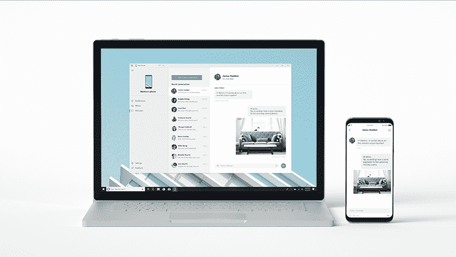

# macOS 14 愿望清单:我们希望苹果在 2023 年采用的 7 项功能和变化

> 原文：<https://www.xda-developers.com/macos-14/>

去年底推出了 iOS 16 、 [macOS Ventura](http://xda-developers.com/macos-ventura) 和 [watchOS 9](http://xda-developers.com/watchos-9) ，但现在，我们已经掌握了所有主要功能和更新，包括更先进的锁屏、Mac 重新设计的系统设置和全新的 Apple Watch faces。现在是时候将所有这些操作系统抛在脑后，专注于下一步了。

macOS 14 最早可能在 6 月份的 WWDC23 期间发布，我们已经迫不及待地想试驾第一个开发者测试版了。预计到这次操作系统的升级，我们准备了一份清单，列出了我们希望苹果在 macOS 14 中包含的七个新增功能。

随着 macOS Catalina 的发布，苹果停止了 Dashboard，它允许用户向他们的 [Mac](http://xda-developers.com/best-macs) 桌面添加小部件。这项功能在公司的桌面系统上很有意义，因为人们通常有充足的空闲空间在他们的大屏幕上插入这些可选的、方便的数据。

随着[iphone](http://xda-developers.com/best-iphone)和[ipad](http://xda-developers.com/best-ipad)最近的操作系统采用了对主屏幕控件的支持，苹果最终在 macOS 14 上实现这一功能是有意义的。现在，用户必须导航到通知中心才能查看他们添加的小部件。简化的执行将允许用户将通知中心固定在桌面的右侧，以便于访问及时的信息。

## 通知镜像

iPhone 和 MAC 是最好的朋友。在 iOS 上复制，在 macOS 上粘贴。在 Mac 上启动 Pages 文稿，并在通过 iPhone 通勤时编辑它。尽管如此，他们仍然有未解决的问题，特别是在沟通不畅的部门。当我在 Mac 上工作时，我通常会把 iPhone 放在旁边，通知镜像会极大地简化我的工作流程。

现在，如果有人通过第三方即时通讯(IM)应用给我发短信，我必须拿起手机回复。如果这个通知也可以到达我的 Mac，那么我可以通过 macOS 14 输入响应。我的工作流程不会被打断，我可以继续无视我的电话。

对于那些把手机放在另一个房间充电的人来说，这个功能非常方便。通过这种方式，他们无需起身就可以与他们的 iPhones 进行互动。这项功能已经与精选的个人电脑和安卓手机兼容，所以如果苹果在 2023 年复制它，这将是一个受欢迎的变化。

## 派对模式

苹果吹嘘其设备可以无缝协作，这一点我们无法否认。该公司可以说拥有移动和计算领域最紧密的生态系统。你可以用 Apple Watch 解锁你的 Mac，用你的 iPhone 作为摄像头，用你的 iPad 和 [Apple Pencil](https://www.xda-developers.com/apple-pencil-2-isnt-magic-wand-editorial/) 签署 Mac 文档，等等。然而，我希望在 macOS 14 和相应的苹果操作系统上看到的一个功能是派对模式。

简而言之，派对模式会以同步的方式通过所有设备的扬声器播放相同的音频。你可以在最少依赖专用扬声器的情况下播放播放列表——至少在小型家庭聚会中是如此。你已经可以将 HomePods 配对，并让它们同时播放相同的音乐，因此 macOS 14 的潜在变化只会将它扩展到 MAC 电脑(以及 iPhones 和 iPads，通过它们各自的 2023 年操作系统更新)。

## 警报，但已同步

通过 macOS Ventura，苹果终于在 Mac 上推出了时钟应用。我希望在 macOS 14 上看到的另一个生态系统功能是可选的同步警报支持。现在，你可以在不同的 iDevices 上设置不同的闹钟，但你应该能够通过 macOS 14 Clock 应用程序编辑 iPhone 的闹钟(反之亦然)，并指示哪个(哪些)设备将实际响铃。现在，我可以通过我的 iPhone、iPad 或 MacBook Air 控制我的 [HomePod 迷你](https://www.xda-developers.com/apple-homepod-mini-review/)闹钟。苹果只需扩展这一功能，使其与其他设备兼容。

## 高级查找我的

Find My 及其广泛的网络是苹果用户的强大工具。您可以对丢失或被盗的设备进行定位、擦除、ping 等操作。事实上，即使关机，用户也能找到他们的(兼容的)iPhones。这使得窃贼更难隐藏踪迹或销声匿迹。尽管如此,“查找我的”——作为一项服务——还远非完美。

从 AirTags 开始，由于未知的原因，你现在无法在 macOS 上配对新的 AirTag 或 ping 现有的 AirTag。一个受欢迎的补充将是对该公司追踪器的适当支持。不过，更重要的是，macOS 14 应该能让我们更好地控制现有的设备。现在，我可以锁定、ping 和定位我的 iPhone，以及其他基本命令。苹果可以把 Find My 变成这些设备的控制中心，让它变得更有用。允许我们打开/关闭设置，如 Wi-Fi 或飞行模式。iPhone 已经可以用作 iPad 遥控器，反之亦然。将这一功能浮出水面，并以更丰富的格式将其植入 Mac 电脑，将使 Find My 变得更加强大。

## 统一版本号

苹果令我困扰的一个小细节是其操作系统的版本号不匹配。目前，我们有三个不同的数字 16 个用于 iOS/iPadOS，13 个用于 macOS，9 个用于 watchOS。2023 年，希望苹果给 macOS 和 watchOS 更大的版本号凸点，以匹配 iOS 和 iPadOS。这样我们就得到 iOS、iPadOS、watchOS、macOS 17。

苹果统一了这些操作系统的用户界面，这将更容易判断某个版本是哪一年发布的。该公司还可以更进一步，在 2023 年推出 iOS/iPadOS/watchOS/macOS 23(而不是 17)。虽然大版本颠簸通常没有意义，但出于简化的目的，这将是一次性的例外。

## 翻译和手表应用

通过 macOS Ventura，苹果终于将时钟和天气应用程序带到了 Mac 上。尽管如此，该公司的电脑仍然错过了某些应用程序，比如最近在 iPadOS 上推出的翻译应用程序。该公司仍未向 macOS 推出这款便捷的工具。我们祈祷这款应用能在 macOS 14 上首次亮相。

另一个我想在 macOS 14 上看到的 iOS 应用是 Watch，它是你用来配对和定制一块 Apple Watch 的工具。Mac 已经意识到手表的存在。这体现在用 Apple Watch 解锁 Mac 等功能上。一个受欢迎的新增功能将是在 Mac 上配对和调整 Apple Watch 设置的能力。通过这种方式，依赖 macOS 的 Android 用户可以利用该公司先进的可穿戴设备。

* * *

不幸的是，macOS 14 还需要几个月的时间，尽管苹果可能已经决定了它将包括哪些主要功能。毕竟，它需要事先规划和发展的新增加的东西才能见天日。在那之前，我们可以坐以待毙，希望库比蒂诺的霸主听取我们的反馈。

如果你喜欢阅读这个愿望清单，你可能想看看类似的文章，围绕着我们对 [iOS 17](http://xda-developers.com/ios-17) 、 [iPadOS 17](http://xda-developers.com/ipados-17) 和 [watchOS 10](http://xda-developers.com/watchos-10) 的期望。

*你希望苹果在 macOS 14 中推出哪些功能？请在下面的评论区告诉我们。*