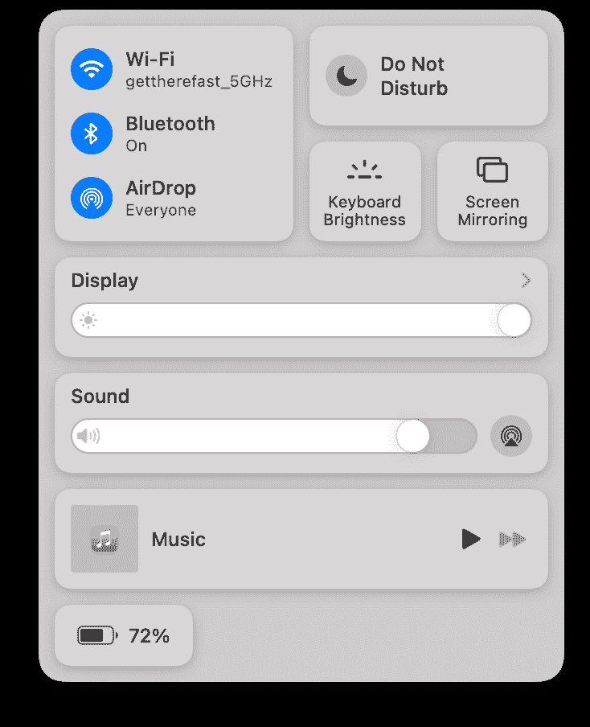
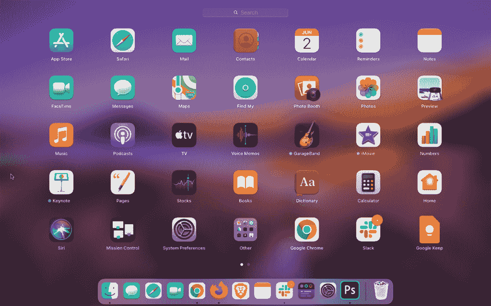
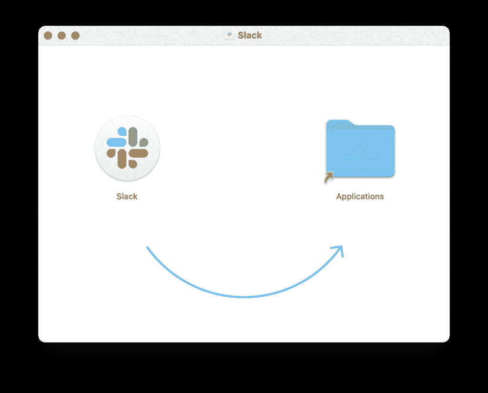

# 当您从 Windows PC 切换到 macOS 时，会有哪些变化？

> 原文：<https://www.xda-developers.com/macos-windows-differences/>

Windows 和 macOS 之间永恒的竞争是由狂热的爱好者发起的，他们总是争论谁比谁更好。自然，声称 Windows 更好的用户数量要大得多，因为 Windows 在桌面操作系统市场上占有份额。截至 2020 年 12 月，估计全球近三分之二的 PC 或笔记本电脑用户使用微软 Windows，而 macOS 仅限于不到五分之一的用户。虽然 Windows 和 macOS(以前的 Mac OS，Macintosh 操作系统的缩写)几乎是同时发明的，但 Windows 拥有更大的用户群，因为它容易获得，并与各种硬件兼容。另一方面，macOS 是苹果公司的专有操作系统，仅限于 [Mac 系列电脑](https://www.xda-developers.com/best-macs/)，包括 [MacBook 型号](https://www.xda-developers.com/difference-macbook-pro-air/)，iMac，Mac Mini 和 Mac Pro——除非你自己设法构建一个功能齐全的 Hackintosh。

由于其庞大的用户群，Windows 具有更广泛的兼容软件和/或应用程序库，并且与附件的兼容性更广。相比之下，那些更喜欢 macOS 而不是 Windows 的人认为前者的用户体验更好、更直观，即使这带来了应用程序相对缺乏的缺点。像大多数第三世界用户一样，我的早期生活是在运行各种版本 Windows 的台式电脑和笔记本电脑上度过的，从 Windows 2000 开始，一直到 Windows 10。但在近四年前改用 macOS 后，我从未觉得有必要回归 Windows。

虽然两者都是为个人电脑设计的，但 Windows 和 macOS 的感觉和操作有着明显的不同。只使用两个操作系统中一个的用户经常发现很难立即适应另一个。如果你最近从 Windows 10 切换到 [macOS Monterey](http://xda-developers.com/macos-monterey) 或 [Ventura](http://xda-developers.com/macos-ventura) ，有一些事情你应该知道，以避免最初的颠簸。这篇文章将告诉你从 Windows 切换到 macOS 时你应该期待和准备的一切。

## 用户界面—菜单栏、Dock、Launchpad、Spotlight 搜索和桌面

设置好 Mac 后，你首先注意到的是一个主屏幕或桌面，与你习惯在 Windows 上看到的完全不同。首先，macOS 中没有开始菜单或任务栏。相反，您会看到显示屏顶部有一个菜单栏，底部有一个 Dock。

### 桌面

macOS 上的桌面很像 Windows。但是，默认情况下，应用程序排列在屏幕的右侧。您还可以根据自己的方便在桌面上拖放任何文件或文件夹，或者使用堆栈按文件类型或日期将类似的项目分组。

您可以右键单击桌面上的空白区域，显示菜单选项以创建新文件夹，**获取桌面目录的信息**，更改壁纸，以及启用堆栈和其他查看选项。你可能会错过 Windows 的**刷新**选项，但是我们知道现在[几乎没有意义](https://answers.microsoft.com/en-us/windows/forum/windows_10-start-winpc/what-does-refresh-option-in-desktop-do/1af1e0dd-e380-4208-81f5-89beb4b3a4f7#:~:text=refresh%20does%20nothing)，即使在 Windows 上也是如此。

你会在菜单栏的左边看到一个**的苹果 Logo** ，点击它会看到包括**关于这台 Mac** 、**系统偏好**、**最近项目**、**强制退出**、**关机**、**重启**、**锁屏**、**注销用户**在内的选项。与这个苹果标志相邻的是各种菜单选项，这取决于位于最前面的应用程序。

当当前桌面上没有打开的应用程序时，您会看到与 Finder 相关的选项。你可能会问，Finder 到底是什么？它类似于这台个人电脑(以前是我的电脑)——但又有些许不同。我们将在下一节详细讨论它。在此之前，让我们带您浏览一下 macOS 中的其余 UI 元素，您在开始使用它时必须立即了解这些元素。

在菜单栏的右侧，有快速访问某些应用程序的快捷方式(支持菜单栏快捷方式)和设置，如蓝牙、Wi-Fi、电池状态、Spotlight 搜索等。除了这些，你还可以访问控制中心，它是在 macOS Big Sur 中添加的。

 <picture></picture> 

Control Center on macOS

在控制中心，您可以找到 Wi-Fi、蓝牙、隔空投送、免打扰的设置、显示器和键盘的亮度设置(适用于 MacBook 机器)、音量、正在播放媒体的控制以及电池。您还可以添加快速用户切换或辅助功能设置的开关。

此外，您可以在菜单栏的最右边找到日期和时间。点击日期和时间会显示最近收到的通知和小工具。您可以根据需要使用通知，也可以通过点击 **X** 图标来清除通知。您也可以通过点击窗格底部的**编辑小部件**按钮来重新排列小部件并添加新部件。

### 码头

在显示屏的底部，Dock 是一些关键应用程序的直接快捷方式。像 Windows 上的任务栏一样，您可以更改 Dock 的位置，在显示器的左侧、底部或右侧进行选择。当您将鼠标光标悬停在 Dock 上时，您会注意到放大效果，并且您可以在设置中更改放大倍数和 Dock 的大小。与 Windows 上的任务栏类似，所有打开的应用程序的图标都位于 Dock 中并最小化。您可以选择特定窗口是最小化到应用程序图标中，还是作为 Dock 一端的单独预览。

您可以自定 Dock 中的图标。要将任何应用程序添加到 Dock，请打开该应用程序一次，然后右键单击图标。然后进入选项，点击**保持在 Dock** 。要移除一个应用程序，请执行相同的步骤，只是这次您会看到**保留在 Dock** 旁边的复选标记。点击它以移除复选标记，从而移除应用程序。更多设置比如打开 Dock 的自动隐藏，你可以去 **Dock &菜单栏**的**系统首选项**中的首选项——这是 macOS 中所有设置的中枢。

### 启动板和 Spotlight 搜索

与 Windows 不同，macOS 没有开始菜单。取而代之的是 Launchpad，它就像一个应用启动器，按下 Launchpad 图标就可以进入(

)在被告席上。如果你有 MacBook(苹果硅驱动的除外)，也可以按下 **F4** 按钮打开 Launchpad。或者，如果你的 MacBook 有 Touchbar，你可以触摸 **<** 图标来展开所有选项，然后点击排列成矩形的六个小方框图标。

最后，你还可以用三个手指和一个拇指在触控板上向内挤压来打开 MacBook 上的 Launchpad。

 <picture></picture> 

Launchpad on macOS

启动 Launchpad 后，您可以使用鼠标或触控板来筛选应用程序列表，或者立即开始键入以按名称搜索应用程序。您还可以通过将应用程序拖放到所需位置来整理应用程序，或者通过将一个应用程序的图标拖到另一个应用程序或现有文件夹上来将多个应用程序添加到一个文件夹中。

您可以通过单击**退出**按钮或使用三个手指和一个拇指在触控板上张开来退出 Launchpad。

除了 Launchpad，你还可以在 macOS 上使用 Spotlight Search。在实用性方面，它与 Windows 中的开始菜单搜索栏非常相似，可以用于在系统范围内搜索文件、应用程序、联系人或系统偏好设置中的菜单项。点击菜单栏上的**放大镜**图标或按键盘上的**命令** + **空格**可以触发 Spotlight Search。

 <picture></picture> 

Spotlight Search on macOS

桌面的前端会出现一个搜索栏。你可以从这里开始输入，macOS 会提供结果建议。除了保存在 Mac 上的项目，Spotlight Search 还可以直接搜索网页。

* * *

## Finder 而不是这台电脑

Finder 是储存所有文件和应用程序的地方。这是 Dock 上的第一个图标，以旧的 Mac OS 徽标为特征。对于 Windows 用户来说，最简单的类比就是将其视为这台 PC 的替代品。然而，Finder 要简单得多，因为 macOS 通常没有磁盘分区。您的大多数文件存储在“下载”、“桌面”或“文稿”中，所有这些文件夹都可以从 Finder 窗口左侧栏的“收藏夹”中访问。

你可以打开任何文件或文件夹，双击它，右键点击查看相关选项，如重命名，压缩，移动到垃圾箱等。您还可以通过点击左侧窗格中的**应用程序**文件夹，从 Finder 中访问所有已安装的应用程序。此外，您可以为文件或文件夹分配彩色标签，以便更好地排序，然后单击侧边栏中标签标题下的颜色。

如果您想要在同一个窗口中打开两个文件夹，Finder 还支持选项卡式视图。为此，在点击文件夹的同时按下**命令**。或者，您可以打开两个不同的 Finder 窗口来执行拖放等简单操作。

* * *

## 你不控制，你指挥

macOS 与 Windows 的另一个不同之处在于修饰键。MacBook 上的标准键盘——或设计用于 Mac 的键盘——有四个按键修饰键:**命令(cmd 或⌘)** 、**选项(alt 或⌥)** 、**控制键(ctrl 或^)** 和**功能键(fn)** 。

与 Windows 使用**控件**作为主要修饰键不同，macOS 使用**命令**。所以，对于复制或粘贴这样的动作，你使用**命令** + **C** 和**命令** + **V** 而不是 **Ctrl** + **C** 或 **Ctrl** + **V** 。同时，**选项**和**控制**是 macOS 中的辅助修改键，很少有不依赖**命令**的直接快捷键。与 Windows 一样，**功能键**用于在 F-数字功能和分配给它们的快捷键之间切换。

这样，你的左手拇指自然地放在**指令**键上，并且可以很容易地在**指令**和**空格键**之间工作。同时，你的小手指不需要在**换挡**和**控制**之间来回移动，可以放在**换挡**键上。

虽然大多数基本快捷键与 Windows 相似，但这里有一些成为超级用户必须知道的最基本的 macOS 键盘快捷键[。](https://www.xda-developers.com/keyboard-shortcuts-mac/)

如果您使用的外部键盘不一定是为 Mac 设计的，它可能与 Windows 上的工作方式相同。例如，我的 USB 键盘——设计用于 Windows——将**开始**键识别为**命令**，将 **Alt** 键识别为**选项**，基本上是将两者互换。幸运的是，你可以通过前往**键盘首选项**并点击页面底部的**修饰键**来重新分配修饰键。

### 学习如何在 Mac 上剪切粘贴

MAC 电脑传统上不像 Windows 那样直观地支持剪切粘贴。这意味着**命令** + **X** 对于移动文件不起作用(在编辑文本时起作用)。扫兴，对吧？

幸运的是，有一些变通办法。您可以通过并排打开两个目录，将所需的文件拖放到新的目标位置。但你也可以在 macOS 上用快捷键剪切粘贴文件。使用**命令** + **C** 复制一个文件，然后使用**命令** + **选项** + **V** 将其粘贴到目标文件夹中，而不只是使用**命令** + **V** 。这样，文件将从其原始目录中删除，并复制到新目录中。

### 回车重命名，双击打开

在我使用 Mac 的最初几天，当我试图通过按下键盘上的**Enter**——在 macOS 中称为**Return**——来打开一个文件或文件夹时，我总是很沮丧。按下**回车键**而不是打开一个文件或文件夹，你可以选择重命名它。

要在 Mac 中打开文件或文件夹，您可以双击任何文件或文件夹，或者按键盘上的**命令** + **O** 。

### 没有退格键

Mac 兼容键盘或 MacBook 上缺少**退格键**很容易被发现。在**退格键**的位置，你会看到一个**删除**按钮，它的作用与 Windows 机器上的不同。编辑文本时，**删除**按钮作为**退格键**，要前进删除，需要按键盘上的 **fn** + **删除**。

当 Windows 用户得知**删除**按钮不能删除文件时，一定会非常恼火。要删除一个文件，您必须右击该文件并选择**移动到文件箱**或按下**命令** + **删除**。您也可以将文件拖放到媒体夹上来删除它。

* * *

## 触控板手势

说到 Mac，最好的体验之一就是触控板。首先，MacBook 的触控板——或者苹果公司的外置蓝牙触控板——非常灵敏和精确。较新的型号还提供 3D force touch，增加了另一个维度的控制。与大多数保留触控板底部区域用于点击的 Windows 笔记本电脑不同，你可以在 MacBook 的触控板上的任何地方按一下，甚至用两个手指按两下，而无需任何努力。

其次，macOS 支持各种触控板手势，旨在减少在基本任务上花费的时间，如导航到上一个或下一个网页，在打开的应用程序之间切换，打开通知，旋转图像等。你需要有意识地努力学习所有的手势，但是一旦你学会了，在界面中导航就变得非常容易了。触控板手势的菜单独立于“系统偏好设置”中的通用鼠标设置，您可以浏览它来学习所有手势。为了帮助用户更好地掌握它们，macOS 还为每个手势提供了动画教程。

新的 MacBook 用户可能会发现，简单地在触控板上点击并不像点击一样有效，他们需要在触控板上按压。这是因为在 macOS 中默认情况下**轻触点击**是禁用的，但是你可以在**触控板偏好设置**中的**点&点击**部分下启用它。

* * *

## 在 macOS 上安装应用程序

Mac 生态系统可能不像 Windows 那样多样化，但 macOS 的应用程序数不胜数。找到适合你的 Mac 的应用程序的最好方法之一是去预装应用程序商店，从经过验证的开发者那里找到应用程序。上传到 App Store 可以确保应用程序通过了严格的审查，并满足 macOS 所需的 UI 和 UX 标准。

然而，某些[开发者可能不想把他们的应用](https://www.xda-developers.com/fortnite-circumvents-google-play-fees-direct-payment-option/)上传到苹果的应用商店。在这种情况下，找到相关应用程序的最佳方式是使用搜索引擎，键入类似“[应用程序名称]用于 Mac 下载”的查询

必须注意，macOS 的安装程序有一个扩展名”。pkg”-用于包-和。exe 文件在这里不起作用。下载完包后，双击即可。在 Mac 上安装从互联网下载的应用程序时，您可能会看到一个窗口，需要将应用程序图标拖放到“应用程序”文件夹中。

 <picture></picture> 

The interface on macOS for installing apps from third-party sources

还有一点需要注意的是，当你在 macOS 上打开一个安装包时，它会作为一个外置磁盘挂载，在 Finder 的桌面和边栏上都可以看到。一旦你完成了应用程序的安装，确保你弹出安装程序，以防止它消耗不必要的内存。

* * *

## 关闭与退出应用程序

到现在为止，你一定已经意识到窗口控制按钮——关闭、最小化和最大化——是有颜色标记的，并且放在标题栏的左侧，也就是说，与我们习惯在窗口上看到的相反。除此之外，macOS 采用了一种独特的方法来关闭应用程序。

当你点击带叉的红色图标时，该应用程序的特定实例被关闭。当它从屏幕上消失时，应用程序仍在后台运行，由 dock 中应用程序图标旁边的圆点表示。由于该应用程序在后台是活跃的，它可以很容易地重新启动，无需任何等待。虽然如果你必须使用许多应用程序，这很有用，但应用程序经常需要一些内存来保持活动，从而降低 Mac 的速度。

为了避免这种情况，你可以**退出**一个应用程序来彻底清除它，而不是直接关闭它。要退出一个应用程序，你可以按键盘上的**命令** + **Q** ，或者右击 Dock 中的应用程序图标，然后点击**退出**。如果两个选项都不起作用，你可以点击菜单栏中的**苹果标志**，然后点击**强制退出**。随后会弹出一个小窗口，在这里，你可以强制应用程序退出。如果应用程序冻结，您可以尝试[四种方法中的一种，在 Mac 上强制退出无响应的应用程序](https://www.xda-developers.com/how-to-force-quit-mac/)。

* * *

## macOS 上的多任务处理

像关闭应用程序一样，macOS 也有不同的调整窗口大小的方法。在 macOS 上，每个调整为全屏幕的窗口都作为单独的桌面打开。这意味着该应用程序占据了显示屏的整个空间，甚至 Dock 和菜单栏都是隐藏的——除非你将光标靠近它们通常所在的区域。这种方法允许用户将全部注意力集中在一个应用程序上，而不会被其他应用程序分散注意力。

可以理解的是，你不能只使用一个应用程序，工作时可能需要在应用程序之间切换。为此，macOS 提供了一些直观的手势:

*   首先，你可以用三个手指在触控板上向左或向右滑动，在所有桌面之间切换。您也可以使用 Control 和向左或向右箭头来实现相同的效果。
*   你可以用三个手指向上滑动来显示所有桌面。
*   所有没有被最大化以充满屏幕的应用程序都可以在一个桌面上使用。要查看所有这些应用程序，您可以用三个手指向上滑动来查看它们。

* * *

## 您应该多久关闭一次 Mac？

你可能经常遇到 MacBook 用户只是随意合上笔记本电脑的盖子，然后直接从那里恢复。这是因为 MAC 支持即时唤醒，不需要频繁关机。事实上，关闭或重新启动 Mac 电脑会刷新内存，从而需要更长时间来启动应用程序。因此，在更新 Mac 时，最好关闭或重启 Mac 来修复任何意外错误。否则，只要您要经常使用 Mac，您通常可以让它进入睡眠状态，而不是完全关机。

与大多数 Windows 笔记本电脑不同，MacBook 的电池不太可能在睡眠时耗尽。但是，仍然会消耗一些能量来保持磁盘通电。因此，如果长时间不使用 MacBook，关闭它是一个好主意。同样，像 iMac、Mac Mini 或 Mac Pro 这样的台式 Mac 可能会消耗不必要的电力，所以如果你长时间不打算使用它们，应该将它们关闭。

* * *

## 了解 macOS 的更多信息

我们希望这篇文章中列出的几点能帮助你缓解从 Windows 切换到 macOS 时的紧张或担忧。完成这些后，我们还有一些建议供您参考，包括以下内容:

*   <picture></picture>

    苹果 MacBook Pro M2

    ##### 苹果 MacBook Pro 13 英寸(2022)

    2022 款 MacBook Pro 13 英寸提供了经典设计，重新引入了触控条，并封装了 M2 芯片。

*   <picture></picture>

    苹果 iMac (24 英寸，M1，2021)

    ##### 苹果 iMac (2021)

    苹果 iMac 采用 M1 芯片，24 英寸 4.5K 视网膜显示屏，最大 16GB 内存，最大 2TB 存储。

*   <picture></picture>

    苹果 Mac Mini M1

    ##### 苹果 Mac Mini (M1，2020)

    苹果 Mac Mini 自带 M1 芯片，内存高达 16GB，存储高达 2TB。

* * *

我们很想知道你从 Windows 转到 Mac 的经历。请在下面的评论部分告诉我们，并确保添加您的建议，我们还可以向本文添加其他内容，以使从 Windows 到 macOS 的过渡更容易。