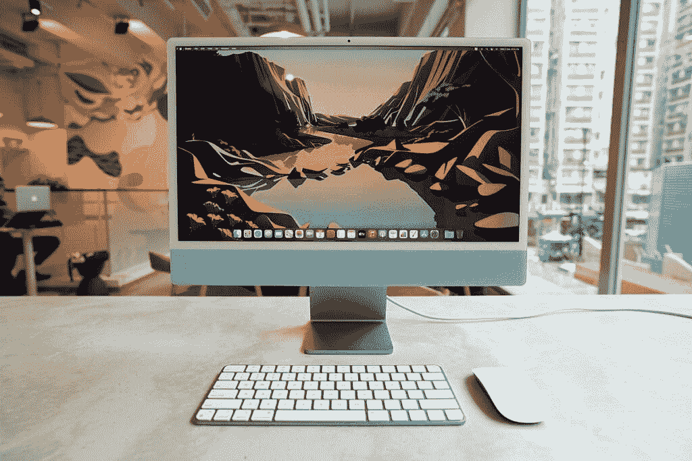
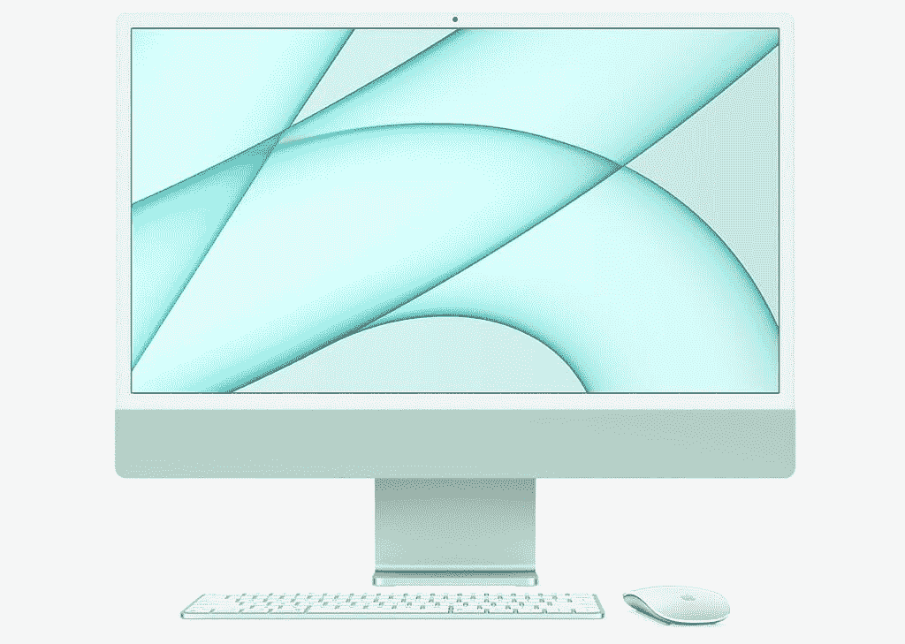
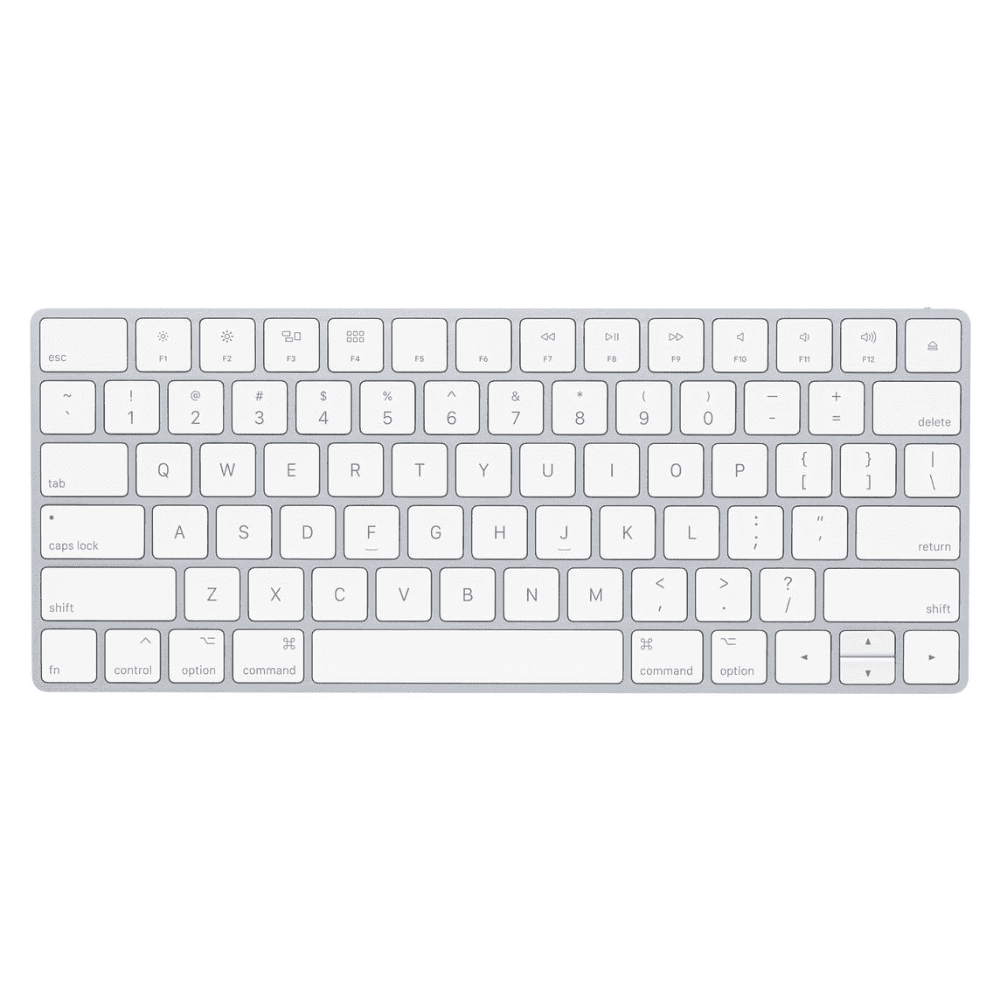

# iMac 配色魔法鼠标和键盘评论

> 原文：<https://www.xda-developers.com/magic-keyboard-touch-id-review/>

在消费科技领域，产品通常会进行大幅度的内部升级或华丽的设计改造，但苹果新推出的 24 英寸 2021 iMac 设法同时提供了这两者。它升级到震撼行业的 M1 硅，并获得了一个[美丽性感](https://www.xda-developers.com/apple-imac-beautiful-design-opinion/)的新身体，比以往任何时候都更丰富多彩和更薄。

XDA 的里奇·伍兹(Rich Woods)仍在撰写他对 iMac 本身的全面评论，但与此同时，我们可以看看 iMac 附带的配套配色配件——神奇鼠标和神奇键盘。

 <picture></picture> 

2021 iMac in blue with color-matched Magic Keyboard and Magic Mouse.

## 苹果神奇鼠标和键盘:设计和颜色

不出所料，神奇鼠标和神奇键盘都是通过蓝牙连接 iMac 的无线设备。这是必要的，因为新款 iMac 的基本型号只配有两个 USB-C Thunderbolt 端口——事实上，如果你打算将更多东西连接到 iMac，如外部显示器，你可能需要一个[好的 Thunderbolt 坞站。](https://www.xda-developers.com/best-thunderbolt-docks/)

回到附件，鼠标和键盘的颜色都与您选择的 iMac 相同(绿色、黄色、橙色、粉色、紫色、蓝色和银色)，但谢天谢地，附件上的颜色比实际的 iMac 上的颜色更微妙。我会说这是一个微妙的色彩，而不是一个完整的油漆工作。

在我的蓝色 iMac 机型上，Magic Mouse 的蓝色灯罩几乎看不出来，除非我在一个有很多自然光的房间里。然而，同一款鼠标的粉色和绿色版本更多地展示了颜色。

 <picture></picture> 

The green on the Magic Mouse and Keyboard is more noticeable for the green model iMac.

除了颜色，这个彩色版的魔法鼠标和魔法鼠标 2 没有什么不同。这意味着顶部是一个塑料单件，底部是一个铝外壳。鼠标感觉轻薄，但构造良好，不脆弱。

另一方面，Magic Keyboard 获得了重大的硬件升级(针对基础型号 iMac)。现在键盘的右上角有一个触控 ID 指纹扫描仪，与苹果最近的 MacBooks 上的传感器相同。

两个配件都很薄。弯曲魔法鼠标的最高部分距离桌面只有 0.85 英寸(约 21.6 毫米)，而魔法键盘的最厚部分为 0.43 英寸(10.9 毫米)。事实上，他们可能太瘦了。

## 苹果神奇鼠标和键盘:性能

让我们从键盘开始吧，因为对我来说这更容易得出一个简单明了的非黑即白的结论。键盘与 iMac 无缝连接，即使当我从关闭状态打开 iMac 时，它也会及时连接，以便我输入密码。一些第三方键盘则不是这样，如果机器已经关闭，在密码登录屏幕之后的*之前，它们无法连接到 iMac。*

触控 ID 也像宣传的那样工作。一次点击就可以让我登录，或者在苹果应用商店确认购买，等等。

然而，我发现键盘太薄，太小了。没有数字键盘，没有背光，没有手腕休息区，也没有以倾斜角度支撑键盘的原生方式。我尝试过的许多第三方轻薄键盘都有橡胶小块，可以以更好的人体工程学角度支撑键盘——当然，苹果没有任何橡胶小块。

键程只有 1 毫米左右，这在笔记本电脑键盘上我可以接受，但对于桌面设备，我想要更多。它显然比不上一个[好的机械键盘](https://www.xda-developers.com/best-mechanical-keyboards/)，但它也比第三方键盘制造商的其他几个便携式选项差。

总的来说，我只是觉得打字体验不太舒服。事实上，比起在 iMac Magic Keyboard 上打字，我更喜欢在 MacBook(最近的一台，不是那台配有糟糕的蝴蝶键盘的)或 iPad Magic Keyboard 上打字。

至于神奇鼠标，它是一个独特、聪明的设计，为其风格增添了一些内容(不像神奇键盘)。例如，对于习惯于传统鼠标的人来说，构成光滑表面的单片塑料可能看起来很奇怪。但它带来了更多的可用性，比如在表面上滑动以触发动作的能力，甚至在表面上挤压以缩放，就像你在触控板或智能手机屏幕上这样做一样。其中一些操作可以在设置中修改。

该表面可以被按下(通过可听见的物理点击),这是典型的左键鼠标输入的两倍。这需要一些时间来适应，我希望鼠标本身更厚一点，更重一点，这样就有更多的东西可以抓住。但是我可以理解为什么在这些新的颜色之前，神奇的鼠标已经获得了大部分积极的评价。

然而，苹果保留了备受嘲讽的决定，将 Lightning 充电端口放在鼠标底部，这意味着你不能同时给鼠标充电和使用它。这是苹果有史以来最糟糕的设计之一。

## 苹果神奇鼠标和键盘:结论

考虑到这些配件是机器免费提供的，很难对它们有太多的抱怨。然而，如果我有另一个键盘可用，由于我前面提到的缺点，我不会使用附带的魔法键盘。

至于 Magic Mouse，用它在 Mac 上编辑照片和视频很棒，因为你可以直接在鼠标上捏和缩放，并在窗口之间快速切换。但是，如果你只是需要一个鼠标来完成非常基本的计算任务，如编写 word 文档，那么任何其他鼠标或触控板都可以胜任，并且通常具有更好的人体工程学特性——并且有许多[伟大的鼠标/触控板](https://www.xda-developers.com/best-mice-trackpads-for-apple-imac/)选项。

这些苹果官方配件确实非常适合彩色时尚的 iMac，所以对于注重美观的人来说，他们会喜欢这种设置。

 <picture></picture> 

Apple iMac (24-inch, M1, 2021)

##### 苹果 iMac (2021 年)

新款苹果 iMac 采用 M1 芯片，24 英寸 4.5K 视网膜显示屏，高达 16GB 的内存和高达 2TB 的存储空间。

 <picture></picture> 

Apple Magic Mouse

##### 苹果神奇鼠标 2

苹果的 Magic Mouse 2 可以单独购买，但它不会有新的颜色——但性能将是一样的。

 <picture></picture> 

Apple Magic Keyboard

##### 苹果魔法键盘

这种神奇键盘的一个版本可以单独购买，但请注意，这个型号没有触控 ID。