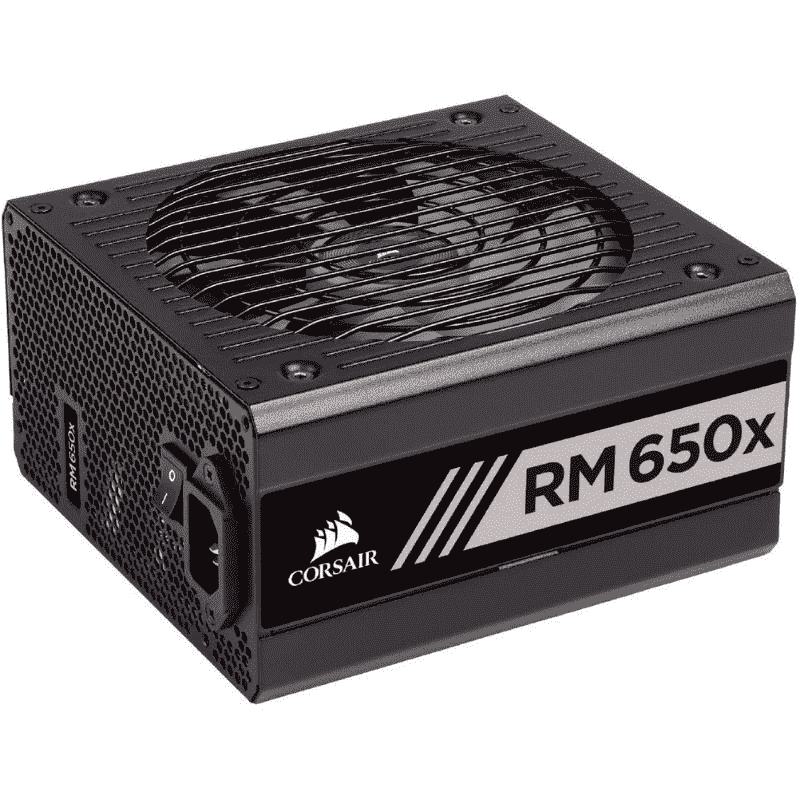

# 主流游戏电脑构建指南:2023 年游戏所需的最佳电脑部件

> 原文：<https://www.xda-developers.com/mainstream-gaming-pc-build-guide/>

如果你想在市场上建立一个新的游戏电脑，那么你就登陆了正确的页面。我们已经有了几个其他的电脑指南，包括一个针对[发烧友游戏电脑版本](https://www.xda-developers.com/premium-gaming-pc-guide/)的指南和一个针对[基于英特尔的流媒体电脑版本](https://www.xda-developers.com/intel-gaming-streaming-pc-guide/)的指南。今天，我们将看看市场上可以买到的主流游戏电脑部件。这些是我们现在在 2023 年初向任何希望组装一个平衡价格和性能的体面游戏装备的人推荐的组件。

随着 2023 年的开始，我们看到 CPU、存储和内存的巨大交易，尽管 GPU 短缺已经结束，但 GPU 仍然非常昂贵。事实上，GPU 短缺的结束似乎并没有真正降低价格，所以你仍然会在这方面花费相当多的现金。你可能会忍不住等待，看看情况是否会有所改善，但我们不会赌 GPU 价格会突然暴跌。

## 主流电脑的最佳 CPU:英特尔酷睿 i5-13400

AMD 曾经统治着预算 CPU 领域，但现在实际上是英特尔提供了最好的回报。酷睿 i5-13400 是英特尔新的主流冠军，它配备的内核比上一代的预算冠军酷睿 i5-12400 多得多。我们仍然推荐 12400，因为它便宜得多，但在 13400 的更高性能和第 12 代 CPU 价格上涨的事实之间，13400 似乎是更好的选择。

大约 250 美元，13400 提供了 10 个内核(尽管其中四个是较慢的 E-core ),您可以在多线程应用程序中获得相当不错的性能。13400 在游戏方面也相当不错，尽管它无法与更高端的英特尔和 AMD CPUs 相媲美，但如果你只是瞄准典型的 60 到 120 FPS，你会对 13400 更加满意。

13400 明显缺少的一点是表示超频支持的-K 后缀。虽然超频从来都不是特别主流，但它离主流更远了，因为 CPU 的时钟速度越来越高，使超频不再像过去那样有吸引力。13400 配备了 4.6GHz 的提升时钟速度，由于其 154 瓦的最大 TDP，您可以非常有信心它将在或接近其提升频率下运行。

还有其他选项向上或向下。还有速度更快的酷睿 i5-13500，带有额外的四个 E 内核，总共 14 个内核，但由于它的价格为 290 美元，而且额外的内核只对生产力应用程序有影响，所以我们不推荐它，除非你知道你需要这些内核。此外还有酷睿 i3-13100，它只有四个内核，价格为 150 美元，明显便宜，但在主流 PC 中，我们强烈建议使用更多内核和更高时钟速度的 CPU。

##### 英特尔酷睿 i5-13400 处理器

酷睿 i5-13400 是英特尔第 13 代价值导向型 CPU，配有 6 个 P 内核和 4 个 E 内核。它兼容 600 和 700 系列芯片组，以及 DDR4 和 DDR5 RAM。

## 主流电脑的最佳显卡:AMD 镭龙 RX 6650 XT

众所周知，GPU 的价格不再合理，这对预算有限的人来说伤害最大。对于主流 PC 来说，Nvidia 根本不再是一个选择，因为它的 30 系列 GPU 零售价格荒谬，而且(在撰写本文时)没有 40 系列的替代品。这样我们就只剩下 AMD 了，它 300 美元的镭龙 RX 6650 XT 足够让你物有所值。

6650 XT 主要面向 1080p 和 1440p 游戏玩家。在绝大多数现代游戏中，它能够在 1080p 下达到 100+ FPS，或在 1440p 下达到 60+ FPS，这通常是在图形设置为更高质量的情况下。通过降低一些设置，如果你喜欢更流畅的游戏体验，你可以合理地期望达到 144 FPS 或更高。这大约相当于 RTX 3060，这应该是 330 美元，但通常发现近 400 美元。

在功能层面上，6650 XT 不如 3060 或其他 Nvidia GPUs 令人印象深刻。它的光线跟踪性能相当差，但即使是 Nvidia 的中端 GPU 也不足以让光线跟踪真正值得启用，所以没什么大不了的。FSR 2 现在已经足够好了，但是不可否认的是 DLSS 总体上更好。还有一些非游戏功能，如 RTX 语音，可能对一些用户有用，虽然 AMD 通常有自己版本的 Nvidia 功能，但通常它们不太好。

还有其他 AMD 选项。RX 6600 XT 是 6650 XT 的一个非常慢的版本，价格明显更低，但在目前的市场上，6600 XT 似乎要缺货了。还有 RX 6600，速度明显较慢，但售价仅为 200 美元，但和 6600 XT 一样，它也缺货。然后是更高端的 RX 6700 XT 和 RX 6750 XT，这两款产品都比 6650 XT 快得多，但价格约为 400 美元。我们相信 6650 XT 在所有这些选项中获得了价格和性能的最佳平衡。

##### AMD 镭龙 RX 6650 XT

RX 6650 XT 是 RX 6600 XT 的更新版本。它的目标是中端游戏玩家，他们希望获得相对较高的性价比，并能够以 1080p 和 1440p 的速度玩游戏。

## 主流 PC 版本的最佳主板:MSI Pro B660-A

这一代主板也异常昂贵，但幸运的是，它不像 GPU 定价那样糟糕。对于第 13 代 CPU，英特尔的 600 和 700 系列有很多选择，但微星的 Pro B660-A 得到了我们的最终推荐。它 150 美元的价格比我们想要的要高一点，但与其他选择相比，Pro B660-A 的价格是最容易接受的价格之一。

虽然 B660 芯片组可以支持 DDR5 和 PCIe 5.0，但微星决定不在 Pro B660-A 上使用这两种技术，这实际上是一件好事。首先，它有助于保持价格在一个合理的水平；支持其中一种或两种功能的主板价格接近 200 美元。其次，这款电脑不需要 DDR5 内存或 PCIe 5.0 支持。DDR5 RAM 的价格几乎是 DDR4 的两倍，但并没有提供更多的性能。PCIe 5.0 固态硬盘刚刚问世，但非常昂贵，而 PCIe 5.0 GPU 可能还要一年时间。

至于 B660 芯片组，它不支持超频，这很好，因为 13400 也不支持超频，这是它与更高端的 Z690 和 Z790 芯片组相比唯一缺少的东西。获得更高端的主板来获得 DDR5、PCIe 5.0 和超频没有什么错，我们只是认为，如果你想要构建一台既快速又实惠的主流 PC，这是不值得的。

MSI 的 Pro B660-A 售价 150 美元，让这款电脑尽可能便宜，同时提供典型游戏或办公电脑所需的一切。如果你想要更多的 USB 端口、Wi-Fi 和更高的构建质量，你可以考虑 190 美元的 MAG B660 Tomahawk，这是一款非常好的主板，但它的价值不如 Pro B660-A。

##### 微星专业版 B660-A

微星的 Pro B660-A 主板专为中端游戏和生产力而设计。它支持第 12 代和第 13 代英特尔 CPU，使用 DDR4 RAM，并具有两个 PCIe 4.0 NVMe 插槽。

## 主流电脑的最佳内存套件:海盗船复仇 LPX 3200 兆赫

海盗船的复仇 LPX DDR4 RAM 非常受欢迎，理由很充分:它真的很便宜，性能也很好。我们推荐 16GB 的套件，价格约为 50 美元，由于 Pro B660-A 有四个内存插槽，你可以花 100 美元购买两个套件，并拥有 32GB 的内存，这比花 150 美元购买两个 32GB 的套件便宜得多。

至于性能，我们特别推荐的 LPX 套件的频率为 3200MHz，额定为 CL16。这并不是 DDR4 可以实现的最快速度和延迟，但更快的套件不仅非常昂贵，而且通常不会在游戏或其他应用程序中获得大的性能提升。即使将这种内存与 Core i9-13900K 配对也不会有太大问题，除非你试图实现超高的帧速率，而不是实现高质量的图形设置。

在 DDR5 内存变得更便宜之前，DDR4 仍将是大多数用户的最佳选择，海盗船的复仇 LPX 绝对是你能买到的最好(如果不是最好的)价值 DDR4 内存之一。

##### 海盗船复仇 LPX DDR4 内存

这款 DDR4 内存价格实惠、性能可靠，是最低调的设计之一，XMP 的一键式设置。

## 最佳存储驱动器:至关重要的 P5 加 1TB

近年来，固态硬盘的价格大幅下降，现在很容易找到不到 100 美元的 1TB NVMe 硬盘，如 Crucial 的 P5 Plus。P5 Plus 不是市场上最快的 NVMe 固态硬盘，但 1TB 型号的价格为 90 美元，这很难抱怨。这是一个 PCIe 4.0 驱动器，我们推荐的主板支持 PCIe 4.0 固态硬盘，所以只要你遵循指南，你就不必担心兼容性问题。

固态硬盘的性能通常取决于您购买的容量，1TB 版本的 P5 Plus 的顺序读取速度为 6600MB/s，顺序写入速度为 5000 MB/s。2TB 型号具有相同的规格，但 500GB 型号的写入速度为 4000MB/s，这使得 1TB 型号要好得多。1TB 型号的随机读取和写入分别为 630K 和 700k IOPS；其他两种型号仅在读取上有所不同，2TB 型号的速度更高，为 720K，500GB 只有 360K。

考虑到容量和性能，很难证明不购买 1TB P5 Plus 或 1TB SSD 是合理的。如今，500GB 并不多，500GB 固态硬盘的性能几乎总是明显低于更高容量的型号。大多数品牌的最佳价值点也是 1TB，我们特别喜欢 P5 Plus，因为它结合了高速和低成本。

##### 至关重要的 P5 加固态硬盘

至关重要的 P5 Plus 不是市场上最快的 PCIe 4.0 固态硬盘，但就其带来的性能和功能而言，它的价格很合理。

## 最佳 PSU: Corsair RM650x 80 Plus 黄金模块化电源装置

根据我们为这一特定构建选择的部件，650W 的电源单元应该足以为所有组件供电。因此，我们选择了 80+黄金评级的海盗船 RM650x PSU。从技术上来说，你可以使用低瓦数的低端 PSU，但如果你想升级的话，有一些额外的功率也不错。这也是该价格范围内为数不多的可靠模块化 PSU 选项之一，模块化电缆对于 PC 构建体验来说非常方便。对于这种个人电脑，你绝对应该买一个模块化的 PSU。

为了让您了解我们为什么推荐功率超过您技术需求的 PSU，让我们来看看我们选择的器件。13400 的最大 TDP 为 153 瓦，6650 XT 的额定功率为 180 瓦，这意味着仅这些部件就可以消耗约 330 瓦。我们可以估计，电脑中的其他所有东西可能会消耗 50 到 100 瓦的额外功率，这使得这台电脑在满载情况下的功耗约为 400 瓦。如果你想升级到 Core i9-13900K 或 RX 7900 XTX，你会看到额外的 200 瓦，650 瓦的 PSU 给你足够的回旋余地。

您也可以通过选择能效等级较低的 PSU 或更便宜的品牌来节省开支，但您真的不想为了一台 1，000 美元的 PC 而在 PSU 上廉价购买。如果你的预算是几百美元，在 PSU 上节省 50 美元是没有意义的。这是一个可怕的想法，因为如果您的 PSU 出现故障，最好的情况是您需要更换它，最坏的情况是您可能需要更换多个组件。Corsair、Seasonic 和 EVGA 是最值得信赖的电源品牌，我们强烈建议您选择 RM650x 这样的型号。

 <picture></picture> 

Corsair RM650x PSU

##### 海盗船 RM650x

Corsair RM650x 是一款完全模块化的 PSU，可为电脑提供可靠的电源。它还具有 80+的金牌评级，这使它优于许多其他选择。

## 最佳电脑机箱:海盗船 4000D 气流

快速浏览一下我们收集的[最佳电脑机箱](https://www.xda-developers.com/best-pc-cases/)将为您的构建提供大量电脑机箱选项，如果您一直遵循我们的建议，那么只要它支持 ATX 主板，您选择什么机箱都没有太大关系，因为 MSI Pro B660-A 是 ATX 大小的。有许多很好的 ATX 案例可供选择，我们很乐意推荐 Corsair 的 4000D Airflow，这是一款面向中端电脑的中塔式机型，可以支持一些高端升级。

4000D 在组件兼容性和间隙方面尤为强劲。它支持高度高达 170mm 的 CPU 空气冷却器，长度高达 360mm 的 GPU，顶部高达 360mm 的散热器，前端高达 280mm 的散热器。一旦你准备好从 6650 XT 转移，这将为空气和液体 CPU 冷却器以及更长更大的 GPU 提供足够的回旋空间。您甚至可以在这个机箱中安装一些高端组件，而不会有任何问题。

然而，4000D 有一两个潜在的问题。首先，它非常普通和黑暗，虽然我们 PC 社区的许多人讨厌 RGB，但也不是每个人都喜欢纯黑色。其次，4000D 只配备了两个机箱风扇，如果你想在 CPU 和 GPU 上实现良好的温度，这是一个问题。你可能想拿起一些额外的 120 毫米风扇或考虑获得 360 毫米的 AIO 液体冷却器，它基本上可以作为你前面的进气风扇，同时也为 CPU 提供良好的冷却。

4000D 售价 95 美元，有点贵，但总的来说还是值得的。这是一个坚固的箱子，有足够的空间，甚至配有灰尘过滤器。4000D 绝对物有所值，我们看不出有什么理由削减机箱预算，尤其是如果您计划升级 CPU、GPU 或 CPU 冷却器等组件。

##### 海盗船 4000D 气流

海盗船 4000D 气流是你可以买到的最好的气流箱之一，为你的组件提供完整的前后气流。它预装了两个 RGB 120mm 风扇。

## 主流游戏电脑构建指南:价格摘要

下面是根据我们为本指南挑选的零件快速浏览的定价摘要。免责声明，这些价格可能会根据库存和其他因素随时发生变化。下表反映了撰写本文时的价格。

| 

成分

 | 

挂牌价格

 |
| --- | --- |
| **英特尔酷睿 i5-13400** | $250 |
| **AMD 镭龙 RX 6650 XT** | $310 |
| **微星 Pro B660-A DDR4** | $150 |
| **海盗船复仇 LPX 16GB (2 个 8GB) DDR4-3200 内存** | $50 |
| **至关重要的 P5 加 1TB M.2 NVMe SSD** | $90 |
| **Corsair RM650x 80 Plus 黄金模块化 PSU** | $105 |
| **幻像日食 P360A** | $95 |
| **总计** | 【1,050 美元 |

**注:**价格汇总不包括[显示器](http://www.xda-developers.com/best-monitors/)和[耳机](https://www.xda-developers.com/best-gaming-headset/)等配件或外设。我们建议根据你的预算分别挑选。特别是，你可能想要一个中档 CPU 冷却器和一些额外的风扇，这最多会多花 100 美元。此外，我们也建议拿一些[导热膏](https://www.xda-developers.com/best-thermal-paste/)，以便在建造时使用。由于这些组件相对便宜，并且许多构建者可能已经准备好了导热膏、机箱风扇和 CPU 冷却器，所以我们不将它们包括在本指南中。

## 主流游戏 PC 构建指南:最终想法

CPU、存储和 RAM 从来没有这么便宜过，但尽管如此，主流 PC 的价值定位还算不错。这主要是因为 GPU 变得越来越贵，尽管在大多数价格范围内性能并没有上升；一些细分市场甚至出现了业绩下滑，这在不久前几乎是闻所未闻的。此外，当代主板比旧主板贵得多，这在主流 PC 上尤其明显。不过，花 1000 美元，你就能造出一台相当不错的电脑，能以 1080 便士甚至 1440 便士的价格玩任何游戏。