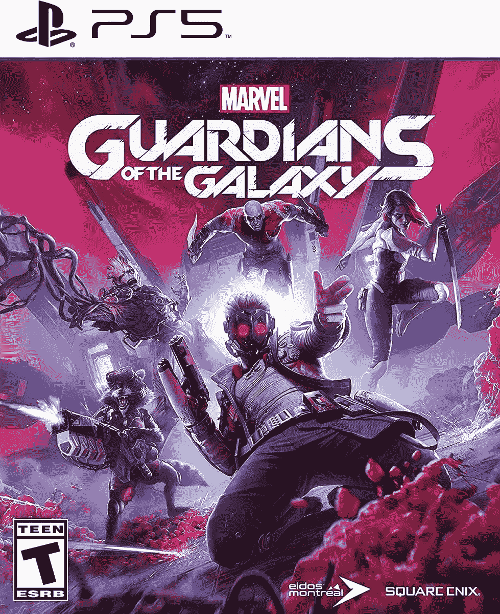
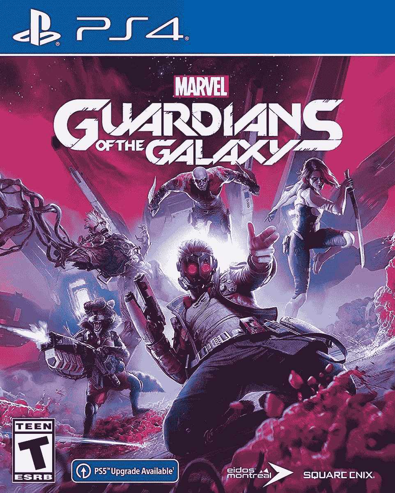
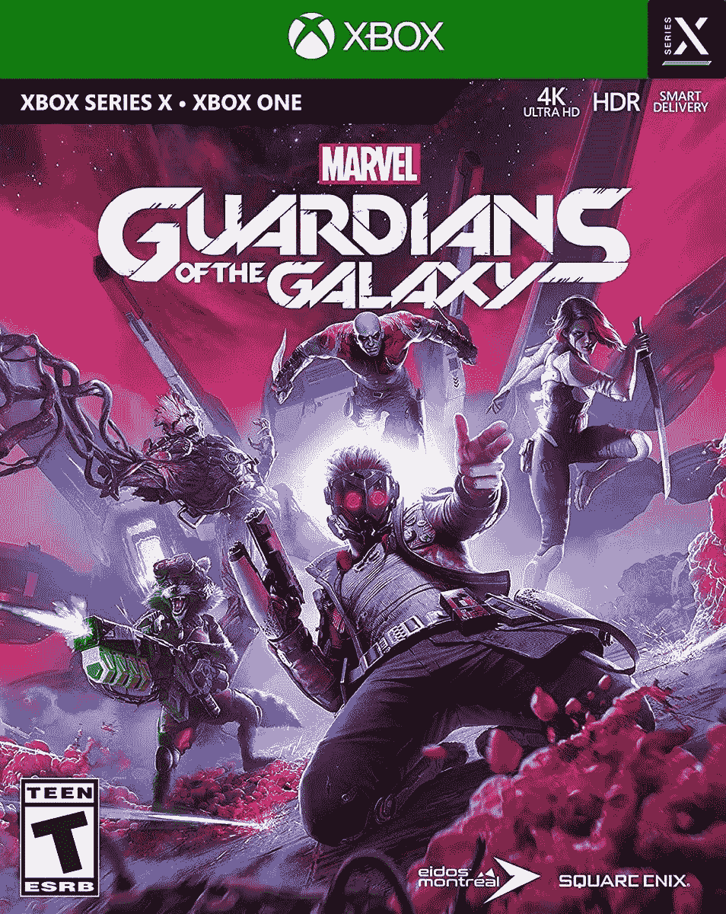

# 漫威的银河护卫队游戏首次发售(30 美元)

> 原文：<https://www.xda-developers.com/marvels-guardians-of-the-galaxy-deal/>

银河护卫队已经收到了迪士尼和漫威影业有限责任公司改编的几部电影，加上几年前的一个泄密游戏系列，但 Square Enix 上个月发布了一款基于漫画的新视频游戏。*漫威的银河护卫队*因其故事和视觉效果获得好评，游戏的主机版首次以 30 美元的价格出售。那是原价的一半。

这是一款第三人称动作冒险游戏，你扮演星际领主，穿着喷射靴在空中飞行，用元素枪射击坏人。加莫拉、火箭浣熊、格鲁特和毁灭者德拉斯也跟着来帮你，他们每个人都有独特的技能和能力。尽管与《漫威电影宇宙》中的*和*银河护卫队的电影有明显的相似之处，但 Square Enix 对漫画的看法还是有点不同。

 <picture></picture> 

Marvel’s Guardians of the Galaxy: PlayStation 5

##### 漫威的银河护卫队:ps5

这是游戏的 PS5 版本，打折到 30 美元。

 <picture></picture> 

Marvel’s Guardians of the Galaxy: PlayStation 4

##### 漫威的银河护卫队:ps4

这是 PS4 版的*银河护卫队*，售价也是 30 美元。

 <picture></picture> 

Marvel’s Guardians of the Galaxy: Xbox

##### 漫威的银河护卫队:Xbox

Xbox 版本可以在 Xbox One 和 Xbox Series X/S 游戏机上运行，售价为 30 美元。

以下是来自 Square Enix 的官方游戏描述:

> 在漫威的银河护卫队展开一场穿越宇宙的狂野之旅。在这款第三人称动作冒险游戏中，你是星际领主，由于你大胆但有问题的领导能力，你已经说服了一群不太可能成为英雄的古怪船员加入你的行列。一些混蛋(肯定不是你)引发了一连串的灾难性事件，只有你能让不可预知的守护者们团结在一起足够长的时间来对抗星际间的彻底融化。使用元素爆能枪，追踪小组痛打，喷射靴动力踢腿，没有什么是禁止的。
> 
> 如果你认为这一切都是有计划的，你将进入一个充满惊喜的世界，你的行为保证会让守护者们保持警觉。在这个原创的漫威银河护卫队故事中，你将遇到强大的新生物和独特的标志性人物，他们都陷入了对银河系命运的斗争中。是时候向宇宙展示你的实力了。
> 
> 你能行的。大概吧。

漫威的《银河护卫队》大部分都受到了评论家和玩家的好评，PS5 版本在 Metacritic 上排名 80/100。故事和对话是这个游戏的主要优点，但是玩起来也很有趣。一些评论指出，战斗可能会在游戏后期变得有点重复，但总的来说，如果你是漫威的粉丝，这 30 美元绝对是值得的。