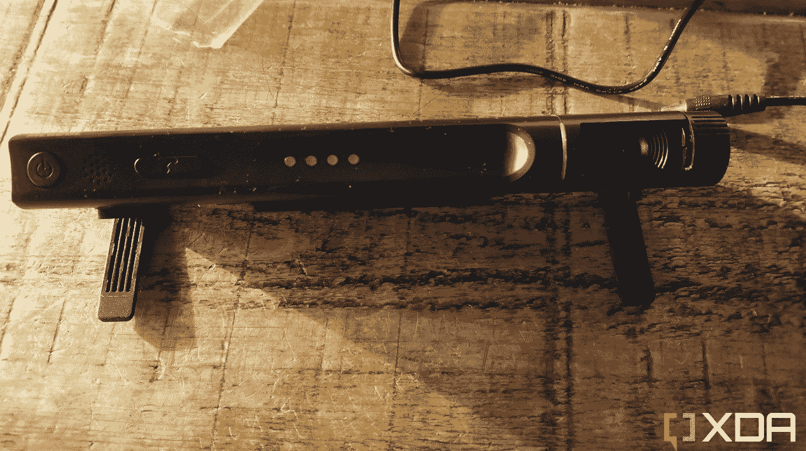

# Mecool Now KA2 安卓电视评论:可以更智能

> 原文：<https://www.xda-developers.com/mecool-now-ka2-android-tv-review/>

如果你想和一群人视频聊天，比如你的家人，有时电脑屏幕会有点小。现在，Mecool 为您的电视引入了一个附加摄像头，当您聊天时，它可以让您将整个小组纳入框架。Mecool Now KA2 是 Mecool 的最新 Android 电视摄像机产品，其中包括一系列家庭娱乐产品、盒子和棒。它还提供一系列附件，如闪存盘、键盘和遥控器。

Mecool Now KA2 智能摄像头位于您的电视顶部，不仅为您提供功能齐全的 Android 电视，还可以作为您电视的网络摄像头，同时为您提供可定制的隐私。但如果你想坐在沙发上打视频电话，这是最好的选择吗？让我们来看看。

***关于这篇评测**:这篇评测是在测试了一台带视频通话的 Mecool Now KA2 智能相机之后写的。Mecool 在这篇文章中没有任何投入。*

Mecool Now KA2 Android TV 是一种直接在沙发上拨打和接听视频电话的绝佳方式。你需要做的就是把这个机顶盒放在你的电视上，设置好，你就可以开始了。

**Key Features**

*   视频通话内置
*   安卓电视应用
*   摄像头和麦克风的隐私

**Specifications**

*   **尺寸:** 7.87 x 2.75 x 1.03 英寸(200 x 70 x 25mm 毫米)
*   **重量:** 0.46 磅(209 克)
*   **电源输入:** 5V / 2A

**Pros**

*   超级容易设置
*   坐在沙发上，不用手接电话
*   为麦克风和摄像头安装的隐私功能

**Cons**

*   只用谷歌打电话
*   没有网飞应用程序

## Mecool Now KA2 Android 电视和视频通话摄像头:价格和可用性

*   你只能在 Mecool 的网站上以 124.99 美元的价格购买机顶盒

Mecool Now KA2 Android 电视和相机在 Mecool 的网站上出售，售价为 124.99 美元。现在，如果你使用 code BLACK，你可以在网站上获得 15%的折扣和免费送货。它之前在亚马逊等第三方零售商上有售，但目前缺货。

## Mecool Now KA2 摄像机:硬件

*   可调式缓冲垫有助于该装置稳固地放置在电视顶部
*   手动滑动摄像头保护隐私
*   滑动开关关闭麦克风

Meecool Now KA2 Android 电视和相机单元具有流线型外观，你可以在下面的照片中看到。设备的前面有电源开关、红外接收器和一键接听按钮。有四个 LED 灯，根据功能显示一系列颜色。在右手边，有一个带 LED 显示屏的摄像头，可以显示摄像头的使用、开启或关闭状态。

 <picture></picture> 

Mecool Now KA2

如果你担心每次你坐在电视机前时你的相机会对着你，这款设备还配有一个麦克风隐私开关和一个滚花轮，当转动时，它会用一个物理盖子盖住相机镜头。

在该单元下方，有一个电源插孔端口、一个 HDMI 输入和输出端口以及一个网络端口。

有两个可调节的支脚可以下降到设备的后部，以防止它向前滑出电视屏幕。还有一个橡胶缓冲器，可以抬起来阻止该单元向前滑出电视屏幕。这些很容易调整，虽然腿有点僵硬，但即使是最纤薄的电视机也可以调整到合适的位置。我的电视机大约有 1 厘米厚，而 Mecool 正好放在电视机的顶部

## Mecool Now KA2 Android 电视和视频通话摄像头:软件和安装

*   易于与遥控器配对
*   一键访问 Google Meet
*   易于安装和使用遥控器

安装 Mecool Now KA2 Android 电视摄像头就像它的设计一样简单。您只需将 HDMI 线缆连接到电视和 Mecool 设备，插上电源，然后打开设备。将遥控器与相机配对(插入两节 AAA 电池后)，登录您的 Google 帐户，然后开始通话。整个安装过程只需要几分钟。

然后，您需要做的就是登录并开始给联系人列表中的人打电话。请注意，这款 Android 电视和摄像头只能与 Google Meet 视频通话软件配合使用，因此在设置之前，请确保您已经准备好了一个 Google 帐户。

我发现 Mecool Now KA2 智能相机软件很容易与遥控器配对。打开相机，将电池放入遥控器。当屏幕出现时，同时单击音量降低和输入按钮，直到设备闪烁。然后，它会将遥控器与 Mecool Now KA2 机顶盒配对。

应用程序连接后，单击遥控器上的 Google Duo 按钮即可访问 Google Meet 屏幕。只要确保你有最新版本的 Google Duo——也就是现在所知的 Google Meet。

虽然我遇到了一个问题，但我还是很快就把机顶盒安装好了。我按照用户指南中的说明，点击了遥控器上的 Google Duo 按钮，并迅速启动了 Google Meet。然而，我看不到任何联系人，也不能在屏幕上创建任何组。我的联系人列表是空的，这令人费解。我花了很长时间才弄明白这个问题:如果列表中没有显示任何支持 Google Meet 的联系人，我就不能给我的任何联系人打电话，我也找不到在哪里添加他们。然后。一切都变得清晰了。我现有的所有联系人都已同步到我的 Outlook 帐户。我从未在我的任何设备上使用谷歌通讯录保存过任何姓名。

这对我来说是个大问题。我希望有权选择在哪里保存和同步我的联系人，我的选择不是谷歌。当然，如果你有一个 Android 设备或者专门使用 Gmail，那么你就不会碰到这个问题。然而，我在我的 Android 上咬了子弹，我在谷歌的联系人中添加了几个名字，所以我可以正确地测试这个功能。当我把联系人添加到我的谷歌账户上时，一切都很完美。

## Mecool Now KA2 Android 电视和视频通话摄像头:功能

*   拨打电话很简单
*   画中画模式
*   遥控呼叫

从该设备拨打电话很简单。使用遥控器向下滚动至所需姓名，然后单击“通话”,使用视频或语音通话。如果对方从他们的移动设备回复，您就可以开始通话了。您也可以从电视上接听电话。如果设备响起，您可以触摸设备顶部的按钮并接听电话。确保您已经打开了摄像头上的滑动盖和麦克风滑块。

当您不使用 Mecool Now KA2 进行视频通话时，您可以利用 [Android TV](https://www.xda-developers.com/best-android-tv-box/) 并使用任何内置应用程序，如 YouTube、Prime Video、Google Play 和抖音。然而，没有网飞，这对一些人来说可能是一个障碍。你还可以使用谷歌助手进行基本的智能控制。

不幸的是，虽然有很多很好的过滤器可以在移动设备上使用，但你不能在通话结束时使用 Mecool Now KA2 Android TV 和摄像机。你能使用的唯一奇特的效果是在房间里镜像摄像机。画中画模式在屏幕上向另一方显示房间的可见部分。

除了缺少过滤器和效果之外，通话的工作方式与移动设备之间的通话完全一样。唯一的区别是你的电视变成了屏幕。您可以坐在沙发上与朋友聊天，而无需拿着移动设备或四处移动来适应每个人的镜头。有了这个小工具，视频通话的体验要好得多。

给联系人打电话很容易，在手机上接听来电也很简单。我还喜欢你可以关掉麦克风，在镜头上盖上盖子，以确保你的隐私得到保障。

市场上还有其他电视摄像机，比如价格更贵的[脸书 Meta Portal](https://www.amazon.com/Facebook-Portal-Smart-Video-Calling/dp/B07XPLJ9TZ?tag=xda-43s0n7u-20&ascsubtag=UUxdaUeUpU1000158&asc_refurl=https%3A%2F%2Fwww.xda-developers.com%2Fmecool-now-ka2-android-tv-review%2F&asc_campaign=Authority) ，或者亚马逊的 [Echo Show](https://www.amazon.com/echo-show-10/dp/B07VHZ41L8/?tag=xda-43s0n7u-20&ascsubtag=UUxdaUeUpU1000158&asc_refurl=https%3A%2F%2Fwww.xda-developers.com%2Fmecool-now-ka2-android-tv-review%2F&asc_campaign=Authority) 和 blink Mini bundle。元摄像头在调用平台方面要灵活得多，但它不能提供完整的 Android 电视体验。凭借其内置的智能扬声器，Echo show 将比简单的视频通话做得更多，但屏幕体验要小得多。

## 该不该买一台 Mecool Now KA2 安卓电视和视频通话摄像头？

**您应该购买一台 Mecool Now KA2 Android 电视和视频通话摄像头，前提是:**

*   您经常使用 Google Duo (Meet)与朋友进行视频通话
*   你想让你的家人在屏幕上打电话
*   您希望您的设备设置简单

**你不应该购买 Mecool Now KA2 安卓电视和视频通话摄像头，如果:**

*   您尚未使用 Google Meet 或其他 Google 程序
*   如果你已经有了 Mecool KA1 安卓电视和智能音箱
*   如果您已经有脸书元门户设备

如果你已经有了带智能扬声器的 Android TVMecool KA1，你可能不会觉得有必要升级到 KA2，特别是如果你不需要视频通话的话。虽然 Mecool Now KA2 Android TV 可以让你访问所有你喜欢的多媒体应用程序和视频通话，但它没有很多其他智能功能。

然而，Mecool Now KA2 Android 电视和视频通话摄像头的价格仅为 129 美元，安装和使用都非常简单。你只需要成为谷歌的超级粉丝，就能充分利用它。

##### Mecool Now KA2

Mecool Now KA2 Android TV 是一种直接在沙发上拨打和接听视频电话的绝佳方式。你需要做的就是把这个机顶盒放在你的电视上，设置好，你就可以开始了。