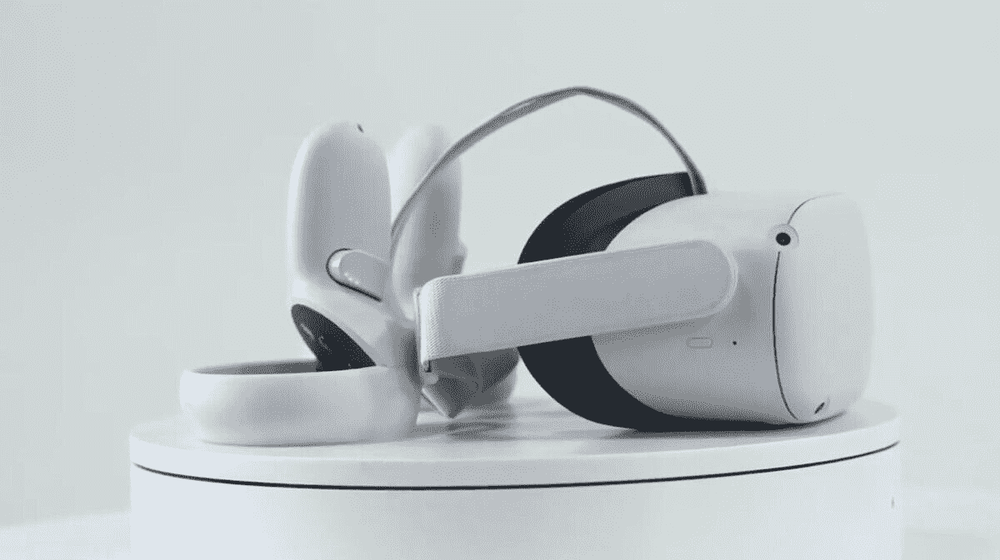

# Meta Quest 2 将从 8 月 1 日起涨价 100 美元

> 原文：<https://www.xda-developers.com/meta-quest-2-100-price-increase/>

# Meta Quest 2 将从 8 月 1 日起涨价 100 美元

Meta Quest 2 将从 8 月 1 日起涨价 100 美元。它还将提高其配件的价格。

如果你想进入虚拟现实，并一直在考虑什么时候可能是一个好时机，那就是现在。Meta 宣布其 Quest 2 VR 耳机将于 8 月份开始涨价。价格上涨是因为 Meta 开始进入虚拟现实的下一个阶段，即将发布其高端项目 Cambria 和 future Quest 耳机。

根据 Oculus 博客上的一篇文章，Meta 将于 8 月 1 日提高其 Quest 2 的价格。这意味着 128GB 的基本型号将售价 399.99 美元，而 256GB 的版本将售价 499.99 美元。具有讽刺意味的是，新价格将与 2019 年首次亮相时的原始 Quest 价格相匹配。虽然这令人惊讶，但 Meta 表示，它这样做是为了继续“投资推动虚拟现实产业的长期发展。”博客还指出，零件和运输成本的上升是罪魁祸首。Meta 还将从 8 月 1 日开始提高配件和翻新型号的价格。

虽然这不是理想的场景，但 Quest 2 是价格最低的 VR 头戴设备之一，提供独立和有线操作。这意味着您可以使用其内部 SoC 独立运行 Quest 2，或者将其连接到 PC 以获得更强大的体验。尽管价格上涨不受欢迎，但也有好的一面。从现在起到今年年底，Meta 将为从 8 月 1 日开始购买任务 2 的任何人免费赠送一份 Beat Saber。Beat Saber 是一款流行的虚拟节奏游戏，很少打折。

## 立即购买！

所以，如果你对虚拟现实感兴趣，你可能想利用 Quest 2 的低价位。

 <picture></picture> 

Meta Quest 2

##### Meta Quest 2 128GB

带有 128GB 内部存储的 Meta Quest 2

 <picture></picture> 

Meta Quest 2

##### Meta Quest 2 256GB

带有 256GB 内部存储的 Meta Quest 2

* * *

**来源** : [Oculus 博客](https://www.oculus.com/blog/meta-quest-2-pricing-changes)