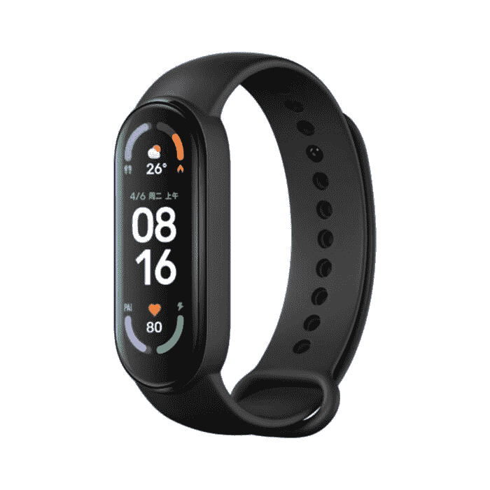

# Mi Band 6 可在美国亚马逊网站上预购

> 原文：<https://www.xda-developers.com/mi-band-6-pre-order-amazon-us/>

# Mi Band 6 可在美国亚马逊网站上预购

小米最新的健身手环 Mi Band 6 现已在美国亚马逊上接受预购。继续阅读，了解更多信息！

自 2014 年推出第一款小米手环以来，小米的可穿戴设备，尤其是小米手环系列，长期以来一直非常畅销。当时，第一款 Mi 手环只有 3 个 LED 灯，没有心脏传感器。7 年后，我们在 [Mi Band 6](https://www.xda-developers.com/xiaomi-mi-band-6/) 中拥有了一个成熟的、高达 450 尼特的边对边 AMOLED 显示屏、几个传感器和更多功能。虽然比第一个版本更贵，但结果是市场上最好的健身带之一。现在，该设备在美国可以预订。

小米在美国销售的设备并不多。智能手机，可以说是他们业务中最大的一块，并没有在北美正式销售。但他们相对较小的美国部门为 Mi TV Stick 和 Mi Box S 等设备以及智能家电和配件(如电源组)提供了例外。

Mi Band 6，或在北美市场将被称为 Mi Smart Band 6，与谷歌支持的 Fitbit 健身手环和其他智能手环直接竞争，从我们自己的 Ben Sin 在他对 Mi Band 6 的评论中收集的[来看，这是一款几乎一切都正确的出色设备，特别是考虑到它的价格点。SpO2 传感器等功能使该设备成为其前身 Mi Band 5 的引人注目的升级。](https://www.xda-developers.com/xiaomi-mi-band-6-review/)

| 

规范

 | 

Mi 乐队 6

 |
| --- | --- |
| **尺寸和重量** |  |
| **材料** | 聚碳酸酯 |
| **腕带** | 硅酮 |
| **兼容性** | 安卓、iPhone |
| **RAM/存储器** | 512KB 内存，16MB 存储空间 |
| **显示** | 1.56 英寸 AMOLED (152 x 486)450 尼特亮度 |
| **连通性** | 蓝牙 v5 BLE |
| **GPS** | 不 |
| **传感器** | 

*   PPG 心率传感器
*   三轴加速度计
*   三轴陀螺仪
*   晴雨表
*   近程传感器

 |
| **NFC 支付** | 是 |
| **电池** | 125 毫安时 |
| **耐水性** | 5 个大气压或 50 米，在淡水中最多 30 分钟 |

如果你有兴趣购买的话，可以点击下面的链接查看亚马逊的列表。

 <picture></picture> 

Xiaomi Mi Band 6

##### 小米 Mi Band 6

小米 Mi Band 6 是一款出色的健身手环，配有 1.53 英寸 AMOLED 显示屏、PPG 心率传感器、3 轴加速度计和陀螺仪、SpO2 传感器等等。