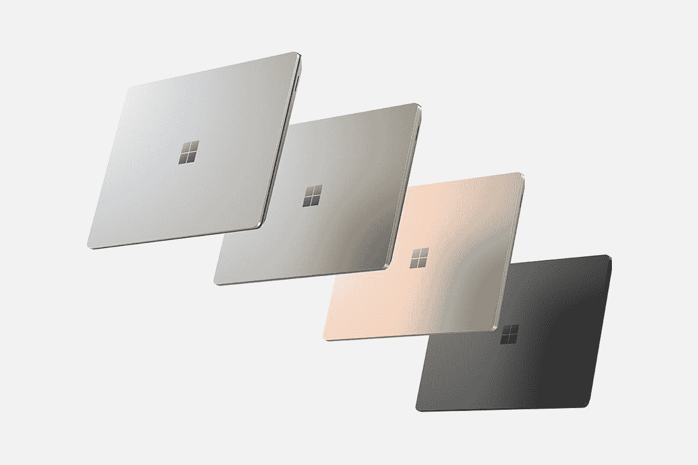

# 微软在 Surface Laptop 5 中增加了第 12 代处理器，而不是其他

> 原文：<https://www.xda-developers.com/microsoft-12th-gen-processors-surface-laptop-5/>

微软今天举行一年一度的 10 月硬件活动，除了 [Surface Pro 9](https://www.xda-developers.com/surface-pro-9/) 和 [Surface Studio 2+](https://www.xda-developers.com/surface-studio-2-plus/) 之外，它还推出了 [Surface Laptop 5](https://www.xda-developers.com/surface-laptop-5/) 。虽然去年的 Surface Pro 8 进行了重大的重新设计，并与创新的 Surface Laptop Studio 一起推出，这是一款重新设计的 Surface Book，但许多人预计会从 Surface Laptop 5 中看到很多东西。

可悲的是，这里没有太多可看的，该产品没有得到其他 Surface 产品所得到的许多改进。事实上，到目前为止，每一款 premium Surface 都得到了改进，比如 120Hz 显示屏和 FHD 网络摄像头。

## 英特尔第 12 代处理器

Surface Laptop 5 最大的变化是，13.5 英寸和 15 英寸型号都配备了英特尔的第 12 代 U 系列处理器，13.5 英寸型号可以是酷睿 i5-1235U 或酷睿 i7-1255U，15 英寸版本只有酷睿 i7。

是的，这意味着传言是真的，没有 AMD 的型号。Surface Laptop 过去的两次迭代提供了英特尔和 AMD 两种选择，微软通常使用上一代 AMD 芯片和当前一代英特尔处理器；然而，有传言称 Surface Laptop 5 是为锐龙 6000 设计的。不清楚两家公司中哪一家退出了。

微软发言人在给 XDA 的一份声明中说:“对于每一款产品，我们都以取悦客户为目标，为我们预想的形式、场景和客户选择正确的组件。”。“这是一个深思熟虑的过程，我们通过与合作伙伴密切合作来调整和完善整体体验。对于该产品，我们对英特尔的第 12 代处理器感到兴奋。该芯片组基于英特尔 Evo 平台构建，将有助于 Surface Laptop 5 实现时尚和功耗的完美平衡。这种平衡一直导致 Surface Laptop 成为我们最喜爱的 Surface 设备。”

当然，所有的英特尔处理器意味着 Surface Laptop 5 第一次配备了 Thunderbolt 4。这意味着你可以使用该端口进行简单的充电，或者你可以用它来点亮双 4K 显示器。这是最通用的港口。

不幸的是，微软仍然只使用一个 USB Type-C 端口，因为它坚持使用其专有的 Surface Connect 端口。还有一个 USB 3.1 型端口。

## 今年的新颜色是鼠尾草色，但是没有阿尔坎塔拉

每年，Surface 笔记本电脑至少都会有一种新颜色。因此，虽然 Surface Laptop 5 真的没有现代化，但它确实有与 Surface Laptop Go 2[一起首次亮相的鼠尾草色。为了给它腾出空间，上一代推出的冰蓝色被踢到了路边。](https://www.xda-developers.com/surface-laptop-go-2/)

Surface Laptop 5 15 仍然只有铂金和哑光黑可选，而 Surface Laptop 5 13.5 则有铂金、鼠尾草、哑光黑和砂岩可选。13.5 英寸的铂金机型是唯一一款键盘上仍有 Alcantara 面料的机型，这曾是 Surface 笔记本电脑的标志性特征。

如上所述，微软还没有添加它在其他产品中添加的改进。13.5 寸和 15 寸的屏幕都是 201ppi，还是 60Hz。网络摄像头仍然是 720p，尽管该公司自 2014 年以来一直在 Surface Pro 中使用至少 1080p 传感器。事实上，由于这是英特尔 Evo 规范的推荐部分，大多数行业都在高端产品中至少使用 FHD 网络摄像头。

Surface Laptop 5 定于 10 月 25 日上市。它将采用以下配置:

| 

屏幕大小

 | 

处理器

 | 

随机存取存储

 | 

储存；储备

 | 

颜色；色彩；色调

 | 

价格

 |
| --- | --- | --- | --- | --- | --- |
| 13.5 | 酷睿 i5 | 8GB | 256GB | 铂 | $999.99 |
| 13.5 | 酷睿 i5 | 8GB | 512GB | 白金、黑色、鼠尾草、砂岩 | $1,299.99 |
| 13.5 | 酷睿 i5 | 16GB | 512GB | 白金、黑色、鼠尾草、砂岩 | $1,499.99 |
| 13.5 | 酷睿 i7 | 16GB | 512GB | 白金、黑色、鼠尾草、砂岩 | $1,699.99 |
| 15 | 酷睿 i7 | 8GB | 256GB | 铂 | $1,299.99 |
| 15 | 酷睿 i7 | 8GB | 512GB | 铂金，黑色 | $1,499.99 |
| 15 | 酷睿 i7 | 16GB | 512GB | 铂金，黑色 | $1,799.99 |
| 15 | 酷睿 i7 | 16GB | 1TB | 黑色 | $2,399.99 |

 <picture></picture> 

Surface Laptop 5

##### Surface 笔记本电脑 5

Surface Laptop 5 是一款高端笔记本电脑，采用第 12 代英特尔处理器和其他高端规格。它甚至首次支持 Thunderbolt 4。