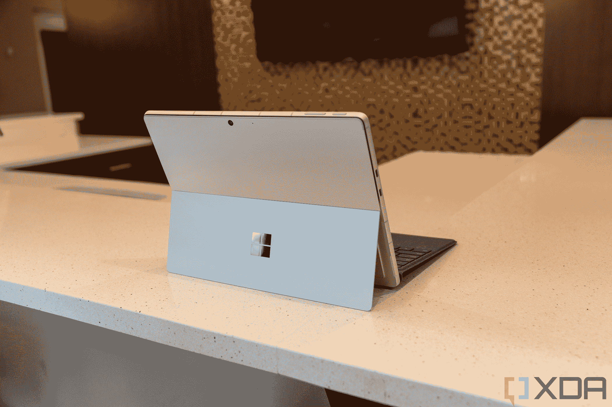

# 微软 2022 年回顾:无聊的硬件升级，新的大软件，和一个巨大的收购

> 原文：<https://www.xda-developers.com/microsoft-2022-year-in-review/>

这几乎难以置信，但我们已经接近了又一年的尾声，2022 年对微软来说无疑是多事之秋。随着 Windows 11 在世界各地的更多设备上发布，给用户带来了全新的外观和体验，微软有更多的东西要宣布。无论是新的 Surface 设备形式的硬件、Windows 11 的重大更新，还是有史以来对游戏公司的最大收购，微软都交付了很多——但在一些方面也有所欠缺。

随着这一年即将结束，这是一个很好的时间来回顾所有的重大事件和微软为我们提供的公告，因为我们正在为未来的一年做准备。

## 700 亿美元收购动视

微软以一个你可能会想到的最大的重磅炸弹开始了新的一年。就在一月中旬，微软宣布以高达 687 亿美元的价格收购视频游戏开发商和发行商动视暴雪。这一重大宣布代表着游戏行业有史以来最大的收购，这一记录是微软自己在不久前通过收购 ZeniMax Media 打破的。这也是微软作为一个整体有史以来最大的一次压倒性收购(第二名是 GitHub，微软在 2016 年以 262 亿美元收购了 GitHub)。

如果收购最终完成，一些最具标志性的游戏特许经营权将归属于微软，包括*使命召唤*系列、*暗黑破坏神*、*守望*，以及由 King 开发和发布的手机游戏，其中包括*糖果粉碎传奇*。微软希望扩展到移动游戏领域，这是视频游戏行业越来越大的一部分，此次收购也是为了帮助实现这一目标，除了支持其 Xbox 平台。有趣的是，这笔交易也有利于任天堂粉丝，微软承诺在未来 10 年将*使命召唤*特许经营权带到索尼和任天堂平台。

收购动视暴雪的交易面临一些法律挑战，正在接受英国和美国监管机构的审查。最近，美国美国联邦贸易委员会宣布将提起诉讼，以阻止收购的发生，尽管微软和动视暴雪仍然相信这笔交易将获得通过。这还没有发生，但是仅仅是声明就引起了这样的冲击波。这只是今年的开始！

## Windows 11 上的 Android 应用

微软的下一个重大事件是推出 Android 的 Windows 子系统。事实上，Windows 10 诞生之初承诺的一项功能终于在 Windows 11 中实现了:在 Windows PC 上运行 Android 应用的能力。

Android 的 Windows 子系统是通过与亚马逊应用商店的合作推出的，最初为美国用户带来了约 1000 款应用。然而，自那以后，它已经显著扩大，微软现在通过 Windows 11 上的亚马逊应用商店推出了超过 50，000 个应用程序，你可以在 31 个国家获得它们。如果亚马逊 Appstore 上的应用还不够，更精明的用户可以下载几乎任何他们想要的应用，只要不需要谷歌服务。

微软也在这一年里不断改进 Android 体验。基于触摸的游戏控制更好，相机质量有所提高，甚至 [Android 13](https://www.xda-developers.com/android-13) 和[即将推出](https://www.xda-developers.com/windows-subsystem-for-android-runs-android-13-in-beta/)。在 PC 上玩 Android 游戏或在 Windows 上开发和测试 Android 应用程序比以往任何时候都更容易。

## Windows 11 版本 22H2 或 2022 更新

这还不是 Windows 11 用户的全部消息。在 2021 年 10 月的大发布后，微软开始致力于下一个大的 Windows 11 更新，官方称为 Windows 11 2022 更新，或 Windows 11 版本 22H2。作为 Windows 11 的第一次重大更新，它包含了许多变化，更多的变化将通过较小的后续更新推出。

此次更新最令人期待的变化之一是在文件浏览器中添加标签，这是微软在 Windows 10 上试验了几年后于 4 月份首次宣布的。标签使得[文件浏览器](https://www.xda-developers.com/windows-11-2022-update-file-explorer-guide/)工作起来更像一个网络浏览器，所以管理你的文件变得更容易，而不必打开多个窗口并管理它们。这是 10 月份推出的一个较小更新的功能之一，但它仍然是一个巨大的功能。

还有更多。“开始”菜单现在有文件夹，您可以更改固定和推荐区域的大小，并且任务管理器已经完全重新设计。不久之后，微软还推出了一款新的照片应用[,对 iCloud Photos 进行了彻底的重新设计和整合。](https://www.xda-developers.com/windows-11-photos/)

微软甚至对平板电脑的使用做了一些巨大的改进。现在，您可以使用滑动手势来打开或关闭“开始”菜单并进行导航。类似地，通知和快速设置面板也可以通过滑动手势打开。当你使用全屏应用时，有一个新的抓取器，有助于防止意外滑动。 [Windows 11 平板电脑](https://www.xda-developers.com/best-windows-tablets/)现在只是好了很多。

## Arm 设备受到重视的一年

虽然这不是一个单一的事件，但 2022 年也是微软最终意识到基于 Arm 的设备的重要性的一年，这无疑要归功于苹果硅 MAC 的蓬勃发展。在其 Build 活动期间，微软宣布计划为 Arm 用户提供完整的开发人员工具链，包括对 Visual Studio、Windows 终端等的原生支持。当然，由于大多数 Android 应用程序都是为 Arm 设计的，它们在 Arm 设备上应该也能运行得更好。

推动 Arm 的一部分是 Volterra 项目，官方称为 [Windows 开发工具包 2023](https://www.xda-developers.com/project-volterra-is-now-windows-dev-kit-2023-available-for-599/) 。这是一台 Arm 驱动的开发机器，旨在使用现在支持 Arm 的所有开发工具。这使得使用单一设备开发和测试为 Arm 设计的 Windows 应用程序比以往任何时候都更容易，希望在不久的将来会有更多的 Arm 应用程序出现在用户面前。微软自己更新了许多内置的 Windows 11 应用程序，以原生支持 Arm，如相机应用程序、记事本和微软商店。

当然，2022 年，我们终于有了搭载更快 Arm 处理器的 Windows 电脑，高通骁龙 8cx Gen 3。没有多少设备使用它，但除了 Project Volterra，我们还有[联想 ThinkPad 13s](https://www.xda-developers.com/lenovo-thinkbook-13s-gen-4-review/) 和微软自己的 Surface Pro 9，它们最终开始实现微软在 Arm 支持下承诺的一切。最好的还在后面，但是 2022 年对 Arm 设备上的 Windows 来说无疑是一个转折点。

## Surface Laptop Go 2:非常受欢迎的升级

说到设备，是时候谈谈微软 2022 年的 Surface 产品了，这些产品总体来说不怎么样，但仍有不错的升级。首先，我们在 6 月份推出了 Surface Laptop Go 2，这是微软廉价笔记本电脑急需的更新。

这款车型与前代车型相比并没有太大变化，但它的变化非常受欢迎。最值得注意的是，我们已经从英特尔酷睿 i5-1035G1 升级到酷睿 i5-1135G7，这是一个巨大的升级。英特尔第 11 代处理器在 CPU 方面提供了一些重大的性能改进，但在 GPU 方面，英特尔 Iris Xe 显卡的性能改进更大。最初的型号适合学校使用，但新型号的价格合理。

这款机型还配备了略有改进的 720p 网络摄像头和新颜色 Sage，我们将在今年晚些时候的 Surface Laptop 5 中再次看到这一点。正如我们在评论中所说，Surface Laptop Go 2 并没有震撼世界，但它是一款“令人愉快的入门级笔记本电脑”[。](http://www.xda-developers.com/surface-laptop-go-2-review/)

## Surface Laptop 5:乏味但必要的更新

接近年底时，微软也发布了年度秋季硬件活动，随之而来的是 Surface Laptop 5。这是另一个设备，做最低限度的升级是值得的，但有时最低限度就足够了。

Surface Laptop 5 与前代相比有一个重大变化，这就是规格。之前的两种型号都有 AMD 和 Intel 版本，但现在，AMD 已经完全从产品线中删除，我们得到的都是第 12 代 Intel 处理器。它们仍然提供受欢迎的性能升级，微软足够聪明地坚持使用 15W U 系列处理器，而不是更耗电的 P 系列，许多公司都没有这样做。

规格中没有太多变化，但有一点需要改变；USB Type-C 端口现在支持 Thunderbolt 4，这意味着您可以将坞站、显示器或外部 GPU 连接到笔记本电脑，以大大增加其功能。微软首先通过 Surface Pro 9 和 Laptop Studio 将 Thunderbolt 引入其设备，但这是第一款支持该功能的主流笔记本电脑。现在，将这款笔记本电脑连接到办公桌上的工作装置，并在您准备离开时断开连接比以往任何时候都更容易。

然而，很多本该升级的东西却没有升级。设计和显示与我们在过去两代产品中看到的一样(在某种程度上，从第一次迭代开始)，网络摄像头仍然只有 720p。

与 Surface Laptop Go 2 类似，13-5 英寸的 Surface Laptop 5 也采用了新的鼠尾草色，取代了冰蓝色。这种新颜色缺少 Alcantara 腕托，因此铂金是目前唯一提供这种颜色的选择。

## Surface Pro 9:Surface Pro 终于有颜色了

除了 Surface Laptop 5，微软还推出了 [Surface Pro 9](https://www.xda-developers.com/surface-pro-9/) 。这是一个大的。在内部，它与以前基本相同，但采用了升级的英特尔第 12 代处理器。这带来了显著的性能提升，当然，我们不会抱怨这一点。

但是今年的大新闻是引入了颜色。自 2012 年问世以来，Surface Pro 系列几乎每次都只有一种颜色。第一个型号是黑色的，然后我们得到了白金，这成为多年来的标准，直到我们最终从 Surface Pro 6 开始再次得到哑光黑色/石墨型号。但在 2022 年，我们终于有了真正的颜色。除了铂和石墨，Surface Pro 9 还采用了令人惊叹的蓝宝石和几乎同样美丽的森林配色。这些颜色实际上比 Surface 笔记本电脑系列更有活力，它们看起来非常棒。当然，还有彩色键盘可以搭配。

然而，这款新机型也有一些缺点，最明显的是取消了耳机插孔。Surface Pro 9 有两个 Thunderbolt 4 端口和 Surface Connect，但仅此而已。尽管如此，光是颜色就让它成为一个非常令人兴奋的设备。

## 支持 5G 的 Surface Pro 9:一款真正伟大的 Windows Arm 平板电脑

除了针对 Arm 设备的软件改进，微软还对其基于 Arm 的平板电脑进行了一些重大的硬件改进。Surface Pro X 终于长大了，并成为 5G 的 Surface Pro 9，这是微软的一个标志，表明 [Arm 终于准备好被视为主要 Surface Pro 系列](http://www.xda-developers.com/surface-pro-9-windows-on-arm-ready-mainstream/)的一部分。

5G 版 Surface Pro 9 由微软 SQ3 处理器提供支持，这是高通骁龙 8cx Gen 3 的调整版本，与前代产品相比，它为桌面带来了更高的性能。它也是第一款支持 5G 而不仅仅是 LTE 的 Surface 设备，所以在连接方面应该更经得起未来的考验。

但是还有更多。微软将这个硬件放在了与普通 Surface Pro 9 相同的机箱中，这意味着它现在稍微厚了一些，而且它也有更大的电池。得益于此，Surface Pro 9 和 5G 是第一款真正实现全天电池续航承诺的设备，搭载了 Arm 上的 Windows。这是可移植性的一个重要因素，很高兴最终看到微软实现了这一点。配合始终在线的连接，这是一款非常适合在旅途中工作的设备。

[我们评测了 Surface Pro 9](https://www.xda-developers.com/surface-pro-9-5g-review/) ，发现它是 Arm 有史以来最好的 Windows。它给了我们对未来的希望。

## Surface Studio 2 Plus:为什么？一年中的重要时刻

除了这些伟大的设备，微软还推出了一款很久以来最奇怪的产品，Surface Studio 2 Plus。这是对已有四年历史的 Surface Studio 2 的[升级，考虑到那个年龄，你可能会认为这是一个大的。事实上，这是一个非常平淡无奇的公告，有一些令人质疑的决定。](https://www.xda-developers.com/surface-studio-2-plus-vs-surface-studio-2/)

首先，Surface Studio 2 Plus 几乎没有改变产品的设计。最初的 Surface Studio 2 看起来仍然非常现代，但它的大挡板在今天会被一些人认为不雅观。话虽如此，微软确实对端口进行了更改，在背面添加了三个 Thunderbolt 4 端口，以取代 Surface Studio 2 中的一些 A 型端口。

规格也升级了，但没有你想象的那么多。我们得到了 35W 的第 11 代处理器，这些处理器已经过时，并且比以前型号的处理器的额定功率低。微软还升级到 Nvidia GeForce RTX 3060 笔记本电脑 GPU，提供更好的图形性能。性能有所提高，但仍落后于 2022 年的大多数高端一体机。

真正令人困惑的是，在没有重大设计变化和过时规格的情况下，如果你想要完整的体验，微软仍然对这款设备收取 4500 美元。这次只有一种配置可用，所以你没有选择花费更少。这个产品的目标受众似乎很小，我们不得不怀疑为什么微软会费心发布它。

## Microsoft Designer 使设计变得前所未有的简单

微软在年底发布的另一个重要公告是[微软设计师](https://www.xda-developers.com/microsoft-designer-image-creator-ai-dall-e-2/)。这种新的设计工具利用人工智能的力量，使设计吸引人的图像变得比以往任何时候都更容易。

借助 Designer，社交媒体经理可以从一个简单的基于文本的提示开始，创建他们想要的图像。使用人工智能，微软可以立即创建具有你想要的元素的图像，如蛋糕或风景的图片。Designer 还允许您在最终设计中添加文本或您自己的图像，从而创建更丰富、更具视觉吸引力的设计。微软设计器仍处于预览阶段，但应该会在 2023 年全面推出。

除此之外，还有[微软创造的](https://www.xda-developers.com/microsoft-create-now-in-preview/)，这是微软所有设计应用的门户网站。在这里，你可以找到各种微软应用的模板和设计思路，包括 PowerPoint、Clipchamp、Forms，最终还有 Designer。

微软还在 Bing 中推出了图像生成器，它也使用 AI(具体来说是 DALL-E 2)根据用户的文本输入创建图像。这一切都是为了让内容创作者和社交媒体经理尽可能简单，微软在这一领域的努力在 2022 年显著增长。

* * *

总而言之，微软在 2022 年度过了相当忙碌的一年，尽管它在各个方面都不是最令人兴奋的，但仍然有一些重大消息。收购动视暴雪仍然是目前科技界最大的故事之一，我们可能会在 2023 年听到更多关于它的消息。我们也看到了让 Arm 上的 Windows 变得相关的真正努力，这是早该做的。虽然微软的一些设备有些乏味和可预测，但它们仍然是受欢迎的升级。当然，Surface Studio 2 Plus 是个例外，它的存在毫无疑问。

尽管如此，今年还是有一些非常令人兴奋的消息，公平地说，我们将在 2023 年和未来几年看到其中一些公告的结果。